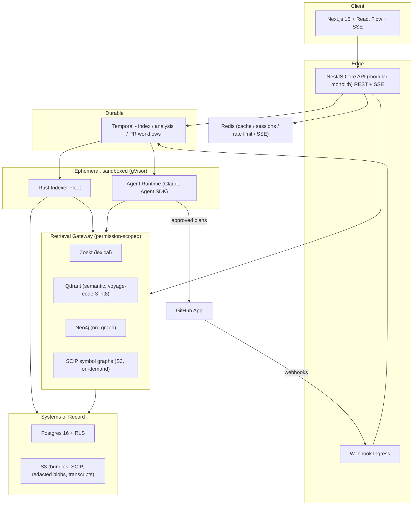
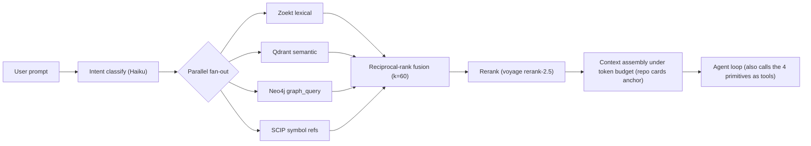

# ARCHITECTURE.md — Atlas

> Distilled architecture reference. This is a **cross-reference and quick-orientation** document; the authoritative detail lives in the [`docs/`](docs/) package. Where this file and a `docs/` file disagree, the doc wins.
>
> **Status:** design-complete, implementation-zero. See [PROJECT_HANDOFF.md](PROJECT_HANDOFF.md).

## 1. One-paragraph thesis

Atlas is an AI platform that models an *entire* engineering organization — services, APIs, message topics, datastores, packages, teams — as an org-level knowledge graph, and uses that graph plus code retrieval to answer "if we make this change, what breaks across all our repos, and why?" It produces evidence-linked impact reports and per-repo change plans, and (behind human approval) opens pull requests. The bet: impact analysis is a **relationship** problem that pure vector RAG cannot solve.

## 2. System topology

## 3. Layer-by-layer

| Layer | Technology | Detail doc |
|---|---|---|
| Frontend | Next.js 15, TypeScript, Tailwind, shadcn/ui, React Flow, TanStack Query, SSE | docs/01 |
| API | NestJS modular monolith, REST + SSE, OpenAPI | docs/01 |
| Orchestration | Temporal (TS SDK) — all multi-step work | docs/01, 04, 05 |
| Indexer | Rust, tree-sitter + SCIP, gVisor-sandboxed, ephemeral | docs/04 |
| Agent runtime | Claude Agent SDK, orchestrator-worker, per-repo isolation | docs/05 |
| Retrieval | Zoekt + Qdrant + Neo4j + SCIP, RRF + voyage rerank-2.5 | docs/02 |
| Vector store | Qdrant (1024-dim int8, HNSW, payload filtering) | docs/06 |
| Graph | Neo4j (Tier 1 org graph) + SCIP artifacts in S3 (Tier 2) | docs/03 |
| Relational | Postgres 16 + row-level security | docs/06 |
| Cache/queue | Redis (cache/SSE/rate-limit) + SQS (webhook ingress) | docs/06 |
| Object storage | S3 (+ per-tenant KMS envelope encryption) | docs/06, 08 |
| Auth | GitHub App + user OAuth + WorkOS SSO/SAML/SCIM | docs/08 |
| Deploy | EKS + Terraform + GitHub Actions + ArgoCD + Argo Rollouts | docs/08 |
| Observability | OpenTelemetry → Grafana; Langfuse (LLM traces/evals) | docs/08 |

## 4. Data model summary

- **Two systems of record:** Postgres 16 (relational + edge *assertions*) and S3 (blobs, SCIP, transcripts).
- **Three rebuildable derived indexes:** Zoekt (lexical), Qdrant (semantic), Neo4j (graph projection of Postgres assertions).
- **Tenant isolation:** `tenant_id` + `FORCE ROW LEVEL SECURITY` in Postgres; mandatory payload filter in Qdrant; `tenant_id` node/edge property in Neo4j; per-tenant S3 prefixes + KMS keys; Redis key prefixes.
- **Two-tier graph:** Tier 1 org graph in Neo4j (~10⁵–10⁶ nodes); Tier 2 symbol edges as SCIP artifacts in S3 with Postgres pointers (never materialized in Neo4j).
- **Node taxonomy:** Org, Repo, Service, Deployable, Package, APIEndpoint, MessageTopic, DataStore, Table, EnvVar, ConfigKey, Team, Person, Domain.
- **Edge taxonomy:** DEPENDS_ON, CALLS, EXPOSES, CONSUMES, PUBLISHES, SUBSCRIBES, READS, WRITES, OWNS, DEPLOYS, REFERENCES_ENV, SHARES_SCHEMA — each carrying `{mechanism, confidence, evidence[file:line], first_seen_commit, last_seen_commit, repo_ids}`.

Full DDL: docs/06. Full taxonomy + Cypher: docs/03.

## 5. The retrieval pipeline (product core)

Seven agent tools: `search_code`, `semantic_search`, `graph_query`, `get_symbol_references`, `read_file_span`, `get_repo_card`, `list_dependents`.

## 6. Security invariants (must hold in every implementation)

1. Secret-scan **before** embedding; read paths serve only redacted blobs.
2. Repo content is hostile input — egress-blocked gVisor sandboxes; content spotlighted as data.
3. GitHub is the authorization root — permission mirroring, fail closed on stale sync.
4. Every claim carries verified evidence.
5. Two-tier graph — never materialize symbol edges into Neo4j.
6. Human approval gates before every autonomous write.

Threat model, tenancy tiers, deployment: docs/08.

## 7. Where to go deeper

Start with [README.md](README.md), then the numbered docs. For the reasoning behind any choice, see docs/09 §Design decisions and each doc's `## Pushback` section (each challenges a founder assumption).
