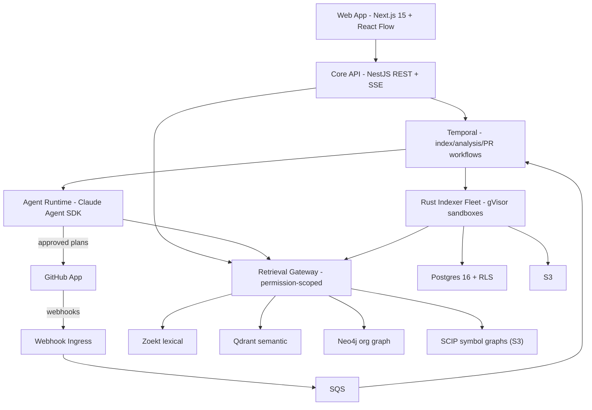
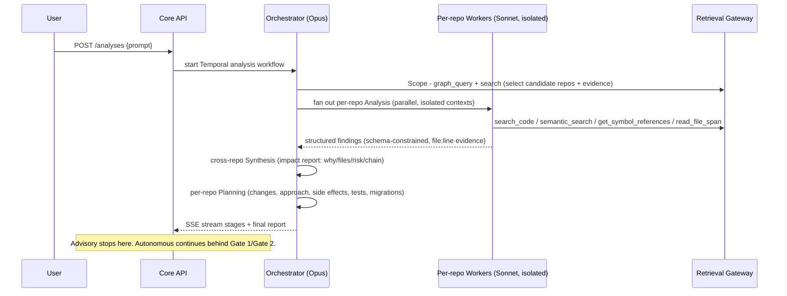

# PROJECT_HANDOFF.md — Atlas

> **Read this first.** This is a staff-engineer-to-staff-engineer handoff for **Atlas**, an AI multi-repository engineering intelligence platform. The repository contains a complete, adversarially-reviewed **architecture specification** (10 Markdown docs, ~5,200 lines) **plus a runnable Phase-0 vertical slice of the whole product loop**: ingest repos → build a cross-repo dependency graph → retrieve (lexical + semantic + RRF) → produce an evidence-linked impact report → serve it over an HTTP/SSE API. Your job is to continue Phase 0 by replacing the deterministic/heuristic stand-ins with the production components.
>
> **What runs today** (plain Node 22+, zero install, no Docker): `npm test` runs **80 passing gate checks** across 12 suites; `npm run analyze "jsonwebtoken" fixtures/sample-org` prints an end-to-end impact report; `npm run api:dev` starts the core API on :3001 with SSE streaming. The cross-repo graph now composes **all four docs/03 coupling mechanisms** (package `DEPENDS_ON`, HTTP `EXPOSES`/`CALLS`, config `REFERENCES_ENV`, schema `READS`/`WRITES`/`SHARES_SCHEMA`) plus **transitive multi-hop blast radius** and a **retrieval eval gate**. See §17.
>
> **Source of truth = the `docs/` package + [README.md](README.md).** This handoff summarizes and points into them; where they disagree with this file, the `docs/` package wins (it is more detailed and was reviewed). For *implemented* code, the code + its tests are the truth.

---

## 0. TL;DR for the next AI

- **What Atlas is:** "Copilot for an entire engineering organization." A developer types an intent ("add org-level permissions"); Atlas searches *all* connected repos, decides which are affected and why, cites the exact files, quantifies risk, generates per-repo implementation plans, and (behind human approval) opens PRs.
- **State:** Design 100% done and reviewed. Implementation **~55%** of the Phase-0 vertical slice — ingestion + a **four-mechanism cross-repo graph** + transitive impact + retrieval (lexical+semantic+RRF) + eval gate + orchestrator-worker agents + HTTP/SSE API + Next.js dashboard, all runnable offline (80 checks). Every piece is a deterministic/heuristic *stand-in* for a production component (see §7, §8).
- **What to read first:** this file → [README.md](README.md) → [docs/02-retrieval-and-rag.md](docs/02-retrieval-and-rag.md) → [docs/01-system-architecture.md](docs/01-system-architecture.md). Then run `npm test` and read `services/indexer-spike/src/analyze.ts` (the loop) top to bottom.
- **What to build next:** productionize the stand-ins in dependency order — tree-sitter chunker, real Qdrant/Zoekt + Voyage, persist graph to Postgres→Neo4j, then replace the deterministic scope/expand in `analyze.ts` with the Claude orchestrator-worker agents (docs/05). See §8 Next Tasks.
- **Non-negotiable invariants:** secret-scan before embedding; repo content is hostile input; GitHub permission mirroring; evidence-linked claims; two-tier graph. See §20.
- **Every number in the docs is an estimate** marked "estimate — verify." Nothing has been benchmarked. Do not quote costs/latencies as fact.

---

## 1. Product Vision

**Problem.** Current AI coding tools (Copilot, Cursor, Cody) operate one repository at a time. Real organizations have tens to hundreds of repositories. When a change is proposed — "add organization-level permissions," "rotate the auth token format," "deprecate the v1 billing API" — no tool answers the actually-hard question: *across our entire system, what breaks, where, and why?* Engineers answer it manually with tribal knowledge, and they get it wrong.

**Why this exists.** Impact analysis is a **relationship** problem, not a search problem. "Who depends on this endpoint?" cannot be answered by embedding similarity. It requires a model of how services, APIs, message topics, datastores, packages, and teams connect across repository boundaries. Atlas builds and maintains that model — an **organization-level knowledge graph** — and uses it to produce evidence-linked impact reports and change plans.

**Target users (one architecture must serve all three):**
1. Individual developers juggling several repos.
2. Startups with microservice architectures (the **beachhead** — see docs/09).
3. Enterprises with hundreds of repos and compliance requirements.

**Long-term vision.** The compounding asset is the org knowledge graph. Over time Atlas becomes the system of record for "how our software actually fits together" — powering impact analysis, autonomous cross-repo refactors, architecture governance, ownership/on-call routing, and onboarding. Moat = the graph + evidence-linked reasoning + SCM-permission-aware retrieval + a fully self-hostable stack for enterprise.

**Current MVP scope (Phase 1, per docs/09).** GitHub only; **TypeScript/JavaScript + Python only** (not all ten languages at launch — deliberate); **Advisory mode only** (plans + suggested diffs + PR descriptions, no autonomous writes); 10–50 repos per org; core dashboard (prompt, impact report, repo list, history). Autonomous PR mode and the full ten languages arrive in Phase 2.

---

## 2. Current Project Status

| Dimension | Status |
|---|---|
| **Current milestone** | Architecture **complete and reviewed**; **Phase 0 vertical slice runnable end-to-end** — ingestion → four-mechanism cross-repo graph → retrieval → impact report → agents → HTTP/SSE API → Next.js dashboard, all offline, 80 checks green. |
| **Overall completion** | Design deliverables: **~100%**. Application implementation: **~55%** (full Phase-0 loop + a **four-mechanism cross-repo graph** with transitive impact + retrieval eval gate + an orchestrator-worker **agent layer** wired to real Claude + **Next.js Web Dashboard** + JSON file persistence + Planning/PR-generation agents). |
| **Finished** | Full architecture package (10 docs); 15 founder deliverables. **Code:** monorepo scaffold; `apps/web` (Next.js Dashboard); `apps/api` (REST/SSE); ingestion spike; **cross-repo graph across all four coupling mechanisms** (DEPENDS_ON, EXPOSES/CALLS, REFERENCES_ENV, READS/WRITES/SHARES_SCHEMA) unified in `fullgraph.ts` with `computeImpact` (1-hop) + `computeImpactTransitive` (multi-hop, cycle-safe, ACL-scoped); retrieval + RRF fusion + **golden-query eval gate**; end-to-end impact analysis; orchestrator pipeline (Scope, Analysis, Synthesis, Planning, PR Generation); JSON file persistence. **80 passing checks across 12 suites.** |
| **Partially complete** | Ingestion pipeline is a **spike**: real logic, but heuristic chunker (not tree-sitter), mock embedder by default (real Voyage behind an env var), local JSON stores (not S3/Postgres/Qdrant), TypeScript (production indexer is Rust). |
| **Not started** | Temporal workflows, GitHub App wiring, **persisting** the graph to Postgres assertions → Neo4j projection (extraction itself is done in-memory), voyage rerank-2.5, all infra provisioning, CI/CD. |

**Honest notes:** (1) the design review found several "critical" security findings were false positives — the docs already implemented the defenses; trust the docs *as designs*, unvalidated against benchmarks. (2) The ingestion spike is proven only on a tiny fixture; it validates *shape and invariants*, not scale or real-repo messiness. (3) `pnpm`/Docker/`cargo` are not on the current machine, so the scaffold uses **npm workspaces** and the indexer spike is **TypeScript** run via Node's native type-stripping — both are documented Phase-0 substitutions, not the production target.

---

## 3. Architecture

Full detail lives in [docs/01-system-architecture.md](docs/01-system-architecture.md). Distilled here; see also [ARCHITECTURE.md](ARCHITECTURE.md).

**Shape:** a **modular monolith core API** (NestJS/TypeScript) with hard internal module boundaries, polyglot only where physics demands separate services: a **Rust indexer fleet** (CPU-bound, sandboxed, ephemeral), **webhook ingress** (availability isolation), **Temporal workers** (long-running), and the **agent runtime** (burst compute). Everything multi-step runs on **Temporal** (durable, resumable, rate-limit-aware). The REST API is a thin command/query layer over Postgres + Temporal.



- **Frontend:** Next.js 15 (App Router, SSR + streaming) + TypeScript + Tailwind + shadcn/ui; **React Flow** for architecture visualization; TanStack Query; **SSE** end-to-end for streamed analysis runs (`Last-Event-ID` resume).
- **Backend:** NestJS modular monolith, REST + SSE, OpenAPI-generated clients. Request → JWT guard → tenant context (AsyncLocalStorage) → Postgres RLS + store-level filters.
- **Database:** Two **systems of record** (Postgres 16, S3) + three **rebuildable derived indexes** (Zoekt, Qdrant, Neo4j). See [docs/06-data-architecture.md](docs/06-data-architecture.md).
- **AI pipeline:** Claude Agent SDK, orchestrator-worker (see §12). Model routing Opus/Sonnet/Haiku by stage.
- **RAG pipeline:** Four retrieval primitives + fusion + rerank + context assembly under a token budget. See §10 and [docs/02-retrieval-and-rag.md](docs/02-retrieval-and-rag.md).
- **Repository indexing:** Rust workers, tree-sitter + SCIP, structure-aware chunking, secret-scan-before-embed, content-addressed dedupe. See [docs/04-github-and-ingestion.md](docs/04-github-and-ingestion.md).
- **Authentication:** GitHub App (least-privilege) + user OAuth (identity) + WorkOS (enterprise SSO/SAML/SCIM). Authorization mirrors GitHub repo permissions.
- **API flow:** `POST /analyses` starts a Temporal analysis workflow → SSE stream of stage events → impact report + per-repo plans persisted → optional `POST /analyses/{id}/pull-requests` (autonomous, gated).
- **Dashboard flow:** prompt history, previous analyses, repo list, saved sessions, impact reports, React Flow architecture visualization, approval workflows.
- **GitHub integration:** GitHub App install → webhook-driven incremental indexing → permission mirroring → PR creation via short-lived scoped tokens. See §11.

---

## 4. Folder Structure

**Current on-disk state** (design-stage — only `docs/` and root Markdown exist):

```
developer problem/
├── README.md                 # Master index of the architecture package
├── PROJECT_HANDOFF.md        # THIS FILE
├── ARCHITECTURE.md           # Distilled architecture cross-reference
├── ROADMAP.md                # Phased delivery plan (from docs/09)
├── CHANGELOG.md              # Session history
└── docs/
    ├── 01-system-architecture.md
    ├── 02-retrieval-and-rag.md
    ├── 03-graph-design.md
    ├── 04-github-and-ingestion.md
    ├── 05-ai-and-agents.md
    ├── 06-data-architecture.md
    ├── 07-scalability-and-cost.md
    ├── 08-security-and-deployment.md
    └── 09-roadmap-team-risks-competition.md
```

**Target monorepo structure** (specified in docs/01 §4 — build this in Phase 0, pnpm workspaces + Turborepo):

```
atlas/
├── apps/
│   ├── web/                  # Next.js 15 dashboard (why: user-facing product surface)
│   └── api/                  # NestJS core API — modular monolith (why: single deployable, hard module boundaries)
├── services/
│   ├── indexer/              # Rust indexer fleet (why: CPU-bound parse/embed, must be sandboxed & ephemeral)
│   ├── webhook-ingress/      # Thin webhook receiver → SQS (why: availability isolation from core API)
│   ├── temporal-workers/     # Temporal workflow/activity workers (why: long-running durable orchestration)
│   └── agent-runtime/        # Claude Agent SDK harness (why: burst compute, sandbox adjacency)
│       ├── src/agents/       #   scope, repo-analysis, synthesis, planning, codegen, review, pr
│       ├── src/tools/        #   canonical retrieval tools (docs/02 §7)
│       ├── src/routing/      #   model-tier routing (Opus/Sonnet/Haiku), prompt cache config
│       └── src/guards/       #   evidence citation verifier, path checks, token budgets, hallucination guards
├── packages/
│   ├── scm-provider/         # @atlas/scm-provider — provider abstraction interface (why: GitLab/Bitbucket later w/o core changes)
│   ├── scm-github/           # @atlas/scm-github — the only Phase-1 adapter
│   ├── shared-types/         # DTOs, schemas, OpenAPI-generated clients
│   ├── graph-client/         # Neo4j Cypher templates + typed queries
│   └── config/               # env parsing, feature flags
└── infra/
    ├── terraform/            # EKS, RDS, S3, KMS, networking (why: IaC, BYOC parity)
    ├── k8s/                  # ArgoCD apps, manifests, gVisor RuntimeClass, NetworkPolicies
    └── ci/                   # GitHub Actions workflows
```

Every folder's rationale is in the comments above and in docs/01 §4.

---

## 5. Files Created (this session)

All are **architecture specification documents** (Markdown). No source code. Status is "complete design; unimplemented."

| File | Purpose | Status | Depends on |
|---|---|---|---|
| [README.md](README.md) | Master index: thesis, 10 key decisions, six-question table, tech table, deliverable coverage map, reading order | Complete | All docs/ |
| [docs/01-system-architecture.md](docs/01-system-architecture.md) | System + backend architecture, SCM provider abstraction, monorepo folder structure, full API surface, tenancy flow | Complete | 03,04,05,06,08 |
| [docs/02-retrieval-and-rag.md](docs/02-retrieval-and-rag.md) | Retrieval/RAG design, **the six questions**, four primitives, fusion→rerank pipeline, agent tool inventory, eval harness | Complete | 03,05,06,07 |
| [docs/03-graph-design.md](docs/03-graph-design.md) | Two-tier graph, node/edge taxonomy, Cypher, extraction pipelines, incremental maintenance, React Flow feed | Complete | 04,06 |
| [docs/04-github-and-ingestion.md](docs/04-github-and-ingestion.md) | GitHub App, OAuth, webhooks, cloning, 10-language parse table, chunking, embedding, incremental indexing, Temporal workflows | Complete | 03,06,08 |
| [docs/05-ai-and-agents.md](docs/05-ai-and-agents.md) | AI architecture, model routing, orchestrator-worker agent pipeline, safety, hallucination guards, evals | Complete | 02,06,07,08 |
| [docs/06-data-architecture.md](docs/06-data-architecture.md) | Postgres DDL, Qdrant/Neo4j/Redis/S3 design, data lifecycle, encryption, offboarding | Complete | 03,07,08 |
| [docs/07-scalability-and-cost.md](docs/07-scalability-and-cost.md) | Load model at 10/100/1000 repos, bottlenecks, cost tables, unit economics, context-limit math | Complete | 02,04,05,06 |
| [docs/08-security-and-deployment.md](docs/08-security-and-deployment.md) | Threat model, code privacy, tenancy tiers, secrets, sandboxing, EKS deployment, compliance | Complete | 04,06,07 |
| [docs/09-roadmap-team-risks-competition.md](docs/09-roadmap-team-risks-competition.md) | Roadmap, team plan, risk register, competitive analysis | Complete | all |
| [PROJECT_HANDOFF.md](PROJECT_HANDOFF.md) | This handoff | Complete | all |
| [ARCHITECTURE.md](ARCHITECTURE.md) | Distilled architecture cross-reference | Complete | docs/01-08 |
| [ROADMAP.md](ROADMAP.md) | Phased delivery plan | Complete | docs/09 |
| [CHANGELOG.md](CHANGELOG.md) | Session history | Complete | — |

**Phase-0 code created this session** (all runnable/inspectable now):

| File(s) | Purpose | Status |
|---|---|---|
| `package.json`, `tsconfig.base.json`, `.gitignore`, `.env.example`, `.nvmrc` | Monorepo root (npm workspaces) | Working |
| `packages/shared-types/src/index.ts` | Cross-service contracts (chunks, evidence, findings, plans, graph taxonomy) | Working |
| `packages/scm-provider/src/index.ts` | 5-port SCM abstraction + registry | Interface only |
| `packages/scm-github/*` | GitHub adapter implementation of ScmProvider | Working, fully typed & tested |
| `packages/config/src/index.ts` | Typed env loader | Working |
| `services/indexer-spike/src/*.ts` | Ingestion spike: `languages`, `secret-scan`, `chunker`, `content-address`, `embedder`, `store`, `pipeline`, `index`; retrieval (`retrieval.ts`, RRF k=60); org graph (`org.ts`, `org-index.ts`); analysis (`analyze.ts`, `analyze-cli.ts`) | Working |
| `packages/graph-core/src/index.ts` | In-memory Tier-1 graph: typed nodes/edges, `dependents`/`blastRadius`, permission-scoped serving | Working |
| `packages/agent-core/src/llm.ts` | `LLMClient` abstraction (Mock ↔ real Anthropic), model routing, forced structured output | Working |
| `services/indexer-spike/src/extractors/*.ts` | Deterministic edge extractors: `dependencies.ts` (DEPENDS_ON), `apis.ts` (EXPOSES/CALLS), `env.ts` (REFERENCES_ENV), `datastore.ts` (READS/WRITES/SHARES_SCHEMA) — all evidence-linked | Working |
| `services/indexer-spike/src/fullgraph.ts` | Composes the four subgraphs; `computeImpact` (1-hop multi-mechanism) + `computeImpactTransitive` (multi-hop, cycle-safe, ACL-scoped) | Working |
| `services/indexer-spike/src/agents/*.ts` | Orchestrator-worker layer: `scope`, `analysis`, `synthesis`, `planning`, `pr`, `guards`, `orchestrator` | Working |
| `apps/api/src/*.ts` | Core API (Node http): `http.ts` (router/JSON/SSE), `server.ts`, `db.ts` (file persistence) | Working |
| `services/webhook-ingress/src/*.ts` | SCM Webhook handler with HMAC and SQS enqueueing | Scaffolded |
| `services/indexer-spike/test/*.ts` | 11 gate suites: `run`, `org`, `retrieval`, `analyze`, `agent`, `api-extract`, `env-extract`, `datastore-extract`, `fullgraph`, `transitive`, `eval` | Passing |
| `apps/api/test/api.run.ts` | API/SSE gate suite | Passing |
| `fixtures/sample-repo/*` | Test fixture with planted fake secrets | Working |
| `fixtures/sample-org/*` | 3-repo org (auth-lib ← web-app, billing-svc) with cross-repo deps/APIs/env/schema couplings | Working |
| `fixtures/chain-org/*` | `gateway → api → core` dependency chain (isolated fixture for transitive-impact tests) | Working |
| `infra/migrations/0001_init.sql` | Postgres schema + RLS (from docs/06) | Written, not applied |
| `docker-compose.yml` | Local infra spec | Written, not brought up |

(Two memory files were also written outside the repo under `~/.claude/.../memory/` recording the session-limit workflow constraint — not part of the deliverable.)

---

## 6. Features Completed

Because this is design-stage, "completed" means **design deliverable completed**, not running feature. All 15 founder deliverables:

| Deliverable | Where | Notes / remaining improvement |
|---|---|---|
| Product/system architecture | docs/01 | Add concrete sequence diagrams once API is scaffolded |
| AI architecture | docs/05 §1–4 | Validate model routing costs against real runs |
| Database schema (DDL) | docs/06 §2–4 | DDL is written but never run against Postgres; needs migration tooling |
| RAG design | docs/02 | Recall@k targets are hypotheses; need the eval fixture built |
| Graph design | docs/03 | Extraction precision/recall unmeasured |
| Agent design | docs/05 §5–8 | Prompts not written; guards specified not coded |
| Folder structure | docs/01 §4 | Scaffold not created |
| API structure | docs/01 §5 | OpenAPI spec not authored |
| Deployment architecture | docs/08 | Terraform not written |
| Infrastructure requirements | docs/08 + docs/07 | Sizing is estimate-only |
| Cost estimates | docs/07 | **All figures unverified** |
| Development roadmap | docs/09 §1 | — |
| Team requirements | docs/09 §2 | — |
| Risks | docs/09 §3 | — |
| Competitive analysis | docs/09 §4 | Refresh quarterly; fast-moving space |

**Review/reconciliation completed this session:** 29-finding adversarial review; 27 real fixes applied across docs 01/02/04/05/07; false-positive findings (secret-leak, graph-ACL, table-name) correctly rejected after file verification; 2 residual cross-doc inconsistencies (authz TTL, tool names) fixed manually.

---

## 7. Features In Progress

**Ingestion pipeline (spike stage).** `services/indexer-spike` implements the real pipeline shape and passes 9 gate tests, but is deliberately a spike:
- **Progress:** file walk, language detection (10-ext map), gitleaks-style secret scan (runs before embed — proven by test), structure-aware chunking (TS/JS brace-depth + Python def/class heuristics), content-addressed dedupe, pluggable embedder (mock ↔ Voyage), 3-sink local store (blobs / chunks meta / vectors).
- **Remaining:** replace heuristic chunker with tree-sitter; wire real Voyage + int8 quantization; swap local JSON sinks for S3 + Postgres + Qdrant; port to the Rust indexer; run under Temporal activities; handle incremental/rename/force-push; scale beyond the fixture.
- **Known issues / context:** chunker is a heuristic and will mis-split unusual code (acceptable for a spike; tree-sitter fixes it). `git rev-parse` prints a harmless stderr line when the dir is not a git repo (caught → `WORKINGDIR`). Node's TS type-stripping forbids embedding literal control characters in source — see §13 Bugs.

**Cross-repo graph (spike — feature-complete for Phase 0).** `@atlas/graph-core` + four extractors + `fullgraph.ts` build a Tier-1 org graph across all four docs/03 coupling mechanisms (DEPENDS_ON, EXPOSES/CALLS, REFERENCES_ENV, READS/WRITES/SHARES_SCHEMA), with 1-hop and transitive multi-hop impact, permission scoping, and a golden-query eval gate.
- **Proves the thesis:** `impact("billing-svc")` = 0 package dependents but catches `web-app` (API caller), `auth-lib` (shared `JWT_SECRET`), `web-app` (shared `users` table) — impact single-mechanism analysis misses entirely.
- **Remaining to productionize:** message-topic (`PUBLISHES`/`SUBSCRIBES`) extraction; tree-sitter/OpenAPI in place of regex/SQL heuristics; more manifest ecosystems + lockfiles; persist Postgres assertions → Neo4j projection; wire transitive impact into the Scope stage.

**Monorepo scaffold (bootstrap stage).** npm-workspaces root, packages, migration, compose file exist. Remaining: `pnpm`/Turborepo migration, CI.
- **`@atlas/scm-github`** was built this session, fully implementing the `ScmProvider` interface with unit tests.

Unstarted: Temporal workflows, GitHub App registration, real infra (Postgres/Neo4j/Qdrant/S3/Zoekt), and the Rust indexer port — treat §8 as the entry point.

---

## 8. Next Tasks (prioritized checklist)

Difficulty: 🟢 easy / 🟡 medium / 🔴 hard. Dependencies noted.

1. ✅ **Scaffold the monorepo** — DONE (npm workspaces; `pnpm`+Turborepo migration still pending since pnpm isn't installed). `package.json`, `tsconfig.base.json`, 3 packages.
2. 🟡 **Provision local dev infra** — compose spec written (`docker-compose.yml`) but **not brought up** (Docker not installed on this machine). Dep: Docker. ~0.5 day once available.
3. 🟡 **Author Postgres migrations** — **DDL written** (`infra/migrations/0001_init.sql`, RLS with `current_setting('app.tenant_id', false)`); **not yet applied** (needs Postgres) and no migration runner wired. Dep: 2. ~1 day.
4. ✅ **Register a GitHub App** (dev), least-privilege scopes; installation + user OAuth overlay. Interface stub exists (`@atlas/scm-provider`); adapter `@atlas/scm-github` **completed (code)**. Remaining: manual App registration on GitHub. Dep: 1.
5. ✅ **Webhook ingress → SQS** — DONE (scaffolded in `services/webhook-ingress`). HMAC verification and GUID dedupe logic implemented. SQS connection mocked via AWS SDK. Dep: 2,4.
6. ✅ **TypeScript ingestion spike** — DONE as a spike (`services/indexer-spike`, 9 passing tests): detect → secret-scan → chunk → content-address → embed → store. **Remaining to productionize:** tree-sitter (replace heuristic chunker), real Voyage + int8, S3/Postgres/Qdrant sinks, port to Rust, run under Temporal. This validated the pipeline shape and the secret invariant; scale/real-repo hardening is the next ~1–2 weeks.
7. 🔴 **Temporal workflows** `fullIndexOrg` / `incrementalIndexRepo` wrapping the (productionized) ingestion as activities. Dep: 6. ~1 week.

> **Task 11 (cross-repo edge extraction) — DONE as a spike, ahead of order, now covering all four docs/03 coupling mechanisms.** `@atlas/graph-core` + `services/indexer-spike/src/org.ts` + five extractors build a Tier-1 cross-repo graph with `file:line` evidence and permission-scoped serving: `dependencies.ts` (**DEPENDS_ON** from npm/Python manifests), `apis.ts` (**EXPOSES/CALLS** from route defs + client call sites), `env.ts` (**REFERENCES_ENV** shared config), `datastore.ts` (**READS/WRITES/SHARES_SCHEMA** from SQL shapes), and `messaging.ts` (**PUBLISHES/SUBSCRIBES** from topic access). `fullgraph.ts` composes them and answers "what breaks if repo X changes?" via `computeImpact` (1-hop, all mechanisms) and `computeImpactTransitive` (multi-hop, cycle-safe, ACL-scoped). Run: `npm run org:index` / `npm run test:graph` / `npm run test:transitive`. **Remaining to productionize:** more ecosystems + lockfiles (docs/04 lists all ten); swap regex/SQL heuristics for tree-sitter + OpenAPI/AsyncAPI specs; persist to Postgres assertions → Neo4j projection instead of in-memory.
8. 🟡 **Minimal retrieval pipeline** — DONE as a spike (`src/retrieval.ts`): lexical + semantic + **RRF fusion** (k=60) over the local store, with a bag-of-words offline embedder so it runs without a live model. Haiku intent classification and token-budgeted context assembly are integrated. **Remaining:** real Zoekt + Qdrant, voyage rerank-2.5, add the graph + SCIP primitives to the fan-out.
9. ✅ **Analysis loop** — TWO paths exist. (a) Deterministic (`src/analyze.ts`). (b) **Orchestrator-worker agent layer** (`src/agents/`: `scope.ts` Opus, `analysis.ts` Sonnet per-repo isolated w/ injection-spotlighting, `synthesis.ts` cross-repo verdict, `planning.ts` side effects/migrations, `pr.ts` PR generation, `guards.ts` evidence verification, `orchestrator.ts`). Reachable via `POST /v1/analyses {mode:"agent"}`.
10. ✅ **Dashboard** — DONE. Next.js 15 + React Flow + shadcn scaffolded in `apps/web`. Proxying to core API via `npm run dev:all`. All Sprint 2 Polish features completed (Live SSE StreamLog, Repo NodePanel, Search/Filtering, Impact Cards with Evidence).

> **API layer — DONE as a spike, ahead of order.** `apps/api` is a runnable Node-http server (zero install) with the docs/01 §5 surface and SSE streaming of pipeline stages. Run `npm run api:dev` then `curl :3001/health`. Uses local `.data/db.json` persistence for prompt history and analyses.
11. 🟡 **Dependency-edge extraction** (package.json/lockfile → DEPENDS_ON) into Neo4j; first cross-repo edge. Dep: 6. ~1 week.
12. ✅ **Orchestrator-worker expansion**: DONE. Scope → per-repo Analysis (parallel, isolated) → Synthesis → Planning → PR Generation are fully wired.

Milestone after task 12 ≈ **Phase 1 Advisory MVP** for TS/JS + Python on 10–50 repos.

---

## 9. Design Decisions

Full rationale in the docs; key decisions and rejected alternatives:

| Decision | Chosen | Rejected | Why |
|---|---|---|---|
| Retrieval mechanism | Four primitives (lexical + semantic + graph + symbol) | Pure vector RAG | Similarity can't answer "who depends on this"; impact analysis is relational. docs/02 |
| Graph construction | Deterministic (parsers/manifests/specs) | LLM "Graph RAG" (entity extraction + community summaries) | Determinism gives precision + evidence; LLM only for low-confidence soft edges. docs/02, 03 |
| Graph storage | Two-tier: Neo4j org graph + SCIP symbol artifacts in S3 | Materialize symbol edges in Neo4j | Symbol edges = billions of rows at 150M LOC; org graph stays ~10⁵–10⁶ nodes. docs/03 |
| Graph source of truth | Postgres edge *assertions*; Neo4j is a rebuildable projection | Neo4j as system of record | Replayable DR + schema migration; cheap exit path to Apache AGE. docs/03, 06 |
| Agent topology | Orchestrator-worker + per-repo context isolation | Seven fixed persona agents | Personas without isolation are theater; isolation is the actual payoff. docs/05 |
| Backend shape | Modular monolith (NestJS) | Microservices day one | Avoid distributed-systems tax before product-market fit; split only what physics forces. docs/01 |
| Orchestration | Temporal | Ad-hoc queues + cron | Durable, resumable, rate-limit-aware; agent runs and index runs are both long multi-step. docs/01 |
| Indexer language | Rust | Node/Python | CPU-bound parsing/embedding; native tree-sitter + SCIP; sandbox-friendly. docs/01, 04 |
| Vector DB | Qdrant | Pinecone / pgvector | Self-hostable (BYOC/on-prem parity), payload filtering, quantization. docs/06 |
| Graph DB | Neo4j | Postgres recursive CTEs / AGE | Multi-hop traversal ergonomics; graph stays small. Exit path preserved. docs/06 |
| Relational | Postgres 16 + RLS | — | System of record + tenant isolation. docs/06 |
| Embeddings | voyage-code-3 + rerank-2.5 | OpenAI/text-embedding | Code-tuned retrieval quality. docs/02 |
| Streaming | SSE | WebSockets | Server-push-only shape; survives corporate proxies/LB restarts. docs/01 |
| Tenancy default | Multi-tenant cloud + per-tenant KMS envelope encryption | Single-tenant default | Cost/velocity; crypto isolation sufficient for most. Enterprise gets VPC/BYOC. docs/08 |
| Language launch scope | TS/JS + Python first | All ten at launch | Beachhead coverage; ten languages is an architecture requirement, not a launch requirement. docs/09 |
| PR mode launch scope | Advisory first | Autonomous at launch | Trust is the product; earn autonomous via measured advisory quality. docs/05, 09 |

---

## 10. RAG Progress

**Design complete; nothing built.** Specification (docs/02):

- **Indexing (target):** clone → tree-sitter parse → structure-aware chunk (function/class unit) → secret-scan (before embed) → voyage-code-3 embed → Qdrant + Zoekt + Postgres pointers. Content-addressed by `sha256(normalized_content)` so unchanged chunks are never re-embedded.
- **Chunking:** function/class granularity; token bounds ~30–60 lines/chunk; markdown/docs, OpenAPI/proto specs, Dockerfiles, K8s/Terraform, `.env.example` chunked with type-specific rules.
- **Embedding:** voyage-code-3, 1024-dim, **int8 quantized** (~1KB/vector + payload); batched; content-addressed dedupe.
- **Metadata (Qdrant payload — no source code in vectors):** `tenant_id`, `repo_id`, path, line span, symbol, `content_sha`, language, `embedding_version`. Chunk *text* reconstructed at assembly time from **redacted**, tenant-encrypted S3 blobs (addressed by `redacted_sha`, never raw git-blob OID — this is the secret-leak defense).
- **Repository selection:** the **Scope** stage queries the graph + search to pick candidate repos with evidence + confidence (ceiling ~50 candidates), before per-repo analysis.
- **Retrieval pipeline:** Haiku intent classification → parallel fan-out across the four primitives → reciprocal-rank fusion (k=60) → voyage rerank-2.5 → context assembly under a token budget anchored by **repo cards** (pre-computed hierarchical LLM summaries via Batch API). Also exposed as **seven agent tools**: `search_code`, `semantic_search`, `graph_query`, `get_symbol_references`, `read_file_span`, `get_repo_card`, `list_dependents`.

**Still to build:** literally all of it. First concrete target = task 6 (TS ingestion spike) + task 8 (minimal pipeline). The **eval fixture org** (a synthetic ~18-repo org with planted cross-repo edges + injection traps) must be built early to gate retrieval quality in CI.

---

## 11. GitHub Integration

Design in docs/04; **not implemented.**

- **OAuth / App:** a **GitHub App** (not a plain OAuth app) — installation tokens with per-repo grants, org-level install, 5,000 req/hr **per installation**, webhooks without a user online. User-level OAuth is layered on **only for identity + permission mirroring** — it never touches repo content. Least-privilege scopes: `contents:read`, `metadata:read`, `pull_requests:write`, `checks:read`. Autonomous writes mint a **separate short-lived `contents:write` token per target repo at PR time**, behind the approval gate.
- **Repository syncing:** webhooks are **level triggers, not edge triggers** — every event is HMAC-verified, SQS-buffered (+DLQ), GUID-deduped, then the incremental workflow reconciles `last_indexed_commit → current remote head`, so duplicates/reordering/loss/replay/force-push all converge. Nightly GraphQL reconciliation catches dropped deliveries.
- **Webhooks consumed:** push, pull_request, installation, installation_repositories, repository, member.
- **Branch handling:** **default branch only** by default; PR heads fetched ephemerally; long-lived release branches per-repo opt-in. (Indexing all branches multiplies cost 3–10× and worsens retrieval with near-duplicate chunks.)
- **PR strategy:** Advisory mode = generate plan + suggested diff + PR *description* (no writes). Autonomous mode = per approved diff, mint scoped token → branch → commit (bound to reviewed diff's content hashes) → open PR whose body links back to the analysis. Human approval gate (plan-hash bound) precedes every write.

---

## 12. AI Pipeline

Design in docs/05; **not implemented.** How a prompt flows:



- **Context building:** repo cards (hierarchical summaries) anchor the context; graph neighborhood summaries + top reranked chunks fill the budget. Retrieved content is **spotlighted** behind per-run random delimiters (injection defense) — it is data, never instructions.
- **Retrieval:** agentic — agents call the seven tools mid-loop, not just a one-shot prompt prefix.
- **Prompt generation:** per-stage prompts with pinned model tier (Opus: Scope/Synthesis/Planning; Sonnet: Analysis/CodeGen/Review; Haiku: classification), aggressive prompt caching, structured outputs everywhere.
- **Output generation:** every inter-stage artifact is **schema-constrained JSON with mandatory `file:line` or graph-edge evidence**; a claim without a citation is rejected at the stage boundary; every path is verified against the manifest at `repo@commit` before it appears in a report. Hallucination guards #1–#7 (docs/05 §6) enforce citation existence, semantic consistency (soft edges can't justify autonomous claims), and exhaustiveness undercount signals. Runs are Temporal workflows — a dead subagent resumes or degrades to an explicit partial, never a silent gap.

---

## 13. Bugs

**No application bugs exist — there is no application.** What exists are documented **design-stage issues** found during review:

- **Reviewer hallucinations (resolved, informational):** review agents raised three "critical" findings (secret-to-LLM leak in docs/06, graph-ACL leak in docs/03, wrong table name in docs/08) that were **false positives** — the docs already implemented the defenses. Verified via grep and rejected. Lesson for the next AI: **read the file before "fixing" a reported vulnerability**; reviewers pattern-match on scary keywords and invert meaning.
- **Edge cases the design flags but doesn't fully solve:** GitHub emits no single authoritative "user lost access" event for every path (org role changes, team cascades, outside-collaborator removal) — permission mirror relies on webhook invalidation + reconciliation + per-grant fail-closed TTL (docs/08 P-4). On-prem/air-gapped LLM story is explicitly de-scoped to Phase 3 (unsolved). SCIP for Java/C++/C# may require building the repo (docs/04) — Phase-2 concern.
- **Unverified assumptions masquerading as numbers:** all costs/latencies/sizings are estimates. Treat as hypotheses to benchmark, not facts.

**Code-stage gotchas (spike):**
- **Do not embed literal control characters in `.ts` source.** The indexer runs under Node's native TS type-stripping; a literal NUL (e.g. writing a bare `'\0'` or a control char inside a regex class) corrupts the file and breaks parsing. Express control bytes numerically (`s.charCodeAt(i) === 0`) or with escape sequences (`'\u0000'`) — see `pipeline.ts` `looksBinary()`. This bit the original binary-guard implementation. 
- **No TypeScript parameter properties under type-stripping.** `constructor(private readonly x: T)` throws `ERR_UNSUPPORTED_TYPESCRIPT_SYNTAX`; declare the field explicitly and assign in the body (see `apps/api/src/http.ts` `SseStream`). Also avoid enums, namespaces, and `import =`. All fine once a real build step (tsc/esbuild) is added.
- **Relative `import type` across packages is intentional.** The spike imports shared types via a relative path (`../../../packages/shared-types/...`) rather than the `@atlas/shared-types` alias, because there's no `npm install`/symlink yet. Since they are `import type`, Node strips them at runtime — zero runtime coupling. Once workspaces are installed, switch to the package alias.
- **Heuristic chunker mis-splits unusual code** (nested braces in strings, decorators, JSX). Acceptable for the spike; tree-sitter is the fix (task 6 productionization).

---

## 14. Technical Debt (intentionally postponed)

| Postponed | Why |
|---|---|
| 8 of 10 languages (Java, Go, Rust, C#, C++, PHP, Ruby) | Beachhead is TS/JS + Python; add in Phase 2 waves. Architecture is already language-agnostic. |
| Autonomous PR mode | Trust must be earned via Advisory quality first; Phase 2 behind approval gates. |
| Full orchestrator-worker | Start with a single-agent analysis loop (task 9) before fan-out. |
| SCIP symbol tier (Phase 2 of indexing) | Phase 1 ships lexical+semantic+dependency-graph; SCIP precision is async best-effort. |
| Neo4j (could start with Postgres AGE) | Design keeps an exit path; Neo4j only pays off once graph queries are real. |
| On-prem / air-gapped | Phase 3; support burden is real (docs/08 Pushback). |
| SQS-in-front-of-Temporal | docs/04 P3 notes it may be one queue too many; ships per canon, revisit Phase 2. |
| GitLab/Bitbucket adapters | Provider abstraction exists (`@atlas/scm-provider`); adapters are Phase 3. |
| SOC 2 / ISO 27001 | Phase 2–3; hire security engineer before the evidence window (docs/09). |

---

## 15. Coding Standards (to be established — recommended defaults from the design)

No code exists yet, so these are **prescriptive standards for the next engineer**, consistent with the stack:

- **Naming:** `camelCase` (TS vars/functions), `PascalCase` (types/React components/Nest providers), `snake_case` (Postgres columns, Redis keys), `kebab-case` (package names, file names, routes). Rust: `snake_case`/`PascalCase` per rustfmt.
- **Folders:** feature/domain modules in the API (`src/analyses/`, `src/repos/`, `src/graph/`); one concern per package under `packages/`.
- **Components:** shadcn/ui primitives; server components by default in Next.js App Router; client components only where interactivity requires; React Flow isolated to the visualization module.
- **API:** REST resource-oriented (docs/01 §5), plural nouns, versioned (`/v1/`), idempotency keys on writes, cursor pagination, SSE for streams. OpenAPI is the contract; generate clients.
- **Error handling:** typed error envelopes (`{code, message, details}`); Nest exception filters; fail-closed on auth/permission (return 403 `PERMISSIONS_STALE` rather than leak). Agent stages fail into explicit partials, never silent gaps.
- **Logging/observability:** OpenTelemetry traces end-to-end; Langfuse for LLM traces/evals; **never log secrets or installation tokens or repo content**; per-tenant cost metering.
- **Testing:** unit (Vitest/Jest for TS, `cargo test` for Rust); integration against docker-compose infra; **retrieval evals** (golden fixture org, recall@k, CI regression gates) are first-class and block merges; contract tests for the SCM provider interface.
- **Security invariants as lint/CI gates:** secret-scan before embed; no write tools in analysis-stage agents; RLS `SET LOCAL` only (block plain `SET`); `DISCARD ALL` on pooled-connection return.

---

## 16. Environment

**Required env vars / services (from docs/04, 06, 08 — none provisioned yet):**

| Var / service | Purpose |
|---|---|
| `GITHUB_APP_ID`, `GITHUB_APP_PRIVATE_KEY`, `GITHUB_WEBHOOK_SECRET`, `GITHUB_CLIENT_ID/SECRET` | GitHub App + user OAuth |
| `ANTHROPIC_API_KEY` (ZDR-enabled) | Claude Agent SDK (Opus/Sonnet/Haiku). Enterprise/BYOC: AWS Bedrock instead |
| `VOYAGE_API_KEY` | voyage-code-3 embeddings + rerank-2.5 |
| `DATABASE_URL` (Postgres 16) | System of record + RLS |
| `QDRANT_URL` / `QDRANT_API_KEY` | Vector store |
| `NEO4J_URI` / `NEO4J_USER` / `NEO4J_PASSWORD` | Org knowledge graph |
| `REDIS_URL` | Cache, sessions, rate limiters, webhook dedupe, SSE buffers |
| `ZOEKT_URL` | Lexical search shards |
| `TEMPORAL_ADDRESS` / namespace | Orchestration |
| `S3_BUCKET` / AWS creds / `KMS_KEY_ID` | Clone bundles, SCIP artifacts, redacted blobs, transcripts; per-tenant envelope encryption |
| `SQS_QUEUE_URL` | Webhook ingress buffer |
| `WORKOS_API_KEY` / `WORKOS_CLIENT_ID` | Enterprise SSO/SAML/SCIM |
| Observability | OTel collector endpoint; `LANGFUSE_*` keys |

**External dependencies:** GitHub API, Anthropic API, Voyage API, AWS (EKS/S3/KMS/SQS/RDS). Local dev: docker-compose for Postgres/Redis/Qdrant/Neo4j/Temporal + LocalStack for S3/SQS.

---

## 17. Commands

**Runnable today** (Node 22+, no install, no infra):

```bash
node services/indexer-spike/src/index.ts fixtures/sample-repo   # run the ingestion spike
node services/indexer-spike/src/org-index.ts fixtures/sample-org auth-lib   # cross-repo impact: "what breaks if auth-lib changes?"
node services/indexer-spike/src/analyze-cli.ts "jsonwebtoken" fixtures/sample-org   # end-to-end impact report (graph + retrieval)
npm run api:dev                                                 # start the core API on :3001, then:
#   curl :3001/health
#   curl -N -X POST :3001/v1/analyses -H 'accept: text/event-stream' -H 'content-type: application/json' -d '{"prompt":"jsonwebtoken","org":"fixtures/sample-org"}'
npm run test:graph                                             # unified four-mechanism impact (fullgraph.ts)
npm run test:transitive                                        # transitive multi-hop blast radius (chain-org fixture)
npm run test:eval                                              # golden-query retrieval eval gate (recall@5, top-1, impact recall)
npm test                                                        # all 80 gate checks across 12 suites (ingestion + graph + transitive + retrieval + eval + analysis + agent + api)
npm run index:spike:fixture                                     # ingestion via root script
npm run org:index                                               # org impact via root script
VOYAGE_API_KEY=... node services/indexer-spike/src/index.ts <dir>   # real voyage-code-3 embeddings
```

**Target commands** (once the toolchain + infra exist — not yet runnable):

```bash
pnpm install                      # migrate npm workspaces → pnpm (pnpm not installed yet)
cargo build --release             # production Rust indexer (cargo not installed yet)
docker compose up -d              # Postgres, Redis, Qdrant, Neo4j, Temporal, LocalStack (Docker not installed yet)
psql "$DATABASE_URL" -f infra/migrations/0001_init.sql   # apply schema
npx tsc -p tsconfig.base.json --noEmit                   # typecheck (needs `npm i -D typescript`)
pnpm --filter web dev             # Next.js dashboard (not built yet)
pnpm --filter api start:dev       # NestJS API (not built yet)
pnpm --filter temporal-workers dev
cargo run -p indexer              # indexer worker
pnpm test:evals                   # retrieval golden-fixture evals (CI gate)
```

---

## 18. Risks

From docs/09 §3 plus architectural:

- **Retrieval quality on messy real-world orgs.** Cross-repo edge precision/recall on inconsistent code is the core technical bet. Mitigation: eval fixture + measured recall@k gates before claiming impact accuracy. **Highest technical risk.**
- **Trust / hallucination.** One wrong impact report destroys credibility with the exact senior engineers who decide adoption. Mitigation: evidence-linked claims, path verification, calibrated confidence, semantic-consistency guard.
- **Indexing cost blowups.** LLM tokens are ~81% of cost (estimate). Mitigation: prompt caching, Batch API, quantization, content-addressed dedupe, model routing.
- **GitHub rate limits at onboarding.** 5,000 req/hr/installation; large orgs need careful budgeting (cloning uses git protocol, not REST — key insight). Estimate — verify.
- **Embedding throughput** is the initial-index long pole (~1M tok/min aggregate assumed). Verify Voyage contract limits early.
- **Performance/scale bottlenecks:** Neo4j write amplification during initial index; Qdrant memory at 40M+ vectors; Temporal backlog during 1000-repo onboarding. All addressed in design; unvalidated.
- **Market:** GitHub could ship native cross-repo Copilot (existential); Sourcegraph is closest competitor. Moat = compounding org graph + self-hostable + permission-aware retrieval (docs/09 §4).
- **Execution:** ten-language scope creep; enterprise sales cycle vs runway.

---

## 19. Future Roadmap

### Next Session (immediate)
- Scaffold monorepo + local docker-compose infra (tasks 1–2).
- Postgres migrations from docs/06 DDL (task 3).
- GitHub App registration + install flow (task 4).

### Next Week
- TypeScript ingestion spike end-to-end (task 6) — the make-or-break vertical slice.
- Temporal index workflows (task 7).
- Minimal retrieval pipeline + single-agent analysis loop (tasks 8–9).
- Build the eval fixture org early.

### Future Versions
- **Phase 1 (mo 2–4):** Advisory MVP, TS/JS + Python, 10–50 repos, core dashboard.
- **Phase 2 (mo 4–8):** org knowledge graph, remaining 8 languages, architecture visualization, autonomous mode behind gates, 100+ repos, SCIP symbol tier.
- **Phase 3 (mo 8–14):** enterprise (SSO/SCIM, BYOC, SOC 2), 1000-repo hardening, GitLab provider.
- Full timeline, exit criteria, team plan, non-goals in [ROADMAP.md](ROADMAP.md) and docs/09.

---

## 20. Final Instructions For The Next AI

You are picking up a **design-complete, implementation-zero** project. Read in this order and act accordingly.

**Read first (in order):**
1. [README.md](README.md) — the map.
2. [docs/02-retrieval-and-rag.md](docs/02-retrieval-and-rag.md) — the intellectual core; if you understand why pure vector RAG is rejected and how the four primitives fuse, you understand the product.
3. [docs/01-system-architecture.md](docs/01-system-architecture.md) — the shape you're building.
4. [docs/09-roadmap-team-risks-competition.md](docs/09-roadmap-team-risks-competition.md) — what to build first and what NOT to build.
5. This file §8 (Next Tasks) — your entry point.

**Source of truth:** the `docs/` package. If this handoff and a doc disagree, the doc wins. If two docs disagree, docs/06 owns schemas, docs/08 owns access-control/security, docs/07 owns cost, docs/03 owns the graph taxonomy, docs/02 owns the retrieval tool inventory.

**Assumptions that must remain true (do not violate):**
- **Secret-scan runs before embedding.** Credentials must never reach Qdrant, Zoekt, S3 chunk text, or an LLM context. Read paths serve only `redacted_sha` blobs, never raw git-blob OIDs.
- **Repo content is hostile input.** Clone/parse/build run in egress-blocked gVisor sandboxes; retrieved content is spotlighted as data, not instructions; analysis-stage agents have no write tools.
- **GitHub is the authorization root.** A user sees only repos their GitHub identity can read; every retrieval call carries the caller's allowed `repo_id` set; fail closed on stale sync.
- **Every agent claim carries evidence** (`file:line` or graph edge), and paths are verified before emission. This is enforced by code, not prompting.
- **Two-tier graph.** Never materialize symbol-level edges into Neo4j.
- **Human approval gates** precede every autonomous write.

**What NOT to change without strong reason:** the four-primitive retrieval decision, the two-tier graph split, the orchestrator-worker agent topology, the modular-monolith + Temporal backbone, Postgres-as-source-of-truth-for-edges, the TS/JS+Python+Advisory launch scope. These are load-bearing and were reasoned through carefully.

**What to do next:** start at §8 task 1 and build the vertical slice through task 9. Build the eval fixture org early — you cannot claim retrieval quality without it. Treat every number in the docs as a hypothesis to benchmark, not a fact. When in doubt, favor evidence-linked correctness over feature breadth — trust is the product.

**One meta-warning learned this session:** if an automated reviewer reports a vulnerability, **open the file and verify against the actual bytes before "fixing" it.** Multiple confident, specifically-cited "critical" findings this session were hallucinations that inverted what the design actually said.
