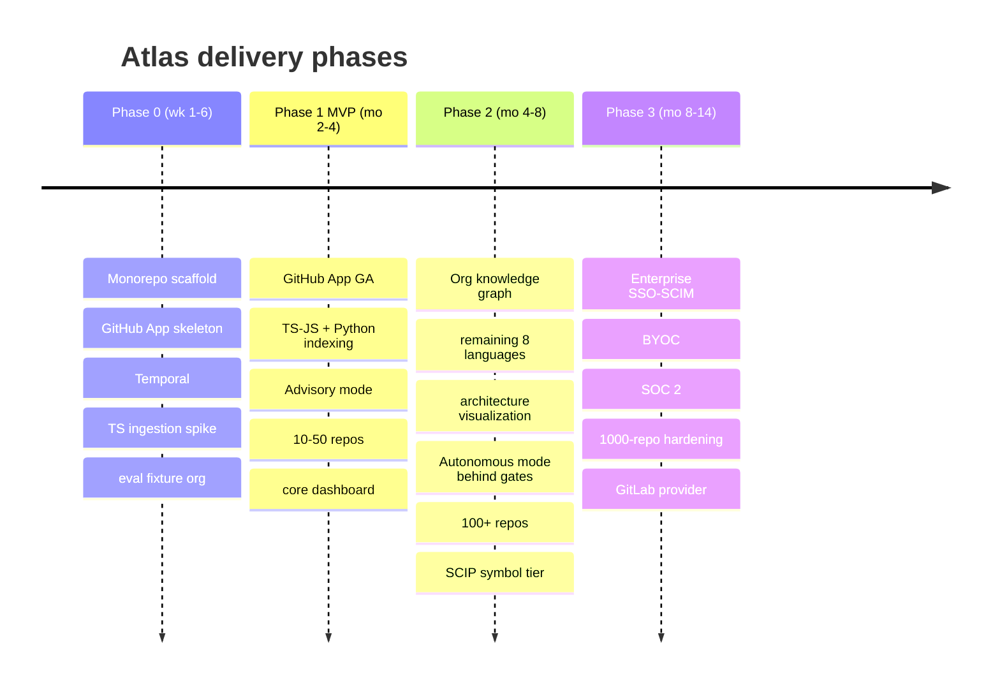

# ROADMAP.md — Atlas

> Phased delivery plan. Authoritative detail: [docs/09-roadmap-team-risks-competition.md](docs/09-roadmap-team-risks-competition.md). Current state: design-complete, implementation not started. All dates are relative durations, not calendar commitments; all costs are estimates.

## Timeline

## Phase 0 — Foundations (weeks 1–6)

**Goal:** prove the vertical slice end-to-end for one language.

- Monorepo (pnpm + Turborepo), CI, local docker-compose infra.
- Postgres migrations from docs/06 DDL with RLS.
- GitHub App registration + installation + user OAuth identity overlay.
- Webhook ingress → SQS with HMAC + dedupe.
- **TypeScript ingestion spike:** clone → tree-sitter → chunk → secret-scan → embed → Qdrant + Zoekt + Postgres.
- Temporal `fullIndexOrg` / `incrementalIndexRepo`.
- **Eval fixture org** (synthetic ~18-repo org, planted cross-repo edges + injection traps).

**Exit criteria:** one repo fully indexed via a durable workflow; a lexical+semantic query returns correct chunks; retrieval eval harness runs in CI.

## Phase 1 — Advisory MVP (months 2–4)

**Goal:** shippable impact analysis for the beachhead.

- GitHub App GA; TS/JS + Python indexing.
- Minimal retrieval pipeline (fan-out + RRF + rerank + assembly).
- Single-agent → orchestrator-worker analysis (Scope → Analysis → Synthesis → Planning).
- Dependency-edge extraction (first cross-repo graph edges).
- Advisory mode only (plans + suggested diffs + PR descriptions; no writes).
- Core dashboard: prompt, SSE run view, repo list, impact report, history, saved sessions.
- 10–50 repos per org.

**Exit criteria:** a real prompt over a real multi-repo org produces an evidence-linked impact report whose claims verify; measured recall@k on planted edges above target; design-partner using it weekly.

## Phase 2 — Graph + Autonomous (months 4–8)

- Full org knowledge graph (all node/edge types, soft edges with confidence).
- Remaining 8 languages in waves (Java/Go → Rust/C# → C++/PHP/Ruby).
- Architecture visualization (React Flow, clustering, diff-between-dates).
- Autonomous PR mode behind approval gates (CodeGen in sandbox → Review → PR).
- SCIP symbol tier (precise cross-repo symbol resolution).
- 100+ repos per org; scale hardening.

**Exit criteria:** autonomous PRs merged by design partners at acceptable acceptance rate; graph precision/recall measured; visualization usable at 100 repos.

## Phase 3 — Enterprise (months 8–14)

- SSO/SAML/SCIM (WorkOS), RBAC, audit, approval workflows.
- Single-tenant VPC / BYOC (LLM via Bedrock); on-prem/air-gapped exploration.
- SOC 2 Type I → II, ISO 27001 track, GDPR/EU residency.
- 1000-repo scale hardening (Neo4j write amplification, Qdrant memory, Temporal backlog).
- GitLab provider adapter (validates the `@atlas/scm-provider` abstraction).

## Explicit non-goals (do NOT build)

- IDE plugin. Code hosting. Generic chatbot. CI runner.

Each is a market someone else owns and a quarter of engineering we cannot spare. Enforce at every roadmap review.

## Team (from docs/09 §2)

- **Founding (Phase 0–1):** 2 full-stack product, 1 infra/platform, 1 language-tooling/indexing, 1 AI/agents; contract designer.
- **Phase 2:** + security engineer (before SOC 2 evidence window), + solutions engineer.
- **Phase 3:** + second AI engineer.
- 14-month fully-loaded cost ≈ $3.0M (estimate); implies ~$5M seed for ≥20 months runway.

## Success metrics

- **North star:** weekly-active org-wide analyses whose impact reports users accept without correction.
- Retrieval: recall@k on known cross-repo edges; LLM-judged relevance.
- Trust: rate of hallucinated/incorrect impact claims (target → 0).
- Phase 2+: autonomous PR acceptance rate; time-to-first-value on onboarding.
