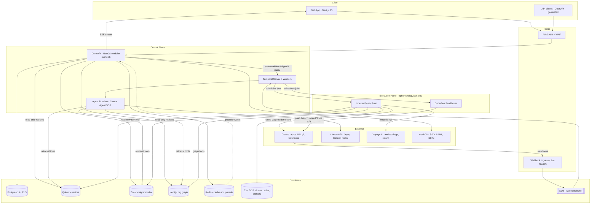
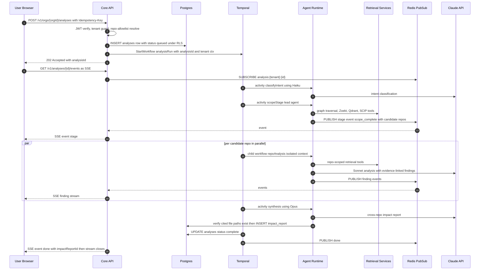
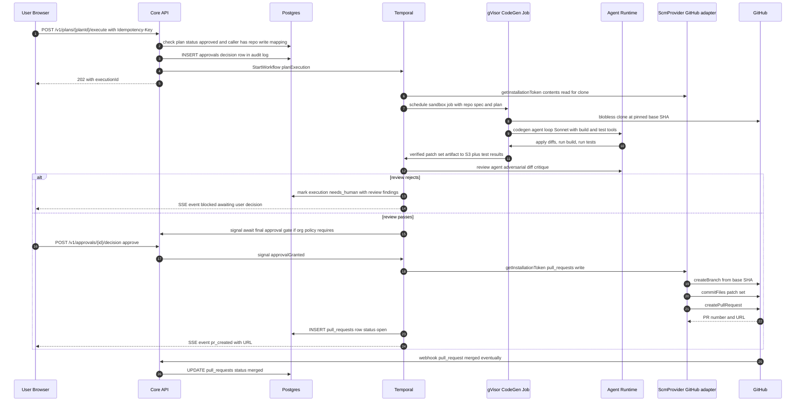
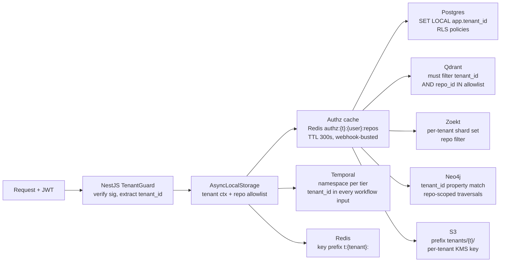

# System & Backend Architecture

> Document 01 of the Atlas architecture package. Retrieval internals: `docs/02-retrieval-and-rag.md`. Graph design: `docs/03-graph-design.md`. Ingestion detail: `docs/04-github-and-ingestion.md`. Agent pipeline: `docs/05-ai-and-agents.md`. Storage schemas: `docs/06-data-architecture.md`. Scale/cost: `docs/07-scalability-and-cost.md`. Security/deployment: `docs/08-security-and-deployment.md`.

## TL;DR

1. **Modular monolith core API (NestJS), polyglot at the edges.** One deployable TypeScript API with hard internal module boundaries; the only separate services are the ones with a physical reason to exist: the Rust indexer fleet (CPU-bound, sandboxed, ephemeral), the webhook ingress (availability isolation), Temporal workers (long-running), and the agent runtime (burst compute, sandbox adjacency). We do not ship 15 microservices on day one — see Pushback.
2. **Everything multi-step runs on Temporal.** Index runs, analysis runs, plan execution, PR creation — all are Temporal workflows with durable state, retries, and per-installation rate-limit awareness. The REST API is a thin command/query layer over Postgres + Temporal; it never holds long-running work in process.
3. **SCM access goes through one TypeScript interface, `@atlas/scm-provider`, with five ports** (auth, repo enumeration, clone access, webhooks, pull requests). Core services import only the interface; `@atlas/scm-github` is the sole adapter in Phase 1. GitLab/Bitbucket are new adapter packages plus a registry entry — zero core changes.
4. **Tenancy is a request-scoped context that every layer enforces independently**: JWT claims → NestJS guard → AsyncLocalStorage → Postgres RLS (`SET LOCAL app.tenant_id`), Qdrant payload filters, Neo4j `tenant_id` node property, per-tenant Zoekt shards, Redis key prefixes, per-tenant S3 prefixes with per-tenant KMS keys, Temporal namespace per tier. Authorization additionally mirrors GitHub repo permissions: every retrieval call carries the caller's repo-ID allowlist.
5. **Streaming is SSE end-to-end** (agent runtime → Redis pub/sub → API → browser), with `Last-Event-ID` resume, because analysis runs are server-push-only and SSE survives corporate proxies and LB restarts better than WebSockets for this shape of traffic.

---

## 1. High-Level Architecture

### 1.1 Component diagram



The GitHub integration boundary is not a box on the network — it is a code boundary: every arrow touching GitHub above passes through `@atlas/scm-provider` (Section 2). No service imports `@octokit/*` except `@atlas/scm-github`.

### 1.2 Component responsibility table

| Component | Tech | Responsibility | Explicitly NOT responsible for | Scaling unit |
|---|---|---|---|---|
| Web App | Next.js 15, TypeScript, Tailwind, shadcn/ui, React Flow, TanStack Query | Dashboard: prompts, analyses, impact reports, plan review/approval, graph visualization, repo list, sessions | Business logic; all mutations go through Core API | Vercel/K8s pods, stateless |
| API Gateway / Edge | AWS ALB + WAF | TLS, routing, IP allowlists (enterprise), request size limits, basic rate limiting | Auth decisions (Core API owns them) | Managed |
| Webhook Ingress | Minimal NestJS app | Verify SCM signatures via provider port, normalize event envelope, enqueue to SQS in < 50 ms, return 202 | Any processing; it must survive Core API outages | 2+ pods, stateless |
| Core API | NestJS modular monolith | AuthN/AuthZ, tenancy context, REST + SSE, CRUD over Postgres, starting/signaling Temporal workflows, read-path retrieval fan-out for interactive search | Long-running work; heavy parsing; talking to git | HPA on pods, stateless |
| Temporal Server + Workers | Temporal, TypeScript SDK | Durable orchestration of index runs, analysis runs, plan execution, PR creation; retries; rate-limit-aware scheduling; human-approval waits as signals | Storing domain state (Postgres is source of truth for domain records) | Worker deployments per task queue |
| Agent Runtime | Node service embedding Claude Agent SDK | Runs Scope/Analysis/Synthesis/Planning/Review agents as Temporal activities; exposes retrieval primitives as tools; enforces token budgets, model routing, evidence citation checks | Deciding *when* to run (Temporal), write access to GitHub | Worker pool per model tier queue |
| Indexer Fleet | Rust; ephemeral gVisor K8s Jobs, egress-blocked except SCM + internal endpoints | Blobless clone, secret scan, tree-sitter parse, SCIP indexing, structure-aware chunking, embedding batching, Zoekt shard build, graph-fact extraction | Query serving; anything with tenant-crossing state | K8s Jobs, one per repo@commit unit |
| CodeGen Sandboxes | gVisor jobs with full checkout + toolchains | Apply diffs, build, run tests, produce verified patches | Network access beyond SCM push + package mirrors | K8s Jobs per plan-repo |
| Qdrant | Self-hosted cluster | Semantic search over code/doc chunks (voyage-code-3, 1024-dim int8), payload filtering by tenant/repo/lang/path | Relationships, exact-match search | Shards by tenant tier; see `docs/07-scalability-and-cost.md` |
| Zoekt | Self-hosted | Lexical/structural trigram search across all tenant repos | Ranking beyond lexical scoring | Per-tenant shard sets |
| Neo4j | Self-hosted cluster | Org-level knowledge graph, 10^5–10^6 nodes at 1000 repos; impact traversals | Symbol-level edges (SCIP tier, S3 + Postgres pointers) | Single cluster; per-tenant DB for enterprise tier |
| Postgres 16 | RDS/self-hosted | System of record: tenants, users, repos, runs, analyses, reports, plans, approvals, PRs, audit log, SCIP pointers; RLS everywhere | Search, vectors | Primary + replicas; partition large tables by tenant |
| Redis | ElastiCache/self-hosted | Session cache, authz repo-set cache, rate-limit token buckets, SSE pub/sub fan-out, idempotency keys | Durable state | Cluster mode |
| S3 | AWS | SCIP artifacts per repo@commit, repo snapshot cache, impact-report exports, agent transcripts | Queryable data | Managed |
| SQS | AWS | Webhook ingress buffer, decouples GitHub burst from Temporal | Multi-step logic (Temporal owns it) | Managed |
| Observability | OTel → Grafana stack; Langfuse | Traces, metrics, logs, LLM traces/evals, per-tenant cost metering | — | Managed/self-hosted |

### 1.3 Why a modular monolith core

The Core API is one NestJS deployable with enforced module boundaries (`@atlas/api` modules: `auth`, `tenancy`, `orgs`, `repos`, `indexing`, `analysis`, `plans`, `approvals`, `graph-query`, `sessions`, `audit`). Nest's DI plus `eslint-plugin-boundaries` rules make cross-module imports compile-time errors except through each module's public facade. This gives us microservice-shaped seams (any module can be extracted later by moving its facade behind HTTP) without paying the day-one costs: distributed transactions, N deployment pipelines, cross-service auth. The services that ARE separate (ingress, indexers, agent runtime, Temporal workers) are separate for physics — failure isolation, CPU profile, sandboxing — not for fashion. Justification against the founder's "optimize for the best possible platform" framing is in Pushback item 1.

---

## 2. SCM Provider Abstraction

### 2.1 Design rules

1. Core code imports **only** `@atlas/scm-provider`. Adapters (`@atlas/scm-github`, later `@atlas/scm-gitlab`, `@atlas/scm-bitbucket`) are resolved at runtime from a registry keyed by the `provider` column on the `installations` table.
2. The interface is **capability-segregated** (five ports) so adapters can be partial: an adapter declares capabilities, and the platform degrades gracefully (e.g., a provider without draft-PR support gets normal PRs).
3. **Normalized event model**: webhooks from any provider are converted into one internal event union before touching SQS. Temporal workflows never see provider payloads.
4. **Tokens are opaque and short-lived**: core code asks for a scoped token and never learns how it was minted (GitHub App installation token vs GitLab group token).

### 2.2 The TypeScript interface

```typescript
// packages/scm-provider/src/index.ts  — the ONLY SCM import allowed in core code

export type ProviderKind = 'github' | 'gitlab' | 'bitbucket';

export type Capability =
  | 'draft_prs' | 'check_runs' | 'fine_grained_installation'
  | 'blobless_clone' | 'commit_status' | 'review_threads';

export interface RepoRef {
  providerRepoId: string;      // provider-native ID, opaque to core
  owner: string;               // org/group/workspace slug
  name: string;
  defaultBranch: string;
  visibility: 'public' | 'private' | 'internal';
  archived: boolean;
  sizeKb: number;
  pushedAt: string;            // ISO 8601
}

export interface ScmToken {
  value: string;               // never logged; redacted by telemetry layer
  expiresAt: string;
  scopes: readonly TokenScope[];
}
export type TokenScope =
  | 'contents:read' | 'metadata:read' | 'pull_requests:write' | 'checks:read';

// ---- Port 1: Auth --------------------------------------------------------
export interface ScmAuthPort {
  /** Mint least-privilege installation-scoped token (GitHub: App installation token). */
  getInstallationToken(
    installationId: string,
    scopes: readonly TokenScope[],
    repoAllowlist?: readonly string[],   // narrow to specific repos when supported
  ): Promise<ScmToken>;

  /** User OAuth code exchange for identity + permission mirroring. */
  exchangeUserCode(code: string, redirectUri: string): Promise<ScmUserIdentity>;

  /** Repos this user's SCM identity can READ. Drives Atlas authorization. */
  listUserReadableRepos(user: ScmUserIdentity): AsyncIterable<RepoRef>;
}
export interface ScmUserIdentity {
  providerUserId: string;
  login: string;
  refreshToken?: string;       // stored envelope-encrypted, see docs/06
}

// ---- Port 2: Repo enumeration -------------------------------------------
export interface ScmRepoPort {
  listInstallationRepos(installationId: string): AsyncIterable<RepoRef>;
  getRepo(installationId: string, providerRepoId: string): Promise<RepoRef>;
  /** Commit range metadata for incremental indexing (docs/04). */
  compareCommits(repo: RepoRef, baseSha: string, headSha: string, token: ScmToken):
    Promise<{ files: ChangedFile[]; truncated: boolean }>;
}
export interface ChangedFile {
  path: string; previousPath?: string;
  status: 'added' | 'modified' | 'removed' | 'renamed';
}

// ---- Port 3: Clone access -------------------------------------------------
export interface ScmClonePort {
  /** Short-lived authenticated URL for blobless partial clone inside sandboxed jobs. */
  getCloneSpec(repo: RepoRef, token: ScmToken): Promise<{
    url: string;                       // https with embedded short-lived credential
    recommendedArgs: readonly string[]; // e.g. ['--filter=blob:none', '--bare']
  }>;
}

// ---- Port 4: Webhooks -----------------------------------------------------
export interface ScmWebhookPort {
  /** Constant-time signature verification against the raw body. */
  verifySignature(headers: Record<string, string>, rawBody: Buffer): boolean;
  /** Provider payload -> normalized event. Returns null for events we ignore. */
  parseEvent(headers: Record<string, string>, rawBody: Buffer): NormalizedScmEvent | null;
  /** Idempotency key for exactly-once processing (GitHub: X-GitHub-Delivery). */
  deliveryId(headers: Record<string, string>): string;
}

export type NormalizedScmEvent =
  | { kind: 'push'; repo: RepoRef; beforeSha: string; afterSha: string; ref: string }
  | { kind: 'pull_request'; repo: RepoRef; action: 'opened' | 'merged' | 'closed' | 'synchronize';
      prNumber: number; headSha: string }
  | { kind: 'installation'; action: 'created' | 'deleted' | 'suspended' | 'unsuspended';
      installationId: string }
  | { kind: 'installation_repos'; installationId: string;
      added: RepoRef[]; removed: RepoRef[] }
  | { kind: 'repository'; repo: RepoRef; action: 'renamed' | 'deleted' | 'archived' | 'transferred' }
  | { kind: 'member_permissions_changed'; installationId: string };  // triggers authz cache bust

// ---- Port 5: Pull requests ------------------------------------------------
export interface ScmPullRequestPort {
  createBranch(repo: RepoRef, fromSha: string, branchName: string, token: ScmToken): Promise<void>;
  /**
   * Commit a verified patch set. Adapter chooses API-based or git-push-based strategy.
   * The commit is bound to the approved+reviewed diff: `reviewedDiffHash` is the sha256
   * of the reviewed diff artifact (recorded in `generated_prs` and the audit log next to
   * `planHash`), and every change carries the sha256 of its post-image (`null` for deletes).
   * The PR stage / token broker MUST reject the commit if the committed file set is not a
   * subset of the reviewed diff's paths, or if any `contentHash` differs from the reviewed
   * post-image — the human diff gate approved a specific byte-level artifact, not the agent.
   */
  commitFiles(repo: RepoRef, branch: string, commit: {
    message: string;
    reviewedDiffHash: string;                                         // sha256 of approved diff artifact
    changes: readonly {
      path: string;
      content: Buffer | null;                                         // null = delete
      contentHash: string | null;                                     // sha256 of post-image; null = delete
    }[];
  }, token: ScmToken): Promise<{ sha: string; committedContentHash: string }>;
  createPullRequest(repo: RepoRef, pr: {
    title: string; body: string; head: string; base: string; draft?: boolean;
  }, token: ScmToken): Promise<{ providerPrId: string; number: number; url: string }>;
  getPullRequestStatus(repo: RepoRef, providerPrId: string, token: ScmToken):
    Promise<{ state: 'open' | 'merged' | 'closed'; checks: 'pending' | 'passed' | 'failed' | 'none' }>;
}

// ---- The provider ----------------------------------------------------------
export interface ScmProvider {
  readonly kind: ProviderKind;
  readonly capabilities: ReadonlySet<Capability>;
  readonly auth: ScmAuthPort;
  readonly repos: ScmRepoPort;
  readonly clone: ScmClonePort;
  readonly webhooks: ScmWebhookPort;
  readonly pullRequests: ScmPullRequestPort;
}

export interface ScmProviderRegistry {
  get(kind: ProviderKind): ScmProvider;   // throws ProviderNotEnabledError
}
```

### 2.3 GitHub-specific vs generic

| Concern | Generic (in `@atlas/scm-provider` / core) | GitHub-specific (in `@atlas/scm-github`) | GitLab/Bitbucket delta (planned) |
|---|---|---|---|
| App identity | `getInstallationToken` contract, token scopes enum | GitHub App JWT signing (RS256), installation token minting, per-repo narrowing | GitLab: group access tokens or OAuth app; Bitbucket: workspace OAuth — same port |
| Permission mirroring | `listUserReadableRepos` contract; Atlas caches the result | `GET /user/installations/{id}/repositories` pagination | GitLab: membership + `min_access_level=10` |
| Webhook verification | raw-body HMAC contract + delivery ID | `X-Hub-Signature-256` HMAC-SHA256, `X-GitHub-Delivery` | GitLab: static secret token header — weaker; adapter compensates with IP allowlist |
| Event taxonomy | `NormalizedScmEvent` union | Mapping of `push`, `pull_request`, `installation`, `installation_repositories`, `repository`, `member` | GitLab MR events → `pull_request`; naming absorbed by adapter |
| Rate limits | Token-bucket interface consumed by Temporal workers | 5,000 req/hr per installation + secondary limits; adapter publishes budget hints | GitLab.com: different ceilings; self-managed: configurable |
| PR semantics | `createPullRequest` contract | Draft PRs, auto-merge flags, Checks API reads | Bitbucket has no draft PRs → capability flag off |
| Clone | `getCloneSpec` contract | `x-access-token:{token}@github.com`, `--filter=blob:none` support | GitLab supports partial clone; Bitbucket Server does not everywhere → capability flag |

The `provider` column exists on `installations`, `repos`, and `pull_requests` rows from day one (see `docs/06-data-architecture.md`), so adding GitLab is: write adapter package, register in `ScmProviderRegistry`, add OAuth screens. No migration, no core change.

---

## 3. Request Lifecycles

### 3.1 Flow A — prompt → impact analysis → streamed results



Notes: the API returns `202` immediately; all state transitions live in Postgres and are re-derivable — if the SSE connection drops, the client reconnects with `Last-Event-ID` and the API replays missed events from a Redis Stream (`XRANGE`) retained for 24 h. Temporal owns retries and rate-limit backoff; the browser connection is never load-bearing.

### 3.2 Flow B — plan approval → autonomous PR creation



Two hard gates are visible here and are non-negotiable: (1) `plan.status = approved` is checked in Postgres before any workflow starts; (2) the write-scoped token (`pull_requests:write`) is minted only *after* the review agent passes and any final human gate is signaled. Clone tokens and write tokens are separate mints with separate scopes.

A third binding is enforced at the write itself: the commit is tied to the exact artifact a human reviewed, not merely to the plan. The final diff gate (Gate 2 in `docs/05` §4.3) approves the reviewed diff by hash; `commitFiles` (Section 2.2) therefore carries `reviewedDiffHash` plus a per-file `contentHash`, and the PR stage / token broker rejects any commit whose file set is not a subset of the reviewed diff's paths or whose content hashes differ from the reviewed post-images. This closes the gap where an injection-steered PR agent could otherwise add unreviewed paths inside an already-approved repo: `planHash` binds *which* changes were approved (`docs/08` §3.4) and `reviewedDiffHash` binds their *exact bytes*. The committed content hash is recorded in `generated_prs` and in the audit log alongside `planHash`. Secret-scan-on-output (`docs/08`) remains a separate, additive check.

---

## 4. Monorepo Structure

One monorepo, pnpm workspaces + Turborepo for TS, a Cargo workspace embedded for Rust. CI builds are path-filtered; ArgoCD deploys per-service images.

```text
atlas/
├── apps/
│   └── web/                          # Next.js 15 dashboard (App Router)
│       ├── app/                      #   routes: /analyses, /repos, /graph, /plans, /sessions, /approvals
│       ├── components/               #   shadcn/ui composites; React Flow graph canvas
│       ├── lib/api/                  #   generated client from packages/contracts (never hand-rolled fetch)
│       └── lib/sse/                  #   EventSource wrapper w/ Last-Event-ID resume + TanStack Query cache merge
│
├── services/
│   ├── api/                          # Core API — NestJS modular monolith
│   │   ├── src/modules/auth/         #   GitHub OAuth, WorkOS SSO, JWT issuance, API keys
│   │   ├── src/modules/tenancy/      #   tenant context, AsyncLocalStorage, RLS session vars, authz cache
│   │   ├── src/modules/orgs/         #   orgs, members, platform RBAC
│   │   ├── src/modules/installations/#   SCM installation lifecycle (provider-agnostic)
│   │   ├── src/modules/repos/        #   repo registry, index status, reindex commands
│   │   ├── src/modules/indexing/     #   index-run queries; starts Temporal ingestion workflows
│   │   ├── src/modules/analysis/     #   analyses, impact reports, SSE event replay
│   │   ├── src/modules/plans/        #   plans, executions, PR records
│   │   ├── src/modules/approvals/    #   approval workflows + policy engine (who may approve what)
│   │   ├── src/modules/graph-query/  #   constrained graph query façade over Neo4j (no raw Cypher from clients)
│   │   ├── src/modules/sessions/     #   saved sessions, prompt history
│   │   └── src/modules/audit/        #   append-only audit log writer
│   ├── webhook-ingress/              # verify → normalize → SQS; deliberately dependency-light
│   ├── workflows/                    # Temporal workers (TypeScript SDK)
│   │   ├── src/workflows/ingestion/  #   repoIndexRun, orgBackfill, incrementalUpdate
│   │   ├── src/workflows/analysis/   #   analysisRun, repoAnalysis (child), synthesis
│   │   ├── src/workflows/execution/  #   planExecution, prLifecycle
│   │   └── src/activities/           #   SQS drain, provider calls, sandbox job scheduling, DB writes
│   └── agent-runtime/                # Claude Agent SDK harness (invoked as Temporal activities)
│       ├── src/agents/               #   scope, repo-analysis, synthesis, planning, codegen, review, pr
│       ├── src/tools/                #   retrieval tools (canonical set, docs/02 §7): search_code, semantic_search, graph_query, get_symbol_references, read_file_span, get_repo_card, list_dependents
│       ├── src/routing/              #   model-tier routing (Opus/Sonnet/Haiku), prompt cache config
│       └── src/guards/               #   evidence citation verifier, path-existence checks, token budgets
│
│   └── indexer/                      # Rust — Cargo workspace (separate toolchain, same repo)
│       ├── Cargo.toml                #   [workspace]
│       └── crates/
│           ├── atlas-indexer/        #   job entrypoint: clone → scan → parse → chunk → embed → publish
│           ├── atlas-clone/          #   blobless/bare partial clone, commit-diff walker
│           ├── atlas-secrets/        #   gitleaks-style scan; runs BEFORE any content leaves the sandbox
│           ├── atlas-parse/          #   tree-sitter grammars for all 10 languages; structure-aware chunker
│           ├── atlas-scip/           #   per-language SCIP indexer drivers + artifact writer (S3)
│           ├── atlas-extract/        #   graph-fact extraction: manifests, lockfiles, API specs, routes,
│           │                         #   topics, env vars, K8s/Terraform — emits edge facts w/ evidence
│           ├── atlas-embed/          #   voyage-code-3 batcher, content-addressed chunk dedupe
│           └── atlas-publish/        #   writers: Qdrant upsert, Zoekt shard build, Neo4j fact queue, PG pointers
│
├── packages/                         # shared TypeScript libraries (all consumed via workspace protocol)
│   ├── scm-provider/                 #   THE provider interface (Section 2) — zero runtime deps
│   ├── scm-github/                   #   GitHub adapter: App JWT, octokit, webhook mapping
│   ├── contracts/                    #   OpenAPI spec (source of truth), zod schemas, generated TS client
│   ├── retrieval/                    #   fan-out + RRF fusion + rerank client (used by API and agent-runtime)
│   ├── graph/                        #   typed Neo4j client, Cypher templates, node/edge taxonomy constants
│   ├── db/                           #   Drizzle schema + SQL migrations (DDL detail in docs/06)
│   ├── temporal-common/              #   workflow/activity type contracts shared by api ↔ workflows
│   ├── telemetry/                    #   OTel setup, token/secret redaction, per-tenant cost meters
│   └── eslint-config/, tsconfig/     #   boundary rules live here (enforce module isolation)
│
├── infra/
│   ├── terraform/                    #   EKS, RDS, ElastiCache, SQS, S3, KMS (per-tenant keys), IAM
│   │   └── envs/{dev,staging,prod}/
│   ├── k8s/                          #   Helm charts per service; gVisor RuntimeClass; NetworkPolicies
│   │   └── charts/{api,web,ingress,workflows,agent-runtime,indexer-job,codegen-job,qdrant,zoekt,neo4j,temporal}
│   ├── argocd/                       #   app-of-apps; per-env overlays; BYOC profile overlay
│   └── docker/                       #   distroless base images; indexer image w/ pinned toolchains
│
├── tools/                            # repo automation: codegen from OpenAPI, fixture repos for eval corpus
├── turbo.json  pnpm-workspace.yaml  Cargo.toml(workspace ref)  .github/workflows/
```

Rules that keep this healthy: `apps/web` may import only `packages/contracts`; `services/*` may not import each other (only `packages/*`); `services/indexer` communicates exclusively via S3/Qdrant/Zoekt/SQS/Postgres — no HTTP calls into the core API from inside sandboxes.

---

## 5. API Structure

### 5.1 Conventions

| Concern | Decision |
|---|---|
| Versioning | URL major version: `/v1/...`. Additive changes are non-breaking; breaking changes require `/v2` with 12-month overlap. OpenAPI spec in `packages/contracts` is the source of truth; clients are generated, never hand-written. |
| Auth | `Authorization: Bearer <JWT>` (browser, from OAuth/SSO session) or `Authorization: Bearer <atlas_pat_...>` (API keys, enterprise). JWT carries `sub`, `tenant_id`, `org_ids`, `scm_identity`, platform roles. |
| Idempotency | All POSTs that create work require `Idempotency-Key` (UUIDv4). Keys stored in Redis (`idem:{tenant}:{key}` → response hash, TTL 24 h); replay returns the original response with `Idempotency-Replayed: true`. |
| Pagination | Cursor-based everywhere: `?limit=50&cursor=<opaque>`; response envelope `{ "data": [...], "next_cursor": "..." | null }`. No offset pagination (unstable under writes). |
| Errors | RFC 9457 problem+json: `{type, title, status, detail, instance, tenant_request_id}`. |
| Rate limits | Per-token buckets in Redis; headers `X-RateLimit-Limit/Remaining/Reset`. Analysis-start has a separate, lower bucket than reads. |
| SSE | `Content-Type: text/event-stream`; named events; monotonic `id:` per analysis enabling `Last-Event-ID` replay from Redis Streams (24 h retention). Heartbeat comment every 15 s. |

### 5.2 REST resource table

Auth scope column = platform RBAC requirement; ALL routes additionally enforce tenant scoping and GitHub-mirrored repo visibility (Section 6).

| Method | Path | Purpose | Auth scope |
|---|---|---|---|
| GET | `/v1/orgs` | List orgs visible to caller | member |
| POST | `/v1/orgs` | Create org (tenant bootstrap) | authenticated |
| GET | `/v1/orgs/{orgId}` | Org detail, plan tier, settings | member |
| PATCH | `/v1/orgs/{orgId}` | Update settings (mode defaults, approval policy) | org:admin |
| GET | `/v1/orgs/{orgId}/installations` | List SCM installations (provider column visible) | member |
| POST | `/v1/orgs/{orgId}/installations` | Begin install flow → provider redirect URL | org:admin |
| DELETE | `/v1/installations/{id}` | Disconnect installation, schedule data purge | org:admin |
| GET | `/v1/orgs/{orgId}/repos` | Repo registry w/ index status; filters `?language=&status=` | member |
| GET | `/v1/repos/{repoId}` | Repo detail: HEAD indexed SHA, chunk/graph stats | repo:read |
| POST | `/v1/repos/{repoId}/reindex` | Force full reindex (idempotent per SHA) | org:admin |
| GET | `/v1/repos/{repoId}/index-runs` | Index run history | repo:read |
| GET | `/v1/index-runs/{runId}` | Run detail: stage timings, errors, Temporal run ID | repo:read |
| POST | `/v1/orgs/{orgId}/analyses` | Submit prompt → start analysis run (Flow A) | member |
| GET | `/v1/orgs/{orgId}/analyses` | List analyses (prompt history backing) | member |
| GET | `/v1/analyses/{id}` | Analysis status + stage summary | repo-set:read |
| POST | `/v1/analyses/{id}/cancel` | Cancel via Temporal signal | owner-or-admin |
| GET | `/v1/analyses/{id}/impact-report` | The impact report: per-repo why/files/risk, evidence | repo-set:read |
| GET | `/v1/impact-reports/{id}/export` | Signed S3 URL for PDF/JSON export | repo-set:read |
| GET | `/v1/analyses/{id}/plans` | Per-repo change plans for this analysis | repo-set:read |
| GET | `/v1/plans/{planId}` | Plan detail: changes, approach, side effects, tests, migrations | repo:read |
| POST | `/v1/plans/{planId}/execute` | Approved plan → autonomous execution (Flow B) | repo:write + approval |
| GET | `/v1/plans/{planId}/executions` | Execution attempts, sandbox results, review verdicts | repo:read |
| GET | `/v1/plans/{planId}/pull-requests` | PRs created from this plan | repo:read |
| GET | `/v1/pull-requests/{id}` | PR record + live provider status | repo:read |
| GET | `/v1/orgs/{orgId}/approvals` | Pending approval requests for caller | member |
| POST | `/v1/approvals/{id}/decision` | Approve/reject with comment (audited, signals Temporal) | approver |
| POST | `/v1/orgs/{orgId}/graph/query` | Constrained graph query DSL — named traversals with params, not raw Cypher | member |
| GET | `/v1/orgs/{orgId}/graph/neighborhood?node={id}&depth={n}` | Subgraph for React Flow visualization (feed defined in docs/03) | member |
| GET | `/v1/orgs/{orgId}/graph/nodes?type=Service&q=...` | Node search/typeahead | member |
| GET | `/v1/orgs/{orgId}/prompts` | Prompt history w/ outcomes | member |
| GET/POST | `/v1/orgs/{orgId}/sessions` | Saved sessions list/create | member |
| GET/PATCH/DELETE | `/v1/sessions/{id}` | Session read/rename/delete | owner |
| GET | `/v1/orgs/{orgId}/audit-log` | Audit events, cursor-paginated | org:admin |
| GET | `/v1/orgs/{orgId}/usage` | Token/cost metering per period | org:admin |

### 5.3 Streaming and ingress endpoints

| Method | Path | Purpose | Notes |
|---|---|---|---|
| GET (SSE) | `/v1/analyses/{id}/events` | Live analysis stream | Events: `stage`, `finding`, `agent_status`, `token_usage`, `done`, `error`. Replayable via `Last-Event-ID`. |
| GET (SSE) | `/v1/plans/{planId}/executions/{execId}/events` | Live execution stream | Events: `sandbox_status`, `test_result`, `review_verdict`, `approval_required`, `pr_created`, `error`. |
| GET (SSE) | `/v1/orgs/{orgId}/index-activity` | Org-wide indexing ticker for dashboard | Low-frequency; 1 event/run transition. |
| POST | `/webhooks/{provider}` | SCM webhook ingress — **separate service + hostname** (`hooks.atlas.dev`), unversioned | Signature verify via provider port → normalize → SQS. Returns 202 in < 50 ms. estimate — verify: 1,000-repo org at ~20 pushes/repo/day ≈ 0.23 events/s mean, 50/s burst — SQS absorbs this trivially. |
| POST | `/webhooks/workos` | SCIM/SSO directory events | Drives enterprise user lifecycle. |

---

## 6. Multi-Tenancy Through Every Layer

Two independent controls apply to every request: **tenant isolation** (you cannot touch another tenant's rows/vectors/nodes/keys even with a bug in application code) and **permission mirroring** (within your tenant, you only see repos your GitHub identity can read). Defense in depth means each storage layer enforces tenancy itself, not just the API.



### 6.1 Layer-by-layer enforcement

| Layer | Mechanism | Failure mode it protects against |
|---|---|---|
| Edge/JWT | `tenant_id` is a signed claim minted at login; never accepted from request bodies or query params | Client-forged tenancy |
| Core API | `TenantGuard` + AsyncLocalStorage context; every repository/service method requires ctx or throws | Developer forgets a WHERE clause |
| Postgres | RLS on every tenant table: `USING (tenant_id = current_setting('app.tenant_id')::uuid)`; API role has no `BYPASSRLS`; `SET LOCAL` inside each transaction | SQL injection or ORM bug leaking rows |
| Qdrant | Single collection per tier with mandatory payload filter `{tenant_id, repo_id ∈ allowlist}` injected by `packages/retrieval` — the raw Qdrant client is not exported | Cross-tenant vector hits |
| Zoekt | Physically separate shard sets per tenant (`/shards/{tenant_id}/...`); search fan-out only mounts caller's shards | Lexical index bleed |
| Neo4j | Every node carries `tenant_id`; all Cypher templates in `packages/graph` begin with a tenant match; enterprise tier gets a dedicated Neo4j database per tenant | Traversal escaping tenant subgraph |
| Redis | Key prefixes `t:{tenant_id}:`; ACL-separated logical usage | Cache poisoning across tenants |
| S3 | `s3://atlas-{env}-artifacts/tenants/{tenant_id}/...`; bucket policy + per-tenant KMS envelope keys (docs/06, docs/08) | Artifact leak even with a leaked object URL |
| Temporal | Namespaces: `cloud-shared`, `cloud-{tenant}` for enterprise, BYOC in-VPC; `tenant_id` in every workflow input; activities re-assert tenancy before DB writes | Workflow processing wrong tenant's data |
| Sandboxes | Indexer/codegen jobs receive exactly one repo's short-lived token; egress-blocked; no cross-repo mounts | Hostile repo content pivoting to other tenants |
| LLM boundary | Prompts assembled only from ctx-filtered retrieval; per-tenant cost meters; ZDR agreement; BYOC uses Bedrock in-VPC | Context contamination and data retention |

### 6.2 Permission mirroring (authorization inside a tenant)

1. On login and on cache expiry (Redis `authz:{tenant}:{user}:repos`, TTL 300s — see `docs/08-security-and-deployment.md` §3.2 and the Redis key table in `docs/06-data-architecture.md` §5), Atlas refreshes the caller's readable-repo set via `ScmAuthPort.listUserReadableRepos` and caches the repo IDs; a periodic reconciliation (6-hourly per installation, `docs/04`) backstops missed webhooks.
2. `member_permissions_changed` and `installation_repos` webhooks bust the cache immediately.
3. The allowlist is injected into: every SQL query (join against permitted repo IDs — RLS handles tenancy, app layer handles repo ACL), every Qdrant filter, the Zoekt repo filter, and every Cypher template parameter set.
4. Analyses record the allowlist snapshot they ran under; a user who later loses repo access loses access to reports whose repo set intersects the revocation (re-checked at read time, not just write time).
5. Platform RBAC (org admin, approver, member) layers on top — it can only *further restrict*, never widen, the mirrored set.

### 6.3 Tenancy tiers

| Tier | Compute | Data stores | LLM |
|---|---|---|---|
| Multi-tenant cloud (default) | Shared EKS, shared services | Shared clusters, isolation per 6.1, per-tenant KMS | Claude API + ZDR |
| Single-tenant VPC / BYOC | Dedicated EKS in customer account via Terraform profile (`infra/argocd` BYOC overlay) | Dedicated everything; same charts | AWS Bedrock in-VPC |
| On-prem / air-gapped (Phase 3) | Customer K8s | Same charts, all components self-hostable by design | Bedrock or customer gateway |

Same codebase, same Helm charts, different overlay — the tier is a deployment profile, not a fork. Details in `docs/08-security-and-deployment.md`.

---

## 7. Cross-Cutting Backend Decisions

| Decision | Choice | Rejected alternative | Why |
|---|---|---|---|
| Streaming transport | SSE | WebSockets | Server-push-only workload; SSE gives HTTP semantics, proxy friendliness, trivial resume via `Last-Event-ID`; WebSockets buy bidirectionality we do not need and cost LB/session complexity |
| Async backbone | Temporal for all multi-step; SQS only as webhook shock absorber | Kafka event bus, BullMQ | Analysis runs are stateful sagas with human-approval waits measured in days — Temporal signals + durable timers model this natively; a bus would force us to hand-roll state machines |
| API style | REST + SSE with generated clients | GraphQL | Resource model is stable and flat; approval/idempotency semantics map cleanly to REST; GraphQL's N+1 and authz-per-field costs are real with RLS + repo ACLs |
| Internal comms | In-process module calls (monolith) + Temporal activities | gRPC mesh | No network hop between modules until a module earns extraction by load profile |
| Config/flags | Postgres-backed org settings + environment overlays | LaunchDarkly day one | Approval policies are domain data, not flags; buy a flag vendor when experiments demand it |
| ID scheme | UUIDv7 everywhere (time-ordered, index-friendly) | Serial IDs | Cursor pagination + multi-writer friendliness; no ID enumeration leaks |
| Frontend | Next.js 15 (App Router) + React Flow, Tailwind + shadcn/ui, TanStack Query | SvelteKit or plain React SPA; Cytoscape/D3 for the graph | App Router SSR + streaming consume the API's SSE cleanly; React Flow's node/edge model maps directly onto the org graph canvas without a bespoke render layer; Tailwind + shadcn give component velocity; a plain SPA would re-implement routing/streaming and Cytoscape/D3 the graph interactions we get for free |
| Observability | Self-hostable OTel → Grafana stack + Langfuse | Datadog (or another SaaS-only APM) | BYOC/air-gapped parity (`docs/08`) requires every component be self-hostable — a SaaS-only APM cannot ship inside a customer VPC; Langfuse adds LLM-specific traces/evals and per-tenant cost metering that generic APMs do not model |
| Auth / SSO | WorkOS (SAML, SCIM, OAuth) + GitHub App/user OAuth | Auth0/Okta, or build the IdP integration matrix in-house | WorkOS covers the enterprise SAML/SCIM breadth in one integration without us maintaining an N-IdP matrix; GitHub remains the authorization root (Section 6), so the identity provider only supplies authentication and directory sync, not repo permissions |

---

## 8. Pushback

### 8.1 "Optimize for the best possible platform, not for simplicity" — partially rejected at the service-topology layer

The founder's instruction reads as a license for maximal architecture. For *capabilities* (four retrieval primitives, two-tier graph, durable orchestration) we agree and the canon implements it. For *service topology* we deliberately chose a modular monolith core, and this is the better platform, not a simplification compromise: the dominant failure mode of ambitious platforms at our stage is spending engineering weeks on inter-service plumbing instead of retrieval quality. Every seam microservices would buy us is preserved as a compile-time-enforced module boundary, and the four genuinely separate services (ingress, indexers, agent runtime, workers) are separated by physics. If the analysis module needs independent scaling at 1000-repo tenants, extraction is a two-week job behind an existing facade. Best possible platform ≠ most distributed platform.

### 8.2 "One architecture must serve individual devs, startups, and enterprises" — true for code, false for infrastructure floor

A single *codebase and architecture* serves all three (Section 6.3 shows tiers as deployment overlays). But the canonical stack's standing cost — Qdrant + Zoekt + Neo4j + Temporal + Postgres + Redis on EKS — has a fixed floor in the hundreds of USD/month (estimate — verify against docs/07 cost model) that an individual dev with 5 repos cannot justify as dedicated infrastructure. The resolution is already implicit in multi-tenancy and should be made explicit product strategy: individual devs are rows in the shared cluster, never deployments. The risk to flag: if the free/dev tier drives Zoekt shard-count explosion (thousands of tiny tenants × per-tenant shard sets), we should collapse small tenants into pooled shards with repo-level filters — a Phase 2 optimization the per-tenant shard design must not preclude. `docs/07-scalability-and-cost.md` owns the numbers.

### 8.3 Neo4j at the low end (canon implemented; alternative noted)

We implement Neo4j as canon for the org graph. Noting for the record: at 10-repo tenants the org graph is ~10^3 nodes, and Postgres recursive CTEs would carry it with one less stateful system to operate. The canon still wins because (a) 1000-repo traversals with typed edges and evidence properties are genuinely Cypher-shaped, (b) BYOC parity means we ship the same stack everywhere, and operating two graph backends by tier is worse than operating Neo4j at all tiers. No change requested — the trade-off should just be visible.

### 8.4 Webhook ingress as a separate service — defended against consolidation

Someone will propose folding webhook ingress into the core API "since it's just one route." Rejected: GitHub retries webhooks on non-2xx with limited patience, and installation webhooks are the *only* signal for permission-revocation cache busting (Section 6.2). Ingress must stay up during core API deploys and incidents. Its entire dependency surface is the provider signature port + SQS, and it must stay that thin.

---

## 9. Open Items Owned Elsewhere

| Item | Owner document |
|---|---|
| Retrieval fusion parameters, token budgets, eval harness | `docs/02-retrieval-and-rag.md` |
| Graph query DSL → Cypher template catalog; visualization feed schema | `docs/03-graph-design.md` |
| Webhook → index-run fan-out, rate-limit budgeting across installations | `docs/04-github-and-ingestion.md` |
| Agent tool inventory, evidence-verification guard implementation | `docs/05-ai-and-agents.md` |
| Full DDL for every table named here; Qdrant collection config; Redis key TTL table | `docs/06-data-architecture.md` |
| Load model validating the SQS/SSE/Temporal sizing estimates in this doc | `docs/07-scalability-and-cost.md` |
| gVisor RuntimeClass, NetworkPolicy specs, KMS key hierarchy | `docs/08-security-and-deployment.md` |
