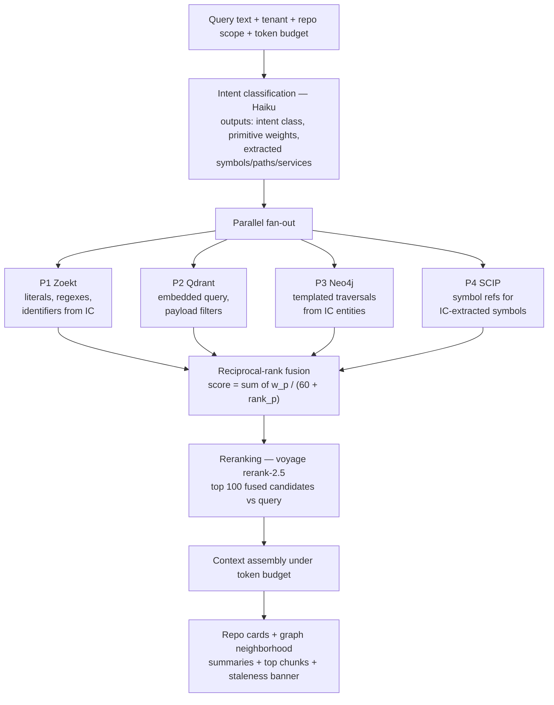
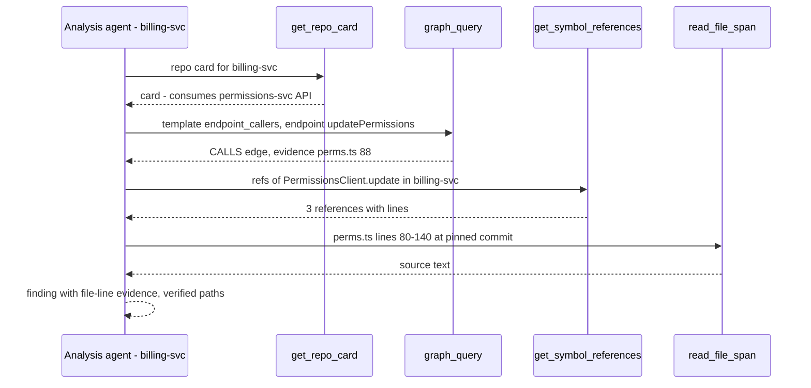
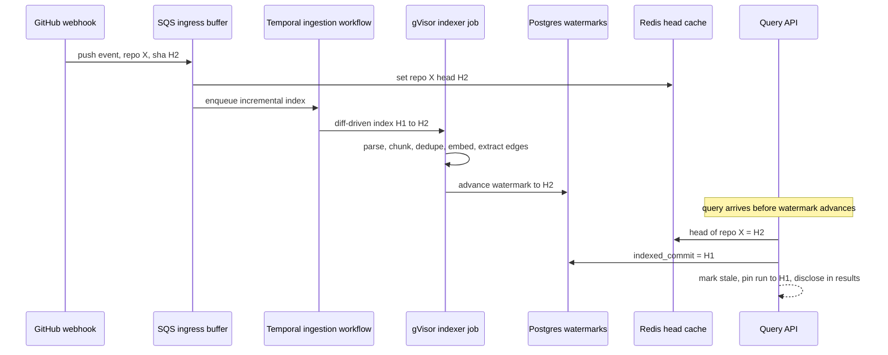

# Retrieval System & RAG Design

> Atlas architecture package — document 02 of 10.
> Upstream: [docs/01-system-architecture.md](01-system-architecture.md) (where these services live), [docs/04-github-and-ingestion.md](04-github-and-ingestion.md) (how the indexes get built).
> Downstream: [docs/03-graph-design.md](03-graph-design.md) (graph internals), [docs/05-ai-and-agents.md](05-ai-and-agents.md) (who consumes retrieval), [docs/06-data-architecture.md](06-data-architecture.md) (physical schemas), [docs/07-scalability-and-cost.md](07-scalability-and-cost.md) (full cost model).

## TL;DR

The five decisions that matter in this document:

1. **Pure vector RAG is rejected.** Impact analysis ("who depends on this?") is a relationship question; embedding similarity cannot answer it reliably. We ship **four retrieval primitives**: Zoekt trigram lexical search, Qdrant semantic search (voyage-code-3, 1024-dim int8), a Neo4j org-level knowledge graph, and on-demand SCIP symbol graphs loaded per `repo@commit` from S3.
2. **Two-tier graph split.** Coarse org topology (Repo, Service, APIEndpoint, MessageTopic, …) is materialized in Neo4j (~10^5–10^6 nodes at 1000 repos). Symbol-level edges are **never** materialized into Neo4j — they would be billions of rows at 1000 repos. Symbol graphs are SCIP artifacts in S3, hydrated on demand, with Postgres pointers.
3. **Deterministic graph, not "Graph RAG."** Parsers, manifests, lockfiles, and API specs build the graph. LLM extraction is confined to soft edges (docs/READMEs → service semantics) and always carries `confidence` + `evidence`. Microsoft-style Graph RAG (LLM entity graphs + community summaries) is not the core mechanism for code.
4. **One pipeline, two consumption modes.** Every query flows through: Haiku intent classification → parallel fan-out across all four primitives → reciprocal-rank fusion (k=60) → voyage rerank-2.5 → context assembly under an explicit token budget anchored by pre-computed repo cards. The same primitives are ALSO exposed as seven typed tools inside the agent loop (agentic RAG) — retrieval is not just a one-shot prompt prefix.
5. **Retrieval is tested like a compiler.** A fixture org with planted cross-repo edges, golden queries with recall@k assertions, LLM-judged relevance for prose queries, and CI regression gates that block merges on metric drops.

---

## 1. The Core Problem: Codebases Do Not Fit in Context Windows

Everything in this document exists because of one arithmetic fact: an engineering organization's code is 2–4 orders of magnitude larger than any LLM context window, and the gap grows with the customer we most want.

| Org tier | Repos | LOC (anchor) | Tokens (~10 tok/LOC) | Multiple of a 200K context window |
|---|---|---|---|---|
| Individual dev | 10 | ~2M | ~20M | ~100× |
| Microservice startup | 100 | ~20M | ~200M | ~1,000× |
| Enterprise | 1,000 | ~150M | ~1.5B | ~7,500× |

All figures are estimates — verify against real customer orgs; the 1000-repo tier assumes a long tail of small repos per the canonical sizing.

Consequences that shape the design:

- **Selection is the product.** The LLM only ever sees a curated slice. If retrieval misses the one repo that consumes a renamed endpoint, no amount of model quality recovers it. Retrieval recall is the ceiling on impact-analysis correctness.
- **Selection must be cheap relative to generation.** At Sonnet input pricing (USD 3/Mtok), naively stuffing 200K tokens per query costs ~USD 0.60 of input alone before any output. Retrieval must reduce 1.5B candidate tokens to a 30–80K token working set for cents, not dollars.
- **"Relevant" has two orthogonal meanings.** *Similar to the query* (semantic) and *connected to the change* (structural). A dependency chain `gateway → auth-svc → orgs-db` contains files that look nothing like the user's prompt. Any single-primitive system optimizes one meaning and silently fails the other.
- **Freshness is part of correctness.** An index that is 40 commits behind produces confident, evidence-cited, wrong answers. Staleness must be measured, surfaced, and bounded (Section 8).

The rest of this document is the machinery that makes selection correct, fresh, and affordable.

---

## 2. The Six Questions

### 2.1 Is traditional vector RAG enough?

**Verdict: No — vector RAG is one of four primitives, and it is the wrong primitive for the platform's headline feature.**

Vector RAG answers "what text is similar to this query?" Impact analysis asks "what code is *connected to* this change?" Those are different questions with disjoint failure modes:

| Property of the impact-analysis problem | Why embeddings fail it |
|---|---|
| Dependents often share zero lexical or semantic surface with the query (SDK wrappers, generated clients, env vars, topic strings) | Nothing similar to embed against — the signal is a *relationship*, not text |
| Answers must be exhaustive ("all 14 consumers"), not top-k | Similarity search is inherently top-k; recall of the 14th consumer is not a thing it can promise |
| Claims need evidence (`file:line`, edge provenance) | A cosine score is not evidence; it cannot be audited |
| Boilerplate look-alikes are everywhere (every service has a "permissions middleware") | High-similarity false positives crowd out true dependents |
| Precise symbol identity matters (`validateOrgScope` in repo A ≠ same-named function in repo B) | Embeddings blur symbol identity by construction |

Where vector search **is** the right primitive: conceptual queries ("where do we do rate limiting?"), fuzzy recall of half-remembered code, cross-language paraphrase matching, and as one signal into fusion. It stays — as a minority shareholder. Concrete failure cases with the rescuing primitive are in Section 4.

### 2.2 Should we use Graph RAG?

**Verdict: We use a knowledge graph, but not "Graph RAG" in the Microsoft sense — the graph is built deterministically by parsers and manifests, not extracted by LLMs.**

Microsoft-style Graph RAG (LLM-extracted entity graphs plus community summaries over a text corpus) solves the right shape of problem — multi-hop, corpus-global questions — with the wrong extractor for code. Code already has ground truth extractors: compilers-grade parsers (tree-sitter, SCIP), dependency manifests, lockfiles, OpenAPI/protobuf/GraphQL SDL/AsyncAPI specs, K8s and Terraform manifests. Using an LLM to guess at edges a lockfile states exactly is paying for hallucination risk we do not need to take.

Division of labor (canonical):

| Edge source | Extractor | Confidence |
|---|---|---|
| Dependency manifests + lockfiles (10 ecosystems) matched against internal repo/package coordinates | Deterministic parser | 0.95–1.0 |
| API specs + framework-aware route extraction (tree-sitter queries) + client call-site extraction with URL-template matching | Deterministic + heuristic matching | 0.6–0.95 |
| Message topic string matching (Kafka/SQS/RabbitMQ/NATS), shared DB/schema refs, env var and config key refs, K8s/Terraform/docker-compose | Deterministic + heuristic matching | 0.5–0.95 |
| Docs/READMEs → service semantics ("soft edges") | LLM extraction (Haiku/Sonnet), always with `confidence` + `evidence` | 0.3–0.8, never load-bearing alone |

One idea we *do* borrow from the Graph RAG literature: hierarchical summaries as retrieval anchors. Our repo cards (Section 6) are exactly community summaries — except the "communities" are real (repos, directories, services), not detected clusters. Full graph design in [docs/03-graph-design.md](03-graph-design.md).

### 2.3 How should repository relationships be stored?

**Verdict: A two-tier split — coarse org topology materialized in Neo4j; symbol-level graphs kept as SCIP artifacts in S3 with Postgres pointers, hydrated on demand per `repo@commit`.**

The scaling argument, in numbers (estimates — verify):

| Tier | Contents | Size at 1,000 repos | Store |
|---|---|---|---|
| Org graph | Org, Repo, Service, Deployable, Package, APIEndpoint, MessageTopic, DataStore, Table, EnvVar, ConfigKey, Team, Person, Domain nodes + 12 canonical edge types | ~10^5–10^6 nodes, low-multiple edges | Neo4j, always hot |
| Symbol graph | Every definition/reference/implementation occurrence | 150M LOC → order of 10^8–10^9 occurrences | SCIP protobuf artifacts in S3, keyed `repo@commit`, Postgres pointer table |

Materializing symbol edges into Neo4j at the enterprise tier means billions of rows, write amplification on every push, and a graph too large to traverse interactively — for edges that any single query touches only a handful of repos' worth of. Instead: the Neo4j graph scopes the question to candidate repos ("which repos CALL this service?"), then the symbol layer answers precisely inside each candidate ("which functions in repo B reference `PermissionsClient.update`?"). This split is a core scaling decision of the platform. Physical layout of the pointer table and S3 keys: [docs/06-data-architecture.md](06-data-architecture.md).

### 2.4 How should dependencies be modeled?

**Verdict: As first-class, evidence-carrying `DEPENDS_ON` edges extracted from manifests and lockfiles across all 10 ecosystems, resolved against an internal package registry of the org's own coordinates.**

Mechanics:

- Every repo's manifests (`package.json`, `go.mod`, `Cargo.toml`, `pom.xml`/`build.gradle`, `requirements.txt`/`pyproject.toml`, `*.csproj`, `composer.json`, `Gemfile`, `CMakeLists.txt`/`conanfile`, plus lockfiles) are parsed at index time.
- Declared coordinates are matched against the org's **internal coordinate map** (built from the org's own published packages and repo metadata). A match produces `(:Repo)-[:DEPENDS_ON]->(:Repo)` via an intermediate `(:Package)` node; a non-match is an external dependency (kept on the Package node, not expanded into the org graph).
- Lockfiles win over manifests for resolved versions; both are recorded as evidence.
- Every edge carries the canonical property set: `{mechanism, confidence, evidence: [file:line], first_seen_commit, last_seen_commit}` — e.g. `mechanism: "lockfile:pnpm-lock.yaml"`, `confidence: 0.98`.

This makes "list everything that transitively depends on `libs/auth-core`" a two-line Cypher traversal with per-hop evidence, instead of a prayer to cosine similarity. Extraction pipeline details: [docs/03-graph-design.md](03-graph-design.md) and [docs/04-github-and-ingestion.md](04-github-and-ingestion.md).

### 2.5 How should APIs be tracked?

**Verdict: As `APIEndpoint` nodes with `EXPOSES` edges from providers and `CALLS`/`CONSUMES` edges from clients, extracted from specs where they exist and from framework-aware parsing where they do not.**

Three extraction lanes, merged with confidence ordering:

1. **Specs (highest confidence):** OpenAPI, protobuf service definitions, GraphQL SDL, AsyncAPI. Spec-declared operations become `APIEndpoint` nodes (`method`, `path_template`, `service`, `spec_source`).
2. **Framework-aware route extraction:** tree-sitter queries per framework (Express/Fastify/Nest routes, Spring `@RequestMapping`, Rails routes, Django/Flask/FastAPI, Go mux/gin/echo, ASP.NET attributes, Laravel, Actix/Axum). Catches endpoints that never got a spec — most of them, in practice.
3. **Client call-site extraction:** HTTP client calls (fetch/axios/requests/net-http/reqwest/HttpClient/Guzzle/Faraday, generated SDK clients) with **URL-template matching** — `\`${PERMS_URL}/v1/orgs/${id}/permissions\`` unifies with route template `/v1/orgs/:id/permissions` even though no literal string matches.

Endpoint identity survives renames because the node is keyed by service + template lineage, and edges carry `first_seen_commit`/`last_seen_commit` — a renamed endpoint is an edge update with history, not a lost relationship. This is precisely the case that kills vector-only retrieval (failure case FC-1, Section 4).

### 2.6 How should service-to-service communication be represented?

**Verdict: As typed, mechanism-tagged edges in the org graph — `CALLS` for synchronous, `PUBLISHES`/`SUBSCRIBES` via `MessageTopic` nodes for async, `READS`/`WRITES`/`SHARES_SCHEMA` via `DataStore`/`Table` nodes for data coupling, `REFERENCES_ENV` for configuration coupling.**

Communication is not one relationship; flattening it loses the risk semantics that impact reports need:

| Channel | Representation | Extraction signal | Risk semantics for impact reports |
|---|---|---|---|
| Sync HTTP/gRPC/GraphQL | `(:Service)-[:CALLS]->(:APIEndpoint)<-[:EXPOSES]-(:Service)` | Call-site + route extraction (2.5) | Breaks immediately and loudly |
| Async messaging | `(:Service)-[:PUBLISHES]->(:MessageTopic)<-[:SUBSCRIBES]-(:Service)` | Topic string matching across Kafka/SQS/RabbitMQ/NATS producer/consumer call sites | Breaks silently and later — flag harder |
| Shared data | `(:Service)-[:READS\|:WRITES]->(:Table)`, `(:Repo)-[:SHARES_SCHEMA]->(:Repo)` | Migration files, ORM models, raw SQL extraction | The invisible coupling that skips every code review |
| Config/env | `(:Service)-[:REFERENCES_ENV]->(:EnvVar)` | Env access call sites + K8s/Terraform/compose manifests | Deploy-time breakage |

Every edge carries mechanism + confidence + evidence, so the Synthesis agent can write "auth-svc SUBSCRIBES to `org.permissions.changed` (kafka topic string match, confidence 0.85, evidence: consumer.py:41)" — an auditable claim, not vibes.

---

## 3. The Four Retrieval Primitives

| # | Primitive | Store | Answers | Query shape | p50 latency budget (estimate — verify) |
|---|---|---|---|---|---|
| P1 | Lexical/structural search | Zoekt trigram index | "Where does this exact string/regex/identifier appear?" | Literal, regex, path/lang/repo filters | < 150 ms |
| P2 | Semantic search | Qdrant, voyage-code-3 (1024-dim, int8) | "What code is *about* this concept?" | Embedded query + payload filters | < 250 ms |
| P3 | Org knowledge graph | Neo4j | "What is connected to X, and how?" | Templated Cypher traversals | < 300 ms |
| P4 | Symbol graph | SCIP artifacts (S3) + Postgres pointers | "Exact defs/refs of this symbol at this commit" | Symbol lookup within `repo@commit` | < 500 ms cold, < 100 ms warm |

### P1 — Zoekt (lexical/structural)

Trigram-indexed regex and literal search across every indexed repo, sharded per tenant. This is the primitive agents reach for constantly: exact identifiers, error strings, config keys, TODO markers. It is also the honesty check on the other primitives — if Zoekt finds 37 occurrences of `PERMISSIONS_SERVICE_URL` and the graph shows 14 `REFERENCES_ENV` edges, extraction has a gap. Zoekt shards are versioned with the index watermark (Section 8) so results are attributable to a commit.

### P2 — Qdrant (semantic)

Structure-aware chunks (function/class level, 30–60 lines) embedded with voyage-code-3, stored int8-quantized (~1KB/vector plus payload). Payload carries `{tenant_id, repo_id, path, lang, chunk_kind, start_line, end_line, commit, content_hash}` — payload filtering scopes every search to tenant and (optionally) to the repo set the graph selected. Secret scanning runs before embedding; credentials never reach Qdrant or LLM context ([docs/04-github-and-ingestion.md](04-github-and-ingestion.md)). Collection schema: [docs/06-data-architecture.md](06-data-architecture.md).

Sizing (estimates — verify): at ~45 lines/chunk average — 10 repos ≈ 44K chunks (~66 MB), 100 repos ≈ 440K chunks (~0.7 GB), 1,000 repos ≈ 3.3M chunks (~5 GB with payloads). Initial embedding cost at USD 0.18/Mtok: ~USD 3.60 / 36 / 270 for the three tiers. Full model in [docs/07-scalability-and-cost.md](07-scalability-and-cost.md).

### P3 — Neo4j (org knowledge graph)

The canonical 14 node types and 12 edge types (Section 2.6, full taxonomy in [docs/03-graph-design.md](03-graph-design.md)). Deliberately small — ~10^5–10^6 nodes at 1,000 repos — so multi-hop traversals stay interactive. The blast-radius query behind the Scope stage:

```cypher
// Blast radius of a service, grouped by mechanism, evidence attached
MATCH (s:Service {key: $serviceKey})
MATCH (s)<-[e:CALLS|CONSUMES|SUBSCRIBES|READS|WRITES|REFERENCES_ENV*1..3]-(dependent)
WHERE ALL(r IN e WHERE r.confidence >= $minConfidence)   // default 0.5
WITH dependent, e, [r IN e | {type: type(r), mechanism: r.mechanism,
     confidence: r.confidence, evidence: r.evidence}] AS hops
MATCH (dependent)<-[:EXPOSES|DEPLOYS*0..1]-(:Service)-[:OWNS*0..1]-()
RETURN DISTINCT dependent.key AS node, labels(dependent) AS kind, hops
ORDER BY size(hops) ASC
LIMIT 200
```

### P4 — SCIP symbol graphs (on demand)

Per-language SCIP indexers (tree-sitter heuristics as fallback) emit one artifact per `repo@commit` to S3; Postgres holds pointers. At query time the symbol service hydrates the artifact for exactly the repos the org graph scoped in, and answers definition/reference/implementation queries with `file:line` precision. Warm artifacts are cached (Redis pointer + local disk). This is how "who calls `validateOrgScope`" returns *references of that specific symbol*, not every same-named function in the org.

---

## 4. Why Vector-Only RAG Fails Impact Analysis: Concrete Failure Cases

Each case is realistic, minimal, and mapped to the primitive that rescues it. These become golden queries in the eval harness (Section 9).

| ID | Scenario | Why vector-only fails | Rescuing primitive |
|---|---|---|---|
| FC-1 | `POST /v1/user-permissions` renamed to `/v1/org-permissions` in `permissions-svc`. Callers in `billing-svc` and `admin-ui` go through a generated SDK method `client.updatePermissions()`. Query: "what breaks if we rename this endpoint?" | Caller code contains neither the old path, the new path, nor anything semantically resembling "rename endpoint." Embeddings of an SDK call-site are about billing, not permissions routing. | P3: `APIEndpoint` node with `CALLS` edges from call-site extraction + URL-template matching lists both callers with `file:line` evidence. |
| FC-2 | `PERMISSIONS_SERVICE_URL` env var consumed by 14 repos. Query: "impact of moving the permissions service to a new host?" | Semantic search surfaces READMEs and deployment docs *about* the service — high similarity, zero dependents. The 14 consumers are one-line `os.environ` reads with no semantic signal. | P3: `REFERENCES_ENV` edges enumerate all 14 deterministically. P1 verifies the count. |
| FC-3 | `orders-svc` writes the `orgs` table via its ORM; `reporting-svc` reads it with raw SQL in a different language. No shared code, no shared API. Query: "can we drop the `plan_tier` column?" | The two repos share no imports, no strings beyond a table name buried in SQL, and dissimilar embeddings. Top-k returns the migration file and stops. | P3: `WRITES`/`READS` edges to the `Table` node from migration + SQL extraction expose both sides. |
| FC-4 | Producer publishes Kafka topic `org.permissions.changed`; consumers exist in Go and Ruby repos. Query: "who consumes permission change events?" | Cross-language consumers are semantically distant from each other and from the query phrasing; one consumer using a constants file has no inline topic string for lexical luck to find. | P3: `PUBLISHES`/`SUBSCRIBES` via the `MessageTopic` node (topic string matching incl. constant resolution). |
| FC-5 | Query: "where is org-level permission checking implemented?" in an org where 30 services vendored a similar middleware skeleton. | Vector search drowns the *canonical* implementation under 30 near-duplicate boilerplate hits — a precision failure, not recall. | P3 (OWNS/Domain narrows to the owning service) + rerank; repo cards identify the canonical repo. |
| FC-6 | Query: "all callers of `validateOrgScope`" where three unrelated repos define same-named functions. | Lexical search returns all name-matches including false positives; semantic search is worse. Symbol identity is invisible to both. | P4: SCIP references for the *specific* symbol at the pinned commit. |
| FC-7 | Repo added 20 minutes ago via `installation_repositories` webhook; query arrives before embedding completes. | The vector index simply does not contain the repo; failure is silent. | Section 8: watermark check marks coverage gaps explicitly; P1/P3 may already have partial coverage (Zoekt and manifest extraction complete before embedding). |

The pattern: vector search fails **silently** — it always returns *something* plausible. The graph and symbol primitives fail **loudly** (edge absent, artifact missing), which is a property we exploit: deterministic absence is reportable; similarity absence is not.

---

## 5. The Retrieval Pipeline

Every retrieval — whether a one-shot dashboard query or an agent tool call marked `mode: "fused"` — runs this pipeline:



### 5.1 Intent classification (Haiku)

A single cheap call (~600 tokens in, ~150 out; ≈ USD 0.0014/query — estimate, verify) classifies the query and extracts structure:

```json
{
  "intent": "impact_analysis | symbol_lookup | concept_search | config_trace | ownership | freeform",
  "weights": { "lexical": 0.2, "semantic": 0.2, "graph": 0.5, "symbol": 0.1 },
  "entities": { "symbols": ["validateOrgScope"], "services": ["permissions-svc"],
                "paths": [], "env_vars": [], "topics": [] },
  "graph_templates": ["blast_radius", "endpoint_callers"]
}
```

Weights bias fusion; they never gate fan-out — all four primitives always run (they are fast and cheap; the cost of a wrong gate is a silent recall hole). The classifier's prompt is cached (aggressive prompt caching per canon), so marginal cost is output-dominated.

### 5.2 Reciprocal-rank fusion

Fused score for candidate `c`: `score(c) = Σ_p w_p / (60 + rank_p(c))` over primitives where `c` appears. Graph and symbol results enter as their evidence spans (file spans cited on edges), so all four lists are comparable at the "file span" granularity.

Worked example — query "what breaks if we rename updatePermissions" (weights: lexical 0.25, semantic 0.15, graph 0.45, symbol 0.15):

| Candidate span | Zoekt rank | Qdrant rank | Graph rank | SCIP rank | Fused score |
|---|---|---|---|---|---|
| `billing-svc/src/perms.ts:88-131` (true dependent) | — | — | 2 | 3 | 0.45/62 + 0.15/63 = **0.00964** |
| `permissions-svc/routes.ts:10-52` (the endpoint) | 1 | 4 | 1 | 1 | 0.25/61 + 0.15/64 + 0.45/61 + 0.15/61 = **0.01628** |
| `docs-site/permissions.md:1-40` (look-alike doc) | — | 1 | — | — | 0.15/61 = **0.00246** |

Two things to read off this table. First, fusion does its headline job: the look-alike doc that **dominates a pure vector ranking** (rank 1 semantically, and the *only* candidate a vector-only system would surface at all) lands at 0.00246 — a factor of ~3.9 below the true dependent (0.00964) that vector search never found. Multi-primitive agreement plus graph weighting recovers the dependent that similarity alone drops on the floor.

Second — and this is why fusion is not the last stage — the endpoint node itself scores highest (0.01628), because it is the one span every primitive ranks near the top. That is correct behavior for "what is this thing?" but *wrong* for "what breaks?": the changed endpoint is not its own blast radius. Raw fusion score is therefore an ordering *input*, not the answer. Reranking (§5.3) re-scores these candidates against the actual question intent, and — decisively — the graph-confidence pin promotes the true dependent: the `CALLS` edge into `permissions-svc` carries confidence ≥ 0.9, so `billing-svc/src/perms.ts:88-131` is pinned into the final answer set for a "what breaks" query regardless of where fusion placed it relative to the endpoint definition. Fusion recalls the dependent past the vector-only baseline; §5.3 is what orders it above the thing being changed.

### 5.3 Reranking (voyage rerank-2.5)

Top ~100 fused candidates are cross-encoded against the original query. Reranking fixes what fusion cannot: FC-5-style boilerplate crowding, ordering *within* the graph's exhaustive-but-unordered dependent lists, and the §5.2 failure where a high-agreement node (the changed endpoint itself) outscores the dependents it should be measured against. Graph edges with confidence ≥ 0.9 are pinned into the final set regardless of rerank score — so the true dependent from §5.2 (`billing-svc/src/perms.ts:88-131`, reached by a confidence-0.9 `CALLS` edge) is guaranteed a place ahead of a bare endpoint definition on a "what breaks" query. The reranker may reorder deterministic facts, not delete them.

### 5.4 Context assembly under token budgets

Assembly is anchor-first: repo cards and graph summaries frame the problem; chunks fill in code. Default budgets (estimates — verify against eval results):

| Consumer | Total input budget | Repo cards | Graph neighborhood summaries | Reranked chunks | Reserve for agentic tool results |
|---|---|---|---|---|---|
| Per-repo Analysis agent (Sonnet) | 40K | 1.2K (1 card) | 2K | 24K (~30 chunks) | 12.8K |
| Cross-repo Synthesis (Opus) | 80K | 12K (up to 10 cards) | 8K | 40K | 20K |
| Dashboard one-shot answer (Sonnet) | 20K | 3K | 2K | 12K | 3K |

Assembly rules, in order: (1) staleness banner if any scoped repo's index is stale; (2) repo cards for every repo contributing candidates; (3) graph neighborhood summary — a rendered, deduplicated list of relevant edges with mechanism/confidence/evidence; (4) chunks in rerank order, whole-chunk only (no mid-function truncation; a chunk that does not fit is dropped, not sliced); (5) every included path has been verified to exist at the pinned commit — the canonical anti-hallucination gate; (6) hard stop at budget. System prompts and tool definitions are cache-stable prefixes.

---

## 6. Repo Cards: Pre-computed Hierarchical Summaries

Repo cards are the compression layer that lets an agent reason about 100 repos without reading them. Three levels, all generated offline via the **Batch API** (50% price cut, no latency pressure) with Sonnet:

| Level | Scope | Target size | Inputs |
|---|---|---|---|
| Repo card | Whole repo | 800–1,200 tokens | File tree, manifests, README, top-level graph edges, language stats |
| Directory card | Top ~10 directories by fan-in/churn | 200–400 tokens | Directory listing, key file headers, contained symbols |
| Service card | A `Service` node (may span repos or be a repo subset) | 400–800 tokens | Exposed endpoints, consumed APIs/topics, data stores, deploy manifests |

Budget arithmetic across the package uses the top of the repo-card range — **~1.2K tokens/card** — as the canonical figure (that is the value the assembly budgets in §5.4 assume). This is also why the card set is itself a retrieval problem, not a prompt prefix: at ~1.2K tokens/card a tier-L org's 1,000 repo cards total ≈ 1.2M tokens, which already overruns a 1M context window before a single line of code is added. The Scope agent must select *which* cards to read ([docs/07-scalability-and-cost.md](07-scalability-and-cost.md) §12); it cannot swallow all of them.

```typescript
interface RepoCard {
  repoId: string;
  commit: string;                    // card is pinned to the commit it summarizes
  level: "repo" | "directory" | "service";
  path?: string;                     // directory cards
  serviceKey?: string;               // service cards
  summary: string;                   // prose, evidence-grounded
  purpose: string;                   // one sentence
  languages: Record<string, number>; // bytes by language
  keyDirectories: { path: string; role: string }[];
  exposedApis: { endpointKey: string; method: string; template: string }[];
  consumedApis: string[];            // endpoint keys, from graph
  topics: { key: string; role: "publishes" | "subscribes" }[];
  dataStores: string[];              // DataStore/Table keys, from graph
  owners: string[];                  // Team/Person keys, from graph OWNS edges
  riskNotes: string[];               // e.g. "no tests in payments/", "raw SQL against shared orgs table"
  generatedAt: string;
  model: string;
  tokenCount: number;
}
```

**How cards anchor context assembly:** the Scope agent reads *only* cards plus the graph to select candidate repos — it never sees raw code. Analysis agents get their repo's card first, so every chunk arrives pre-framed ("this is the billing service; it consumes permissions-svc"). Synthesis composes the impact report from cards + findings without re-reading code. Cards are the reason the pipeline's chunk budget can stay small.

**Generation and refresh:** cards regenerate when >15% of a repo's chunks change (content-addressed dedupe makes this cheap to detect), when any manifest/spec changes, or on a 30-day clock — whichever first (estimate — verify thresholds). Graph-derived fields (`exposedApis`, `owners`, …) are injected deterministically at read time from Neo4j, not trusted from LLM output. Cost at 1,000 repos: ~30K input + ~1.5K output tokens per card via Batch (Sonnet batch ≈ USD 1.50/7.50 per Mtok) → ≈ USD 56 per full regeneration cycle, amortized to a few dollars/day with incremental refresh (estimate — verify). Stored in Postgres, cached in Redis ([docs/06-data-architecture.md](06-data-architecture.md)).

Prompt-injection note: card generation reads READMEs and comments — hostile input per canon. Card prompts run with the same injection defenses as indexing ([docs/08-security-and-deployment.md](08-security-and-deployment.md)); cards are data, never instructions, when later assembled into agent context.

---

## 7. Agentic Retrieval: The Tool Inventory

The pipeline of Section 5 is the *opening move*. Real analysis is iterative: an agent reads a finding, forms a hypothesis, and needs to check it. So the four primitives are exposed as seven typed tools inside the agent loop (Claude Agent SDK; agent architecture in [docs/05-ai-and-agents.md](05-ai-and-agents.md)).

Common envelope — every tool result carries staleness and evidence, and is tenant-scoped and permission-filtered (a user's agents can only touch repos that user's GitHub identity can read; [docs/08-security-and-deployment.md](08-security-and-deployment.md)):

```typescript
interface StalenessInfo {
  indexedCommit: string;   // what the index reflects
  headCommit: string;      // latest known via webhook
  commitsBehind: number;
  indexedAt: string;       // ISO timestamp
  stale: boolean;          // commitsBehind > 0 or ageSeconds > threshold
}

interface Evidence { repo: string; path: string; startLine: number; endLine: number; commit: string }

interface ToolResult<T> {
  data: T;
  staleness: Record<string, StalenessInfo>;  // per repo touched
  evidence: Evidence[];
  truncated: boolean;                        // hit result caps
}
```

The seven tools:

```typescript
// P1 — Zoekt. Exact/regex search. The agent's microscope.
search_code(params: {
  query: string;              // literal or RE2 regex
  regex?: boolean;            // default false
  repos?: string[];           // default: run's scoped repo set
  langs?: string[];           // 10 canonical languages
  pathGlob?: string;          // e.g. "src/**/*.ts"
  maxResults?: number;        // default 30, cap 100
}): ToolResult<{ path: string; line: number; preview: string; repo: string }[]>

// P2 — Qdrant. Conceptual search over chunks.
semantic_search(params: {
  query: string;
  repos?: string[];
  langs?: string[];
  chunkKinds?: ("function" | "class" | "config" | "doc" | "test")[];
  topK?: number;              // default 15, cap 50
}): ToolResult<{ chunkId: string; repo: string; path: string; span: [number, number];
                 score: number; preview: string }[]>

// P3 — Neo4j via TEMPLATED queries only. Raw Cypher is not exposed to agents
// (injection + runaway-traversal safety). Templates are versioned server-side.
graph_query(params: {
  template: "blast_radius" | "endpoint_callers" | "topic_consumers" | "table_accessors"
          | "env_var_referrers" | "repo_neighbors" | "ownership" | "path_between";
  params: Record<string, string | number>;
  minConfidence?: number;     // default 0.5
  maxDepth?: number;          // default 3, cap 4
}): ToolResult<{ nodes: GraphNode[]; edges: GraphEdgeWithEvidence[] }>

// P4 — SCIP. Precise symbol navigation at a pinned commit.
get_symbol_references(params: {
  repo: string;
  symbol: string;             // SCIP symbol or qualified name; fuzzy resolution allowed
  role?: "definition" | "reference" | "implementation";  // default "reference"
  commit?: string;            // default: run pin
  maxResults?: number;        // default 50, cap 200
}): ToolResult<{ path: string; line: number; role: string; enclosing: string }[]>

// Ground truth reader. Reads from the content-addressed snapshot at the pinned
// commit — never the live default branch — so evidence lines stay verifiable.
read_file_span(params: {
  repo: string;
  path: string;
  startLine: number;
  endLine: number;            // span cap: 300 lines per call
  commit?: string;            // default: run pin
}): ToolResult<{ content: string; totalLines: number }>

// Compression layer accessor (Section 6).
get_repo_card(params: {
  repo: string;
  level?: "repo" | "directory" | "service";  // default "repo"
  path?: string;
}): ToolResult<RepoCard>

// Sugar over graph_query for the single most common agent question.
list_dependents(params: {
  node: { type: "Repo" | "Service" | "APIEndpoint" | "MessageTopic" | "Table" | "EnvVar" | "Package";
          key: string };
  edgeTypes?: ("DEPENDS_ON" | "CALLS" | "CONSUMES" | "SUBSCRIBES" | "READS" | "WRITES" | "REFERENCES_ENV")[];
  maxDepth?: number;          // default 1, cap 3
  minConfidence?: number;     // default 0.5
}): ToolResult<{ dependent: GraphNode; via: GraphEdgeWithEvidence[] }[]>
```

Budgets and guardrails (enforced server-side, not by prompt): per-agent-run tool-call budget (default 40 calls for Analysis, 80 for Synthesis — estimate, verify against eval traces); per-call result token caps with `truncated: true` signaling; `read_file_span` is the only tool returning raw file content, and it reads the pinned snapshot; all paths returned by any tool are existence-verified before an agent may cite them in a report.

A typical agentic sequence during impact analysis:



---

## 8. Freshness and Staleness

Webhook-driven incremental indexing ([docs/04-github-and-ingestion.md](04-github-and-ingestion.md)) means the indexes chase HEAD; queries arrive whenever they like. The design goal is not zero staleness — it is **bounded, measured, disclosed** staleness.

**Watermarks.** Postgres table `repo_index_state` (DDL in [docs/06-data-architecture.md](06-data-architecture.md)) tracks per repo: `indexed_commit`, `indexed_at`, and per-primitive versions (`zoekt_shard_version`, `qdrant_generation`, `graph_generation`, `scip_commit`). Redis holds `repo:{id}:head` — the latest SHA seen via webhook — updated in milliseconds even when indexing takes minutes.

**Query-time protocol:**

1. Resolve the scoped repo set; read watermark + head for each (one Redis mget).
2. `stale = commitsBehind > 0 OR indexed_at older than 24h` (the latter catches webhook loss; a daily reconciliation sweep re-lists installations as backstop).
3. Staleness is attached to every tool result (`StalenessInfo`) and rendered as a banner in assembled context and in the dashboard UI: *"Index for billing-svc is 3 commits behind (pushed 2 min ago); results reflect commit `a1b2c3d`."*
4. Agent runs **pin** each repo to its `indexed_commit` at run start. All primitives serve that pin (Zoekt shards and SCIP artifacts are commit-addressed; Qdrant serves latest-indexed generation — the pin records exactly which). Evidence cites the pinned commit, so every `file:line` claim is verifiable even after HEAD moves.
5. Escape hatch: `refresh_repo` (user/dashboard action, not an agent tool — agents must not burn rate limit) signals a priority Temporal reindex; SSE streams progress; typical push-to-searchable target p50 < 60 s, p95 < 5 min for a normal push (estimate — verify; large force-pushes fall back to fuller reindex).



**Why disclose instead of block:** an index 1 commit behind is almost always still correct for org-level questions; blocking queries on reindex would make the product feel broken every time anyone pushes. The graph's edge properties (`last_seen_commit`) plus pinning make the staleness *auditable*, which is the actual requirement. Autonomous-mode writes are the exception: the CodeGen stage re-syncs its sandbox checkout to true HEAD before generating diffs ([docs/05-ai-and-agents.md](05-ai-and-agents.md)) — analysis may lag; committed code may not.

---

## 9. Retrieval Evaluation Harness

Retrieval is the correctness ceiling (Section 1), so it gets compiler-grade testing, not vibe checks.

**Fixture org.** `atlas-eval-fixtures`: the golden fixture org (the same purpose-built org [docs/05-ai-and-agents.md](05-ai-and-agents.md) §9 evaluates agents against), a synthetic GitHub org of ~18 repos spanning all 10 languages (estimate — grow as coverage demands), with **planted, documented cross-repo relationships**: REST + gRPC + GraphQL calls (spec'd and unspec'd), Kafka/SQS topics, a shared Postgres schema, env-var coupling, internal packages in every ecosystem, one deliberately renamed endpoint (FC-1), same-named symbols across repos (FC-6), and prompt-injection payloads in READMEs (security regression, [docs/08-security-and-deployment.md](08-security-and-deployment.md)). Ground truth lives in `edges.golden.yaml` in the fixture org itself.

**Golden queries.** Versioned YAML, one file per query class:

```yaml
- id: fc1-renamed-endpoint
  query: "What breaks if we rename POST /v1/user-permissions in permissions-svc?"
  class: impact_analysis
  expect:
    repos_must_include: [billing-svc, admin-ui]            # repo-level recall
    spans_must_include:                                    # file-level recall
      - { repo: billing-svc, path: src/perms.ts, lines: [88, 131] }
      - { repo: admin-ui, path: lib/api/permissions.ts, lines: [12, 40] }
    edges_must_include:
      - { type: CALLS, from: "service:billing-svc", to: "endpoint:permissions-svc:POST:/v1/user-permissions" }
  budget: { max_context_tokens: 40000, max_latency_ms: 3000 }
```

**Metric suite:**

| Metric | Measures | Gate (CI, vs main baseline) |
|---|---|---|
| Repo recall@10 | Scope stage selects the right repos | Hard floor 0.95 on golden set; no drop > 1 pt |
| Span recall@20 / @50 | Pipeline surfaces the right file spans | No drop > 2 pts |
| Edge recall | Extraction found the planted cross-repo edges | Hard floor 0.98 for deterministic mechanisms; 0.85 heuristic (estimates — calibrate) |
| Edge precision | No hallucinated edges above confidence 0.7 | Hard floor 0.97 |
| MRR of first true dependent | Fusion + rerank ordering quality | No drop > 0.05 |
| LLM-judged relevance | Prose/conceptual queries with no single golden span; Sonnet judge, 0–3 rubric, fixed judge prompt version | Mean no drop > 0.15 |
| p95 pipeline latency | Section 5 end-to-end on fixtures | < 3 s |
| Context budget compliance | Assembly never exceeds declared budgets | Zero violations |

**Where it runs:**

- **CI (GitHub Actions):** the fixture org is pre-indexed into a compact snapshot (Qdrant collection dump, Zoekt shards, Neo4j dump, SCIP artifacts) restored into ephemeral containers; the golden suite runs on every PR touching retrieval, extraction, chunking, fusion, or prompt-assembly code. Gate failures block merge. Full re-index-from-source runs nightly to catch extraction regressions the snapshot would mask.
- **Langfuse:** every production retrieval is traced (query, weights, per-primitive results, fused/reranked lists, assembled context, cost). Sampled traces feed Langfuse datasets; thumbs-down on an impact report opens a triage task whose output is a *new golden query* — the eval set grows from real failures.
- **Embedding/reranker upgrades:** any model or quantization change (e.g., a voyage-code-3 successor) must run the full suite plus an A/B on sampled production traces before rollout; embeddings are re-generated collection-parallel, cut over atomically per tenant.

---

## 10. Pushback

Canon is implemented above as specified. Three places where I disagree or where the founder's assumptions need pressure:

### 10.1 Founder assumption challenged: "One architecture must serve all three customer tiers" — true for the code, false for the deployment economics of retrieval

The retrieval stack has a fixed floor: Zoekt shards want RAM, Neo4j wants a warm heap, Qdrant wants its HNSW graphs resident. For a 1,000-repo enterprise that floor is noise. For an individual dev with 10 repos (~44K chunks, ~66 MB of vectors), dedicating per-tenant instances is absurd — the COGS would exceed plausible individual-tier pricing by an order of magnitude (estimate — verify in [docs/07-scalability-and-cost.md](07-scalability-and-cost.md)). The architecture (four primitives, one pipeline) should be identical across tiers, but the *deployment profile* must not be: individual and startup tiers run on shared multi-tenant pools (Qdrant multi-tenancy via payload partitioning, shared Zoekt with per-tenant shard ACLs, single Neo4j with tenant-property isolation enforced at the query-template layer), with dedicated instances starting at the single-tenant VPC tier. If we treat "one architecture" as "one deployment shape," the individual tier — the top of the adoption funnel — is unprofitable at any realistic price. Recommendation: make shared-pool retrieval a first-class deployment profile in [docs/08-security-and-deployment.md](08-security-and-deployment.md), not an afterthought.

### 10.2 Canon challenged: Voyage embeddings + reranker are the only non-self-hostable components in the retrieval path

Canon states every canonical component is self-hostable by design, and Phase 3 promises air-gapped on-prem. voyage-code-3 and rerank-2.5 are API services; in an air-gapped deployment there is no Voyage API, and unlike the LLM (Bedrock in BYOC per canon) no canonical fallback is named. Worse, embeddings are *load-bearing state*: switching embedding models later means re-embedding every chunk in every tenant (1,000 repos ≈ USD 270 of embedding cost per tenant is fine; the operational migration is the real cost). Recommendation: keep Voyage as the canonical default (it earns its place on quality), but (a) hide it behind an `EmbeddingProvider`/`RerankProvider` interface from day one, (b) record `embedding_model` + version in every Qdrant payload (already in the payload schema, Section P2), and (c) qualify one open-weight code-embedding fallback before any Phase 3 commitment is signed — benchmark on the golden suite, not on published leaderboards (do not trust numbers we did not run; estimates — verify).

### 10.3 Canon challenged: Haiku intent classification on every query is on the latency-critical path

A ~300–500 ms LLM call in front of a < 1 s retrieval pipeline is the largest single latency line-item for interactive dashboard queries, and its output (weights + entities) is highly cacheable and largely inferable from surface features (a backtick-quoted identifier → symbol_lookup; a path → lexical-heavy). Implemented as canon here — fan-out is never gated, so a bad classification degrades ranking, not recall, which keeps the risk low. But recommendation: log classifier inputs/outputs from day one (Langfuse), then distill a rules-plus-small-model fast path for the top intent classes and reserve Haiku for the ambiguous tail. Target: classifier p50 < 30 ms for 80% of queries (estimate — verify). This is an optimization with a clean escape hatch, not an architecture change — which is exactly why it should not be canonized as an LLM call forever.

---

*End of document 02. Continue with [docs/03-graph-design.md](03-graph-design.md) for the graph internals this document leans on.*
