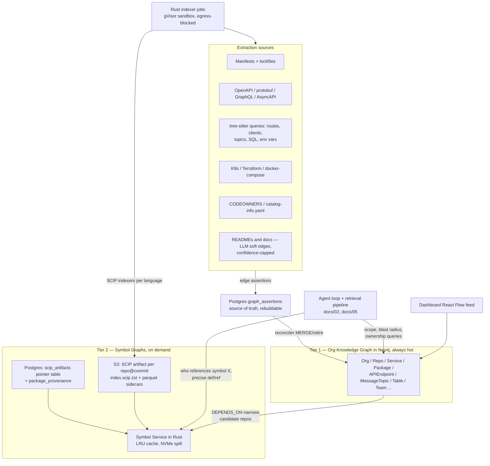
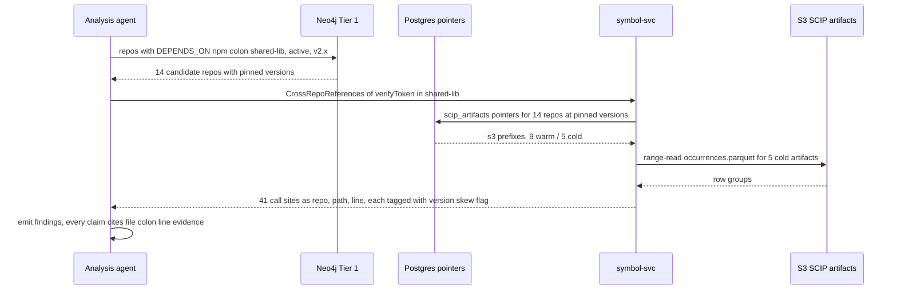
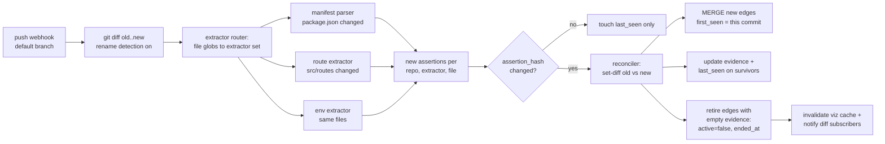

# Graph Design: Code Graph & Knowledge Graph

**Document:** docs/03-graph-design.md
**Owner:** Platform Architecture
**Status:** Canonical — all sibling documents align to the taxonomy and storage split defined here.
**Related:** retrieval usage of the graph in `docs/02-retrieval-and-rag.md`; ingestion/webhook plumbing in `docs/04-github-and-ingestion.md`; full Postgres DDL in `docs/06-data-architecture.md`; sandboxing and tenancy in `docs/08-security-and-deployment.md`.

## TL;DR

1. **Two tiers, hard split.** Tier 1 is a small, always-hot **org knowledge graph in Neo4j** (~10^5–10^6 nodes at 1000 repos). Tier 2 is **symbol-level SCIP artifacts per repo@commit in S3 with Postgres pointers**, loaded on demand. Symbol edges are NEVER materialized into Neo4j — at 150M LOC with commit history they are billions of rows (math in §1).
2. **Postgres is the source of truth for derived edges; Neo4j is a rebuildable projection.** Extractors write declarative "edge assertions" to Postgres keyed by `(repo, extractor, file)`; a reconciler diffs assertions and applies MERGE/retire operations to Neo4j. Disaster recovery and schema migration are a replay, not a restore.
3. **Every edge carries `{mechanism, confidence, evidence[], first_seen_commit, last_seen_commit}`.** Deterministic extractors (manifests, specs, tree-sitter queries) produce confidence ≥ 0.8; LLM-extracted soft edges are capped at 0.6, rendered dashed in the UI, and excluded from autonomous-mode planning unless human-confirmed.
4. **Cross-repo symbol stitching happens at package boundaries.** A symbol in repo A resolves to its definition in repo B via the SCIP moniker's package coordinate matched against a `package_provenance` table (published version → repo@commit). Tier 1 `DEPENDS_ON` edges narrow the candidate repo set; Tier 2 gives file:line precision.
5. **The graph tracks the default branch only, with time-travel via `first_seen/last_seen` timestamps.** PR branches are analyzed in ephemeral overlays and never written to Tier 1. Retired edges are soft-deleted with `ended_at` and kept 90 days to power the dashboard's diff-between-two-dates view.

---

## 1. Two-Tier Architecture and Why

### 1.1 The edge-explosion math (estimates — verify against pilot data)

The naive design — "put every symbol and every reference into the graph database" — dies at enterprise scale. Anchor numbers from the brief: 1000 repos ≈ 150M LOC.

| Quantity | Basis | Estimate at 1000 repos / 150M LOC |
|---|---|---|
| Symbol definitions | ~1 definition per 10 LOC (estimate — verify) | ~15M nodes |
| Symbol occurrences (references) | ~1 occurrence per 3 LOC (estimate — verify) | ~50M edges per snapshot |
| Indexed commits retained per repo | 20 (rolling window for time-travel + PR analysis) | 20× multiplier |
| **Symbol-level rows if materialized** | 50M × 20 + node rows + evidence properties | **> 1 billion rows** |
| Daily churn | 1000 repos × ~30 pushes/day × ~2k occurrence deltas | ~60M edge writes/day |

A Neo4j cluster holding 10^9+ relationships with 60M writes/day is a large, expensive, operationally fragile system — and it answers questions we almost never ask globally. "Who references `verifyToken` across the org" is asked about *one symbol at a time*, scoped to repos that *already* depend on the defining package.

By contrast, the org-level graph is small and stable:

| Node type | Basis | Estimate at 1000 repos |
|---|---|---|
| Repo | 1 per repo | 1,000 |
| Service | ~1.2 per repo (some repos deploy nothing) | ~1,200 |
| Deployable | k8s Deployments, Lambdas, cron jobs | ~2,500 |
| Package (internal) | published libs, shared protos | ~1,500 |
| Package (external, referenced) | deduped across org | ~30,000 |
| APIEndpoint | ~40 per service | ~50,000 |
| MessageTopic | Kafka/SQS/RabbitMQ/NATS | ~500 |
| DataStore / Table | ~200 stores, ~8,000 tables | ~8,200 |
| EnvVar / ConfigKey | deduped | ~50,000 |
| Team / Person / Domain / Org | org chart + CODEOWNERS | ~2,200 |
| **Total nodes** | | **~1.5 × 10^5** (within the 10^5–10^6 canon) |

Edges are the larger and more variable population; the org graph is edge-dense because a handful of node types (env vars, shared packages, tables) have very high fan-in. Itemized bottom-up:

| Edge type | Basis at 1000 repos / 150M LOC | Estimate |
|---|---|---|
| `DEPENDS_ON` (Repo→Package) | ~1000 repos × ~200 direct+transitive deduped deps each; shared internal libs are hub edges (one lib DEPENDS_ON'd by 400 repos) | ~700,000 |
| `REFERENCES_ENV` (Service/Deployable→EnvVar/ConfigKey) | ~3,700 services+deployables × ~120 env/config reads each (code-read + `.env.example` + k8s + terraform, deduped) | ~450,000 |
| `CONSUMES` (Service→APIEndpoint) | call-site extraction across services; multiple call sites collapse per endpoint | ~200,000 |
| `EXPOSES` (Service→APIEndpoint) | ~50k endpoints, ~1 owning service each, plus spec+route double-assertion | ~60,000 |
| `READS` / `WRITES` (Service→Table/DataStore) | ~3,700 services × ~30 distinct table accesses | ~120,000 |
| `OWNS` (Team/Person→Repo/Service/Table/Topic/Domain; Service→Table) | CODEOWNERS + team + catalog + migration-home over all ownable nodes | ~150,000 |
| `DEPLOYS` (Repo→Deployable/Service; Deployable→Service) | ~2,500 deployables + service links | ~7,000 |
| `PUBLISHES` / `SUBSCRIBES` (Service→MessageTopic) | ~500 topics × ~4 producers/consumers | ~4,000 |
| `CALLS` (Service→Service, derived rollup of CONSUMES∘EXPOSES) | ~3,700 services, power-law fan-out | ~40,000 |
| `SHARES_SCHEMA` (Repo↔Repo / Service↔Service) | proto/GraphQL/DDL lineage overlaps | ~30,000 |
| **Total edges** | dominated by `DEPENDS_ON` hub fan-in + per-service `REFERENCES_ENV` | **~1.8–2 × 10^6** |

This ~2M figure is the canonical org-graph edge count and is the one every downstream sizing derivation uses: the Neo4j store size, page-cache RAM node, and batched-load write volume in `docs/07-scalability-and-cost.md` (§1.2, §2.1, §6.5) and the `dependency_edges` mirror in `docs/06-data-architecture.md` are all sized on it. It is ~1% of the >10^9 rows a materialized symbol graph would carry (above) — the whole point of the two-tier split.

That still fits comfortably in a single Neo4j instance with the whole graph in page cache, and 2-hop traversals return in milliseconds. **This two-tier split is a core scaling decision**: relationship questions between *services, repos, packages, topics, tables* live in Tier 1; relationship questions between *symbols* live in Tier 2 and are loaded per repo@commit only when an agent or query actually needs them.

### 1.2 Responsibility split



**Decision — containment is a property, relationships are edges.** The canonical edge taxonomy has no `CONTAINS`. We deliberately model hierarchy (Org→Repo, Repo→Service artifacts, tenant scoping) as node properties (`tenant_id`, `repo_id` where single-owned, `domain`) rather than edges. This keeps every traversal query about *actual coupling*, lets the API layer enforce repo-level ACLs with a denormalized `repo_ids` provenance filter (Neo4j has no row-level security — see §6.4, which handles shared, multi-repo nodes correctly), and avoids polluting blast-radius traversals with structural hops. `DEPLOYS` covers the one structural relationship that matters for impact analysis: which repo ships which deployable/service.

---

## 2. Tier 1: Org Knowledge Graph (Neo4j)

One Neo4j *database* per tenant (Neo4j 5 multi-database); enterprise single-tenant/BYOC gets a dedicated instance (`docs/08-security-and-deployment.md`).

### 2.1 Node taxonomy

| Node label | What it represents | Key properties (beyond `id`, `tenant_id`) | Identity key |
|---|---|---|---|
| `Org` | Connected GitHub org / installation | `provider`, `external_id`, `name` | `provider + external_id` |
| `Repo` | A source repository | `full_name`, `default_branch`, `primary_language`, `head_commit`, `archived` | `provider + external_id` |
| `Service` | Logical runtime service (may span deployables) | `name`, `repo_id`, `domain`, `tier` 0–3, `runtime`, `description` | `tenant + name` |
| `Deployable` | Concrete deploy unit: k8s Deployment, Lambda, cron | `name`, `kind`, `cluster`, `namespace`, `repo_id` | `tenant + cluster + namespace + name` |
| `Package` | Published library/module coordinate | `coordinate` e.g. `npm:@acme/shared-lib`, `registry`, `internal` bool, `latest_version` | `coordinate` |
| `APIEndpoint` | HTTP/gRPC/GraphQL operation | `protocol`, `method`, `path_template`, `service_name`, `spec_ref` | `service + protocol + method + path_template` |
| `MessageTopic` | Kafka topic, SQS queue, RabbitMQ exchange, NATS subject | `name`, `broker_kind`, `schema_ref` | `tenant + broker_kind + name` |
| `DataStore` | Database/cache/bucket instance or logical cluster | `kind` e.g. postgres/redis/s3, `logical_name` | `tenant + logical_name` |
| `Table` | Table/collection/keyspace inside a DataStore | `name`, `datastore`, `schema_hash` | `datastore + name` |
| `EnvVar` | Environment variable name (org-deduped) | `name`, `sensitive` bool (name-heuristic only — values never ingested) | `tenant + name` |
| `ConfigKey` | Config file key (yaml/toml/properties path) | `key_path`, `source_kind` | `tenant + key_path` |
| `Team` | GitHub team / IdP group | `name`, `external_id`, `member_count` | `provider + external_id` |
| `Person` | GitHub user mapped to platform identity | `login`, `display_name` | `provider + login` |
| `Domain` | Business domain grouping for clustering/nav | `name`, `description`, `color`, `source` manual\|inferred | `tenant + name` |

### 2.2 Edge taxonomy

Directionality is fixed and enforced by the reconciler; extractor output that violates endpoint rules is rejected at write time.

| Edge type | From → To | Meaning | Typical `mechanism` values |
|---|---|---|---|
| `DEPENDS_ON` | Repo → Package | Declared dependency (extra props: `version_range`, `resolved_version`, `dep_kind` prod\|dev) | `lockfile`, `manifest`, `vendored` |
| `CALLS` | Service → Service | Derived service-to-service rollup of CONSUMES∘EXPOSES (extra prop: `via_endpoint_count`) | `derived-http`, `derived-grpc` |
| `EXPOSES` | Service → APIEndpoint | Service serves this endpoint | `openapi`, `protobuf`, `graphql-sdl`, `asyncapi`, `route-extraction` |
| `CONSUMES` | Service → APIEndpoint | Service calls this endpoint (extra prop: `client_kind`) | `generated-client`, `url-template-match`, `grpc-stub`, `llm-doc` |
| `PUBLISHES` | Service → MessageTopic | Producer relationship | `kafka-client`, `sqs-client`, `rabbitmq-client`, `nats-client`, `config` |
| `SUBSCRIBES` | Service → MessageTopic | Consumer relationship | same as PUBLISHES |
| `READS` | Service → Table or DataStore | Read path exists | `sql-literal`, `orm-model`, `query-builder` |
| `WRITES` | Service → Table or DataStore | Write path exists | `sql-literal`, `orm-model`, `migration` |
| `OWNS` | Team or Person → Repo, Service, Table, MessageTopic, Domain; Service → Table | Ownership/stewardship (extra prop: `role` owner\|maintainer\|steward) | `codeowners`, `github-team`, `catalog-file`, `migration-home`, `llm-doc` |
| `DEPLOYS` | Repo → Deployable or Service; Deployable → Service | Repo's CI produces / manifest runs this unit | `k8s-manifest`, `helm`, `terraform`, `docker-compose`, `ci-config` |
| `REFERENCES_ENV` | Service or Deployable → EnvVar or ConfigKey | Reads this variable/key at runtime | `code-read`, `env-example`, `k8s-env`, `terraform-var` |
| `SHARES_SCHEMA` | Repo ↔ Repo or Service ↔ Service (stored directed, queried undirected) | Both define/consume the same schema lineage (extra prop: `schema_ref`) | `proto-registry`, `migration-overlap`, `shared-ddl`, `graphql-federation` |

### 2.3 Universal edge property contract

Every derived edge carries exactly this envelope (plus type-specific extras noted above):

```
mechanism:          string enum (see per-type values)
confidence:         float 0.0–1.0 (see §4.3 bands)
evidence:           list<string> of "repo_full_name/path:line" — every entry verified to exist
                    at extraction commit before write; capped at 32 entries + total count
repo_ids:           list<repo_id> — the repos whose assertions justify this edge (union of
                    src/dst contributing repos); the ACL provenance set used by §6.4
first_seen_commit:  sha — commit where this edge first appeared
last_seen_commit:   sha — most recent commit confirming it
first_seen_at:      datetime (commit timestamp) — powers time-window queries
last_seen_at:       datetime
active:             boolean — false = retired, kept 90 days for diff views (§5.3)
ended_at:           datetime, null while active
```

Edge identity is `(src, type, dst, mechanism)`. The same logical relationship found by two extractors (e.g., `CONSUMES` via generated client *and* via URL match) yields two edges; the UI and retrieval layer display max confidence and the merged evidence set.

### 2.4 Schema: constraints and indexes

```cypher
// ---- Uniqueness constraints (one per node identity key) ----
CREATE CONSTRAINT org_key      IF NOT EXISTS FOR (n:Org)          REQUIRE n.id IS UNIQUE;
CREATE CONSTRAINT repo_key     IF NOT EXISTS FOR (n:Repo)         REQUIRE n.id IS UNIQUE;
CREATE CONSTRAINT service_key  IF NOT EXISTS FOR (n:Service)      REQUIRE (n.tenant_id, n.name) IS UNIQUE;
CREATE CONSTRAINT deploy_key   IF NOT EXISTS FOR (n:Deployable)   REQUIRE (n.tenant_id, n.cluster, n.namespace, n.name) IS UNIQUE;
CREATE CONSTRAINT package_key  IF NOT EXISTS FOR (n:Package)      REQUIRE n.coordinate IS UNIQUE;
CREATE CONSTRAINT endpoint_key IF NOT EXISTS FOR (n:APIEndpoint)  REQUIRE (n.tenant_id, n.service_name, n.protocol, n.method, n.path_template) IS UNIQUE;
CREATE CONSTRAINT topic_key    IF NOT EXISTS FOR (n:MessageTopic) REQUIRE (n.tenant_id, n.broker_kind, n.name) IS UNIQUE;
CREATE CONSTRAINT table_key    IF NOT EXISTS FOR (n:Table)        REQUIRE (n.tenant_id, n.datastore, n.name) IS UNIQUE;
CREATE CONSTRAINT envvar_key   IF NOT EXISTS FOR (n:EnvVar)       REQUIRE (n.tenant_id, n.name) IS UNIQUE;
CREATE CONSTRAINT cfgkey_key   IF NOT EXISTS FOR (n:ConfigKey)    REQUIRE (n.tenant_id, n.key_path) IS UNIQUE;
CREATE CONSTRAINT team_key     IF NOT EXISTS FOR (n:Team)         REQUIRE n.id IS UNIQUE;
CREATE CONSTRAINT person_key   IF NOT EXISTS FOR (n:Person)       REQUIRE n.id IS UNIQUE;
CREATE CONSTRAINT domain_key   IF NOT EXISTS FOR (n:Domain)       REQUIRE (n.tenant_id, n.name) IS UNIQUE;

// ---- Property existence (write-time integrity) ----
CREATE CONSTRAINT repo_head    IF NOT EXISTS FOR (n:Repo)         REQUIRE n.head_commit IS NOT NULL;

// ---- Lookup indexes for hot query entry points ----
CREATE INDEX repo_fullname     IF NOT EXISTS FOR (n:Repo)         ON (n.full_name);
CREATE INDEX service_domain    IF NOT EXISTS FOR (n:Service)      ON (n.domain);
CREATE INDEX service_tier      IF NOT EXISTS FOR (n:Service)      ON (n.tier);
CREATE INDEX endpoint_path     IF NOT EXISTS FOR (n:APIEndpoint)  ON (n.path_template);
CREATE INDEX package_internal  IF NOT EXISTS FOR (n:Package)      ON (n.internal);

// ---- Relationship property indexes (confidence + liveness filters on every query) ----
CREATE INDEX rel_consumes_conf IF NOT EXISTS FOR ()-[r:CONSUMES]-()   ON (r.confidence, r.active);
CREATE INDEX rel_calls_conf    IF NOT EXISTS FOR ()-[r:CALLS]-()      ON (r.confidence, r.active);
CREATE INDEX rel_depends_ver   IF NOT EXISTS FOR ()-[r:DEPENDS_ON]-() ON (r.resolved_version, r.active);
CREATE INDEX rel_seen_window   IF NOT EXISTS FOR ()-[r:CALLS]-()      ON (r.first_seen_at, r.ended_at);
```

### 2.5 Worked queries — real product questions

Every query the agent tools and dashboard issue is parameterized, tenant-scoped, and filtered to `$visibleRepoIds` (the caller's GitHub-mirrored ACL, §6.4). ACL predicates elided below for readability.

**Q1 — "Which repos break if auth-service changes the `/v1/users` response shape?"**

```cypher
MATCH (auth:Service {tenant_id: $tenant, name: 'auth-service'})
      -[:EXPOSES {active: true}]->(ep:APIEndpoint)
WHERE ep.path_template = '/v1/users' AND ep.method = 'GET'
MATCH (consumer:Service)-[c:CONSUMES]->(ep)
WHERE c.active AND c.confidence >= $minConfidence   // default 0.5
OPTIONAL MATCH (r:Repo)-[:DEPLOYS {active: true}]->(consumer)
RETURN consumer.name        AS service,
       r.full_name          AS repo,
       c.mechanism          AS how_we_know,
       c.confidence         AS confidence,
       c.evidence[0..5]     AS sample_evidence
ORDER BY c.confidence DESC;
```

Returned evidence entries (`payments-api/src/clients/users.ts:88`) go directly into the impact report; the Scope agent then pulls those files via Tier 2 / chunk retrieval for field-level analysis of whether the *response shape* is actually consumed.

**Q2 — "Blast radius of bumping `@acme/shared-lib` from 2.x to 3.0."**

```cypher
MATCH (p:Package {coordinate: 'npm:@acme/shared-lib'})
MATCH (r:Repo)-[d:DEPENDS_ON]->(p)
WHERE d.active AND d.resolved_version STARTS WITH '2.'
OPTIONAL MATCH (r)-[:DEPLOYS {active: true}]->(s:Service)
// downstream services that call the directly-affected services, 2 hops
OPTIONAL MATCH (down:Service)-[:CALLS*1..2]->(s)
RETURN r.full_name                    AS repo,
       d.resolved_version             AS pinned_version,
       d.dep_kind                     AS dep_kind,
       collect(DISTINCT s.name)       AS affected_services,
       collect(DISTINCT down.name)    AS transitive_callers,
       d.evidence                     AS lockfile_evidence
ORDER BY size(transitive_callers) DESC;
```

Tier 1 answers *which repos*; the Planning stage then asks Tier 2 *which symbols of shared-lib each repo actually uses* (§3.4) so the per-repo plan can say "you call `verifyToken` and `SessionStore`, both changed in 3.0" instead of "you depend on the lib".

**Q3 — "Who owns everything downstream of topic `payment.events`?"**

```cypher
MATCH (t:MessageTopic {tenant_id: $tenant, name: 'payment.events'})
MATCH (sub:Service)-[s:SUBSCRIBES]->(t) WHERE s.active
// events fan out: subscribers plus what subscribers call, 3 hops
MATCH (sub)-[:CALLS*0..3]->(affected:Service)
OPTIONAL MATCH (owner:Team)-[o:OWNS]->(affected) WHERE o.active
RETURN DISTINCT affected.name                             AS service,
       affected.domain                                    AS domain,
       collect(DISTINCT owner.name)                       AS owning_teams,
       CASE WHEN count(owner) = 0 THEN true ELSE false END AS unowned
ORDER BY unowned DESC, service;
```

**Q4 — "Which services read table `users` but do not own it?"**

```cypher
MATCH (tb:Table {tenant_id: $tenant, name: 'users', datastore: 'primary-postgres'})
MATCH (svc:Service)-[rd:READS]->(tb)
WHERE rd.active AND rd.confidence >= 0.5
  AND NOT EXISTS { MATCH (svc)-[o:OWNS]->(tb) WHERE o.active }
RETURN svc.name        AS service,
       rd.mechanism    AS access_mechanism,
       rd.confidence   AS confidence,
       rd.evidence     AS evidence
ORDER BY rd.confidence DESC;
```

This is the "shared database anti-pattern" detector — a first-class impact signal, because schema changes to `users` must fan out to every reader, not just the owner.

**Q5 — "Unowned services on the critical path."**

```cypher
// critical path = tier-0 services plus everything they transitively call
MATCH (critical:Service {tenant_id: $tenant}) WHERE critical.tier = 0
MATCH (critical)-[:CALLS*0..3]->(dep:Service)
WITH DISTINCT dep
WHERE NOT EXISTS { MATCH (:Team)-[o:OWNS]->(dep) WHERE o.active }
  AND NOT EXISTS { MATCH (:Person)-[o:OWNS]->(dep) WHERE o.active }
OPTIONAL MATCH (r:Repo)-[:DEPLOYS {active: true}]->(dep)
RETURN dep.name AS unowned_service, dep.domain AS domain, r.full_name AS repo
ORDER BY dep.domain, dep.name;
```

**Q6 — "Blast radius of rotating env var `STRIPE_API_KEY`."** (bonus — this query runs verbatim behind the dashboard's env-var panel)

```cypher
MATCH (e:EnvVar {tenant_id: $tenant, name: 'STRIPE_API_KEY'})
MATCH (u)-[ref:REFERENCES_ENV]->(e) WHERE ref.active
RETURN labels(u)[0] AS kind, coalesce(u.name, u.full_name) AS unit,
       ref.mechanism AS mechanism, ref.evidence AS evidence;
```

### 2.6 Derived `CALLS` rollup

`CALLS` edges are materialized nightly (and incrementally on CONSUMES/EXPOSES change) so visualization and multi-hop queries never pay endpoint-level fan-out:

```cypher
MATCH (a:Service)-[c:CONSUMES]->(ep:APIEndpoint)<-[x:EXPOSES]-(b:Service)
WHERE a <> b AND c.active AND x.active
WITH a, b,
     count(ep)                                   AS via_endpoint_count,
     min(reduce(m = 1.0, r IN [c, x] | CASE WHEN r.confidence < m THEN r.confidence ELSE m END)) AS min_conf,
     collect(c.evidence[0])[0..8]                AS sample_evidence
MERGE (a)-[k:CALLS {mechanism: 'derived-http'}]->(b)
SET  k.via_endpoint_count = via_endpoint_count,
     k.confidence = min_conf,
     k.evidence   = sample_evidence,
     k.active     = true,
     k.last_seen_at = datetime();
```

Confidence of a derived edge is the **minimum** of its constituents — a derived edge is never more certain than its weakest input.

---

## 3. Tier 2: Symbol Graph (SCIP artifacts)

### 3.1 Artifact and storage layout

Per repo@commit, the sandboxed Rust indexer (see `docs/04-github-and-ingestion.md`) emits one SCIP index per language plus query-optimized sidecars:

```
s3://atlas-{tenant}/scip/{repo_id}/{commit_sha}/
    {language}/index.scip.zst        # canonical SCIP protobuf, zstd-compressed
    {language}/symbols.parquet       # symbol -> definition path:line, kind, signature
    {language}/occurrences.parquet   # symbol -> occurrence path:line, role (def/ref/impl)
    {language}/exports.json          # public API surface: symbols reachable at the
                                     # package boundary, keyed by package coordinate
```

`exports.json` is the stitching contract (§3.4): only symbols exported through a published package boundary participate in cross-repo resolution. Sidecars exist because answering "references of one symbol" from raw SCIP requires a full scan; parquet with symbol-sorted row groups makes it a range read. Artifact size: SCIP for a 2M-LOC repo lands in the tens-to-low-hundreds of MB uncompressed (estimate — verify with scip-typescript/scip-java on pilot repos); zstd + parquet sidecars cut cold-load bytes substantially.

### 3.2 Postgres pointer tables

Authoritative DDL lives in `docs/06-data-architecture.md`; the shape that matters here:

```sql
CREATE TABLE scip_artifacts (
    id                uuid PRIMARY KEY DEFAULT gen_random_uuid(),
    tenant_id         uuid NOT NULL,
    repo_id           uuid NOT NULL REFERENCES repos(id),
    commit_sha        char(40) NOT NULL,
    language          text NOT NULL,               -- one row per language per repo@commit
    indexer           text NOT NULL,               -- 'scip-typescript@0.3.x' | 'tree-sitter-fallback'
    precision         text NOT NULL,               -- 'scip' | 'heuristic'
    s3_prefix         text NOT NULL,
    size_bytes        bigint NOT NULL,
    symbol_count      integer,
    occurrence_count  bigint,
    status            text NOT NULL DEFAULT 'ready',  -- building|ready|failed|superseded
    created_at        timestamptz NOT NULL DEFAULT now(),
    UNIQUE (tenant_id, repo_id, commit_sha, language)
);  -- row-level security by tenant_id, as everywhere (docs/06)

CREATE TABLE package_provenance (
    tenant_id         uuid NOT NULL,
    package_coordinate text NOT NULL,              -- 'npm:@acme/shared-lib'
    version           text NOT NULL,               -- '2.3.1'
    repo_id           uuid NOT NULL REFERENCES repos(id),
    commit_sha        char(40) NOT NULL,           -- commit that published this version
    source            text NOT NULL,               -- 'git-tag'|'release'|'registry-metadata'|'head-fallback'
    confidence        real NOT NULL,               -- 1.0 tag match ... 0.6 head fallback
    PRIMARY KEY (tenant_id, package_coordinate, version)
);
```

Retention: `ready` artifacts for the last 20 indexed commits per repo plus every commit referenced by `package_provenance`; older rows marked `superseded` and S3 objects transitioned to infrequent-access, purged after 90 days (lifecycle policy in `docs/06-data-architecture.md`).

### 3.3 On-demand loading — the Symbol Service

A stateless-ish Rust service (`symbol-svc`) is the only reader of SCIP artifacts. It exposes gRPC (internal) surfaced to agents as retrieval tools (`docs/02-retrieval-and-rag.md`):

| RPC | Question answered | Typical latency target |
|---|---|---|
| `Definition(repo, commit, symbol)` | where is this symbol defined | < 50 ms warm, < 2 s cold (estimate — verify) |
| `References(repo, commit, symbol, role?)` | all occurrences in one repo | same |
| `PublicExports(repo, commit)` | package-boundary API surface | < 100 ms (exports.json is small) |
| `CrossRepoReferences(symbol, package_coordinate)` | org-wide references via stitching (§3.4) | < 5 s across ≤ 50 repos (estimate — verify) |
| `SymbolAt(repo, commit, path, line, col)` | hover-style resolution for evidence links | < 50 ms warm |

Caching: LRU of decoded parquet row groups in memory, full artifacts spilled to local NVMe, keyed by `(repo, commit, language)`. Hot set follows active agent runs — an org-wide impact run touches perhaps 20–80 artifacts, not 1000. Cache admission is triggered by the Scope stage: when Tier 1 selects candidate repos, the orchestrator issues prefetch hints so per-repo Analysis subagents hit warm caches.

### 3.4 Cross-repo stitching at package boundaries

SCIP symbol monikers embed the package coordinate: `scip-typescript npm @acme/shared-lib 2.3.1 lib/auth.ts/verifyToken().` Stitching never needs a global symbol table — the package coordinate is the join key, and Tier 1 already knows who depends on what.

Resolution of "repo A references `verifyToken`; where is it defined?":

1. `symbol-svc` reads the occurrence's moniker from repo A's artifact → external symbol in `npm:@acme/shared-lib@2.3.1`.
2. `package_provenance` lookup: `(npm:@acme/shared-lib, 2.3.1)` → `(repo B, commit c9f2...)`. Miss → fall back to nearest indexed commit by version-tag distance, and **downgrade the answer's confidence** (`source: head-fallback`, 0.6).
3. Load repo B's `exports.json` at that commit, match the symbol suffix → definition `lib/auth.ts:41`.

The inverse query — "who references `verifyToken` across the org?" — is the blast-radius workhorse:



**Version skew rule:** references are resolved against the *consumer's pinned version* (from the `DEPENDS_ON` edge's `resolved_version`), not repo B's HEAD. This is why `package_provenance` exists — impact analysis against HEAD silently lies when consumers lag releases. When only heuristic (tree-sitter fallback) indexes exist for a language, `precision: heuristic` propagates into finding confidence and the report labels those call sites "probable".

---

## 4. Extraction Pipelines per Edge Type

All extractors run inside the ephemeral gVisor-sandboxed indexer jobs (egress-blocked; repo content is hostile input — `docs/08-security-and-deployment.md`). Extractors are pure functions from `(repo, commit, file set)` to **edge assertions**; they never write Neo4j directly.

### 4.1 Deterministic extractors

| Edge type | Extractor | Inputs | Mechanism | Confidence |
|---|---|---|---|---|
| `DEPENDS_ON` | Manifest/lockfile parsers, all 10 ecosystems: package-lock/pnpm/yarn, requirements/poetry/uv, pom/gradle, go.mod/go.sum, Cargo.lock, csproj/packages.lock.json, conan/vcpkg/CMake, composer.lock, Gemfile.lock | manifests + lockfiles, matched against internal `package_provenance` coordinates | `lockfile` / `manifest` / `vendored` | 1.0 / 0.85 / 0.7 |
| `EXPOSES` | Spec parsers: OpenAPI, protobuf, GraphQL SDL, AsyncAPI | spec files, buf/registry configs | `openapi` etc. | 0.95 |
| `EXPOSES` | Framework route extraction — tree-sitter queries per framework: Express/Fastify/Nest, FastAPI/Flask/Django, Spring, Gin/Echo/chi, Actix/axum, ASP.NET, Laravel/Symfony, Rails | source | `route-extraction` | 0.85 |
| `CONSUMES` | Generated-client detection (OpenAPI/gRPC stubs) | generated code markers, codegen configs | `generated-client` / `grpc-stub` | 0.9 |
| `CONSUMES` | Call-site extraction: fetch/axios/got, requests/httpx, OkHttp/WebClient, net/http, reqwest, HttpClient, Guzzle, Faraday — URL-template matching against known `APIEndpoint.path_template`s | source + endpoint inventory | `url-template-match` | 0.85 literal URL; 0.6 interpolated |
| `PUBLISHES` / `SUBSCRIBES` | Broker-client tree-sitter queries for Kafka/SQS/RabbitMQ/NATS + topic names from config | source + config | `kafka-client` etc. / `config` | 0.85 literal topic; 0.5 dynamic topic |
| `READS` / `WRITES` | SQL literal parsing; ORM model mapping: Prisma, TypeORM, SQLAlchemy, Django ORM, Hibernate/JPA, GORM, sqlx/Diesel, EF Core, Eloquent, ActiveRecord; migration files also *create* `Table` nodes | source + migrations | `sql-literal` / `orm-model` / `migration` | 0.9 / 0.85 / 0.95 |
| `OWNS` | CODEOWNERS, GitHub team membership, `catalog-info.yaml` (Backstage), migration-home heuristic for Service→Table | provider API + files | `codeowners` / `github-team` / `catalog-file` / `migration-home` | 0.9 / 0.95 / 0.9 / 0.7 |
| `DEPLOYS` | K8s/Helm/Terraform/docker-compose/CI parsing; image → repo matching via image name and build context | infra manifests | `k8s-manifest` etc. | 0.9 |
| `REFERENCES_ENV` | tree-sitter queries: `process.env.X`, `os.environ["X"]`, `System.getenv`, `os.Getenv`, `std::env::var`, `Environment.GetEnvironmentVariable`, `getenv`, `ENV["X"]`; plus `.env.example`, k8s `env:`, terraform vars | source + manifests | `code-read` / `env-example` / `k8s-env` / `terraform-var` | 0.9 / 0.7 / 0.9 / 0.85 |
| `SHARES_SCHEMA` | Same proto/GraphQL schema lineage across repos (registry or file-hash match); overlapping DDL for the same table | specs + migrations | `proto-registry` / `shared-ddl` / `migration-overlap` | 0.9 / 0.8 / 0.7 |

Service identity resolution (which `Service` a file belongs to) runs before edge assertion: deployable manifests → service name → fallback to repo-name heuristic, monorepos split by workspace/package directory. Ambiguous files assert edges from the Repo-level default service with a 0.1 confidence penalty.

### 4.2 LLM-assisted soft edges — docs and READMEs only

Deterministic extraction builds the graph. The LLM's only graph role is **soft edges** from prose: READMEs, `docs/`, ADRs, runbooks — the "Graph RAG" entity-extraction pattern is deliberately NOT our core mechanism for code (canonical verdict; see `docs/02-retrieval-and-rag.md` for why).

Pipeline (Batch API, Haiku tier, nightly over changed docs):

1. Candidate docs → structured extraction with a closed schema: `{edge_type, src_name, dst_name, quote, doc_path, line}` — the model may only emit the 12 canonical edge types and may only *reference* entities, never invent taxonomy.
2. **Entity resolution gate:** `src_name`/`dst_name` must resolve to existing nodes (exact, then alias table, then trigram similarity ≥ 0.9). Unresolvable claims are dropped, not created. Exception: `Domain` suggestions are queued for human review, never auto-created.
3. Evidence check: the quote must literally appear at `doc_path:line` (defeats hallucinated citations and blunts prompt-injection payloads that try to assert fake edges — extraction runs with no tools, output schema enforced, doc content treated as hostile).
4. Emit assertion with `mechanism: llm-doc`, confidence from model self-report **capped at 0.6**, floor 0.3 (below 0.3 → dropped).

Soft edges are most valuable exactly where deterministic extraction is blind: intent ("service X is the *system of record* for orders"), planned deprecations, and ownership statements in READMEs that CODEOWNERS misses.

### 4.3 Confidence model and usage policy

| Band | Sources | Retrieval fan-out (docs/02) | Impact reports | Autonomous planning (docs/05) | Visualization |
|---|---|---|---|---|---|
| 0.95–1.0 | lockfiles, specs, migrations, GitHub teams | yes | cited as fact | usable | solid edge |
| 0.8–0.95 | deterministic code parse | yes | cited as fact | usable | solid edge |
| 0.6–0.8 | heuristic match: URL templates, dynamic topics, migration-home | yes | cited with mechanism shown | usable with verification step | solid, lighter |
| 0.3–0.6 | `llm-doc` soft edges | only if `graph_soft_edges: true` (default on for Scope stage, off for Synthesis facts) | separate "possible, unverified" section | **blocked** — requires human confirm or deterministic corroboration | dashed, tooltip shows quote |

Corroboration rule: when a deterministic extractor later confirms a relationship that existed only as a soft edge, the soft edge remains (its evidence is still useful prose) but ranking always prefers the deterministic edge; the dashboard collapses them into one line with combined evidence.

---

## 5. Incremental Graph Maintenance

### 5.1 Push-driven, diff-scoped re-extraction

Webhook delivery, dedupe, and Temporal wiring are owned by `docs/04-github-and-ingestion.md`; this section owns the graph-update activity inside that workflow.



Mechanics that make this correct, not just fast:

- **Router table**, not heuristics: each extractor declares file globs (`**/package.json`, `**/*.lock`, `src/**/*.{ts,py,...}`, `deploy/**/*.yaml`). A changed file fans out to every matching extractor; extractors re-run **per file**, not per repo.
- **Assertions are the unit of truth.** `graph_assertions (tenant_id, repo_id, extractor, file_path)` stores the normalized edge set and an `assertion_hash`. Identical hash → no Neo4j write at all (the common case: most pushes touch no relationship-bearing lines).
- **Set-diff semantics per file.** Edges are multi-sourced: `CONSUMES` from `clients/users.ts` may also be asserted by `clients/admin.ts`. Removing a file's assertion removes only that file's lines from the edge's evidence; the edge retires only when its evidence set becomes empty. This prevents the classic bug where deleting one call site kills an edge that three other files still justify.
- **Evidence refresh on survivors:** line numbers shift on every touch of an evidence file; assertions carry recomputed `path:line` so evidence never goes stale, and `last_seen_commit`/`last_seen_at` advance.
- **Cross-repo cascades:** a changed OpenAPI spec re-triggers URL-template matching *for consumers* — the reconciler enqueues re-evaluation of `CONSUMES` assertions in repos holding edges to the changed endpoints (bounded: only affected `APIEndpoint` ids, only repos with existing edges or lexical hits from Zoekt).

### 5.2 Deletes, renames, repo removal

| Event | Handling |
|---|---|
| File deleted | Drop its assertion rows; evidence set-diff retires edges that lose all support. Tier 2 unaffected (artifacts are per-commit immutable). |
| File renamed | Git rename detection maps assertions to the new path in place — `first_seen_commit` is preserved so history does not reset on refactors. |
| Repo archived | `Repo.archived = true`; edges stay active (archived code still runs in prod more often than anyone admits) but visualization badges it. |
| Repo deleted / app uninstalled | Detach-retire all repo-scoped nodes and edges (`active=false`) immediately; hard purge of graph rows, assertions, SCIP artifacts, and vectors on the uninstall-purge schedule in `docs/08-security-and-deployment.md`. Edges *into* surviving nodes from other repos (e.g., their `CONSUMES` of a deleted service's endpoints) retire with `ended_reason: target-removed` — these show up in the diff view as breakage warnings, which is a feature. |
| Force-push / history rewrite | Assertions are keyed by content at HEAD, so re-extraction converges; `first_seen_commit` may reference an unreachable sha — retained as opaque provenance. |
| Default branch changed | Full re-extraction of the repo (rare; treated as re-onboarding). |

**Consistency backstop:** a nightly Temporal cron re-runs full extraction on a 2% repo sample and diffs against stored assertions; drift above threshold pages the on-call and triggers full reconciliation for the affected extractor version. Because Neo4j is a projection of `graph_assertions`, a from-scratch rebuild is a replay job (estimate — verify: low hours for 1000 repos, dominated by Neo4j write throughput, no re-cloning required).

PR branches never touch Tier 1. The agent pipeline evaluates a PR by computing assertion deltas in memory (same extractors, ephemeral overlay) and answering "what would this graph look like if merged" — served from the overlay, discarded after the run.

### 5.3 Time-travel and retention

`first_seen_at`/`last_seen_at`/`ended_at` on every edge make the graph bitemporal-lite: current state is `active = true`; state "as of T" is `first_seen_at <= T AND (ended_at IS NULL OR ended_at > T)`. Retired edges purge after 90 days (configurable per tenant), which bounds graph growth to roughly steady-state + one quarter of churn.

---

## 6. Serving the Dashboard Architecture Visualization

### 6.1 API surface (NestJS, under `/api/v1/graph` — full API conventions in `docs/01-system-architecture.md`)

| Endpoint | Purpose | Notes |
|---|---|---|
| `GET /graph/overview?level=domain\|team\|service\|repo&minConfidence=0.5` | Clustered top-level map | server-side clustering, aggregated edge weights |
| `GET /graph/nodes/:id/neighborhood?hops=1..2&edgeKinds=CALLS,DEPENDS_ON&minConfidence=` | Expand-on-click subgraph | hop cap 2, node cap 300 per response |
| `GET /graph/diff?from=2026-06-01&to=2026-07-01&level=service` | What changed between two dates | uses first_seen_at/ended_at (§5.3) |
| `GET /graph/path?src=:id&dst=:id&maxHops=6` | "How are these two connected" | shortest paths, max 25 paths |
| `GET /graph/edges/:id/evidence` | Full evidence list + deep links to code view | evidence beyond the 32-entry cap paged from Postgres |
| `POST /graph/queries/blast-radius` | Parameterized Q1/Q2-style queries for impact panel | same Cypher as §2.5, agent and UI share the query catalog |

All responses are ETagged; the reconciler bumps a per-tenant graph version on every applied change, so the dashboard long-polls a lightweight `GET /graph/version` and refetches only visible viewport data.

### 6.2 React Flow data contract

```typescript
// packages/shared/src/graph-viz.ts — consumed by Next.js dashboard (React Flow)
export type NodeKind =
  | 'Org' | 'Repo' | 'Service' | 'Deployable' | 'Package' | 'APIEndpoint'
  | 'MessageTopic' | 'DataStore' | 'Table' | 'EnvVar' | 'ConfigKey'
  | 'Team' | 'Person' | 'Domain';

export type EdgeKind =
  | 'DEPENDS_ON' | 'CALLS' | 'EXPOSES' | 'CONSUMES' | 'PUBLISHES' | 'SUBSCRIBES'
  | 'READS' | 'WRITES' | 'OWNS' | 'DEPLOYS' | 'REFERENCES_ENV' | 'SHARES_SCHEMA';

export interface GraphNodeDTO {
  id: string;
  kind: NodeKind;
  label: string;
  cluster: { domain?: string; team?: string };     // drives grouping + color
  collapsedCount?: number;                          // >0 when this is a super-node
  metrics: { fanIn: number; fanOut: number; endpointCount?: number };
  badges: Array<'unowned' | 'archived' | 'tier0' | 'stale-index' | 'soft-only'>;
  acl: { visible: true };                           // invisible nodes are never sent (6.4)
}

export interface GraphEdgeDTO {
  id: string;                                       // stable hash of (src, kind, dst, mechanism)
  source: string;
  target: string;
  kind: EdgeKind;
  mechanism: string;
  confidence: number;                               // 0..1 -> opacity; <0.6 -> dashed
  evidenceCount: number;                            // full list fetched lazily
  weight?: number;                                  // aggregated count on clustered edges
  diffState?: 'added' | 'removed' | 'unchanged';    // present only on /graph/diff responses
}

export interface GraphViewResponse {
  nodes: GraphNodeDTO[];
  edges: GraphEdgeDTO[];
  graphVersion: string;                             // ETag/version token
  layoutHint: 'elk-layered' | 'elk-force';          // client runs elkjs in a web worker
}
```

Layout runs client-side (elkjs in a web worker; React Flow renders). Positions are cached per user+view in Redis so revisits are stable; the server sends `layoutHint` only.

### 6.3 Clustering, filtering, diff view

- **Clustering:** any viewport that would exceed ~150 visible nodes is collapsed server-side to `Domain` (default) or `Team` super-nodes; inter-cluster edges aggregate into weighted bundles (`weight` = underlying edge count, confidence = max). Click-to-expand fetches the neighborhood endpoint. Domain assignment comes from `Service.domain` (catalog file → manual override in dashboard → LLM suggestion queued for approval, in that priority order).
- **Filtering:** edge kinds, min confidence slider (default 0.5 — dashed soft edges appear only when the user drags below 0.6, with an explicit "showing unverified relationships" banner), team/domain scoping, text search (Neo4j lookup index → focus node). Filters compose into the same parameterized Cypher — no client-side graph math beyond layout.
- **Diff view:** two date pickers → `GET /graph/diff`. Added edges green, removed edges red with `ended_reason` tooltips, unchanged dimmed. Because retired edges persist 90 days (§5.3), "what changed since the last architecture review" is a single indexed query — this view is also embedded in impact reports ("this change would add these 3 edges") using the PR overlay from §5.2.

### 6.4 Authorization at the serving layer

Neo4j has no row-level security, so enforcement is structural. A naïve `WHERE n.repo_id IN $visibleRepoIds` filter is **wrong** and must not be used: only `Repo`, `Service`, and `Deployable` carry a single `repo_id` (§2.1). The shared node types — `APIEndpoint`, `MessageTopic`, `DataStore`, `Table`, `EnvVar`, `ConfigKey`, `Package` — are tenant-scoped and contributed to by *many* repos, so a single-`repo_id` predicate matches nothing on them and silently fails open. A user with read access to one repo could then traverse `blast_radius`/`topic_consumers` (docs/02 §7) through those shared nodes and enumerate endpoints, topics, tables, and env vars — plus their `evidence` `file:line` strings — belonging to repos they cannot read in GitHub. That is a path-and-structure leak of unauthorized repos.

Enforcement is therefore **provenance-based**, mirroring how `dependency_edges` already tracks `src_repo_id`/`dst_repo_id` (`docs/06-data-architecture.md` §2.2):

- **Every node and every edge carries a denormalized `repo_ids` array** — the set of repos whose assertions justify that node or edge (an endpoint contributed to by `payments-api` and `admin-api` has `repo_ids: [payments-api, admin-api]`; a hub package has the union of every dependent repo). The reconciler maintains it as the union of the `src_repo_id`/`dst_repo_id` of all assertions supporting the element, adding on MERGE and pruning on retire. External-only nodes (external `Package`s) get the special sentinel `['*public']` so they remain visible to any tenant member without exposing a private repo.
- **The mandatory interceptor filters every returned node and edge** by `WHERE ANY(rid IN n.repo_ids WHERE rid IN $visibleRepoIds)` for nodes and the same predicate over `r.repo_ids` for relationships (`$visibleRepoIds` = the caller's GitHub-mirrored permission set, cached per `docs/08-security-and-deployment.md`). Because the predicate is applied to the *element's own* provenance set — not to a single scalar `repo_id` — shared `APIEndpoint`/`MessageTopic`/`Table`/`EnvVar`/`Package` nodes are visible exactly when the caller can read at least one contributing repo, and never otherwise.
- **Authorization is edge-centric for traversals.** An edge is visible only if the caller can read at least one repo in its `repo_ids`; a node reachable *only* through filtered-out edges is dropped from the result, so it cannot be enumerated as a bare hop. Cross-repo edges follow the same rule: the edge's `repo_ids` is the union of both endpoints' contributing repos, and evidence entries whose `repo_full_name` is not in `$visibleRepoIds` are stripped from `evidence` before serialization so no `file:line` from an unreadable repo ever leaves the API.
- **Aggregated super-nodes count only visible members**, and the agent-side graph tools go through this same interceptor with the *requesting user's* ACL — an agent run can never see a repo its initiating user cannot.

**Worked ACL case.** Topic `payment.events` is published by `billing-svc` (repo B) and subscribed by `ledger-svc` (repo A); the `MessageTopic` node has `repo_ids: [A, B]`, the `PUBLISHES` edge has `repo_ids: [B]`, the `SUBSCRIBES` edge has `repo_ids: [A]`. A user who can read only repo A (`$visibleRepoIds = [A]`) sees the topic node (A is in its `repo_ids`) and the `SUBSCRIBES` edge, but the `PUBLISHES` edge is filtered out (`[B] ∩ [A] = ∅`) and `billing-svc` is dropped if it is reachable only via that edge — so the user cannot discover that repo B publishes to the topic, nor read B's `file:line` evidence. A user with access to neither A nor B sees no trace of the topic at all. This is the property the single-`repo_id` filter failed to provide.

---

## 7. Operational Notes

| Concern | Position |
|---|---|
| Neo4j sizing at 1000 repos | Single instance, 3-node causal cluster for HA; at ~2M edges (§1.1) the store is ~4 GB and a 16 GB RAM node keeps page cache ≥ store size with headroom (matches `docs/07-scalability-and-cost.md` §2.1; estimate — verify). Community-vs-Enterprise licensing decision in `docs/08-security-and-deployment.md`; multi-database tenancy requires Enterprise. |
| Write throughput | Reconciler batches MERGEs per repo-push transaction; sustained load at 1000 repos ≈ tens of transactions/min — nowhere near Neo4j limits. The bottleneck is extractor compute, costed in `docs/07-scalability-and-cost.md`. |
| Rebuild time | Full Tier 1 replay from `graph_assertions`: hours, not days (estimate — verify). Tier 2 rebuild = re-index, dominated by SCIP indexer runtime (see `docs/07-scalability-and-cost.md`). |
| Metrics | Per-extractor: assertions/sec, edge add/retire rates, evidence-verification failure rate (spikes indicate extractor bugs or injection attempts), soft-edge resolution rate, reconciler lag p95, symbol-svc cache hit rate. OTel → Grafana. |
| Extractor versioning | Each assertion row records extractor version; version bumps trigger lazy re-extraction on next touch + background backfill, so improved extractors converge without a big-bang rebuild. |

---

## Pushback

**1. Founder assumption challenged: "the platform searches all connected repos" — global freshness is not worth uniform cost at 1000 repos.** The founder ask implies every repo is equally indexed, equally fresh, equally queryable. At enterprise scale that is the wrong spend: real orgs follow a power law where ~10% of repos receive ~90% of pushes, and long-tail repos are archived-in-spirit years before anyone archives them. We should ship **freshness tiers**: hot repos get push-driven Tier 1 + Tier 2 updates as designed; cold repos (no push in 90 days) get Tier 1 maintenance only, with SCIP re-indexed lazily on first agent touch. The graph design above already supports this (artifacts are per-commit, `stale-index` badge exists, symbol-svc loads on demand) — the change is purely a scheduling policy, and it cuts indexing compute roughly in proportion to the long tail (estimate — verify against pilot push distributions; cost model in `docs/07-scalability-and-cost.md`). Recommendation: adopt tiering at GA; the uniform model is fine through the design-partner phase.

**2. Canon implemented, alternative argued: Neo4j vs. Postgres-native graph for Tier 1.** The canon picks Neo4j and this document implements it fully. But note what Tier 1 actually is after this design: ≤ 10^6 nodes, ≤ low-10^6 edges, 2–3-hop traversals, with Postgres *already* holding the source-of-truth assertions. A `graph_edges` table with recursive CTEs (or Apache AGE for Cypher syntax) would eliminate an entire stateful system, its HA story, its Enterprise license for multi-database tenancy, and the Neo4j-Postgres consistency seam — at this scale, recursive CTEs over indexed edge tables are fast enough (estimate — verify with Q1–Q6 benchmarks on synthetic 10^6-edge data). Neo4j's genuine wins are variable-length path ergonomics, the query-plan cache for the visualization workload, and graph algorithms (GDS) if we later want centrality-based criticality scoring. Verdict: keep Neo4j (canon; the ergonomics matter for the agent-facing query catalog, and BYOC parity holds since Neo4j self-hosts), but the reconciler's projection architecture deliberately keeps the exit cheap — if operating Neo4j in every BYOC deployment proves painful in Phase 2, swapping the projection target to Apache AGE is a contained migration, not a re-architecture.

**3. Founder assumption challenged: `APIEndpoint` granularity in Tier 1 will need a governor.** The taxonomy puts endpoints in the org graph, and at ~50k nodes for 1000 repos that is fine. But orgs with large public API surfaces or generated CRUD (one team with OData or auto-generated REST can emit thousands of endpoints from one service) can blow past the 10^5–10^6 node envelope. We enforce a per-service endpoint cap (default 500, configurable): beyond it, endpoints collapse into path-prefix groups (`/v1/admin/*`) stored as single `APIEndpoint` nodes with `path_template` globs, and Tier 2 + Zoekt carry the precision. This preserves the sizing guarantee that makes Tier 1 always-hot — the property the entire two-tier design rests on.
