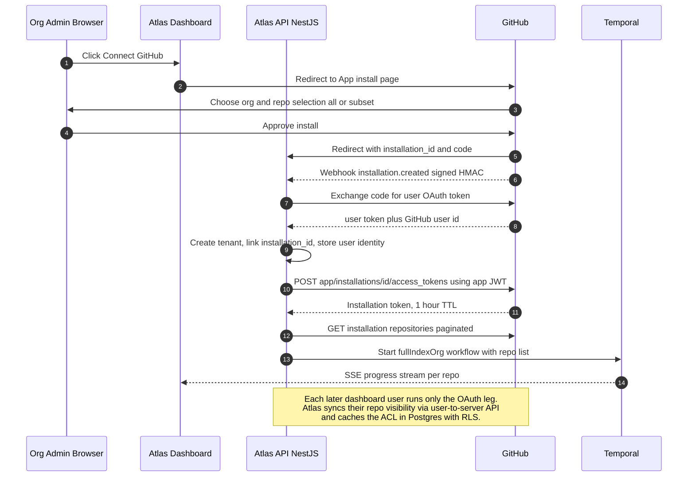
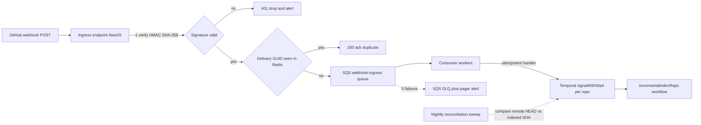
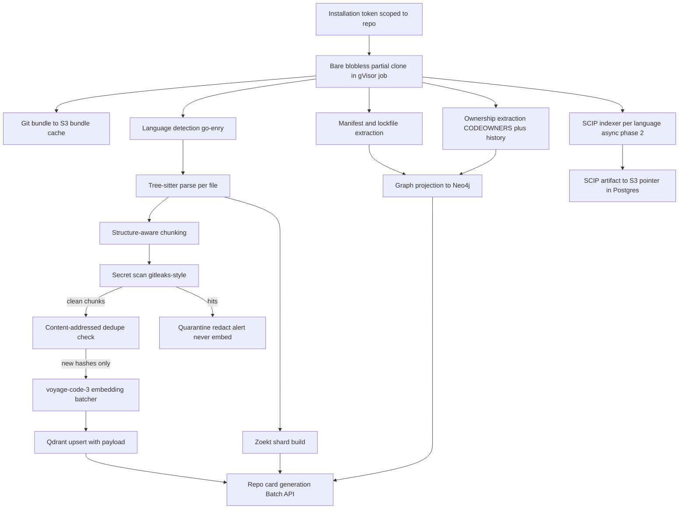

# GitHub Integration & Ingestion Pipeline

> Document 04 of 10. Upstream context: [docs/01-system-architecture.md](01-system-architecture.md) (provider abstraction, API surface), [docs/02-retrieval-and-rag.md](02-retrieval-and-rag.md) (what the index feeds), [docs/03-graph-design.md](03-graph-design.md) (graph extraction consumes this pipeline's output), [docs/06-data-architecture.md](06-data-architecture.md) (schemas for everything persisted here), [docs/08-security-and-deployment.md](08-security-and-deployment.md) (sandbox threat model this pipeline runs inside).

## TL;DR

1. **GitHub App, not OAuth app.** Installation tokens with per-repo grants and org-level install give us least-privilege access (`contents:read`, `metadata:read`, `pull_requests:write`, `checks:read`), a 5,000 req/hr budget **per installation** (scales with customers), and webhooks that fire without any user being online. User-level OAuth is layered on top strictly for identity and permission mirroring — it never touches repo content.
2. **Webhooks are hints, not commands.** Every event is HMAC-verified, buffered in SQS (standard queue + DLQ), deduped by delivery GUID, and then handled as a *level trigger*: the incremental workflow reconciles "last indexed commit → current remote state," so duplicates, replays, and out-of-order deliveries all converge to the same index. A nightly reconciliation sweep catches dropped webhooks.
3. **Two-phase indexing SLA.** Phase 1 (clone → parse → chunk → secret-scan → embed → Zoekt → manifests → graph projection) makes a 100-repo / 20M LOC org fully searchable in **≈ 3–3.5 h, SLA 4 h** (estimate — verify), with embedding throughput at the canonical 1M tok/min as the long pole. Phase 2 (SCIP symbol indexing, which may require builds for Java/C++/C#) lands asynchronously within 24 h and only upgrades precision — it never blocks usability.
4. **Content-addressed everything.** Chunks are keyed by `sha256(normalized_content)`; unchanged chunks are never re-embedded, renames are payload-only updates in Qdrant, and Merkle-style git tree comparison makes incremental indexing cost proportional to the diff, not the repo. Embedding spend for a steady-state org is cents per day, not dollars.
5. **Repo content is hostile input.** All cloning, parsing, and SCIP indexing runs in ephemeral gVisor-sandboxed jobs with egress blocked after fetch; secret scanning (gitleaks-style) runs **before** chunk emission so credentials can never reach Qdrant, Zoekt, S3 chunk storage, or an LLM context window.

---

## 1. GitHub App Architecture

### 1.1 Why a GitHub App, not a plain OAuth app

| Dimension | OAuth App | GitHub App | Winner |
|---|---|---|---|
| Access scope | All repos the authorizing user can access — all-or-nothing `repo` scope includes write | Installation-scoped: org admin selects exact repos; permissions are granular per resource | **GitHub App** |
| Rate limit | 5,000 req/hr shared per user token | 5,000 req/hr **per installation** (higher for large orgs — scales with GHE plans), plus separate user-to-server budget | **GitHub App** |
| Acting identity | A human user — breaks when they leave the company | The App itself — survives offboarding; PRs show as `atlas[bot]` | **GitHub App** |
| Webhooks | Configured per repo/org by hand | Bundled with the installation, fire for all granted repos automatically | **GitHub App** |
| Token model | Long-lived user token (rotatable but persistent) | Short-lived (1 h) installation tokens minted on demand from an app JWT | **GitHub App** |
| Enterprise procurement | Security teams reject `repo`-scoped OAuth routinely | Reviewable permission manifest; org admins approve exact grants | **GitHub App** |

The decision is not close. OAuth-app-only architecture fails the enterprise tier outright (no security team grants blanket `repo` scope) and fails the rate-limit math at 1,000 repos. We still use user-level OAuth — but only as an *identity overlay* (§1.3).

The provider abstraction (see [docs/01-system-architecture.md](01-system-architecture.md)) wraps this as a `ScmProvider` interface; everything below the webhook-normalization boundary in this document is GitHub-specific by design (see Pushback P2).

### 1.2 Permission set (least privilege)

| Permission | Level | Why we need it | Why not more |
|---|---|---|---|
| `contents` | **read** | Clone/fetch repos, read files, read manifests | Autonomous mode pushes via a *dedicated* short-lived token minted with `contents:write` scoped to the single target repo at PR time, only after the human approval gate ([docs/05-ai-and-agents.md](05-ai-and-agents.md)); the standing grant stays read-only |
| `metadata` | **read** | Repo list, default branch, topics, languages — mandatory baseline for any App | n/a |
| `pull_requests` | **write** | Open PRs, push PR comments/descriptions in both modes | Does not grant force-push or branch protection changes |
| `checks` | **read** | Read CI status to inform risk analysis and post-PR verification | We do not write checks in v1 |
| `members` (org) | **read** | Map GitHub teams → `Team`/`Person` nodes and CODEOWNERS resolution ([docs/03-graph-design.md](03-graph-design.md)) | Optional at install; degrade gracefully to CODEOWNERS-only ownership |
| Webhooks | n/a | `push`, `pull_request`, `installation`, `installation_repositories`, `repository`, `member` | Exactly the six events in §2.1 — nothing else subscribed |

Everything else — issues, discussions, actions, secrets, environments — is deliberately **not requested**. Every permission we don't hold is a breach class we don't have.

### 1.3 Installation flow + user OAuth identity overlay

Two distinct trust relationships, established in one onboarding flow:

- **App installation** (org admin → Atlas): grants Atlas the *capability* to read repos.
- **User OAuth** (each dashboard user → Atlas): proves *who the user is on GitHub* so we can mirror their repo visibility. A user only ever queries repos their own GitHub identity can read, even though the App token could read more — this is the authorization core described in [docs/08-security-and-deployment.md](08-security-and-deployment.md).



Repo-visibility mirroring runs on login and every 15 minutes per active user (user-to-server `GET /user/installations/{id}/repositories`), and is invalidated eagerly by `member` and `repository` webhooks.

### 1.4 Installation token lifecycle

| Step | Detail |
|---|---|
| App JWT | RS256-signed with the App private key (held in KMS, never on disk), `exp` ≤ 10 min, minted per request batch |
| Mint installation token | `POST /app/installations/{id}/access_tokens`; optionally narrowed with `repositories: [...]` and a `permissions` subset — indexer jobs get tokens scoped to **only the repo they are indexing**, `contents:read` only |
| Cache | Redis `gh:tok:{installation_id}:{scope_hash}` with TTL **50 min** (10-min safety margin under the 60-min expiry); single-flight lock prevents mint stampedes |
| Distribution | Tokens passed to sandboxed jobs via one-time Temporal activity payloads, never via env vars in pod specs, never written to logs/traces (OTel redaction processor, see [docs/08-security-and-deployment.md](08-security-and-deployment.md)) |
| Revocation | `installation.deleted` / `installation.suspend` webhook → delete Redis keys, cancel running workflows for that installation, tombstone tenant data per retention policy ([docs/06-data-architecture.md](06-data-architecture.md)) |
| PR-time write token | Minted fresh with `contents:write` + `pull_requests:write` for the single target repo, TTL 1 h, used once by the PR agent, discarded |

### 1.5 Rate-limit budget management

Primary budget: **5,000 req/hr per installation** (REST) and 5,000 points/hr (GraphQL) — separate pools. Secondary limits (per GitHub documentation — verify current values at implementation): ≤ 100 concurrent requests, content-creation caps (~80/min, ~500/hr), and abuse-detection heuristics on burst patterns.

**Budget allocator.** A Redis token bucket per installation (`gh:rl:{installation_id}`, refilled from the `x-ratelimit-remaining`/`x-ratelimit-reset` response headers — the headers are the source of truth, the bucket is a local throttle). Every Temporal activity that calls GitHub draws from the bucket with a priority class:

| Priority | Consumer | Share of budget | Notes |
|---|---|---|---|
| P0 | PR creation, approval-gate actions | reserved 10% | User-facing writes never starve |
| P1 | Webhook-driven incremental metadata | 30% | Small calls: compare commits, PR details |
| P2 | Visibility mirroring, CODEOWNERS, teams | 20% | Mostly GraphQL |
| P3 | Bulk indexing metadata | 40% | Preemptible; Temporal activities pause on exhaustion and resume after `x-ratelimit-reset` |

Tactics, in order of leverage:

1. **Git protocol over API.** Clones/fetches use git smart HTTP with the installation token — these do **not** consume the REST budget (they have their own throttling; we cap at 8 concurrent clones per installation to stay under abuse heuristics — estimate, verify).
2. **Conditional requests.** All repeatable REST GETs send `If-None-Match` with cached ETags; `304` responses do not count against the primary rate limit (per GitHub documentation — verify). ETags live in Redis (`gh:etag:{url_hash}`).
3. **GraphQL for fan-in metadata.** One GraphQL query fetches default branch + languages + topics + CODEOWNERS presence + latest commit for 100 repos (~1 point/repo) vs ~400 REST calls. Rule: **GraphQL for breadth, REST for depth** — REST for anything with conditional-request support or media-type needs (tarballs, diffs), GraphQL for batched org-wide metadata.
4. **Webhook-first design.** Steady state needs near-zero polling; the API budget is almost entirely idle headroom for bursts.

Worked steady-state check (100-repo org, estimate — verify): ~200 pushes/day → ~200 `compare` calls + ~50 PR-detail calls + hourly visibility sync (~24 GraphQL points × 24) ≈ **< 700 requests/day against a 120,000/day budget**. The rate limit only matters during initial indexing and mass re-index — both flow through P3 preemptible activities.

---

## 2. Webhook Ingress

### 2.1 Events consumed

| Event | Actions handled | Effect |
|---|---|---|
| `push` | any | Signal `incrementalIndexRepo` for the pushed ref (default branch only by default; see §3.1); carries `before`/`after` SHAs and `forced` flag |
| `pull_request` | `opened`, `synchronize`, `closed`, `merged` | Update PR mirror tables (dashboard), trigger analysis-refresh hints; merged PRs to default branch are covered by the ensuing `push` |
| `installation` | `created`, `deleted`, `suspend`, `unsuspend`, `new_permissions_accepted` | Tenant lifecycle: provision/teardown, token revocation, permission re-audit |
| `installation_repositories` | `added`, `removed` | Start `fullIndexRepo` for added repos; run removal GC (§4.4) for removed ones |
| `repository` | `renamed`, `deleted`, `archived`, `unarchived`, `transferred`, `privatized`, `publicized` | Rename updates coordinates everywhere (Postgres, Qdrant payloads, graph `Repo` node); delete/transfer triggers GC; archive pauses indexing |
| `member` / `membership` | `added`, `removed`, `edited` | Invalidate cached user-repo visibility ACLs; update `Person`/`Team` graph nodes |

### 2.2 Ingress hardening



Hardening rules:

1. **Signature verification first, before parsing.** HMAC-SHA256 over the raw body with the webhook secret; constant-time compare; reject on mismatch and alert on repeated mismatches (someone probing the endpoint).

```typescript
import { createHmac, timingSafeEqual } from "node:crypto";

export function verifyGitHubSignature(rawBody: Buffer, sigHeader: string | undefined, secret: string): boolean {
  if (!sigHeader?.startsWith("sha256=")) return false;
  const expected = Buffer.from("sha256=" + createHmac("sha256", secret).update(rawBody).digest("hex"));
  const received = Buffer.from(sigHeader);
  return expected.length === received.length && timingSafeEqual(expected, received);
}
```

2. **Ack fast, process async.** The endpoint does signature check + GUID dedupe + SQS enqueue, returns 200 in < 50 ms. GitHub retries slow/failed deliveries; a slow handler causes duplicate storms. All real work happens behind SQS.
3. **SQS standard queue, not FIFO.** GitHub does not guarantee ordering anyway, our handlers are idempotent and level-triggered (§2.3), and FIFO per-group throughput limits would throttle installation-wide bursts. DLQ after 5 receive failures, with redrive tooling.
4. **Dedupe.** `X-GitHub-Delivery` GUID → Redis `SETNX wh:dedupe:{guid} EX 86400`. Catches GitHub redeliveries and our own at-least-once SQS semantics upstream of Temporal; Temporal signal handlers are additionally idempotent by `(repo, after_sha)`.
5. **Replay resistance.** A replayed webhook (captured request re-sent) fails GUID dedupe within 24 h; beyond that it is harmless because handlers reconcile against live GitHub state rather than trusting payload content — a replayed `push` for an old SHA results in a no-op reconcile.
6. **Payloads are untrusted data.** Webhook bodies are stored 30 days in S3 for debugging ([docs/06-data-architecture.md](06-data-architecture.md)) but never fed to an LLM and never used as authorization input; repo names/commit messages inside them are treated as attacker-controlled strings (prompt-injection surface — see [docs/08-security-and-deployment.md](08-security-and-deployment.md)).

### 2.3 Out-of-order delivery: level triggers, not edge triggers

We never apply webhook payloads as state transitions. A `push` event means only: *"repo R, ref B changed; check it."* The `incrementalIndexRepo` workflow reads `last_indexed_commit` from Postgres, fetches the current remote head, and diffs between those two — regardless of what the event claimed. Consequences:

- Two pushes delivered in reverse order → first signal indexes to the newest head; second signal reconciles to a no-op.
- A dropped webhook → the nightly reconciliation sweep (GraphQL batch: default-branch head OID for every tracked repo, ~1 point/repo) finds the drift and signals the same workflow.
- A duplicated event → idempotent no-op.

One mechanism handles duplication, reordering, loss, and replay. This is the single most important design choice in the ingress path.

---

## 3. Ingestion Pipeline End to End



Every box from clone through SCIP runs inside ephemeral gVisor-sandboxed Kubernetes jobs (Rust indexer workers) with egress blocked after fetch completes; the job's only outputs are structured artifacts pushed to S3/Qdrant/Postgres through an internal gateway. Rationale and threat model: [docs/08-security-and-deployment.md](08-security-and-deployment.md).

### 3.1 Clone strategy

| Decision | Choice | Rationale |
|---|---|---|
| Clone type | `git clone --bare --filter=blob:none` | Full commit/tree history (needed for ownership heuristics, Merkle diffing, rename detection) without any blob until requested; typically 5–15% of full clone size (estimate — verify) |
| Blob materialization | `git sparse-checkout`-free; blobs fetched on demand via `git cat-file --batch` backed by promisor fetch for HEAD tree only | We index the default-branch HEAD snapshot; historical blobs are never fetched |
| Branch scope | **Default branch only** by default; per-repo opt-in for additional long-lived branches | Indexing every branch multiplies cost ~3–10× for near-zero retrieval value; PR analysis fetches PR head refs ephemerally without indexing them |
| Re-index without re-clone | `git bundle create` after each successful index → S3 `bundles/{repo_id}/{commit}.bundle`; next full re-index restores bundle + incremental fetch | Cuts GitHub transfer and secondary-limit exposure; a 1,000-repo re-index (e.g., chunker version bump) touches GitHub only for deltas |
| Concurrency | ≤ 8 concurrent clones per installation (estimate — verify against abuse heuristics), token scoped to the single repo | Sandbox jobs are single-repo; blast radius of a compromised job is one repo, read-only |

### 3.2 Language detection

`go-enry` (linguist-compatible, embedded in the Rust worker via FFI or the Rust port) classifies every file. Output feeds three consumers: parser selection (§3.3), the `Repo` node's language mix in Neo4j, and chunker mode selection (§3.4). Vendored/generated paths (`vendor/`, `node_modules/`, `*_pb2.py`, `*.min.js`, linguist `generated` heuristics) are excluded from embedding and SCIP but **included in Zoekt** (grep must see everything) with a `vendored:true` shard flag so retrieval can filter.

### 3.3 Parsing matrix — all ten languages

Tree-sitter is the universal layer: every file gets a syntax tree, chunk boundaries, and heuristic symbol extraction. SCIP is the precision layer: compiler-accurate symbol/reference resolution stored per `repo@commit` in S3 with Postgres pointers, loaded on demand ([docs/03-graph-design.md](03-graph-design.md) — the two-tier graph split).

| Language | Tree-sitter grammar | SCIP indexer | Build required? | Fallback when SCIP unavailable/failed | Maturity tier |
|---|---|---|---|---|---|
| TypeScript | `tree-sitter-typescript` | `scip-typescript` | No — needs `node_modules` install (sandboxed, network-allowlisted registry mirror) | Tree-sitter defs + import-graph heuristics | **A** |
| JavaScript | `tree-sitter-javascript` | `scip-typescript` (JS mode, uses JSDoc/inference) | Same as TS | Tree-sitter defs + import heuristics | **A** |
| Python | `tree-sitter-python` | `scip-python` | No — venv install of deps improves precision, optional | Tree-sitter defs + module-path resolution | **A** |
| Go | `tree-sitter-go` | `scip-go` | Module download only | Tree-sitter defs + package-path resolution | **A** |
| Rust | `tree-sitter-rust` | `rust-analyzer` SCIP emit (`rust-analyzer scip`) | Cargo metadata resolution, no full build | Tree-sitter defs + `use`-path heuristics | **A** |
| Java | `tree-sitter-java` | `scip-java` | **Yes** — Maven/Gradle build or `--build-tool=auto`; frequently fails on bespoke builds | Tree-sitter defs + package/import resolution (good precision for Java's rigid package structure) | **B** |
| C# | `tree-sitter-c-sharp` | `scip-dotnet` | **Yes** — MSBuild restore | Tree-sitter defs + namespace resolution | **B** |
| C++ | `tree-sitter-cpp` | `scip-clang` | **Yes** — requires `compile_commands.json`; hardest to automate | Tree-sitter defs + `#include` graph; accept name-based ambiguity | **C** |
| PHP | `tree-sitter-php` | `scip-php` | Composer install | Tree-sitter defs + PSR-4 autoload-map resolution (namespace→path is deterministic — strong fallback) | **B** |
| Ruby | `tree-sitter-ruby` | `scip-ruby` | Bundler install; Sorbet-based, weak on untyped code | Tree-sitter defs + constant-resolution heuristics | **C** |

Rules:

- **SCIP is always best-effort and always async (Phase 2).** A SCIP failure is a logged degradation, never an indexing failure. The `repo_index_state` row records `scip_status ∈ {ok, partial, failed, unsupported}` per language, and retrieval surfaces confidence accordingly ([docs/02-retrieval-and-rag.md](02-retrieval-and-rag.md)).
- **Builds run in the same gVisor sandbox** with egress restricted to per-ecosystem package-registry mirrors (Artifactory-style pull-through cache) — build scripts execute arbitrary code and are treated as hostile.
- **Tier C languages ship with explicit reduced-precision messaging** (see Pushback P1).

### 3.4 Structure-aware chunking

Canonical target: one chunk = 30–60 lines ≈ 300–600 tokens at ~10 tokens/LOC. Chunking operates on the tree-sitter CST, never on raw line windows, for code files.

| Rule | Value |
|---|---|
| Primary unit | Function / method / class body (tree-sitter query per language) |
| Target size | 300–600 tokens |
| Min bound | 64 tokens — smaller siblings (imports, small consts, one-line functions) are coalesced into a "module preamble" or neighbor chunk |
| Max bound | 1,024 tokens hard cap — oversized functions split at top-level statement boundaries inside the function, each part carrying the enclosing signature |
| Overlap | **No sliding overlap between sibling chunks** (they are semantically disjoint units); instead every chunk is prefixed with a *context header*: `repo > path > enclosing class/module > signature` (~20–40 tokens). Split parts of one oversized function overlap by one statement |
| Chunk identity | `chunk_hash = sha256(language + context_header_normalized + body_normalized)`; normalization strips trailing whitespace, not comments (comments carry meaning) |
| Payload | `{tenant_id, repo_id, path, lang, start_line, end_line, symbol, kind, commit_first_seen, vendored}` — Qdrant collection layout in [docs/06-data-architecture.md](06-data-architecture.md) |

Non-code content gets dedicated chunkers because its retrieval role differs:

| Content type | Chunking rule | Why |
|---|---|---|
| Markdown / docs / READMEs | Split at heading boundaries (`#`–`###`), 200–800 tokens, merge short sections under parent heading; heading path in context header | Doc sections are the unit of meaning; these chunks also feed LLM soft-edge extraction ([docs/03-graph-design.md](03-graph-design.md)) |
| OpenAPI / AsyncAPI | One chunk per operation (`path+method`) and per schema component, with `info` block prepended | Retrieval asks "who exposes POST /users" — operation granularity matches the question; also feeds `APIEndpoint` graph extraction |
| Protobuf / GraphQL SDL | One chunk per `service`/`message` / per type definition | Same — definition-level questions |
| Dockerfile | Whole file if ≤ 600 tokens, else split per stage (`FROM` boundaries) | Stages are the semantic unit |
| K8s manifests / Helm / docker-compose | One chunk per resource document (YAML `---` split), context header = `kind/name/namespace` | Resource-level questions; feeds `Deployable` extraction |
| Terraform | One chunk per `resource`/`module`/`variable` block via `tree-sitter-hcl` | Block-level questions; feeds infra edges |
| `.env.example` / config templates | One chunk per file, each key emitted as structured `ConfigKey` metadata alongside; **values are always redacted even in examples** | Feeds `REFERENCES_ENV` edges; example values are a secret-leak vector |
| Lockfiles, large JSON/data files | **Never embedded.** Zoekt-only + manifest extractor | Zero semantic retrieval value per token; would dominate embedding cost |

### 3.5 Secret scanning — before embedding, without exception

Position in pipeline: after chunking, before dedupe/embedding, inside the sandbox. Engine: gitleaks-style rulepack (regex + keyword anchors + Shannon entropy validation) compiled into the Rust worker.

- **Hit handling:** the secret span is replaced with `⟨REDACTED:{rule_id}⟩` in the chunk *before hashing* (so the redacted content is what gets content-addressed — a rotated-but-identical-context chunk dedupes correctly); the raw finding (path, line, rule, fingerprint — **not the secret value**) goes to a `secret_findings` Postgres table and fires a tenant-visible alert.
- **Scope:** applies equally to Zoekt shard input, chunk storage in S3, embeddings, and any file content loaded into agent context at query time (the retrieval layer re-checks the redaction flag; [docs/02-retrieval-and-rag.md](02-retrieval-and-rag.md)).
- **Whole-file quarantine:** files with > 5 findings or matching high-risk names (`id_rsa`, `*.pem`, `credentials.json`) are excluded from indexing entirely.
- **Why before embedding is non-negotiable:** vectors are not reversible in general, but chunk payloads and Zoekt are verbatim text, and embedded chunks get injected into LLM prompts. One leaked credential in a context window sent to a third-party API is a reportable incident under enterprise DPAs ([docs/08-security-and-deployment.md](08-security-and-deployment.md)).

### 3.6 Embedding generation — voyage-code-3

| Parameter | Value |
|---|---|
| Model | voyage-code-3, 1024-dim, output dtype int8 (canonical; ~1 KB/vector + payload) |
| Cost | USD 0.18 / Mtok |
| Batching | Batcher accumulates chunks to ≤ 128 texts or ≤ 100K tokens per request (estimate — verify against current API limits), flushes on 200 ms idle |
| Rate limits | Provider tier assumed **1M tokens/min** sustained (canonical planning figure — see [docs/07-scalability-and-cost.md](07-scalability-and-cost.md) §1.1; estimate — verify Voyage contract tier and request a raise before first enterprise onboarding); shared org-fair token bucket in Redis so one tenant's initial index cannot starve others' incremental updates |
| Retry | Temporal activity retry: exponential backoff 1 s → 60 s, max 8 attempts, honor `Retry-After`; batch is the retry unit; poison chunks (persistent 4xx) are logged and skipped, never block the repo |
| Dedupe | Before enqueue: `SELECT 1 FROM chunks WHERE chunk_hash = $1` (Postgres, unique index). Existing hash → insert a `chunk_refs` row only; **no API call**. This is the primary cost control: a fork, a vendored copy, or an unchanged file across commits costs zero embedding spend |
| Cost caps | Per-tenant daily embedding budget (default: 2× initial-index estimate) with alert at 80%, hard stop + human review at 100% — protects against pathological repos (generated-code churn) |

Worked steady-state number: an active 100-repo org changing ~30K LOC/day → ~300K tokens/day → **≈ USD 0.05/day** embedding spend (estimate — verify). Initial index dominates (§6); steady state is noise. Full unit economics: [docs/07-scalability-and-cost.md](07-scalability-and-cost.md).

### 3.7 Dependency manifest + lockfile extraction — all ten ecosystems

The extractor parses manifests and lockfiles into normalized `(name, version_constraint, resolved_version, scope, registry)` records; the graph builder matches them against internal package coordinates published by sibling repos to derive `DEPENDS_ON` edges with `{mechanism: "manifest", confidence: 0.95+, evidence: file:line}` ([docs/03-graph-design.md](03-graph-design.md)).

| Ecosystem | Manifest(s) | Lockfile(s) | Internal-coordinate matching |
|---|---|---|---|
| JS/TS (npm) | `package.json` (incl. workspaces) | `package-lock.json`, `yarn.lock`, `pnpm-lock.yaml` | Scoped names (`@org/*`), private registry URLs, `workspace:*`, git/file deps |
| Python | `pyproject.toml`, `requirements*.txt`, `Pipfile`, `setup.cfg/py` (static only) | `poetry.lock`, `uv.lock`, `Pipfile.lock` | Private index URLs, VCS deps, name match vs sibling `pyproject` names |
| Java | `pom.xml`, `build.gradle`, `build.gradle.kts` (static parse; no build execution) | `gradle.lockfile`, Maven via resolved poms when SCIP build ran | `groupId:artifactId` vs sibling publications |
| Go | `go.mod` (incl. `replace`) | `go.sum` | Module path prefix match against org VCS hosts — highest-precision ecosystem |
| Rust | `Cargo.toml` (incl. workspace, path/git deps) | `Cargo.lock` | Path/git deps and private registry names |
| C# | `*.csproj`, `Directory.Packages.props`, `packages.config` | `packages.lock.json` | Private NuGet feed package IDs |
| C++ | `conanfile.txt/py`, `vcpkg.json`, CMake `FetchContent`/`find_package` heuristics | `conan.lock`, `vcpkg` manifest baselines | Name match; **lowest confidence — capped at 0.7**, C++ dependency truth often lives in CI scripts |
| PHP | `composer.json` | `composer.lock` | Vendor-prefixed names, VCS repository entries |
| Ruby | `Gemfile`, `*.gemspec` | `Gemfile.lock` | Private gem sources, git/path gems |
| Cross-cutting | `Dockerfile FROM`, K8s images, Terraform module sources, docker-compose `image:` | n/a | Image name → `Deployable` → owning repo, `DEPLOYS` edges |

Gradle/Maven caveat: static parsing misses dynamically-resolved versions; when the SCIP build ran (§3.3) we harvest the resolved dependency report as a higher-confidence overlay.

### 3.8 Ownership extraction

Two mechanisms, merged with explicit confidence:

1. **CODEOWNERS** — parsed from all three valid locations (`/`, `.github/`, `docs/`), patterns compiled to gitignore-style matchers, teams resolved via `members:read` (or left as opaque handles when the permission was declined). Produces `OWNS` edges with `confidence: 0.9`, `mechanism: "codeowners"`, evidence = CODEOWNERS line.
2. **Commit-history heuristic** — from the bare clone (commit metadata is fully present in blobless clones; zero extra API calls): per top-level directory, committers weighted by `commits × recency_decay(half_life=180d)`; contributors above 25% weight become `OWNS` candidates with `confidence: 0.5–0.7`, `mechanism: "commit_history"`. Bot authors (`*[bot]`, dependabot et al.) are excluded.

CODEOWNERS always wins on conflict. Ownership feeds the Scope agent's "who to notify / who reviews" output ([docs/05-ai-and-agents.md](05-ai-and-agents.md)) and the dashboard's impact reports.

---

## 4. Incremental Indexing

### 4.1 Commit-diff driven with Merkle-style content addressing

Git *is* a Merkle tree; we exploit it instead of re-inventing one:

1. Workflow reads `last_indexed_commit` (Postgres) and fetches the remote head into the bare clone (bundle-restored if the pod is fresh).
2. `git diff-tree -r --find-renames=60% <old> <new>` yields exact `{A,M,D,R}` file sets by comparing tree OIDs — subtrees with identical OIDs are skipped without reading a single blob. Cost is proportional to the change, not the repo.
3. For each changed file: re-parse → re-chunk → secret-scan → hash. Chunk hashes are diffed against the stored chunk set for that file: new hashes are embedded, vanished hashes get `chunk_refs` decrements, surviving hashes are untouched. An edit to one function in a 2,000-line file re-embeds ~1 chunk.
4. Zoekt: the repo's shard set is rebuilt from the updated checkout (Zoekt shard builds are fast and per-repo; sub-file incrementality isn't worth the complexity — estimate ~1 s per 50 MB, verify).
5. Graph: extractors re-run only for changed manifest/spec/config files; derived edges are upserted with `last_seen_commit = <new>`; edges whose evidence files changed but no longer yield the edge are ended (§4.4).
6. SCIP: re-index is scheduled if changed files intersect the language's source set; debounced to at most one SCIP run per repo per hour (builds are expensive).
7. Postgres `last_indexed_commit` is updated **last**, transactionally with the index-state row — the workflow is resumable at any step because every step is idempotent on `(repo, new_commit)`.

### 4.2 Rename detection

`--find-renames=60%` splits renames into:

- **Pure rename (similarity 100%):** chunk hashes are unchanged → Qdrant `set_payload` updates `path` on existing points; Zoekt shard rebuild picks up the path; graph evidence paths are rewritten. **Zero re-embedding.**
- **Rename + edit:** unchanged chunks within the file dedupe by hash (payload update), edited chunks follow the normal new/vanished flow. Content addressing makes rename handling an optimization detail rather than a correctness problem.

### 4.3 Force-push and branch-delete

| Event | Detection | Handling |
|---|---|---|
| Force push | `push` webhook `forced: true`, or reconcile discovers non-fast-forward | Compute `merge-base(old_indexed, new_head)`; diff `merge-base → new_head` for additions and `merge-base → old_indexed` for content to decrement. If old commits were GC'd server-side and `old_indexed` is unreachable, fall back to **full tree diff**: compare the stored file-hash manifest (Postgres, per-file blob OIDs at last index) against the new tree — still proportional to actual difference thanks to tree OID comparison |
| Default-branch switch | `repository` webhook `edited` (default branch change) | Treated as force-push-with-unknown-base: full tree diff |
| Branch delete (tracked branch) | `push` webhook with deleted ref | Decrement `chunk_refs` for all chunks referenced only by that branch's index, end branch-scoped graph edges, drop the branch's Zoekt shard set; deferred GC (§4.4) |
| Repo removed / uninstalled | `installation_repositories` / `installation` webhooks | Tenant-scoped hard GC after retention window; bundle cache deleted immediately |

### 4.4 Garbage collection of orphaned artifacts

Reference counting + grace period, never immediate deletion (a bad deploy of the chunker must not be able to mass-delete an index irrecoverably):

| Artifact | Liveness source | GC policy |
|---|---|---|
| Qdrant vectors | `chunk_refs` (Postgres): `(chunk_hash) ← (repo, branch, path)` references | Refcount 0 → tombstone row with `orphaned_at`; nightly `gcOrphans` activity batch-deletes points older than **7 days** |
| Chunk text in S3 | Same `chunk_refs` | Same tombstone sweep; S3 lifecycle rule as backstop |
| Zoekt shards | Shard manifest per repo/branch | Old shard set deleted after new set passes a smoke query; branch-delete removes the set after 7 days |
| Neo4j derived edges | `last_seen_commit` vs repo's current indexed commit | Edge not re-derived at current commit → `status: stale` immediately (excluded from default traversals, visible in "recently removed" views); hard-deleted after 30 days ([docs/03-graph-design.md](03-graph-design.md)) |
| SCIP artifacts in S3 | Postgres pointer table `scip_artifacts(repo, commit)` | Keep current + previous 2 commits per repo; lifecycle-expire the rest at 30 days |
| Git bundles in S3 | `repo_index_state` | Keep latest per repo; expire on repo removal |

Metric to alert on: `orphaned_vectors_pending > 5%` of collection size — indicates a GC stall or a chunker identity bug.

---

## 5. Temporal Workflow Definitions

Temporal (TypeScript SDK) owns all multi-step ingestion state — no bespoke job tables, no cron-and-pray. Task queues: `ingest-control` (workflows, lightweight activities) and `ingest-heavy` (sandboxed clone/parse/SCIP activities, executed by workers that spawn gVisor jobs and heartbeat on their behalf).

### 5.1 Activity interfaces

```typescript
// packages/ingest/src/activities/types.ts
export interface CloneResult {
  repoId: string;
  headCommit: string;
  bundleS3Key: string;
  bytesFetched: number;
  fileManifest: { path: string; blobOid: string; sizeBytes: number }[];
  changedPaths?: string[]; // present when sinceCommit was given: output of git diff-tree -r --find-renames=60%
}

export interface ChunkBatchResult {
  filesProcessed: number;
  chunksEmitted: number;
  chunksDeduped: number;      // hash already known → no embed
  secretFindings: number;      // redactions applied pre-hash
  chunkManifestS3Key: string;  // hashes + payloads for downstream activities
}

export interface IngestActivities {
  mintScopedInstallationToken(installationId: number, repoId: string): Promise<{ tokenRef: string; expiresAt: string }>;
  cloneOrFetchRepo(args: { repoId: string; tokenRef: string; sinceCommit?: string; bundleS3Key?: string }): Promise<CloneResult>; // heartbeats every 15s with bytes fetched
  detectLanguages(args: { repoId: string; commit: string }): Promise<Record<string, number>>;
  parseAndChunk(args: { repoId: string; commit: string; paths?: string[] }): Promise<ChunkBatchResult>; // heartbeats per 500 files
  embedNewChunks(args: { repoId: string; chunkManifestS3Key: string }): Promise<{ embedded: number; tokensSpent: number }>; // heartbeats per batch; draws from tenant token bucket
  upsertVectors(args: { repoId: string; chunkManifestS3Key: string }): Promise<{ upserted: number }>;
  buildZoektShards(args: { repoId: string; commit: string }): Promise<{ shardSetId: string }>;
  extractManifests(args: { repoId: string; commit: string; paths?: string[] }): Promise<{ dependencies: number; specs: number }>;
  extractOwnership(args: { repoId: string; commit: string }): Promise<{ ownersFound: number }>;
  projectGraph(args: { repoId: string; commit: string }): Promise<{ nodesUpserted: number; edgesUpserted: number; edgesEnded: number }>;
  runScipIndexer(args: { repoId: string; commit: string; language: string }): Promise<{ status: 'ok' | 'partial' | 'failed'; artifactS3Key?: string }>; // heartbeats every 30s; timeout 45m
  generateRepoCard(args: { repoId: string; commit: string }): Promise<void>; // Batch API, fire-and-forget semantics
  gcOrphans(args: { tenantId: string; olderThanDays: number }): Promise<{ vectorsDeleted: number; edgesDeleted: number; shardsDeleted: number }>;
  commitIndexState(args: { repoId: string; commit: string; phase: 'searchable' | 'symbol_precise' }): Promise<void>;
}
```

### 5.2 Full index — org and repo workflows

```typescript
// packages/ingest/src/workflows/fullIndex.ts
import { proxyActivities, startChild, workflowInfo } from '@temporalio/workflow';
import type { IngestActivities } from '../activities/types';

const light = proxyActivities<IngestActivities>({
  taskQueue: 'ingest-control',
  startToCloseTimeout: '2 minutes',
  retry: { initialInterval: '1s', backoffCoefficient: 2, maximumInterval: '1m', maximumAttempts: 8 },
});

const heavy = proxyActivities<IngestActivities>({
  taskQueue: 'ingest-heavy',
  startToCloseTimeout: '45 minutes',
  heartbeatTimeout: '60 seconds',
  retry: {
    initialInterval: '5s', backoffCoefficient: 2, maximumInterval: '5m', maximumAttempts: 5,
    nonRetryableErrorTypes: ['RepoAccessRevoked', 'RepoTooLarge', 'TenantBudgetExceeded'],
  },
});

/** Parent: one per installation onboarding. Child per repo, bounded parallelism. */
export async function fullIndexOrg(args: {
  tenantId: string; installationId: number; repoIds: string[];
  maxParallelRepos?: number; // default 8 — per-installation concurrency cap (clone abuse limits + fair-share)
}): Promise<void> {
  const cap = args.maxParallelRepos ?? 8;
  const queue = [...args.repoIds];
  const running = new Set<Promise<void>>();
  while (queue.length > 0 || running.size > 0) {
    while (queue.length > 0 && running.size < cap) {
      const repoId = queue.shift()!;
      const child = startChild(fullIndexRepo, {
        args: [{ tenantId: args.tenantId, installationId: args.installationId, repoId }],
        workflowId: `full-index:${repoId}`,           // idempotent: duplicate starts collapse
        parentClosePolicy: 'ABANDON',                  // org workflow completion never kills repo indexing
      }).then((h) => h.result());
      const tracked = child.finally(() => running.delete(tracked));
      running.add(tracked);
    }
    await Promise.race(running);
  }
}

export async function fullIndexRepo(args: { tenantId: string; installationId: number; repoId: string }): Promise<void> {
  const { tokenRef } = await light.mintScopedInstallationToken(args.installationId, args.repoId);
  const clone = await heavy.cloneOrFetchRepo({ repoId: args.repoId, tokenRef });
  await light.detectLanguages({ repoId: args.repoId, commit: clone.headCommit });

  const chunks = await heavy.parseAndChunk({ repoId: args.repoId, commit: clone.headCommit });
  // Phase 1 fan-out: embeddings, Zoekt, manifests, ownership are independent.
  await Promise.all([
    heavy.embedNewChunks({ repoId: args.repoId, chunkManifestS3Key: chunks.chunkManifestS3Key })
      .then(() => heavy.upsertVectors({ repoId: args.repoId, chunkManifestS3Key: chunks.chunkManifestS3Key })),
    heavy.buildZoektShards({ repoId: args.repoId, commit: clone.headCommit }),
    heavy.extractManifests({ repoId: args.repoId, commit: clone.headCommit }),
    heavy.extractOwnership({ repoId: args.repoId, commit: clone.headCommit }),
  ]);
  await light.projectGraph({ repoId: args.repoId, commit: clone.headCommit });
  await light.commitIndexState({ repoId: args.repoId, commit: clone.headCommit, phase: 'searchable' });

  // Phase 2: SCIP per detected language — best-effort, never fails the workflow.
  const langs = await light.detectLanguages({ repoId: args.repoId, commit: clone.headCommit });
  for (const lang of Object.keys(langs)) {
    try { await heavy.runScipIndexer({ repoId: args.repoId, commit: clone.headCommit, language: lang }); }
    catch { /* recorded by activity as scip_status=failed; retrieval degrades gracefully */ }
  }
  await light.commitIndexState({ repoId: args.repoId, commit: clone.headCommit, phase: 'symbol_precise' });
  await light.generateRepoCard({ repoId: args.repoId, commit: clone.headCommit });
}
```

### 5.3 Incremental index — signal-driven, debounced, level-triggered

```typescript
// packages/ingest/src/workflows/incrementalIndex.ts
import { defineSignal, setHandler, condition, continueAsNew, sleep } from '@temporalio/workflow';
import { light, heavy } from './proxies'; // same activity proxies as fullIndex.ts

export const pushSignal = defineSignal<[{ afterSha: string; forced: boolean }]>('push');

/** Long-lived workflow per repo, started via signalWithStart from the SQS consumer.
 *  workflowId = `incr-index:${repoId}` — all pushes for a repo funnel into one instance. */
export async function incrementalIndexRepo(args: { tenantId: string; installationId: number; repoId: string }): Promise<void> {
  let pending = false;
  let forcedSeen = false;
  setHandler(pushSignal, (p) => { pending = true; forcedSeen ||= p.forced; });

  for (let cycles = 0; cycles < 500; cycles++) {          // continueAsNew before history bloats
    await condition(() => pending, '24 hours');           // idle timeout → workflow completes; next push restarts it
    if (!pending) return;
    await sleep('30 seconds');                            // debounce: coalesce push bursts into one reconcile
    pending = false;
    const forced = forcedSeen; forcedSeen = false;

    // Level trigger: reconcile last_indexed_commit → live remote head; signal payload SHAs are hints only.
    const { tokenRef } = await light.mintScopedInstallationToken(args.installationId, args.repoId);
    const clone = await heavy.cloneOrFetchRepo({ repoId: args.repoId, tokenRef, sinceCommit: forced ? undefined : 'last_indexed' });
    const chunks = await heavy.parseAndChunk({ repoId: args.repoId, commit: clone.headCommit, paths: clone.changedPaths });
    await Promise.all([
      heavy.embedNewChunks({ repoId: args.repoId, chunkManifestS3Key: chunks.chunkManifestS3Key })
        .then(() => heavy.upsertVectors({ repoId: args.repoId, chunkManifestS3Key: chunks.chunkManifestS3Key })),
      heavy.buildZoektShards({ repoId: args.repoId, commit: clone.headCommit }),
      heavy.extractManifests({ repoId: args.repoId, commit: clone.headCommit, paths: clone.changedPaths }),
    ]);
    await light.projectGraph({ repoId: args.repoId, commit: clone.headCommit });
    await light.commitIndexState({ repoId: args.repoId, commit: clone.headCommit, phase: 'searchable' });
    // SCIP re-index scheduled out-of-band, debounced to 1/hour/repo.
  }
  await continueAsNew<typeof incrementalIndexRepo>(args);
}
```

### 5.4 Retry, heartbeat, and concurrency policy summary

| Concern | Mechanism |
|---|---|
| Long activities dying silently | `heartbeatTimeout: 60s` on all heavy activities; heartbeat details carry progress (bytes, files, batches) so retries resume from checkpoints stored in S3 manifests |
| GitHub rate-limit exhaustion | Activities throw `RateLimited{resetAt}`; custom retry via `nextRetryDelay = resetAt - now` — Temporal sleeps exactly until the budget refills instead of blind backoff |
| Poison repos | `RepoTooLarge` (> 10 GB working tree, estimate — verify threshold) and `RepoAccessRevoked` are non-retryable → workflow parks the repo with a dashboard-visible state |
| Per-installation concurrency | Parent-workflow semaphore (cap 8) + `ingest-heavy` worker `maxConcurrentActivityTaskExecutions` sized to cluster capacity; per-tenant fairness via one org workflow per installation |
| Embedding budget | `embedNewChunks` draws from the tenant Redis token bucket; `TenantBudgetExceeded` is non-retryable pending human review |
| Chunker/parser version bumps | `index_schema_version` on every artifact; a version bump enqueues low-priority re-index org workflows fed from S3 bundle cache — GitHub is barely touched |

---

## 6. Initial-Index SLA — Worked Math for a 100-Repo Org

Canonical inputs: 100 repos ≈ 20M LOC; ~10 tokens/LOC; chunk = 30–60 lines; long-tail size distribution (p50 repo ≈ 50K LOC, a few ≥ 1M LOC — estimate). All figures below are **estimates — verify** against launch benchmarks; the pipeline reports actuals per phase in Grafana.

| Quantity | Derivation | Value |
|---|---|---|
| Source text at HEAD | 20M LOC × ~35 B/line | ≈ 700 MB |
| Git transfer (blobless clone + HEAD blobs) | commits/trees ≈ 2–4 GB + packed HEAD blobs ≈ 1 GB | ≈ 3–5 GB |
| Chunk count | 20M LOC ÷ 45 lines/chunk avg | ≈ 450K chunks |
| Embedding tokens | 20M LOC × 10 tok/LOC | ≈ 200M tokens |
| Embedding cost | 200 Mtok × USD 0.18/Mtok | ≈ **USD 36** |
| Qdrant footprint | 450K × (1 KB int8 vector + ~0.5 KB payload) | ≈ 700 MB |
| Zoekt shard size | ~3× source text (trigram overhead) | ≈ 2 GB |

Wall-clock per phase, with the per-installation cap of 8 parallel repo jobs:

| Phase | Throughput assumption (estimate — verify) | Wall clock |
|---|---|---|
| Clone (8 parallel, staggered) | 25 MB/s aggregate sustained | ≈ 3–4 min |
| Parse + chunk + secret scan | 10 MB/s/core × 8 jobs (tree-sitter is fast; gitleaks pass dominates) | ≈ 10 min |
| **Embedding** | 1M tokens/min provider tier (canonical), org-fair bucket | **≈ 200 min ← long pole** (≈ 160 min at ~80% dedupe retention) |
| Qdrant upsert | 5K points/s bulk | ≈ 2 min |
| Zoekt shard builds | ~1 GB source/min across builders | ≈ 5 min |
| Manifests + ownership + graph projection | dominated by Neo4j upserts, ~10⁴ nodes / 10⁵ edges | ≈ 5–10 min |
| Repo cards (Batch API, Haiku/Sonnet) | async, non-blocking | landing ≤ 24 h, typically ≈ 1 h |
| **Phase 1 total (searchable)** | phases overlap per repo; embedding queue drains last | **≈ 3–3.5 h expected → SLA: 4 h at p95** (lexical + graph queryable at ≈ 30–45 min; semantic search completes the phase — consistent with [docs/07-scalability-and-cost.md](07-scalability-and-cost.md) §3.3 tier-M staged availability) |
| Phase 2 (SCIP) | Tier A langs: minutes/repo, no build. Java/C#/C++ builds: 5–45 min/repo, many fail on first attempt | **SLA: 24 h best-effort, precision-upgrade only** |

Sensitivity: Phase 1 wall time is dominated by embedding and scales inversely with the provider throughput tier. At the canonical 1M tok/min, a 10-repo org (~2M LOC, ~20M tokens) indexes fully in **≈ 30–40 min**. A 1,000-repo org (~150M LOC, ~1.5B tokens pre-dedupe / ~975M post-dedupe, ≈ USD 175 embedding after ~35% content-addressed dedupe — pre-dedupe ceiling ≈ USD 270, estimate) is squarely embedding-throughput-bound: at 1M tok/min the embedding step alone is **≈ 16 h**, and at Voyage's default **300k tok/min** tier it stretches to **≈ 54 h** — the gap between onboarding over a weekend and onboarding over a week ([docs/07-scalability-and-cost.md](07-scalability-and-cost.md) §3.3, §6.2). The mitigation is a negotiated throughput tier before first enterprise onboarding plus staged availability, not a raised tier taken as a given — the full capacity plan lives in [docs/07-scalability-and-cost.md](07-scalability-and-cost.md). The product handles this honestly: the dashboard shows per-repo phase status, and retrieval works over whatever subset is already indexed, ordered so the org's most-active repos (by recent push frequency) index first.

---

## 7. Pushback

### P1 — Founder assumption: "ten languages, one architecture, language-agnostic" — parity at launch is not real, and we should say so

The architecture is language-agnostic; the *ecosystem tooling is not*. `scip-typescript`, `scip-python`, `scip-go`, and `rust-analyzer` emit are solid. `scip-java` works when builds are conventional. `scip-clang` needs `compile_commands.json` that most C++ repos cannot produce unattended; `scip-ruby` is Sorbet-derived and weak on idiomatic untyped Ruby; `scip-php` is the least mature of the set. If we market ten-language parity, the first enterprise with a large C++ or Ruby estate will benchmark us into an embarrassing gap between promise and precision.

**Recommendation:** keep all ten languages *ingested* (tree-sitter, chunking, embeddings, Zoekt, manifests work uniformly — that part genuinely is language-agnostic), but publish a tiered precision matrix (the A/B/C column in §3.3) in the product and sales collateral, and let per-repo `scip_status` drive visible confidence in impact reports. This costs nothing to build — the pipeline already records it — and converts a future credibility failure into a trust feature. Canon is unchanged: same ten languages, same indexers, same fallbacks; the pushback is purely against implying uniform precision.

### P2 — Founder assumption: "GitLab/Bitbucket later via a provider abstraction" — abstract the events, not the provider

A full `ScmProvider` interface designed today, before a second provider exists, will encode GitHub shapes (installations, App JWTs, check runs, delivery GUIDs) and require a rewrite anyway — GitLab has no installation concept, different webhook auth (static secret token, no HMAC-SHA256 header parity), and group-level tokens with different scoping. The cheap, durable seam is a **normalized internal event schema** (`RepoChanged`, `RepoAdded`, `RepoRemoved`, `MembershipChanged`) at the SQS-consumer boundary, plus a `GitTransport` interface for clone/fetch — everything downstream of §2.3 and §3.1 in this document is already provider-neutral because it operates on git and normalized events. Defer the auth/permissions abstraction until GitLab is actually scheduled ([docs/09-roadmap-team-risks-competition.md](09-roadmap-team-risks-competition.md)); anything designed sooner is speculation with maintenance cost.

### P3 — Canon disagreement, implemented anyway: SQS in front of Temporal is one queue too many

Canon mandates SQS for webhook ingress buffering, and this document implements it (§2.2). The alternative worth recording: Temporal `signalWithStart` directly from the webhook endpoint would eliminate the SQS consumer fleet, its DLQ, and one at-least-once boundary — Temporal already provides durable, retryable, deduplicable delivery, and our dedupe/level-trigger design must exist regardless. The honest case for SQS is narrower than "buffering": it is (a) a shock absorber if the Temporal frontend is down during a deploy while GitHub's redelivery patience is short, and (b) a cheap place to shed load during a webhook storm (mass-rebase bots can emit thousands of events/minute). Those are real but modest benefits for an extra moving part. **Decision stands with canon** — SQS ships — but if operational data shows the consumer fleet is pure pass-through, collapsing it onto `signalWithStart` is a clean simplification to revisit in Phase 2, not a rewrite.

### P4 — "Optimize for the best possible platform" does not mean "index everything": default-branch-only is the right default

The maximalist reading of the founder ask — index all branches, all history — multiplies embedding and storage cost 3–10× (estimate) and *worsens* retrieval by flooding it with near-duplicate chunks from stale branches. The best platform indexes the default branch (what the org treats as truth), fetches PR heads ephemerally for PR-scoped analysis, and offers per-repo opt-in for long-lived release branches (needed for enterprises maintaining `release/*` lines). This is implemented in §3.1 as the default and it is the correct one; treating "best possible" as "most exhaustive" is the assumption being rejected.
