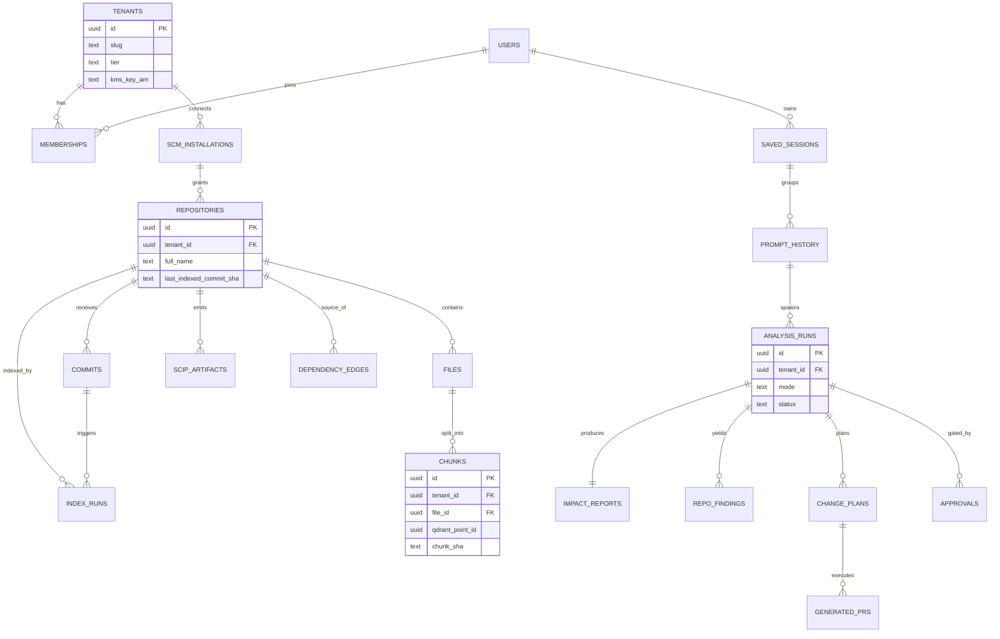
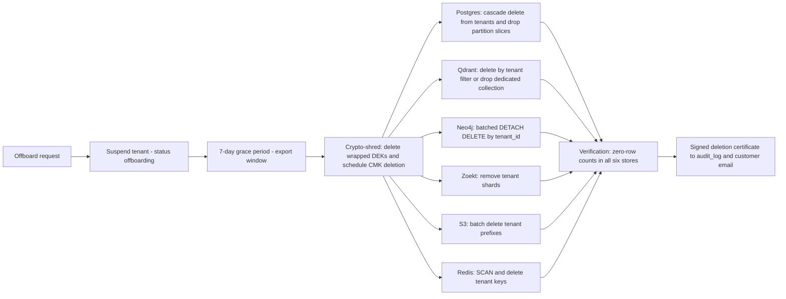

# Data Architecture & Schemas

Owner: Data/Platform. Siblings: system context in `docs/01-system-architecture.md`, retrieval pipeline in `docs/02-retrieval-and-rag.md`, graph taxonomy in `docs/03-graph-design.md`, ingestion flow in `docs/04-github-and-ingestion.md`, security/tenancy detail in `docs/08-security-and-deployment.md`, load/cost model in `docs/07-scalability-and-cost.md`.

## TL;DR

1. **Two systems of record, three derived indexes.** Postgres 16 and S3 are the only systems of record. Zoekt, Qdrant, and Neo4j are *derived* indexes, rebuildable from Postgres + S3 at any time. This single rule drives our backup, DR, and offboarding design — we back up two stores rigorously and treat the rest as rebuildable caches with snapshots as an optimization.
2. **Four stores because one breaks.** Forcing Postgres/pgvector to be the lexical index, vector store, and graph engine fails at the 1000-repo tier (~3.3M chunks per org, multi-hop traversals over 10^5–10^6 graph nodes, trigram search over 150M LOC). The comparison table below itemizes exactly what breaks and what each specialized store buys.
3. **Tenant isolation is defense-in-depth, uniform everywhere.** Every tenant-scoped Postgres table carries `tenant_id` with `FORCE ROW LEVEL SECURITY`; Qdrant queries pass through a single retrieval gateway that injects a mandatory `tenant_id` filter (per-tenant HNSW subgraphs via `payload_m`); Neo4j nodes/edges carry `tenant_id` in node-key constraints; S3 prefixes are per-tenant and encrypted with per-tenant envelope keys.
4. **No source code in Qdrant, ever — and no raw secret anywhere on a read path.** Vector payloads are metadata-only (path, lines, symbol, content hash). Chunk *text* is reconstructed at context-assembly time from **redacted**, tenant-encrypted blobs in S3 (addressed by their post-redaction hash, Redis-cached); raw git-blob objects are never stored or served, and `read_file`/`read_file_span` re-apply redaction spans on every read (§3.4). This shrinks the vector store, simplifies crypto-shredding, keeps the blast radius of a vector-store compromise to embeddings + metadata, and guarantees a committed secret cannot reach an LLM.
5. **Offboarding is a Temporal workflow with a deletion certificate.** Hard delete across Postgres, Qdrant, Neo4j, Zoekt, Redis, and S3 within a 30-day SLA (72h target), with immediate crypto-shredding by scheduling the tenant KMS key for deletion, followed by automated zero-row verification across all stores.

---

## 1. Why four stores instead of one

The founder asked for the best possible platform. At the data layer, "best" means *fewest systems of record* and *specialized derived indexes* — not one database doing four jobs badly.

### 1.1 What breaks if Postgres does everything at 1000 repos

Sizing anchors (estimate — verify): 1000 repos ≈ 150M LOC ≈ 1.5B tokens; at 30–60 lines/chunk that is ~3.3M chunks per org; a 1024-dim int8 vector is ~1KB. Multi-tenant cloud must hold hundreds of such orgs.

| Job | Postgres-only approach | What breaks at the 1000-repo tier | Specialized store | What it buys |
|---|---|---|---|---|
| Lexical/structural code search | `pg_trgm` GIN indexes over file text | GIN bloat and write amplification on every push; no symbol-aware ranking; regex over 150M LOC needs shard-parallel trigram search Postgres cannot do (estimate — verify) | **Zoekt** | Purpose-built trigram sharding, sub-second regex/identifier search at Sourcegraph scale, cheap incremental shard rebuilds |
| Semantic search | `pgvector` HNSW | Hundreds of millions of vectors across tenants on one primary; HNSW build memory and vacuum churn from chunk-level updates; no first-class int8 scalar quantization + rescoring path; scaling is vertical (estimate — verify) | **Qdrant** | int8 quantization with float32 rescore, payload-partitioned per-tenant HNSW subgraphs, horizontal sharding, self-hostable for BYOC parity |
| Org dependency graph, multi-hop | Recursive CTEs over an edge table | 4–6 hop transitive impact queries over 10^5–10^6 nodes become planner-hostile SQL; no variable-length path semantics; visualization feeds need graph-shaped queries | **Neo4j** | Cypher variable-length paths, evidence-carrying edge properties, graph algorithms; stays small by design — symbol-level edges never enter it (see `docs/03-graph-design.md`) |
| Control plane, ACLs, billing, audit | Postgres | Nothing — this is what Postgres is for | **Postgres 16** | Transactions, RLS tenant scoping, FKs, partitioning; the single source of truth for everything that must never be wrong |
| Artifacts, blobs, transcripts | `bytea` / large objects | Backup and restore time couples 100s of GB of artifacts to control-plane recovery; TOAST churn | **S3** | Content-addressed immutable storage, lifecycle rules, per-tenant KMS, 11-nines durability |

A second, underrated failure mode: **blast radius**. One giant Postgres couples restore time of the control plane (must be minutes) to restore of bulk artifacts (can be hours). Splitting systems of record (small, critical) from derived indexes (large, rebuildable) is what makes the RTO targets in §8 achievable.

### 1.2 Rebuild economics — why "derived" is credible

Re-embedding is cheap enough that the vector store never needs heroic backups (voyage-code-3 at USD 0.18/Mtok, ~10 tok/LOC — all estimates to verify). Wall time is bounded by the **aggregate** embedding-throughput cap, not per-worker rate: `docs/07-scalability-and-cost.md` (§1.1/§6.2) caps aggregate Voyage embedding at ~1M tok/min (~60 Mtok/hr, contract-dependent). Adding workers only helps *up to* that ceiling — 10 parallel workers cannot collectively exceed 1M tok/min against the Voyage API — so the figures below are computed as `tokens ÷ 1M tok-min ÷ 60`, i.e. against the aggregate cap, not `10 workers × 10 Mtok/hr`:

| Org size | LOC | Tokens | Full re-embed cost | Full re-embed wall time (aggregate cap ~1M tok/min) |
|---|---|---|---|---|
| 10 repos | 2M | ~20M | **~$3.60** | ~20 min (below the cap; ~2 workers saturate it) |
| 100 repos | 20M | ~200M | **~$36** | ~3.5 h |
| 1000 repos | 150M | ~1.5B | **~$270** | ~25 h (1.5B tok ÷ 1M tok-min ÷ 60), regardless of worker count |

Zoekt rebuilds from clone bundles in S3; Neo4j rebuilds from the `dependency_edges` relational mirror (§3, table 12) plus a re-run of deterministic extractors. Nothing in a derived store is unrecoverable.

---

## 2. Core entity model



Conventions used throughout the DDL:

- **IDs are UUIDv7**, generated application-side (time-ordered for B-tree locality; Postgres 16 has no native generator — estimate/verify against pg version at build time).
- Every tenant-scoped table has `tenant_id uuid NOT NULL` as the **first** column of composite indexes, and an RLS policy (§2.3).
- Timestamps are `timestamptz`; soft delete via `deleted_at` only where the dashboard needs undo; everything else hard-deletes.
- Enumerations are `text + CHECK` rather than native enums (cheaper migrations).

### 2.1 Postgres 16 DDL — identity, tenancy, SCM

```sql
CREATE EXTENSION IF NOT EXISTS citext;
CREATE EXTENSION IF NOT EXISTS pgcrypto;

-- ---------- Tenancy ----------
CREATE TABLE tenants (
  id               uuid PRIMARY KEY,
  slug             text NOT NULL UNIQUE,
  name             text NOT NULL,
  tier             text NOT NULL DEFAULT 'dev'
                     CHECK (tier IN ('dev','team','enterprise')),
  isolation        text NOT NULL DEFAULT 'pooled'
                     CHECK (isolation IN ('pooled','dedicated_collection','byoc')),
  kms_key_arn      text,                          -- per-tenant CMK (envelope root, §7)
  data_region      text NOT NULL DEFAULT 'us-east-1',
  retention_policy jsonb NOT NULL DEFAULT '{}',   -- per-class overrides of §8 defaults
  status           text NOT NULL DEFAULT 'active'
                     CHECK (status IN ('active','suspended','offboarding','purged')),
  created_at       timestamptz NOT NULL DEFAULT now(),
  deleted_at       timestamptz
);

-- Global identities (GitHub OAuth); NOT tenant-scoped.
CREATE TABLE users (
  id              uuid PRIMARY KEY,
  github_user_id  bigint UNIQUE,
  github_login    text,
  email           citext UNIQUE,
  display_name    text,
  avatar_url      text,
  created_at      timestamptz NOT NULL DEFAULT now(),
  last_login_at   timestamptz,
  deleted_at      timestamptz
);

CREATE TABLE memberships (
  tenant_id   uuid NOT NULL REFERENCES tenants(id) ON DELETE CASCADE,
  user_id     uuid NOT NULL REFERENCES users(id)   ON DELETE CASCADE,
  role        text NOT NULL CHECK (role IN ('owner','admin','member','viewer')),
  created_at  timestamptz NOT NULL DEFAULT now(),
  PRIMARY KEY (tenant_id, user_id)
);
CREATE INDEX idx_memberships_user ON memberships (user_id);

-- Mirror of GitHub repo permissions: a user sees only repos their GitHub
-- identity can read (canonical authorization rule). Refreshed by webhook +
-- periodic sync; Redis-cached (§5).
CREATE TABLE repo_access_mirror (
  tenant_id     uuid NOT NULL REFERENCES tenants(id) ON DELETE CASCADE,
  user_id       uuid NOT NULL REFERENCES users(id)   ON DELETE CASCADE,
  repository_id uuid NOT NULL,                       -- FK added after repositories
  permission    text NOT NULL CHECK (permission IN ('read','triage','write','maintain','admin')),
  synced_at     timestamptz NOT NULL DEFAULT now(),
  PRIMARY KEY (tenant_id, user_id, repository_id)
);

-- ---------- SCM connectivity (provider-abstracted, GitHub first) ----------
CREATE TABLE scm_installations (
  id                       uuid PRIMARY KEY,
  tenant_id                uuid NOT NULL REFERENCES tenants(id) ON DELETE CASCADE,
  provider                 text NOT NULL DEFAULT 'github'
                             CHECK (provider IN ('github','gitlab','bitbucket')),
  external_installation_id bigint NOT NULL,      -- GitHub App installation id
  account_login            text NOT NULL,
  account_type             text CHECK (account_type IN ('Organization','User')),
  permissions              jsonb NOT NULL,       -- granted-scope snapshot
  webhook_secret_ref       text NOT NULL,        -- secret-manager pointer, never plaintext
  suspended_at             timestamptz,
  created_at               timestamptz NOT NULL DEFAULT now(),
  updated_at               timestamptz NOT NULL DEFAULT now(),
  UNIQUE (provider, external_installation_id)
);

CREATE TABLE repositories (
  id                       uuid PRIMARY KEY,
  tenant_id                uuid NOT NULL REFERENCES tenants(id) ON DELETE CASCADE,
  installation_id          uuid NOT NULL REFERENCES scm_installations(id) ON DELETE CASCADE,
  provider                 text NOT NULL DEFAULT 'github',
  external_repo_id         bigint NOT NULL,
  full_name                text NOT NULL,        -- "org/repo"
  default_branch           text NOT NULL DEFAULT 'main',
  visibility               text CHECK (visibility IN ('private','internal','public')),
  primary_language         text,
  languages                jsonb,                -- {"typescript":0.62,"go":0.30,...}
  size_kb                  bigint,
  loc_estimate             bigint,
  indexing_enabled         boolean NOT NULL DEFAULT true,
  last_indexed_commit_sha  text,
  last_indexed_at          timestamptz,
  repo_card                jsonb,                -- Batch-API summary card (docs/02)
  archived                 boolean NOT NULL DEFAULT false,
  created_at               timestamptz NOT NULL DEFAULT now(),
  updated_at               timestamptz NOT NULL DEFAULT now(),
  deleted_at               timestamptz,
  UNIQUE (provider, external_repo_id)
);
CREATE INDEX idx_repos_tenant_name ON repositories (tenant_id, full_name);

ALTER TABLE repo_access_mirror
  ADD CONSTRAINT fk_ram_repo FOREIGN KEY (repository_id)
  REFERENCES repositories(id) ON DELETE CASCADE;
```

### 2.2 Postgres 16 DDL — indexing pipeline

We deliberately do **not** mirror full git history. `commits` holds only commits Atlas has *seen* (webhook heads and index-run targets); history lives in git, where it belongs.

```sql
CREATE TABLE commits (
  id            uuid PRIMARY KEY,
  tenant_id     uuid NOT NULL,
  repository_id uuid NOT NULL REFERENCES repositories(id) ON DELETE CASCADE,
  sha           text NOT NULL,
  parent_shas   text[],
  ref           text,                              -- branch that delivered it
  author_login  text,
  authored_at   timestamptz,
  message_head  text,                              -- first line only
  stats         jsonb,                             -- {files_changed, additions, deletions}
  received_at   timestamptz NOT NULL DEFAULT now(),
  UNIQUE (repository_id, sha)
);
CREATE INDEX idx_commits_repo_time ON commits (repository_id, received_at DESC);

CREATE TABLE index_runs (
  id                   uuid PRIMARY KEY,
  tenant_id            uuid NOT NULL,
  repository_id        uuid NOT NULL REFERENCES repositories(id) ON DELETE CASCADE,
  commit_id            uuid REFERENCES commits(id),
  run_type             text NOT NULL CHECK (run_type IN ('full','incremental','reembed','backfill')),
  trigger              text NOT NULL CHECK (trigger IN ('webhook','manual','schedule','install')),
  temporal_workflow_id text,
  status               text NOT NULL DEFAULT 'queued'
                         CHECK (status IN ('queued','cloning','parsing','embedding',
                                           'graph_sync','completed','failed','cancelled')),
  stats                jsonb,   -- {files_seen, chunks_new, chunks_deleted,
                                --  tokens_embedded, secrets_redacted, duration_ms}
  error                text,
  started_at           timestamptz,
  finished_at          timestamptz,
  created_at           timestamptz NOT NULL DEFAULT now()
);
CREATE INDEX idx_index_runs_repo   ON index_runs (repository_id, created_at DESC);
CREATE INDEX idx_index_runs_active ON index_runs (tenant_id, status)
  WHERE status NOT IN ('completed','failed','cancelled');

CREATE TABLE files (
  id                uuid PRIMARY KEY,
  tenant_id         uuid NOT NULL,
  repository_id     uuid NOT NULL REFERENCES repositories(id) ON DELETE CASCADE,
  path              text NOT NULL,
  language          text,
  content_sha       text NOT NULL,        -- git blob sha; identity/dedupe key ONLY.
                                          -- NOT a read path: raw git blobs are never
                                          -- stored or served (they contain unredacted
                                          -- secrets). Retained for git correlation.
  redacted_sha      text,                 -- hash of the POST-redaction bytes; keys the
                                          -- ONLY S3 blob object served to any read path
                                          -- (blobs/{redacted_sha}.zst, §6). NULL until
                                          -- the secret scan + redaction pass completes.
  redaction_spans   jsonb NOT NULL DEFAULT '[]',  -- [{start_byte,end_byte,rule}] applied
                                          -- to produce redacted_sha; re-applied on every
                                          -- read to guarantee no drift (see §3.5, docs/04)
  size_bytes        integer,
  is_generated      boolean NOT NULL DEFAULT false,
  is_vendored       boolean NOT NULL DEFAULT false,
  first_seen_commit text,
  last_seen_commit  text,
  deleted_at        timestamptz           -- gone from default branch
);
CREATE UNIQUE INDEX uq_files_live_path ON files (repository_id, path)
  WHERE deleted_at IS NULL;
CREATE INDEX idx_files_blob ON files (tenant_id, content_sha);      -- dedupe correlation
CREATE INDEX idx_files_redacted ON files (tenant_id, redacted_sha); -- read-path lookup

-- Chunk METADATA only. Vectors live in Qdrant; text is reconstructed from the
-- REDACTED S3 blob (files.redacted_sha + line range), never from a git-blob-OID
-- object -- so no secret can re-enter agent context at reconstruction time (§3.5,
-- docs/04). qdrant_point_id = uuidv5(tenant_id, chunk_sha || embedding_model ||
-- embedding_version): content-addressed dedupe means identical chunks across
-- files/commits share one vector point. chunk_sha is over the redacted text.
CREATE TABLE chunks (
  id                uuid PRIMARY KEY,
  tenant_id         uuid NOT NULL,
  repository_id     uuid NOT NULL REFERENCES repositories(id) ON DELETE CASCADE,
  file_id           uuid NOT NULL REFERENCES files(id) ON DELETE CASCADE,
  chunk_sha         text NOT NULL,        -- hash of normalized chunk text
  qdrant_point_id   uuid NOT NULL,
  symbol            text,                 -- fully-qualified symbol when applicable
  kind              text NOT NULL CHECK (kind IN ('function','class','method','block','doc','config')),
  start_line        integer NOT NULL,
  end_line          integer NOT NULL,
  token_count       integer,
  embedding_model   text NOT NULL DEFAULT 'voyage-code-3',
  embedding_version integer NOT NULL DEFAULT 1,
  created_at        timestamptz NOT NULL DEFAULT now(),
  deleted_at        timestamptz,
  UNIQUE (file_id, start_line, end_line, chunk_sha)
);
CREATE INDEX idx_chunks_point ON chunks (tenant_id, qdrant_point_id);
CREATE INDEX idx_chunks_repo  ON chunks (repository_id) WHERE deleted_at IS NULL;

-- Pointers to SCIP symbol-graph artifacts in S3 (per repo@commit).
-- Canonical decision: NOT materialized into Neo4j (two-tier graph split).
CREATE TABLE scip_artifacts (
  id            uuid PRIMARY KEY,
  tenant_id     uuid NOT NULL,
  repository_id uuid NOT NULL REFERENCES repositories(id) ON DELETE CASCADE,
  commit_sha    text NOT NULL,
  language      text NOT NULL,
  indexer       text NOT NULL,            -- e.g. 'scip-typescript@0.3.x'
  s3_key        text NOT NULL,
  size_bytes    bigint,
  symbol_count  integer,
  status        text NOT NULL DEFAULT 'pending'
                  CHECK (status IN ('pending','ready','failed')),
  created_at    timestamptz NOT NULL DEFAULT now(),
  UNIQUE (repository_id, commit_sha, language)
);

-- Relational MIRROR of org-level graph edges. Single-writer rule: the graph
-- extraction pipeline writes here first (transactional, with the index_run);
-- a sync worker projects rows into Neo4j. Neo4j is derived; this table is the
-- rebuild source and serves bulk joins (findings x edges, offboarding counts).
-- Taxonomy is canonical and defined in docs/03-graph-design.md.
CREATE TABLE dependency_edges (
  id                uuid PRIMARY KEY,
  tenant_id         uuid NOT NULL,
  src_repo_id       uuid NOT NULL REFERENCES repositories(id) ON DELETE CASCADE,
  dst_repo_id       uuid REFERENCES repositories(id) ON DELETE CASCADE,  -- NULL = external
  src_node_key      text NOT NULL,        -- Neo4j natural key (docs/03)
  dst_node_key      text NOT NULL,
  edge_type         text NOT NULL CHECK (edge_type IN
                      ('DEPENDS_ON','CALLS','EXPOSES','CONSUMES','PUBLISHES','SUBSCRIBES',
                       'READS','WRITES','OWNS','DEPLOYS','REFERENCES_ENV','SHARES_SCHEMA')),
  mechanism         text NOT NULL,        -- 'lockfile','openapi','tree-sitter-route',
                                          -- 'topic-string','k8s-manifest','llm-soft-edge',...
  confidence        real NOT NULL CHECK (confidence >= 0 AND confidence <= 1),
  evidence          jsonb NOT NULL,       -- [{"file":"a/b.ts","line":42}, ...]
  first_seen_commit text,
  last_seen_commit  text,
  created_at        timestamptz NOT NULL DEFAULT now(),
  updated_at        timestamptz NOT NULL DEFAULT now(),
  UNIQUE (tenant_id, src_node_key, dst_node_key, edge_type, mechanism)
);
CREATE INDEX idx_edges_reverse ON dependency_edges (tenant_id, dst_repo_id, edge_type);
CREATE INDEX idx_edges_forward ON dependency_edges (tenant_id, src_repo_id, edge_type);
```

### 2.3 Postgres 16 DDL — analysis, plans, PRs, governance

```sql
CREATE TABLE saved_sessions (
  id               uuid PRIMARY KEY,
  tenant_id        uuid NOT NULL REFERENCES tenants(id) ON DELETE CASCADE,
  user_id          uuid NOT NULL REFERENCES users(id),
  title            text,
  state            jsonb NOT NULL DEFAULT '{}',  -- pinned repos, filters, canvas layout
  last_activity_at timestamptz NOT NULL DEFAULT now(),
  created_at       timestamptz NOT NULL DEFAULT now(),
  deleted_at       timestamptz
);
CREATE INDEX idx_sessions_user ON saved_sessions (tenant_id, user_id, last_activity_at DESC);

CREATE TABLE prompt_history (
  id         uuid PRIMARY KEY,
  tenant_id  uuid NOT NULL REFERENCES tenants(id) ON DELETE CASCADE,
  user_id    uuid NOT NULL REFERENCES users(id),
  session_id uuid REFERENCES saved_sessions(id) ON DELETE SET NULL,
  prompt     text NOT NULL,
  intent     text,                                -- Haiku intent classification (docs/02)
  created_at timestamptz NOT NULL DEFAULT now()
);
CREATE INDEX idx_prompts_user ON prompt_history (tenant_id, user_id, created_at DESC);

CREATE TABLE analysis_runs (
  id                   uuid PRIMARY KEY,
  tenant_id            uuid NOT NULL REFERENCES tenants(id) ON DELETE CASCADE,
  prompt_id            uuid NOT NULL REFERENCES prompt_history(id),
  created_by           uuid NOT NULL REFERENCES users(id),
  mode                 text NOT NULL CHECK (mode IN ('advisory','autonomous')),
  temporal_workflow_id text,
  status               text NOT NULL DEFAULT 'queued'
                         CHECK (status IN ('queued','scoping','analyzing','synthesizing',
                                           'planning','awaiting_approval','codegen','review',
                                           'pr','completed','failed','cancelled')),
  scope                jsonb,                     -- Scope-stage candidate repos + evidence
  model_usage          jsonb,                     -- per-tier token rollups
  cost_usd             numeric(10,4),
  started_at           timestamptz,
  finished_at          timestamptz,
  created_at           timestamptz NOT NULL DEFAULT now()
);
CREATE INDEX idx_runs_tenant_time ON analysis_runs (tenant_id, created_at DESC);
CREATE INDEX idx_runs_active      ON analysis_runs (tenant_id, status)
  WHERE status NOT IN ('completed','failed','cancelled');

CREATE TABLE impact_reports (
  id                  uuid PRIMARY KEY,
  tenant_id           uuid NOT NULL,
  analysis_run_id     uuid NOT NULL UNIQUE REFERENCES analysis_runs(id) ON DELETE CASCADE,
  summary_md          text,
  affected_repo_count integer,
  risk_level          text CHECK (risk_level IN ('low','medium','high','critical')),
  graph_snapshot      jsonb,                      -- React Flow subgraph feed (docs/03)
  transcript_s3_key   text,                       -- full agent transcript (S3, §6)
  created_at          timestamptz NOT NULL DEFAULT now()
);

-- Per-repo Analysis-subagent output. Evidence is structural: every file path
-- was verified to exist at the analyzed commit before insertion (docs/05).
CREATE TABLE repo_findings (
  id              uuid PRIMARY KEY,
  tenant_id       uuid NOT NULL,
  analysis_run_id uuid NOT NULL REFERENCES analysis_runs(id) ON DELETE CASCADE,
  repository_id   uuid NOT NULL REFERENCES repositories(id),
  affected        boolean NOT NULL,
  why_md          text,
  risk            text CHECK (risk IN ('low','medium','high','critical')),
  files           jsonb NOT NULL DEFAULT '[]',    -- [{path, start_line, end_line, reason}]
  evidence        jsonb NOT NULL DEFAULT '[]',    -- file:line refs + dependency_edges ids
  confidence      real CHECK (confidence >= 0 AND confidence <= 1),
  created_at      timestamptz NOT NULL DEFAULT now()
);
CREATE INDEX idx_findings_run  ON repo_findings (analysis_run_id);
CREATE INDEX idx_findings_repo ON repo_findings (tenant_id, repository_id, created_at DESC);

CREATE TABLE change_plans (
  id              uuid PRIMARY KEY,
  tenant_id       uuid NOT NULL,
  analysis_run_id uuid NOT NULL REFERENCES analysis_runs(id) ON DELETE CASCADE,
  repository_id   uuid NOT NULL REFERENCES repositories(id),
  plan_md         text NOT NULL,   -- required changes, approach, side effects, testing, migrations
  structured      jsonb,           -- machine-readable steps for the CodeGen agent
  status          text NOT NULL DEFAULT 'draft'
                    CHECK (status IN ('draft','approved','rejected','superseded','executed')),
  created_at      timestamptz NOT NULL DEFAULT now(),
  updated_at      timestamptz NOT NULL DEFAULT now()
);
CREATE INDEX idx_plans_run ON change_plans (analysis_run_id);

CREATE TABLE generated_prs (
  id                 uuid PRIMARY KEY,
  tenant_id          uuid NOT NULL,
  change_plan_id     uuid NOT NULL REFERENCES change_plans(id) ON DELETE CASCADE,
  repository_id      uuid NOT NULL REFERENCES repositories(id),
  branch_name        text NOT NULL,
  head_sha           text,
  provider_pr_number integer,
  provider_pr_url    text,
  state              text NOT NULL DEFAULT 'branch_created'
                       CHECK (state IN ('branch_created','pushed','opened','merged','closed','failed')),
  diff_stats         jsonb,                       -- {files, additions, deletions}
  review_notes_md    text,                        -- adversarial Review-agent critique
  created_at         timestamptz NOT NULL DEFAULT now(),
  updated_at         timestamptz NOT NULL DEFAULT now()
);
CREATE INDEX idx_prs_repo ON generated_prs (tenant_id, repository_id, created_at DESC);

-- Human approval gates. Canonical rule: an approval row with decision =
-- 'approved' MUST exist before any autonomous write action executes.
CREATE TABLE approvals (
  id           uuid PRIMARY KEY,
  tenant_id    uuid NOT NULL REFERENCES tenants(id) ON DELETE CASCADE,
  subject_type text NOT NULL CHECK (subject_type IN
                 ('analysis_run','change_plan','generated_pr')),
  subject_id   uuid NOT NULL,
  action       text NOT NULL,                     -- 'execute_codegen','open_pr','push_commit'
  requested_by text NOT NULL,                     -- 'agent:<run_id>' or 'user:<uuid>'
  decided_by   uuid REFERENCES users(id),
  decision     text NOT NULL DEFAULT 'pending'
                 CHECK (decision IN ('pending','approved','rejected','expired')),
  reason       text,
  requested_at timestamptz NOT NULL DEFAULT now(),
  decided_at   timestamptz,
  expires_at   timestamptz NOT NULL
);
CREATE INDEX idx_approvals_pending ON approvals (tenant_id, requested_at)
  WHERE decision = 'pending';
CREATE INDEX idx_approvals_subject ON approvals (subject_type, subject_id);
```

### 2.4 Postgres 16 DDL — audit and metering (partitioned, append-only)

```sql
CREATE SEQUENCE audit_log_id_seq;
CREATE TABLE audit_log (
  id           bigint NOT NULL DEFAULT nextval('audit_log_id_seq'),
  tenant_id    uuid   NOT NULL,
  occurred_at  timestamptz NOT NULL DEFAULT now(),
  actor_type   text NOT NULL CHECK (actor_type IN ('user','agent','system','webhook')),
  actor_id     text,
  action       text NOT NULL,          -- dotted verbs: 'pr.opened','repo.indexed','auth.login'
  subject_type text,
  subject_id   text,
  ip           inet,
  user_agent   text,
  detail       jsonb,
  PRIMARY KEY (occurred_at, id)
) PARTITION BY RANGE (occurred_at);     -- monthly partitions via pg_partman

CREATE INDEX idx_audit_tenant ON audit_log (tenant_id, occurred_at DESC);
-- Append-only: application role gets INSERT/SELECT only.
REVOKE UPDATE, DELETE ON audit_log FROM atlas_app;

CREATE SEQUENCE usage_metering_id_seq;
CREATE TABLE usage_metering (
  id              bigint NOT NULL DEFAULT nextval('usage_metering_id_seq'),
  tenant_id       uuid   NOT NULL,
  occurred_at     timestamptz NOT NULL DEFAULT now(),
  meter           text NOT NULL CHECK (meter IN
                    ('llm_input_tokens','llm_output_tokens','embed_tokens','rerank_requests',
                     'index_minutes','storage_gb_day','analysis_runs')),
  model           text,                            -- e.g. 'claude-sonnet-4-5'
  quantity        numeric(18,4) NOT NULL,
  cost_usd        numeric(12,6),                   -- at canonical prices (docs/07)
  analysis_run_id uuid,
  index_run_id    uuid,
  PRIMARY KEY (occurred_at, id)
) PARTITION BY RANGE (occurred_at);     -- monthly partitions

CREATE INDEX idx_meter_tenant ON usage_metering (tenant_id, occurred_at DESC, meter);
-- Daily rollup table (tenant_id, day, meter, model, sum) refreshed by a
-- Temporal cron workflow feeds the dashboard and billing; raw rows expire (§8).
```

### 2.5 Row-level security — the tenant fence

Every tenant-scoped table gets the same policy. Application connections run as `atlas_app` (no BYPASSRLS) and set `app.tenant_id` **per transaction** from the authenticated principal; Temporal workers do the same from workflow input. `FORCE` makes even the table owner subject to policies.

The policy uses `current_setting('app.tenant_id')` with `missing_ok = false` — the default — **on purpose**. A missing GUC must *raise*, not silently return NULL: with `missing_ok = true` a forgotten `SET LOCAL` would evaluate `tenant_id = NULL` → NULL → not-satisfied, which fails writes closed but *silently disables the fence on reads* (every row is filtered out, masking the bug) and, worse, removes the hard-error backstop that catches a query issued with no tenant context at all. Failing loud converts a whole class of "forgot to scope the connection" bugs from silent-wrong into a caught exception.

```sql
-- Template applied to every table carrying tenant_id:
DO $$
DECLARE t text;
BEGIN
  FOREACH t IN ARRAY ARRAY[
    'memberships','repo_access_mirror','scm_installations','repositories','commits',
    'index_runs','files','chunks','scip_artifacts','dependency_edges','saved_sessions',
    'prompt_history','analysis_runs','impact_reports','repo_findings','change_plans',
    'generated_prs','approvals','audit_log','usage_metering']
  LOOP
    EXECUTE format('ALTER TABLE %I ENABLE ROW LEVEL SECURITY', t);
    EXECUTE format('ALTER TABLE %I FORCE  ROW LEVEL SECURITY', t);
    -- missing_ok = false: an unset app.tenant_id RAISES (fail-loud), never NULL.
    EXECUTE format(
      'CREATE POLICY tenant_isolation ON %I
         USING (tenant_id = current_setting(''app.tenant_id'', false)::uuid)
         WITH CHECK (tenant_id = current_setting(''app.tenant_id'', false)::uuid)', t);
  END LOOP;
END $$;

-- Repo-level visibility (mirror of GitHub permissions) is enforced in the API
-- layer against repo_access_mirror; RLS is the tenant fence, not the repo fence.
```

**Pooled-connection discipline (mandatory, since a pooler reuses connections across tenants).** `SET LOCAL` scopes the GUC to the current transaction and is undone at `COMMIT`/`ROLLBACK`; a plain `SET` persists on the physical connection and would leak the previous tenant's id into the next borrower's request — RLS would then *accept* the cross-tenant write because the GUC is non-null and matches an attacker-influenced value. The fence therefore depends on connection hygiene the policy alone cannot enforce:

1. **Every tenant-scoped statement runs inside an explicit transaction that begins with `SET LOCAL app.tenant_id = $1`.** No autocommit statements against tenant tables; the data-access layer wraps even single reads in `BEGIN … SET LOCAL … <stmt> … COMMIT`. This also guarantees `missing_ok = false` has a value to read.
2. **Plain `SET app.tenant_id` (session-scoped) is forbidden in application code** and blocked in review/CI (grep gate); only `SET LOCAL` is permitted. Temporal activities follow the same rule — the tenant id comes from workflow input, set with `SET LOCAL` at the top of each activity's transaction.
3. **Reset on connection return.** The pooler issues `DISCARD ALL` (or at minimum `RESET app.tenant_id`) when a connection is returned to the pool, so no GUC can survive into the next checkout even if a transaction was mishandled. Server-side statement/idle-in-transaction timeouts back this up.

**Test (isolation regression suite):** borrow a pooled connection, set tenant A via `SET LOCAL`, commit; then, on the same physical connection, attempt an `INSERT`/`UPDATE` of a tenant-B row *without* re-setting the GUC — assert it raises (missing GUC) or is rejected by `WITH CHECK`, and assert a stale session-level `SET` cannot survive the pool's reset. A green result proves neither a forgotten scope nor a leaked GUC can produce a cross-tenant write.

### 2.6 Hot queries → indexes

| Hot path | Query shape | Index that serves it |
|---|---|---|
| Reverse impact bulk join | "all edges into repo X of type EXPOSES/CALLS" | `idx_edges_reverse (tenant_id, dst_repo_id, edge_type)` |
| Qdrant hit → metadata hydrate | point ids → chunk rows → file paths | `idx_chunks_point (tenant_id, qdrant_point_id)` |
| Dashboard run list | latest runs per tenant | `idx_runs_tenant_time (tenant_id, created_at DESC)` |
| Approval inbox | pending approvals per tenant | partial `idx_approvals_pending` |
| Incremental indexing | live file by path at repo | partial `uq_files_live_path` |
| Blob dedupe check | "have we seen this content_sha" | `idx_files_blob (tenant_id, content_sha)` |
| Billing rollup | tenant × month × meter | `idx_meter_tenant` + monthly partitions |

---

## 3. Qdrant collection design

### 3.1 Shared collection vs collection-per-tenant

| Dimension | Shared collection + `tenant_id` payload partitioning | Collection per tenant |
|---|---|---|
| RAM overhead | One set of segments; per-tenant HNSW subgraphs via `payload_m` | Fixed per-collection overhead × thousands of tenants; small tenants waste RAM |
| Tenant count scaling | Thousands of tenants fine (payload index) | Qdrant degrades with very high collection counts (estimate — verify) |
| Isolation strength | Filter-enforced (gateway-injected, mandatory) | Physical; stronger story for compliance |
| Noisy neighbor | Shared segment IO; mitigated by shard keys | Fully isolated |
| Offboarding | `delete_by_filter tenant_id` | Drop collection — instant |
| Per-tenant tuning | Global HNSW params | Per-tenant quantization/HNSW possible |
| Ops burden | One collection to monitor/upgrade | Fleet management of collections |

**Chosen default (canonical): shared collection with `tenant_id` payload partitioning for dev/team tiers; dedicated collections for enterprise tier** (and dedicated Qdrant clusters entirely in BYOC/single-tenant VPC — see `docs/08-security-and-deployment.md`). Sensitive payload fields are app-side encrypted with the tenant DEK (§7); vectors themselves carry no source text (§3.3).

### 3.2 Collection parameters

```yaml
# Collection: chunks_v1   (version suffix enables blue/green re-embedding)
vectors:
  size: 1024                 # voyage-code-3
  distance: Cosine
  on_disk: true              # float32 originals on disk, used only for rescoring
quantization_config:
  scalar:
    type: int8               # ~4x RAM reduction; ~1KB/vector in RAM
    quantile: 0.99
    always_ram: true
hnsw_config:
  m: 0                       # no global graph -- multitenant pattern
  payload_m: 16              # per-tenant HNSW subgraph (estimate -- verify against
                             # current Qdrant multitenancy guidance)
  ef_construct: 128
optimizers_config:
  default_segment_number: 8
payload_indexes:
  tenant_id:   { type: keyword, is_tenant: true }
  repo_id:     { type: keyword }
  language:    { type: keyword }
  kind:        { type: keyword }
  branch:      { type: keyword }
  embedding_version: { type: integer }
search_defaults:
  ef: 96
  rescore: true              # int8 candidates rescored against float32 on disk
```

### 3.3 Payload schema — metadata only, never source text

```typescript
/** Qdrant point payload. Point id = uuidv5(tenant_id, chunk_sha + model + version).
 *  NO source code text: chunk text is reconstructed at context-assembly time
 *  from the REDACTED S3 blob (files.redacted_sha + line range), Redis-cached --
 *  never from a raw git-blob object. Rationale: smaller store, cleaner
 *  crypto-shredding, smaller breach blast radius, and no path by which a
 *  committed secret can reach agent context (secret scan runs BEFORE this). */
interface ChunkPayload {
  tenant_id: string;          // partition key (is_tenant)
  repo_id: string;
  file_path: string;          // app-side encrypted with tenant DEK at rest
  language: 'javascript' | 'typescript' | 'python' | 'java' | 'go'
          | 'rust' | 'csharp' | 'cpp' | 'php' | 'ruby' | 'other';
  kind: 'function' | 'class' | 'method' | 'block' | 'doc' | 'config';
  symbol?: string;            // fully-qualified; encrypted like file_path
  start_line: number;
  end_line: number;
  content_sha: string;        // git blob sha: identity/dedupe only, NOT a read pointer
  redacted_sha: string;       // -> blobs/{redacted_sha}.zst, the ONLY reconstruction source
  chunk_sha: string;          // hash over redacted chunk text
  branch: string;             // default branch only in v1
  embedding_version: number;  // bump on model/chunker change; blue/green swap
}
```

**Sizing** (estimate — verify): a 1000-repo org ≈ 3.3M points → ~3.3GB int8 in RAM + ~13GB float32 on disk + ~2GB payload/indexes. A 10-repo org ≈ 44k points ≈ 45MB RAM — hundreds of small tenants fit on one modest node. Access rule: agents and API never talk to Qdrant directly; the retrieval gateway (see `docs/02-retrieval-and-rag.md`) injects the `tenant_id` filter and repo-ACL filter (from `repo_access_mirror`) on every query — a missing filter is a hard error, not an open query.

### 3.4 The read-path redaction contract — no secret reaches an LLM

Redaction in the vector store alone is insufficient: the vector store holds no text, so anything that reconstructs text (context assembly) or reads a file directly (the `read_file` / `read_file_span` ground-truth tools of `docs/02` §7 and `docs/05` §4.2) is a second, independent path a committed secret could travel. Both paths must be closed at the *storage* layer, not by a boolean flag.

**Invariant: the only bytes any read path can serve are post-redaction bytes.** Enforced by three rules, all rooted in the schema above:

1. **Single blob store, redacted-addressed.** There is exactly one object family the reconstruction and file-read code may open: `blobs/{redacted_sha}.zst`. A raw git-blob-OID object (`blobs/{content_sha}.zst`) is never written — the ingest pipeline runs the secret scan and redaction pass *before* it computes `redacted_sha` and uploads (`docs/04` §3.5). `content_sha` survives only as a dedupe/identity key and is not a valid S3 read pointer; there is no code path that constructs an S3 key from `content_sha`.
2. **Re-apply spans on every read, don't trust the flag.** `files.redaction_spans` persists the exact `(start_byte,end_byte,rule)` list per (file, commit). `read_file` / `read_file_span` fetch the redacted blob AND re-apply the recorded spans before returning, so even a stale or partially-rebuilt blob cannot leak: redaction is idempotent and always re-run at the boundary. Context assembly slices its chunk text from the same redacted blob using `chunk_sha` (computed over redacted text) as an integrity check — a mismatch fails the assembly closed rather than falling back to raw content.
3. **Crypto scope.** Redacted blobs are still tenant-encrypted (SSE-KMS + tenant DEK, §7); redaction removes secrets, encryption protects the remaining source. The two controls are independent and both required.

**Eval (blocking, in the retrieval/ingestion suite of `docs/02`/`docs/04`):** plant a known credential in a fixture repo, index it, then assert **zero** secret bytes are returned by (a) `read_file_span` over the planted line range, (b) fully assembled agent context for a query that retrieves that chunk, and (c) the raw Qdrant payload. The eval must cover all three surfaces — a green Qdrant-only check is exactly the false negative this section exists to prevent. This is the mechanism behind the "secret-to-LLM leak is impossible" claim in `docs/04` §3.5 and threat T-11 in `docs/08`.

---

## 4. Neo4j property schemas

The node/edge taxonomy (Org, Repo, Service, Deployable, Package, APIEndpoint, MessageTopic, DataStore, Table, EnvVar, ConfigKey, Team, Person, Domain; DEPENDS_ON … SHARES_SCHEMA) and its extraction pipelines are owned by `docs/03-graph-design.md` — not duplicated here. This document owns only the *storage contract*:

- Every node and relationship carries `tenant_id`; every relationship carries `{mechanism, confidence, evidence, first_seen_commit, last_seen_commit}` mirroring `dependency_edges` columns 1:1.
- **Single-writer rule:** only the graph-sync worker writes Neo4j, projecting from `dependency_edges` after the owning `index_run` commits in Postgres. Neo4j is derived; on drift or disaster, wipe the tenant subgraph and re-project (minutes, not hours — the org graph is 10^5–10^6 nodes at 1000 repos).
- Node identity constraints (Neo4j 5, Enterprise for node-key constraints; on Community we store a precomputed `_uid = tenant_id + ':' + key` with a UNIQUE constraint):

```cypher
CREATE CONSTRAINT repo_node_key IF NOT EXISTS
FOR (r:Repo) REQUIRE (r.tenant_id, r.key) IS NODE KEY;

CREATE CONSTRAINT service_node_key IF NOT EXISTS
FOR (s:Service) REQUIRE (s.tenant_id, s.key) IS NODE KEY;
-- ...one per node label; evidence lists stored as JSON strings on relationships,
-- authoritative copies in dependency_edges.evidence (jsonb).
```

- `impact_reports.graph_snapshot` (Postgres) holds the frozen React Flow subgraph for each report so the dashboard renders historical reports without querying live Neo4j state that has since changed.

---

## 5. Redis key design

Redis is cache and coordination only — **zero durable state** (no backup; `maxmemory-policy allkeys-lru` on the cache DB, `noeviction` on the coordination DB, logically separated).

| Key pattern | Type | Purpose | TTL |
|---|---|---|---|
| `sess:{session_id}` | hash | Dashboard auth session | 24h sliding |
| `authz:{tenant_id}:{user_id}` | set | Cached repo-ACL (readable repo ids) from `repo_access_mirror`; this is the access-control cache defined in `docs/08` §3.2 (same key, single TTL across the package) | 300s |
| `retr:{tenant_id}:{query_hash}` | string (json, DEK-encrypted) | Fused retrieval result cache post-RRF pre-rerank | 15m |
| `blob:{content_sha}` | string (zstd) | Hot file-blob text for context assembly | 6h, LRU |
| `rl:gh:{installation_id}` | token bucket | GitHub API budget vs 5000 req/hr + secondary limits | 1h window |
| `rl:llm:{tenant_id}:{model}` | token bucket | Per-tenant LLM TPM/RPM budget | 1m window |
| `wh:dedupe:{delivery_guid}` | string (SETNX) | Webhook delivery dedupe before SQS enqueue | 24h |
| `stream:run:{analysis_run_id}` | stream | Agent progress events for SSE fan-out (MAXLEN ~10k) | 6h after run end |
| `lock:index:{repository_id}` | string | Indexing mutex (heartbeat-renewed by Temporal activity) | 30m |
| `card:{tenant_id}:{repo_id}` | string (json) | Repo-card cache for context assembly | 24h |
| `gviz:{tenant_id}:{view_hash}` | string (json) | Architecture-visualization subgraph cache | 1h |

---

## 6. S3 layout and lifecycle

Three buckets per environment; per-tenant prefixes; SSE-KMS with the tenant CMK (§7) on all tenant data; versioning on; Object Lock (compliance mode) only on `atlas-prod-audit` exports for enterprise.

| Bucket / prefix | Contents | Lifecycle rule |
|---|---|---|
| `atlas-{env}-code/{tenant}/bundles/{repo}/{sha}.bundle` | Bare/blobless clone bundles from sandboxed indexers (`docs/04`) | Keep objects tagged `retain=latest`; expire untagged after 14d; noncurrent versions after 7d |
| `atlas-{env}-code/{tenant}/blobs/{sha2}/{redacted_sha}.zst` | **Redacted** file blobs, addressed by their post-redaction hash — the sole source of chunk text and of `read_file`/`read_file_span` output (§3.3, §3.4). Raw git-blob-OID objects are **never** written to S3: the secret scan + redaction pass runs before this object exists (`docs/04` §3.5), so the stored bytes contain no secret. | Expire when unreferenced by `files` (app-driven batch delete, weekly); no time-based rule |
| `atlas-{env}-code/{tenant}/scip/{repo}/{sha}/{lang}.scip` | SCIP symbol-graph artifacts (pointer rows in `scip_artifacts`) | Keep `retain=latest` per repo+lang; expire others after 90d |
| `atlas-{env}-runs/{tenant}/transcripts/{run_id}/` | Full agent transcripts, tool traces (linked from `impact_reports`) | Standard 30d → Glacier IR → expire at 90d (tenant-overridable) |
| `atlas-{env}-runs/{tenant}/exports/{export_id}/` | User-requested report/data exports | Expire 30d |
| `atlas-{env}-backups/postgres/` | WAL archive + base backups (platform key, not tenant keys) | WAL 14d; base backups 35d; monthly to Glacier, 12 months |
| `atlas-{env}-backups/neo4j/`, `.../qdrant/` | Nightly/weekly snapshots of derived stores | 7d rolling |

---

## 7. Encryption: per-tenant KMS envelope

- Each tenant gets a KMS CMK (`tenants.kms_key_arn`) at team/enterprise tier; dev-tier tenants get a per-tenant **data key (DEK)** derived and wrapped under a pooled tier CMK (see Pushback #2 — envelope semantics and crypto-shredding are identical, only the root differs).
- **S3:** SSE-KMS with the tenant CMK on all tenant prefixes.
- **Postgres:** storage-level encryption (EBS/RDS) plus app-side field encryption with the tenant DEK for high-sensitivity columns: `prompt_history.prompt`, `impact_reports.summary_md`, `repo_findings.why_md/files/evidence`, `change_plans.plan_md/structured`, `generated_prs.review_notes_md`. Metadata columns stay plaintext for indexing.
- **Qdrant:** disk encryption + app-side DEK encryption of `file_path`/`symbol` payload fields; vectors are embeddings of code (treated as sensitive derived data — covered by crypto-shredding, since without Postgres/S3 they are unlinkable to source).
- **Crypto-shredding:** deleting a tenant's wrapped DEKs and scheduling CMK deletion renders every remaining ciphertext unreadable across all stores and backups — this is what lets us honor deletion even for data inside immutable backups.
- LLM traffic runs under a zero-data-retention agreement; Bedrock in BYOC (`docs/08-security-and-deployment.md`).

---

## 8. Data lifecycle, retention, offboarding, DR

### 8.1 Retention defaults (tenant-overridable via `tenants.retention_policy`)

| Data class | Default retention | Rationale |
|---|---|---|
| `prompt_history`, `saved_sessions` | 400 days | Dashboard history; long enough for annual workflows |
| `impact_reports`, `repo_findings`, `change_plans` | 400 days | Referenced by dashboards and PRs |
| Agent transcripts (S3) | 90 days | Debug/eval value decays fast; large |
| `index_runs`, `commits` | 180 days | Operational forensics |
| `audit_log` | 400 days hot; enterprise export to customer-owned bucket for 7y | Compliance (`docs/08`) |
| `usage_metering` raw | 13 months (drop partitions) | Billing disputes; rollups kept indefinitely |
| Clone bundles / SCIP non-latest | 14d / 90d (S3 lifecycle, §6) | Rebuildable from origin |

### 8.2 Tenant offboarding — hard delete across every store



Implemented as a Temporal `TenantOffboardWorkflow` (durable, resumable — a half-finished delete resumes, never silently stops). **SLA: hard delete complete within 30 days of request; target 72h.** Crypto-shredding at step D makes data unreadable immediately even though physical deletion of backups follows lifecycle expiry. The verification step runs count queries per store and fails the workflow (paging on-call) on any nonzero result.

### 8.3 Backups and DR

| Store | Role | Backup | RPO | RTO | Notes |
|---|---|---|---|---|---|
| Postgres | System of record | Continuous WAL archiving + PITR; daily cross-region snapshot | ≤ 5 min | ≤ 1 h (targets — verify in game-day) | Small by design (~5–10GB/1000-repo tenant, estimate) |
| S3 | System of record | Versioning; cross-region replication for enterprise tenants | ~0 | ~0 | Native durability |
| Qdrant | Derived | Daily snapshot | 24 h | ≤ 4 h restore; re-embed fallback is throughput-bound (~25 h for a 1000-repo org at the ~1M tok/min aggregate cap, ~$270, §1.2) | Snapshot is an optimization, not a dependency; restore-from-snapshot is the fast path, re-embed is the last resort |
| Neo4j | Derived | Nightly dump | 24 h | ≤ 2 h re-project from `dependency_edges` | Rebuild preferred over restore |
| Zoekt | Derived | None | n/a | ≤ 4 h shard rebuild from bundles | Fully derived |
| Redis | Cache | None | n/a | minutes | Cold caches self-heal |

Region-loss DR: restore Postgres cross-region snapshot, repoint S3 replicas, re-project Neo4j, and **restore the Qdrant snapshot as the primary path** (≤ 4 h); re-embedding is the fallback only when a snapshot is unavailable, and it is bounded by the ~1M tok/min aggregate embedding cap (§1.2) — ~25 h for a full 1000-repo org even with many workers, which is why we re-embed *hot tenants first* (prioritized by `last_activity_at`) so active tenants recover in minutes-to-hours while the long tail backfills. Full-platform RTO target: 8h assumes snapshot restore, not full re-embed; degraded-mode (search-only, no agents) target: 2h (estimates — verify in DR drills; runbooks in `docs/08-security-and-deployment.md`).

---

## Pushback

**1. Founder assumption challenged — "optimize for the best possible platform, not simplicity" does not mean more databases.** Every additional store multiplies the offboarding matrix, encryption integration, backup surface, and tenant-isolation proofs — §8.2 already fans out to six systems. We explicitly rejected a fifth store class in v1: no ClickHouse/Timescale for `usage_metering` (partitioned Postgres + rollups is fine until ~10^9 rows/year, estimate — verify), no OpenSearch for logs (Grafana/Loki per canon), no dedicated feature store. The "best possible platform" at the data layer is *two* systems of record and ruthless derivability — if a future store cannot be rebuilt from Postgres + S3, it does not get added.

**2. Per-tenant KMS CMKs for every tenant is over-engineered at the dev tier.** Canon mandates per-tenant envelope encryption — implemented above. But a dedicated AWS CMK per tenant costs $1/month plus API-request charges and runs into account key quotas at tens of thousands of self-serve tenants (estimate — verify current KMS limits). Our refinement keeps envelope semantics per tenant while pooling only the *root*: dev tier = per-tenant DEK wrapped under a shared tier CMK; team/enterprise = dedicated CMK. Crypto-shredding still works identically (delete the tenant's wrapped DEKs). If compliance review rejects the pooled root for any tier, flipping dev tenants to dedicated CMKs is a key-rewrap migration, not a schema change.

**3. int8 quantization may be leaving 3–4x RAM on the table.** Canon specifies int8 (implemented). Binary quantization with float32 rescoring can cut RAM a further ~8x vs float32 (~32x total) at some recall cost that reranking (voyage rerank-2.5) may fully absorb — for code embeddings this is unproven either way (estimate — verify with the retrieval eval suite in `docs/02-retrieval-and-rag.md` before touching production). The schema is ready: `embedding_version` in both Postgres and Qdrant payloads enables a blue/green quantization migration with zero downtime. Revisit at the 100-tenant mark when vector RAM becomes a top-3 infra line item (`docs/07-scalability-and-cost.md`).

**4. The `dependency_edges` relational mirror is a dual-write risk — managed, not eliminated.** Canon requires the mirror; the drift hazard is real. Mitigation is architectural: Postgres is written transactionally with the owning `index_run`, Neo4j is *only* written by the projection worker, and a nightly Temporal reconciliation job diffs edge counts per tenant and re-projects on mismatch. If reconciliation pages more than monthly, the fix is to demote Neo4j to a nightly-rebuilt read replica of the mirror, not to add write paths.
