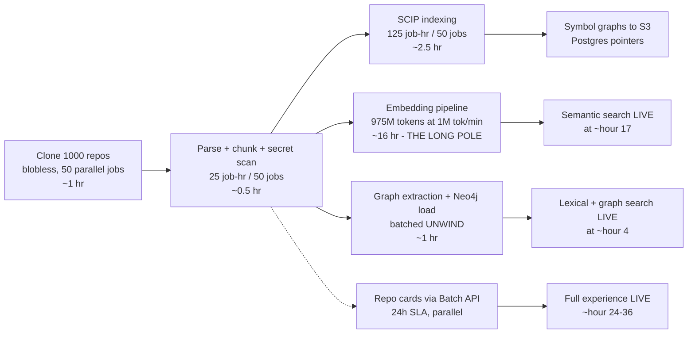

# Scalability & Cost Model

> Document 07 of 10. Depends on: [01-system-architecture.md](01-system-architecture.md) (component inventory), [02-retrieval-and-rag.md](02-retrieval-and-rag.md) (retrieval pipeline and token budget), [04-github-and-ingestion.md](04-github-and-ingestion.md) (indexing pipeline), [05-ai-and-agents.md](05-ai-and-agents.md) (agent stages and model routing), [06-data-architecture.md](06-data-architecture.md) (store schemas). Security/tenancy cost implications: [08-security-and-deployment.md](08-security-and-deployment.md). Pricing strategy built on these floors: [09-roadmap-team-risks-competition.md](09-roadmap-team-risks-competition.md).

**All dollar figures in this document are estimates to verify against current price sheets and cloud calculators before any external commitment. Anchor prices used throughout: Sonnet 4.5 $3/$15 per Mtok in/out; Opus 4.5 $5/$25; Haiku 4.5 $1/$5; voyage-code-3 $0.18/Mtok; prompt-cache write = 1.25x input price, cache read = 0.1x input price (estimate — verify).**

## TL;DR

1. **LLM tokens are the business, infra is a rounding error.** At the 1000-repo tier, LLM spend (~$25.6k/mo estimated) is ~81% of total cost; all storage and compute combined is ~$6k/mo. Every optimization dollar goes to token efficiency first: prompt caching (-38% on heavy runs), model routing (all-Opus would be ~3x), then everything else.
2. **A fully-worked org-wide impact analysis touching 12 repos costs ~$5.25 in Advisory mode and ~$9.65 in Autonomous mode with prompt caching ON (~$8.40 / ~$16.03 without).** These per-run costs, not storage, set the pricing floor.
3. **Initial indexing at 1000 repos is embedding-throughput-bound, not GitHub-bound.** 1.5B code tokens at an assumed 1M tok/min sustained embedding throughput is ~25 hours single-pipe (~16h after 35% content-addressed dedupe). GitHub REST calls for onboarding are only ~10.5k, or ~2.1 hours against the 5000/hr limit — cloning uses the git protocol and does not consume REST quota (verify).
4. **Context windows cannot brute-force this problem and never will.** 150M LOC is ~1.5B tokens: 1,500x a 1M-token window, and even one hypothetical 1.5B-token prompt would cost ~$4,500 in input tokens at Sonnet prices. The four-primitive retrieval architecture in [02-retrieval-and-rag.md](02-retrieval-and-rag.md) is the only viable design, not an optimization.
5. **Seat-only pricing is structurally broken for this product; the floor is hybrid seat + metered credits.** Per-user monthly cost varies 100x between a Q&A-only user (~$1.50/mo) and a daily autonomous-run user (~$290/mo). Floor: seat fee covering infra + Q&A quota, heavy runs metered at ≥1.8x LLM cost (org-wide advisory ≥ $9 retail, autonomous ≥ $17).

---

## 1. Load Model and Assumptions

Everything below derives from these assumptions. Each is stated so it can be falsified with production telemetry (per-tenant cost metering feeds back into this model — see §10).

### 1.1 Canonical anchors

| Anchor | Value | Source |
|---|---|---|
| Tokens per LOC | ~10 | canon |
| Chunk size | 30–60 lines; **45 LOC avg → ~450 tok/chunk** | canon + midpoint |
| Vector | 1024-dim int8 ≈ 1 KB + payload | canon |
| Bytes per source line | ~40 B (estimate — verify per-language) | assumption |
| GitHub App REST limit | 5,000 req/hr/installation + secondary limits | canon |
| Embedding throughput | 1M tok/min sustained, **aggregate across the whole Voyage contract** — a per-key ceiling, not per-worker; N embed workers share this one budget (estimate — verify Voyage rate tier; contract-dependent) | assumption |
| Dedupe rate (vendored code, forks, generated files) | 10% / 20% / 35% at S/M/L (estimate — verify with real orgs) | assumption |

### 1.2 The three tiers

| Metric | Tier S — 10 repos | Tier M — 100 repos | Tier L — 1000 repos |
|---|---:|---:|---:|
| LOC | 2M | 20M | 150M (long tail of small repos) |
| Source bytes | ~80 MB | ~800 MB | ~6 GB |
| Code tokens (10/LOC) | 20M | 200M | 1.5B |
| Chunks (45 LOC avg) | ~44k | ~440k | ~3.3M |
| Unique chunks after dedupe | ~40k | ~350k | ~2.2M |
| Qdrant vectors (1/unique chunk) | ~40k | ~350k | ~2.2M |
| Files (~125 LOC/file avg) | ~16k | ~160k | ~1.2M |
| Neo4j org-graph nodes | ~4k | ~40k | ~150k |
| Neo4j org-graph edges | ~15k | ~180k | ~2M |
| Active developers | 1–5 | ~20 | ~500 |
| Pushes/day | ~15 | ~150 | ~2,500 |

The Neo4j numbers matter: they confirm the canonical two-tier graph split. The **org graph stays at 10^5–10^6 nodes even at tier L** because symbol-level edges live in SCIP artifacts on S3 (Postgres pointers), not in Neo4j. Materializing symbol edges would be billions of rows — see [03-graph-design.md](03-graph-design.md). The ~150k tier-L node count is the per-type buildup owned by [03-graph-design.md](03-graph-design.md) §1.1 (1,000 Repo + ~1,200 Service + ~50,000 APIEndpoint + ~50,000 EnvVar/ConfigKey + ~30,000 external Package + long tail ≈ 1.5×10^5); this document conforms to that owner rather than re-deriving it.

### 1.3 Query workload (analyses per day)

Four query classes with very different cost profiles (per-class costs derived in §5):

| Class | Description | Est. cost/run (cached) | Tier S /day | Tier M /day | Tier L /day |
|---|---|---:|---:|---:|---:|
| Q&A | Retrieval-grounded chat, single-shot, Haiku/Sonnet routed | $0.05 | 12 | 100 | 3,000 |
| Scoped analysis | 1–3 repos, mini pipeline | $1.00 | 2 | 15 | 300 |
| Org-wide impact (Advisory) | ~12 repos, full pipeline | $5.25 | 0.3 | 3 | 40 |
| Autonomous change | ~12 repos scoped, ~8 modified, codegen + review + PR | $9.65 | 0.1 | 1.5 | 20 |

Tier L usage = 6 Q&A + light heavy-run usage per dev per day across 500 devs — deliberately conservative on heavy runs because they are metered (see §9). All mixes are estimates to verify against beta telemetry.

---

## 2. Storage Sizing per Store

Derivations use §1 counts. Provisioned sizes include ~2x headroom for growth, indexes, and WAL/compaction.

### 2.1 Sizing table

| Store | What it holds | Tier S | Tier M | Tier L | Sizing math (tier L shown) |
|---|---|---:|---:|---:|---|
| **Postgres 16** | Tenants, repo/file/chunk metadata, SCIP pointers, analyses, approvals, audit, usage metering | ~1 GB (prov 10 GB) | ~10 GB (prov 25 GB) | ~80 GB (prov 150 GB) | 2.2M chunk rows x ~600 B = 1.3 GB; 1.2M file rows; usage_events ~100k rows/day x 200 B ≈ 7 GB/yr; audit log similar; indexes ~2x |
| **Qdrant** | 1024-dim int8 vectors + payload | RAM ~60 MB, disk ~0.2 GB | RAM ~0.5 GB, disk ~1.6 GB | RAM ~3.3 GB, disk ~10 GB | RAM = 2.2M x (1 KB int8 + ~150 B HNSW links + ~300 B hot payload); disk = f32 originals 2.2M x 4 KB + payload |
| **Neo4j** | Org graph: 14 node types, 12 edge types, evidence props | ~30 MB | ~350 MB | ~4 GB store; 16 GB RAM node | 2M edges x ~1.5 KB (with top-5 evidence inline) + ~150k nodes x 1 KB + indexes; page cache ≥ store size |
| **S3** | SCIP artifacts per repo@commit (retain 4 snapshots), repo cards, analysis reports, embedding parquet backups, Temporal archives | ~1 GB | ~10 GB | ~60 GB | SCIP ≈ 1.5x source x 4 snapshots = 36 GB; backups ~9 GB; reports/cards small. At $0.023/GB-mo this is **$1.40/mo — S3 is never the problem** |
| **Zoekt** | Trigram index over source | ~250 MB | ~2.5 GB | ~18 GB | ~3x source bytes (estimate — verify); serve fully mmapped: RAM ≈ index size for p95 |
| **Redis** | Retrieval/blob cache, SSE run buffers, permission mirror, rate-limit counters | 1 GB | 4 GB | 16 GB | dominated by `retr:` fused-result cache (15m TTL) + `blob:` hot-file text (6h LRU) + `stream:run:` SSE buffers (MAXLEN ~10k), per [06-data-architecture.md](06-data-architecture.md) §5. The permission mirror is negligible: a 500-user x 1000-repo read-ACL set is ~tens of KB as bitmaps, single-digit MB as UUID sets — ~0.0004% of the budget, not the driver. 16 GB is a 2x-headroom provision matching the cache.r6g.large x3 in [08-security-and-deployment.md](08-security-and-deployment.md) §8.1 |

Evidence lists longer than 5 entries live in Postgres, not on Neo4j edge properties — hub edges (a shared internal library DEPENDS_ON'd by 400 repos) would otherwise carry multi-MB properties ([03-graph-design.md](03-graph-design.md)).

### 2.2 Why every store stays boring

The only store with a real scaling story is Qdrant — and only at **platform** scale, not per-tenant scale (§6.4). A single 1000-repo tenant needs ~3.3 GB of vector RAM. This is the payoff of three canonical decisions: structure-aware chunking (one vector per function/class, not per line), content-addressed dedupe, and keeping symbol graphs out of Neo4j.

---

## 3. Initial Full Index: Wall Time and Cost

### 3.1 Pipeline stages and throughput assumptions

Per [04-github-and-ingestion.md](04-github-and-ingestion.md): blobless partial clone → tree-sitter parse + chunk → secret scan → SCIP index → embed → graph extraction → repo card (Batch API). All in ephemeral gVisor-sandboxed jobs, orchestrated by Temporal.

Throughput assumptions (all estimates — verify on reference repos):

| Stage | Throughput | Tier L job-time |
|---|---|---:|
| Clone (blobless) | ~20 MB/s per job | ~5 min total across fleet |
| tree-sitter parse + chunk + gitleaks scan | ~100k LOC/min/core | ~25 job-hr |
| SCIP indexing | ~20k LOC/min/job (language-dependent: scip-java slow, scip-typescript medium) | ~125 job-hr |
| Embedding (voyage-code-3) | 1M tok/min **aggregate API throughput** | 975M tok post-dedupe → **~16 hr** |
| Graph extraction + Neo4j batched load | see §6.5 | <1 hr |
| Repo cards (Sonnet via Batch API) | 24h SLA, typically faster | parallel, non-blocking |

### 3.2 Critical path at 1000 repos



**Staged availability is a product decision that falls out of the math**: Zoekt + Neo4j are queryable within ~4 hours; semantic search lands at ~17 hours; repo cards complete the experience by hour 24–36. The dashboard shows per-stage progress rather than a 30-hour spinner.

### 3.3 Initial index: wall time and cost per tier

| | Tier S | Tier M | Tier L |
|---|---:|---:|---:|
| Wall time to lexical+graph live | ~15 min | ~1.5 hr | ~4 hr |
| Wall time to fully indexed | ~40 min | ~4–5 hr | **~24–36 hr** |
| Embedding cost (post-dedupe tokens x $0.18/Mtok) | $3.20 | $29 | $175 |
| Repo cards (Sonnet Batch: ~40k tok in, 2k out per repo at 50% batch discount ≈ $0.075/repo) | $0.75 | $7.50 | $75 |
| Sandbox compute (~200 pod-hr at tier L, c7g.2xlarge spot ~$0.12/hr, estimate) | ~$2 | ~$8 | ~$50 |
| **Total one-time onboarding cost** | **~$6** | **~$45** | **~$300** |

Onboarding a 1000-repo enterprise costs ~$300 — trivially absorbed into any enterprise contract. **Wall time, not cost, is the onboarding constraint**, and it is embedding-throughput-bound (§6.2).

### 3.4 Steady-state incremental daily cost

Commit-diff-driven incremental indexing with content-addressed chunk dedupe means daily cost scales with *changed* lines, not corpus size:

| Component | Math (tier L) | Tier S /day | Tier M /day | Tier L /day |
|---|---|---:|---:|---:|
| Re-embedding changed chunks | 2,500 pushes x ~150 changed LOC x 10 tok = 3.75M tok x $0.18/M | <$0.01 | $0.04 | $0.68 |
| SCIP re-index (debounced per repo) | ~600 repo-reindexes x 2 min = 20 pod-hr spot | ~$0 | $0.20 | $2 |
| Repo card refresh (weekly cadence, Batch API) | 1000 cards/wk x $0.075 / 7 | $0.10 | $1 | $11 |
| Graph re-extraction + Neo4j delta writes | batched, changed edges only | ~$0 | ~$0 | ~$1 |
| **Total incremental** | | **~$0.15** | **~$1.30** | **~$15** |
| **Monthly indexing steady state** | | **~$5–10** | **~$40–90** | **~$450–500** |

---

## 4. Target Query Latencies

Latency targets are **tier-independent by design** — that is the entire point of pre-built indexes. A 12-repo analysis takes the same wall time at a 10-repo org and a 1000-repo org; only candidate-selection input differs, and that is bounded by the token budget in [02-retrieval-and-rag.md](02-retrieval-and-rag.md).

| Interaction | p50 target | p95 target | Dominated by |
|---|---:|---:|---|
| Zoekt query | 80 ms | 300 ms | mmap page faults on cold shards |
| Qdrant ANN top-100 with tenant/repo payload filter | 30 ms | 120 ms | HNSW + filter cardinality |
| Neo4j 2-hop neighborhood | 50 ms | 250 ms | hub-node fan-out |
| SCIP symbol lookup (S3 fetch + parse, warm cache) | 100 ms | 800 ms | S3 GET on cold artifact |
| Full retrieval fan-out (4 primitives parallel + RRF) | 350 ms | 1.2 s | slowest primitive |
| Rerank 100 candidates (voyage rerank-2.5) | 200 ms | 500 ms | API round-trip |
| Q&A first token (SSE) | 1.5 s | 4 s | retrieval + prompt-cache warm-up |
| Scoped analysis (1–3 repos) end-to-end | 60 s | 180 s | Sonnet agent loops |
| Org-wide impact, Advisory, ~12 repos | 6 min | 15 min | parallel analysis + Opus synthesis |
| Autonomous run (incl. build + test in sandbox) | 20 min | 60 min | codegen loops + CI-like test runs |

SLO ownership and alerting via the OTel/Grafana stack; per-stage agent latency traced in Langfuse ([05-ai-and-agents.md](05-ai-and-agents.md)).

---

## 5. LLM Token Model: Fully Worked Example

**Scenario: "Add organization-level permissions" — org-wide impact analysis, Scope selects 12 candidate repos, 8 ultimately require changes. Pipeline per [05-ai-and-agents.md](05-ai-and-agents.md).**

Token counts are cumulative across agent-loop turns (each turn re-sends the growing context — this is exactly what prompt caching attacks). All figures estimates — verify against Langfuse traces.

### 5.1 Without prompt caching

| # | Stage | Model | Loop shape | Tok in (cum) | Tok out | Cost |
|---|---|---|---|---:|---:|---:|
| 1 | Intent classification | Haiku | 1 call | 2k | 0.2k | $0.003 |
| 2 | Scope (lead agent, graph/search tools) | Opus | 8 turns, ctx 8k→30k | 120k | 6k | $0.75 |
| 3 | Per-repo Analysis x12 | Sonnet | 6 turns each, ctx →25k | 90k x12 | 5k x12 | $4.14 |
| 4 | Cross-repo Synthesis | Opus | 1–2 calls over 12 findings docs + graph summaries | 60k | 8k | $0.50 |
| 5 | Per-repo Planning x12 | Opus | 3 turns each | 30k x12 | 4k x12 | $3.00 |
| | **Advisory total** | | | **~1.6M** | **~124k** | **$8.39** |
| 6 | CodeGen x8 (sandboxed checkout, build+test loops) | Sonnet | ~10 turns each | 200k x8 | 15k x8 | $6.60 |
| 7 | Review agent x8 (adversarial diff critique) | Sonnet | 1–2 calls | 25k x8 | 3k x8 | $0.96 |
| 8 | PR agent x8 (branch, commit, PR body) | Haiku | 1 call | 5k x8 | 1k x8 | $0.08 |
| | **Autonomous total** | | | **~3.6M** | **~276k** | **$16.03** |

Sample line item (stage 3, per repo): 90k x $3/M + 5k x $15/M = $0.27 + $0.075 = **$0.345**; x12 = $4.14.

### 5.2 With prompt caching

Cache pricing: write = 1.25x input, read = 0.1x input (Opus read $0.50/M, Sonnet read $0.30/M — estimate, verify). In an N-turn loop, only *new* tokens are written; the accumulated prefix is read at 0.1x. System prompt + tool definitions (~5k tok) hit cache across every call in every run.

| # | Stage | Cached math | Cost cached | vs uncached |
|---|---|---|---:|---:|
| 1 | Intent | negligible | $0.003 | — |
| 2 | Scope | write 30k x $6.25/M + read 90k x $0.50/M + out $0.15 | $0.38 | -49% |
| 3 | Analysis x12 | per repo: write 25k x $3.75/M + read 65k x $0.30/M + out $0.075 = $0.188 | $2.26 | -45% |
| 4 | Synthesis | repo-card prefix cache-hits ~30k read; 30k write; out $0.20 | $0.40 | -20% |
| 5 | Planning x12 | per repo: write 12k x $6.25/M + read 18k x $0.50/M + out $0.10 = $0.184 | $2.21 | -26% |
| | **Advisory total** | | **$5.25** | **-37%** |
| 6 | CodeGen x8 | per repo: write 45k x $3.75/M + read 155k x $0.30/M + out $0.225 = $0.44 | $3.52 | -47% |
| 7 | Review x8 | mostly fresh diff content, small win | $0.80 | -17% |
| 8 | PR x8 | negligible | $0.08 | — |
| | **Autonomous total** | | **$9.65** | **-40%** |

**Headline: $5.25 Advisory / $9.65 Autonomous per org-wide run (cached), vs $8.39 / $16.03 uncached.** Prompt caching is worth ~$6.40 per autonomous run — at tier L's 20 runs/day that alone is ~$3.8k/mo.

Derived per-class costs used in the workload model (§1.3): Q&A ≈ $0.05 (15k ctx, Haiku/Sonnet routed, cached); scoped 1–3-repo analysis ≈ $1.00 (same pipeline, 2 analysis workers, short synthesis).

---

## 6. Ranked Bottleneck Analysis

Ranked by (probability of hitting it) x (severity when hit). Math shown for each.

### 6.1 #1 — LLM tokens per analysis (recurring cost + latency ceiling)

The math is §5. At tier L: $853/day ≈ **$25.6k/mo, 81% of total platform cost for that tenant**. This is the bottleneck that shapes pricing (§9), model routing, and the token budget in [02-retrieval-and-rag.md](02-retrieval-and-rag.md). It is also the latency floor: an Opus synthesis over 60k input tokens streams for tens of seconds no matter how fast retrieval is. Controls: caching (done), routing (done), context assembly budgets (done), per-tenant spend caps + metering (§10).

### 6.2 #2 — Embedding throughput at initial index (onboarding wall clock)

- Tier L: 1.5B raw tokens, ~975M post-dedupe.
- At 1M tok/min aggregate (estimate — verify contract tier): 975 min ≈ **16.3 hr**; at a default-tier 300k tok/min it becomes **~54 hr** — the difference between "onboard over a weekend" and "onboard over a week of retries."
- Mitigations, in order: negotiate throughput tier before first enterprise onboarding; dedupe before embedding (35% at L is free wall-clock); prioritize repos by recent-commit activity so the org's hot 20% is semantically searchable in the first ~3 hours; staged availability (§3.2) so the product is usable while embedding drains.
- GitHub is *not* the constraint here; see #4.
- **Canonical throughput reconciliation:** 1M tok/min aggregate is the single number this cost model, the onboarding wall-time (§3), and the DR re-embed RTO all use. It is an *aggregate per-key contract cap*, so multi-worker fan-out (§6.6 embed queue) must sum to ≤1M tok/min — 10 workers each doing 1.67M tok/min is not a valid configuration, it violates the same one contract. Any sibling figure that assumes a different sustained rate (e.g. a 2M tok/min provider tier in [04-github-and-ingestion.md](04-github-and-ingestion.md), or a 10 Mtok/hr/worker × 10 workers = 1.67M tok/min rebuild rate in [06-data-architecture.md](06-data-architecture.md) §1.2) must reconcile to this cap or explicitly document a negotiated higher tier; at 1M tok/min the tier-L full re-embed is ~1.5B/1M ≈ 25 h (≈16 h after dedupe), not 15 h, and the 100-repo Phase-1 embed is ~200 min, not 100.

### 6.3 #3 — Qdrant memory at platform scale (40M+ vectors)

Per-tenant Qdrant is small (§2). The shared multi-tenant cluster is not: ~100 mixed-size cloud tenants sum to **~40M vectors** (fleet-wide anchor also used in [08-security-and-deployment.md](08-security-and-deployment.md) §8.1). Buildup: ~60 tier-S at ~40k = 2.4M; ~25 tier-M at ~350k = 8.75M; ~13 large near-L tenants at ~2.2M = ~28.6M; long tail ~0.5M → **~40M**. The 40M is driven by the near-L tenants, so it holds only if roughly a dozen tenants approach tier L; on the §1.3 assumption that heavy tenants are rare, expect the lower end (~12–15M) and rescale the RAM table and node counts proportionally. Both endpoints are provisioning inputs to verify against real tenant mix.

| | float32, no quantization | int8 quantized (canon) |
|---|---:|---:|
| Vector RAM | 40M x 4 KB = 160 GB | 40M x 1 KB = 40 GB (originals on disk, mmap, used for rescoring) |
| HNSW links RAM | 40M x ~150 B = 6 GB | 6 GB |
| Total RAM (before replication) | ~170–180 GB | ~50 GB |
| Node footprint (x2 replication) | ~6x r7g.4xlarge ≈ $4.9k/mo | ~2–3x r7g.2xlarge ≈ $1.5k/mo |

**int8 quantization saves ~120 GB RAM ≈ $2–3.4k/mo at 40M vectors (estimate — verify)**, with recall recovered by disk-based rescoring of the f32 originals (recall target ≥0.97 — measured in the retrieval evals of [02-retrieval-and-rag.md](02-retrieval-and-rag.md), never assumed). Payload-filtered tenant isolation and shard-per-large-tenant placement per [06-data-architecture.md](06-data-architecture.md).

### 6.4 #4 — GitHub API rate limits (5,000 req/hr/installation)

Initial-index REST budget at tier L (cloning uses git smart HTTP — **it does not consume REST quota**; estimate — verify):

| Call class | Calls |
|---|---:|
| Per repo: get repo, languages, branch protection, CODEOWNERS contents, collaborators (~2 pages), topics/teams | ~10 x 1000 = 10,000 |
| Org-level: installation repo listing (10 pages), org members (5 pages), 50 teams x 2 | ~500 |
| **Total** | **~10,500 → ~2.1 hr at 5,000/hr** |

Comfortably inside onboarding wall time, so **not** an onboarding bottleneck. The real constraints: (a) **secondary limits** — concurrency caps and per-minute point budgets (estimate — verify current values); keep a token-bucket client at ≤80 concurrent with Temporal-level rate limiting; (b) **permission-mirror freshness** — re-listing collaborators for 1000 repos costs ~2k calls, so we cache the permission mirror in Redis (15-min TTL) and invalidate via `member`/`team`/`repository` webhooks instead of polling ([08-security-and-deployment.md](08-security-and-deployment.md)); (c) autonomous-mode content-creation mutation limits — at 20 PRs/day, irrelevant.

### 6.5 #5 — Neo4j write amplification during initial index

Tier L initial load: ~150k node MERGEs + ~2M edge MERGEs, each edge ~1.5 KB with `{mechanism, confidence, evidence[<=5], first_seen_commit, last_seen_commit}`.

- **Naive (one tx per edge):** 2M commits x ~2 ms fsync ≈ 66 min of pure fsync, serialized — plus lock contention on hub nodes (a shared internal library node touched by hundreds of concurrent DEPENDS_ON MERGEs) pushes this into hours.
- **Batched (canon):** `UNWIND $rows ... MERGE` at 10k rows/tx = 200 transactions, hub-node batches grouped to a single writer → **<10 min**. Physical write volume ≈ 3 GB logical x 3–5x (index maintenance on 4 edge indexes + tx log) ≈ 10–15 GB — trivial on NVMe.
- **Incremental trap:** naively bumping `last_seen_commit` on every edge of a repo per push = ~2k property writes x 600 repo-reindexes/day = 1.2M writes/day of pure churn. Instead: write only *changed* edges on push; sweep `last_seen_commit` in one daily batched pass. Details in [03-graph-design.md](03-graph-design.md).

### 6.6 #6 — Temporal task backlog during 1000-repo onboarding

Activity census for tier-L onboarding: 1000 clone + 1000 parse + 1000 SCIP + ~1,100 embed-batch activities (2.2M chunks / ~2k chunks per activity) + 1000 graph-load + 1000 repo-card ≈ **~6–7k activities, ~70k state transitions** with retries. A small self-hosted Temporal cluster sustains hundreds of transitions/sec (estimate — verify) → the *server* clears this in minutes. The real risks are worker-side:

1. **External rate-limit coupling** — embedding activities must not outrun the Voyage contract tier. One task queue per external dependency with a queue-level rate limit:

```typescript
// Embed worker: one activity = one Voyage call of ~128 chunks (~58k tokens).
// 1M tok/min contract tier => ~17 calls/min => 0.29 activities/sec ceiling.
const embedWorker = await Worker.create({
  taskQueue: 'embed-batch',
  maxConcurrentActivityTaskExecutions: 8,
  maxTaskQueueActivitiesPerSecond: 0.29, // estimate — derive from contracted tok/min
});
// SCIP workers: CPU-bound gVisor pods, autoscaled on schedule-to-start latency.
const scipWorker = await Worker.create({
  taskQueue: 'scip-index',
  maxConcurrentActivityTaskExecutions: 2, // per pod; KEDA scales pods 0..50
});
```

2. **Worker starvation** — autoscale gVisor indexer pods (0→50) on Temporal schedule-to-start latency SLO (>30 s p95 scales out), spot instances, per [08-security-and-deployment.md](08-security-and-deployment.md).
3. **Fairness** — a tier-L onboarding must not starve incremental indexing for existing tenants: separate task queues (`onboard-*` vs `incremental-*`) with reserved worker capacity for the latter.

---

## 7. Infra Footprint per Tier

Tier S and M run on the shared multi-tenant cloud (costs below are the *allocated share*); tier L is shown as a dedicated single-tenant VPC (the enterprise deployment shape from [08-security-and-deployment.md](08-security-and-deployment.md)). Instance pricing: estimate — verify.

| Component | Tier S (share) | Tier M (share) | Tier L (dedicated VPC) |
|---|---|---|---|
| EKS control plane | shared | shared | 1 ($73/mo) |
| Core service nodes (API, Temporal, Zoekt, Qdrant, Neo4j) | shared | shared | 3x m7g.2xlarge + 2x r7g.xlarge (Zoekt) + 2x r7g.xlarge (Qdrant) + 1x r7g.xlarge (Neo4j) |
| Indexer/codegen sandbox fleet | shared spot pool | shared spot pool | avg 6x c7g.2xlarge spot, burst 50 |
| Postgres | shared RDS w/ RLS | shared RDS w/ RLS | db.r6g.2xlarge multi-AZ |
| Redis | shared | shared | 2x cache.r7g.large |
| Observability (Grafana stack + Langfuse) | shared | shared | dedicated stack |
| **Est. monthly infra** | **~$40** | **~$350** | **~$5,500** |

---

## 8. Cost Tables: Monthly Totals per Tier

All figures estimates — verify. LLM figures assume prompt caching ON and canonical model routing.

| Monthly cost | Tier S | Tier M | Tier L |
|---|---:|---:|---:|
| Infra (allocated / dedicated) | $40 | $350 | $5,500 |
| LLM (workload from §1.3 x per-class costs from §5) | $155 | $1,505 | $25,590 |
| Embedding + incremental indexing (§3.4) | $10 | $90 | $500 |
| One-time onboarding (amortize yr 1) | $6 | $45 | $300 |
| **Total monthly (steady state)** | **~$205** | **~$1,945** | **~$31,600** |
| LLM share of total | 76% | 77% | **81%** |

Daily LLM detail (tier L): 3,000 Q&A x $0.05 + 300 scoped x $1.00 + 40 org-wide x $5.25 + 20 autonomous x $9.65 = $150 + $300 + $210 + $193 = **$853/day**.

---

## 9. Unit Economics and Pricing Floor

### 9.1 Unit costs

| Unit | Tier S | Tier M | Tier L |
|---|---:|---:|---:|
| Cost / repo / month | $20.50 | $19.50 | $31.60 |
| Cost / active dev / month | $41 (5 devs) | $97 (20 devs) | $63 (500 devs) |
| Cost / Q&A query | $0.05 | $0.05 | $0.05 |
| Cost / scoped analysis | ~$1.00 | ~$1.00 | ~$1.00 |
| Cost / org-wide advisory run | ~$5.25 | ~$5.25 | ~$5.25 |
| Cost / autonomous run | ~$9.65 | ~$9.65 | ~$9.65 |

Note the shape: per-run costs are **flat across tiers** (retrieval makes analysis cost proportional to repos *touched*, not repos *indexed*), while per-dev cost varies with usage mix. Tier M's $97/dev is higher than tier L's $63/dev purely because its assumed heavy-run mix is richer per capita — this is a usage variable, not a scaling law.

### 9.2 Why seat-only pricing is broken, and the floor

Per-user monthly LLM cost spans ~$1.50 (Q&A-only user) to ~$290 (a dev running one autonomous org-wide change every workday). That is ~100x variance under one seat price — the heavy users destroy margin and the light users subsidize them until they churn. **The pricing floor is therefore structural, not just numeric: hybrid seat + metered credits.**

| Floor component | Basis | Floor (est.) |
|---|---|---:|
| Seat fee (covers infra share + Q&A quota + scoped-analysis quota, target ≥75% margin on this slice) | infra ~$8–12/dev + Q&A ~$1.50–5/dev | **$25–40/seat/mo** |
| Org-wide advisory run (metered) | $5.25 cost x ≥1.8 markup | **≥$9/run** |
| Autonomous run (metered) | $9.65 cost x ≥1.8 markup | **≥$17/run** |
| Enterprise (tier L, all-in): cost $31.6k/mo → at 60–65% blended gross margin | $31.6k / 0.35–0.40 | **≥$80–90k/mo ≈ $160–180/seat/mo equivalent, or platform fee + committed credit pool** |

Sanity: a tier-M startup on this floor pays 20 x $30 + (3 x $9 + 1.5 x $17) x 30 ≈ **$2.0k/mo** against $1.95k cost — floor, not target; target list prices and competitive positioning belong to [09-roadmap-team-risks-competition.md](09-roadmap-team-risks-competition.md). Anything below these numbers is selling dollars for ninety cents.

### 9.3 Margin sensitivity

Gross margin is a function of exactly three levers: cache hit rate, heavy-run mix, and model routing discipline. A 10-point drop in cache hit rate on agent loops moves tier-L LLM cost by ~$2.5–4k/mo; one enterprise team discovering "run autonomous mode in a cron job" moves it by more. **Per-tenant spend caps and per-run cost display in the dashboard are launch requirements, not nice-to-haves** (metering schema in §10).

---

## 10. Cost Metering (implementation hook)

Every LLM/embedding call emits a usage event; Temporal activity wrappers make this unavoidable rather than best-effort. Langfuse traces carry the same run_id for drill-down.

```sql
CREATE TABLE usage_events (
  id               BIGINT GENERATED ALWAYS AS IDENTITY PRIMARY KEY,
  tenant_id        UUID        NOT NULL,
  run_id           UUID,                      -- analysis/agent run; NULL for indexing
  stage            TEXT        NOT NULL,      -- intent|scope|analysis|synthesis|planning|codegen|review|pr|qa|embed|repo_card
  model            TEXT        NOT NULL,      -- claude-opus-4-5 | claude-sonnet-4-5 | claude-haiku-4-5 | voyage-code-3 | rerank-2.5
  tokens_in        BIGINT      NOT NULL DEFAULT 0,
  tokens_out       BIGINT      NOT NULL DEFAULT 0,
  tokens_cache_write BIGINT    NOT NULL DEFAULT 0,
  tokens_cache_read  BIGINT    NOT NULL DEFAULT 0,
  cost_usd_micros  BIGINT      NOT NULL,      -- computed at ingest from current price sheet
  created_at       TIMESTAMPTZ NOT NULL DEFAULT now()
);
CREATE INDEX ON usage_events (tenant_id, created_at);
-- Row-level security per 06-data-architecture.md; daily rollups feed billing + the spend-cap enforcer.
```

```typescript
// Enforced before every heavy-class run (05-ai-and-agents.md gate #0):
interface SpendCheck {
  tenantId: string;
  runClass: 'qa' | 'scoped' | 'org_wide' | 'autonomous';
  estimatedCostUsd: number;      // from §5 per-class table, refined by scope size
  monthToDateUsd: number;        // rollup of usage_events
  capUsd: number;                // per-tenant contract cap
  verdict: 'allow' | 'require_approval' | 'block';
}
```

---

## 11. Optimization Levers, Ranked by ROI

Ranked by (dollars saved at tier L) / (engineering cost + quality risk). The top two are already canonical baseline — listed with their counterfactuals to show what turning them off would cost.

| # | Lever | Mechanism | Savings at tier L (est.) | Cost/risk | Verdict |
|---|---|---|---:|---|---|
| 1 | **Prompt caching** | 0.1x reads on agent-loop prefixes, system prompts, tool defs, repo cards | ~$15.7k/mo (uncached tier-L LLM ≈ $41.3k vs $25.6k) | Near-zero; requires stable prompt prefix ordering | Baseline, enforce in SDK wrapper |
| 2 | **Model routing** | Haiku classify, Sonnet analyze/codegen, Opus only plan/synthesize | All-Opus counterfactual ≈ 2.5–3x LLM cost → >$30k/mo avoided | Quality risk if routed too low; eval-gated per [05-ai-and-agents.md](05-ai-and-agents.md) | Baseline |
| 3 | **int8 quantization** | 4x vector RAM reduction, disk-rescored recall | $2–3.4k/mo platform-wide at 40M vectors (§6.3) | Recall risk — measured, not assumed | Baseline |
| 4 | **Content-addressed chunk dedupe** | Skip embedding/storing vendored code, forks, generated files | 35% of tier-L tokens: ~$95 per onboarding + 35% Qdrant/Zoekt footprint + less retrieval noise | Hash pass is nearly free | Highest ROI per line of code |
| 5 | **Batch API** | 50% discount on offline work (repo cards, refresh sweeps) | ~$37 per tier-L onboarding + ~$165/mo refresh | 24h SLA — only for non-interactive paths | Use for all offline summarization |
| 6 | **Repo-card caching** | Stable cards = cache-hit prefixes in every Scope/Synthesis call + no regeneration | ~$50–100/mo direct; bigger win is latency + cache hit rate feeding lever #1 | Staleness — bounded by weekly refresh + change-triggered invalidation | Do it; measure hit rate |

Deliberately absent: fine-tuned small models for analysis (premature — no eval corpus yet, revisit per [09-roadmap-team-risks-competition.md](09-roadmap-team-risks-competition.md) Phase 3) and self-hosted embedding models (throughput help, but operational cost exceeds the $500/mo tier-L embedding bill it would replace).

---

## 12. Why Context Windows Cannot Replace Retrieval

The recurring investor/founder question: "models will have 10M-token windows soon — why build all this retrieval machinery?" The arithmetic is unforgiving:

| Corpus | Tokens | vs 1M-token window | Hypothetical single-prompt cost at Sonnet $3/Mtok input |
|---|---:|---:|---:|
| One large repo (500k LOC) | 5M | 5x over | $15/query |
| Tier S (2M LOC) | 20M | 20x over | $60/query |
| Tier M (20M LOC) | 200M | 200x over | $600/query |
| Tier L (150M LOC) | **1.5B** | **1,500x over** | **$4,500/query** |

Even granting a science-fiction 1.5B-token window: at ~$4,500 of input per query (uncached), multi-minute prefill latency, and well-documented long-context attention degradation, brute force loses to retrieval on cost, latency, *and* accuracy simultaneously. Caching does not rescue it — the corpus changes with every push, invalidating the prefix.

**What fits in a real window (our context assembly budget: 30–60k tokens typical, 150k max, per [02-retrieval-and-rag.md](02-retrieval-and-rag.md)):**
- A curated repo-card set: ~2k tokens/card → ~25–75 cards per prompt. Note that even the *summaries* of a tier-L org (1000 cards ≈ 2M tokens) exceed a 1M window — the Scope agent must retrieve *which cards* to read, which is itself a retrieval problem.
- Graph neighborhood summaries (Neo4j 2-hop, ~5–10k tokens) and the top reranked chunks (~20–40 chunks).

**What never fits:** full source of any org beyond a hobby project; the symbol graph (billions of SCIP occurrences at tier L); the commit history. The four-primitive retrieval design is not an optimization over a bigger window — it is the only architecture in which cost per query is proportional to the *question* instead of the *corpus*. Window growth makes retrieval *better* (bigger assembled contexts, fewer round-trips), not obsolete.

---

## Pushback

Canon is implemented above exactly as specified. Three challenges, two aimed at founder assumptions, one at a canonical routing choice — with numbers.

### P1 — "One architecture must serve all three" is true; one *business* does not (founder assumption)

The architecture scales down fine. The economics do not. A tier-S individual power user costs ~$155–205/mo (§8) — above the entire price of every prosumer dev tool on the market. At a typical $20–50/mo indie price point, every active individual user is sold at a loss, and the loss scales with engagement — the worst possible shape. The individual tier is justified as a funnel (design partners, word of mouth, land-and-expand into their employers) but it must ship with hard credit caps on org-wide and autonomous runs from day one, and finance should model it as marketing spend, not revenue. Recommendation: cap tier-S at N heavy runs/month included, metered beyond; revisit only if per-token prices fall ~5x.

### P2 — "Optimize for the best possible platform, not for simplicity" has a per-tenant floor cost (founder assumption)

The five-store stack (Postgres + Qdrant + Neo4j + Zoekt + S3) plus Temporal is the right call at tiers M and L, and every component is self-hostable for BYOC — but a dedicated deployment of it has a ~$450+/mo floor before a single token is spent, ~11x the allocated multi-tenant share at tier S ($40). The consequence is architectural: **aggressive multi-tenancy is a solvency requirement, not a deployment option.** Any future decision that weakens multi-tenant density (per-tenant Neo4j instances, per-tenant Temporal namespaces on dedicated nodes) must clear a bar of ~$400/mo/tenant in equivalent value. The canon already supports this (RLS in Postgres, payload-filtered Qdrant, shared Zoekt shards) — this pushback is a warning against eroding it for operational convenience.

### P3 — Opus for *per-repo* planning is the single most expensive routing choice; canon should narrow it (canonical decision, alternative argued)

Canon routes "planning" to the Opus tier. In the worked example, per-repo Planning x12 costs $2.21 cached — **42% of the $5.25 Advisory run** — while cross-repo Synthesis, the genuinely global reasoning step, costs $0.40. Per-repo planning operates inside one repo's context with the synthesis report as guidance; it is structurally the same difficulty class as per-repo Analysis, which canon already trusts to Sonnet. Routing per-repo Planning to Sonnet (keeping Opus for Synthesis and for plans the Review agent flags as contested) drops the stage to ~$0.55 and the Advisory run to ~$3.60 (-31%), and tier-L monthly LLM by ~$2.5k (estimate). Proposal: keep canon at launch, run the Sonnet-planning arm as an offline eval in Langfuse ([05-ai-and-agents.md](05-ai-and-agents.md)), and switch when plan-quality evals show parity. If the evals show parity and we don't switch, we are donating a third of our per-run margin to sentiment.

---

## Cross-Reference Index

| Topic | Document |
|---|---|
| Retrieval pipeline, token budgets, retrieval evals | [02-retrieval-and-rag.md](02-retrieval-and-rag.md) |
| Two-tier graph split, edge schema, batched Cypher loads | [03-graph-design.md](03-graph-design.md) |
| Indexing pipeline stages, webhooks, incremental diffs | [04-github-and-ingestion.md](04-github-and-ingestion.md) |
| Agent pipeline, model routing, approval gates, evals | [05-ai-and-agents.md](05-ai-and-agents.md) |
| Store schemas, RLS, S3 layout, lifecycle | [06-data-architecture.md](06-data-architecture.md) |
| Tenancy tiers, gVisor sandboxes, K8s/BYOC deployment | [08-security-and-deployment.md](08-security-and-deployment.md) |
| Pricing strategy above the floor, competitive benchmarks | [09-roadmap-team-risks-competition.md](09-roadmap-team-risks-competition.md) |
