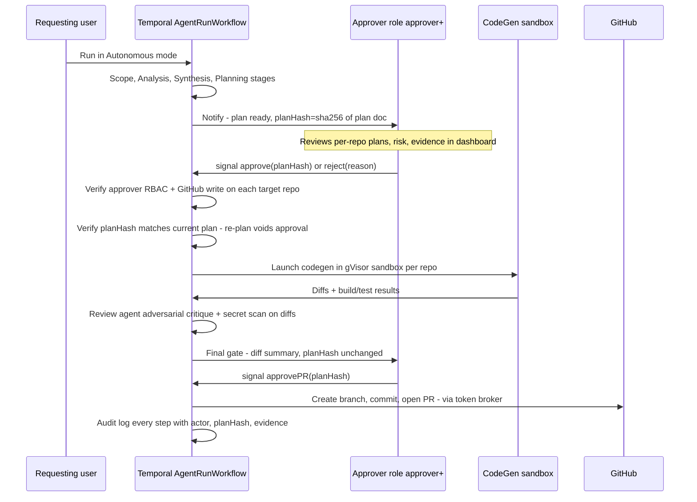
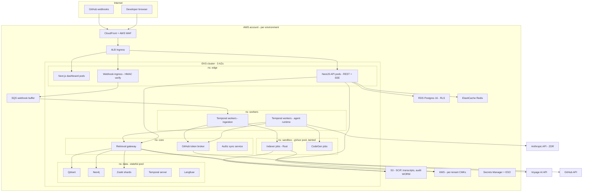
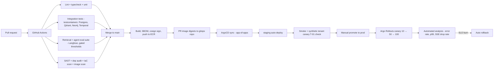
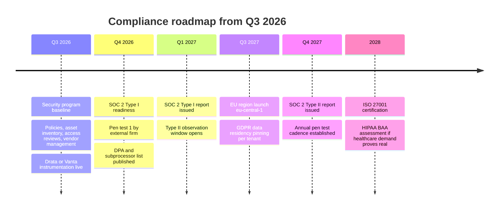

# Security, Deployment & Infrastructure

> Document 08 of 10. Cross-references: system architecture in [01-system-architecture.md](01-system-architecture.md), data layouts and encryption schemas in [06-data-architecture.md](06-data-architecture.md), sizing/load model in [07-scalability-and-cost.md](07-scalability-and-cost.md), agent safety mechanics in [05-ai-and-agents.md](05-ai-and-agents.md), ingestion pipeline in [04-github-and-ingestion.md](04-github-and-ingestion.md).

## TL;DR

1. **Repo content is hostile input, end to end.** Indexer and codegen jobs run in gVisor-sandboxed, egress-blocked, ephemeral pods with a two-phase fetch/execute split so that no GitHub token ever coexists with executing repo code. Prompt injection is mitigated by content demarcation, per-stage tool allowlists, plan-hash-bound human approval gates, and PR-only writes.
2. **GitHub is the authorization root.** A user can only query or see repos their GitHub identity can read. Permissions are mirrored via webhook-driven invalidation plus 6-hour reconciliation, cached in Redis (TTL 300s), and enforced at a single retrieval gateway that injects allowed `repo_id` sets into every Qdrant filter, Zoekt query, Neo4j predicate, and SCIP lookup. Fail-closed **per grant**: a `(user, repo)` grant older than the 900s TTL is dropped and re-fetched, so a silently-revoked grant is exposed for ≤ 900s, not the tenant-wide 24h outage bound.
3. **Raw code is ephemeral; only encrypted derived artifacts persist.** Clones and sandbox checkouts live only inside job pods and are shredded on completion. Chunks, vectors, graph, and SCIP artifacts persist under per-tenant KMS envelope encryption. The LLM API operates under a zero-data-retention agreement with an explicit contractual no-training commitment.
4. **Multi-tenant cloud is the default tenancy tier.** Per-tenant cryptographic isolation + RLS + gateway-enforced filters are sufficient for individuals and startups; single-tenant VPC/BYOC (LLM via AWS Bedrock) serves enterprises. On-prem/air-gapped stays Phase 3 and is explicitly de-scoped until the air-gapped model problem is solved (see Pushback).
5. **One deployment machine: EKS + Terraform + GitHub Actions CI + ArgoCD GitOps + Argo Rollouts canary.** Three environments (dev/staging/prod), the same manifests for cloud and BYOC (BYOC = a Terraform-driven instance of the same stack in the customer's AWS account), progressive delivery with automatic rollback on SLO burn.

---

## 1. Threat Model

### 1.1 Assets

| Asset | Where it lives | Sensitivity | Persistence |
|---|---|---|---|
| Raw source code (clones, sandbox checkouts) | Ephemeral pod scratch volumes only | Critical — the customer's crown jewels | Minutes to hours; shredded at job end |
| GitHub App private key | AWS KMS asymmetric key (sign-only, non-exportable) | Critical — signs JWTs for every installation | Permanent, never leaves KMS |
| GitHub installation tokens | Redis (encrypted, TTL < 1h expiry), issued on demand | Critical — read access to all tenant repos | ≤ 1 hour |
| User OAuth tokens | Postgres, encrypted with tenant DEK | High — identity + repo visibility resolution | Until revoked |
| Derived indexes (chunks, vectors, Zoekt shards, Neo4j graph, SCIP artifacts) | Qdrant / Zoekt PVs / Neo4j / S3 | High — code is reconstructable from chunks; partially from vectors | Long-lived, envelope-encrypted |
| LLM transcripts, prompt history, impact reports | Postgres + S3 | High — contain code excerpts and org architecture | Long-lived, tenant-scoped retention policy |
| Customer-provided credentials (optional integrations) | Dedicated Secrets Manager path `/atlas/tenants/{tenant_id}/customer/*` | Critical | Until rotated/deleted |
| Audit logs | Postgres append-only + S3 Object Lock (WORM) | Medium — required for forensics and compliance | 1 year hot, 7 years cold (estimate — verify against compliance requirements) |

### 1.2 Actors

| Actor | Capability | Primary motivation |
|---|---|---|
| External attacker | Internet-facing surfaces: dashboard, API, webhook endpoint, OAuth flow | Steal code, tokens, or transcripts |
| Malicious tenant | Legitimate authenticated access to their own tenant | Break tenant isolation; read another tenant's code or vectors |
| Malicious repo content | Anything in a connected repo: build scripts, READMEs, comments, manifests | Execute code in our infra during indexing; steer an autonomous agent via prompt injection; exfiltrate secrets |
| Insider (Atlas employee) | Production access, deploy rights | Access customer code or transcripts |
| Compromised upstream dependency | Code running inside our images | Supply-chain compromise of the platform itself |

### 1.3 Attack surfaces and mitigations

| ID | Threat | Actor | Mitigations |
|---|---|---|---|
| T-01 | **Cross-tenant leakage via shared vector collections** — a query in tenant A returns tenant B's chunks | Malicious tenant / bug | (a) All vector reads go through one **retrieval gateway** service; agents and API pods have no network route to Qdrant. (b) Gateway injects `tenant_id` + allowed `repo_id` payload filters server-side; filters are constructed from the authz cache, never from client input. (c) Payloads (code text) are encrypted with the tenant DEK before insertion — a filter bug leaks ciphertext, not code (see §2.2 and 06-data-architecture.md). (d) Enterprise tiers get dedicated collections or a dedicated Qdrant cluster. (e) Continuous canary test: synthetic tenant pairs with distinctive marker strings; alert if a marker crosses tenants. |
| T-02 | **Prompt injection via repo content steering an autonomous agent** — a README instructs the agent to open a PR that exfiltrates env files | Malicious repo content | (a) All retrieved repo content is wrapped in demarcated untrusted-content blocks; system prompts instruct models to treat it as data. (b) Per-stage tool allowlists: Scope/Analysis/Synthesis/Planning agents have **zero write-capable tools** (05-ai-and-agents.md). (c) Human approval gate binds to a **plan hash**; any re-plan invalidates the approval (§3.4). (d) CodeGen build/test sandboxes are zero-egress — dependencies are pre-vendored as a read-only closure during the credentialed fetch phase (§5), so the build phase has **no** network path, not even to a package registry proxy: an injected "curl this secret to evil.com" or a DNS/proxy exfil attempt cannot connect anywhere. A continuous eval runs a repo with a malicious `postinstall`/Gradle plugin that attempts DNS resolution and proxy egress and asserts the connection fails. (e) The only artifact leaving a codegen sandbox is a diff, which passes the adversarial Review agent and human PR review. (f) Writes are PR-only against a new branch; the GitHub App has no push rights to protected branches. (g) Haiku-tier injection classifier flags retrieved chunks containing imperative instructions addressed to AI agents; flagged chunks are quarantined from Autonomous-mode runs. |
| T-03 | **Malicious build scripts executing during indexing** — `postinstall` or a Gradle plugin runs arbitrary code when a SCIP indexer needs a build | Malicious repo content | (a) Two-phase jobs: the **fetch phase** (minimal container, holds a short-lived token, performs blobless clone, executes nothing) is separate from the **index phase** (gVisor, no token, no network egress except the S3 VPC endpoint via presigned URLs). Repo code never executes in a pod that holds credentials. (b) gVisor RuntimeClass: syscall interception, no host kernel exposure. (c) NetworkPolicy default-deny egress (§5). (d) CPU/mem/disk limits + `activeDeadlineSeconds` kill cryptominers and fork bombs. (e) No shared filesystem between tenants; `emptyDir` scratch shredded with the pod. (f) tree-sitter parsing (which executes nothing) is the default; build-requiring SCIP indexers are opt-in per language and always sandboxed. |
| T-04 | **Embedding inversion recovering code from vectors** — attacker with vector access reconstructs source | External attacker / insider | (a) Treat vectors as sensitive as code: same encryption-at-rest, same access controls, never exported. (b) Qdrant is not internet-reachable; access only via the retrieval gateway inside the cluster. (c) int8 quantization reduces reconstruction fidelity but is a storage optimization, **not** a security control — we do not rely on it. (d) Payload code text encrypted with tenant DEK; inversion of the vector alone yields approximations, not the canonical chunk. (e) Vector export APIs do not exist in the product surface. |
| T-05 | **Stolen GitHub tokens** — installation token or App key exfiltrated grants read access to all tenant repos | External attacker / insider | (a) App private key lives in KMS as a non-exportable asymmetric key; JWTs are signed **inside KMS** — the key cannot be stolen from our processes. (b) Installation tokens are short-lived (≤ 1h), fetched on demand by a **token broker**, scoped to specific repositories where the API allows, cached encrypted in Redis with TTL below expiry. (c) Tokens never appear in logs (structured-log scrubber for `ghs_`, `ghu_`, `github_pat_`, `AKIA` prefixes), never in agent context (agents call broker-mediated tools, see §4). (d) Anomaly detection on GitHub API usage per installation; auto-revoke + re-key on anomaly. (e) IMDSv2 enforced; pods use IRSA, no node-level AWS credentials. |
| T-06 | **Webhook forgery / SSRF** — forged webhook triggers indexing of attacker-controlled repo, or API fetches internal URLs | External attacker | HMAC signature verification (`X-Hub-Signature-256`) before SQS enqueue; webhook handler has no other capability than enqueue; all outbound fetches go through an egress proxy with an allowlist (github.com, api.anthropic.com, api.voyageai.com). |
| T-07 | **Permission drift** — user loses GitHub repo access but retains Atlas visibility | Malicious tenant | Webhook-driven invalidation (`member`, `membership`, `team`, `repository`, `installation_repositories` events) + 6h full reconciliation + 300s cache TTL + **per-grant fail-closed** on a 900s grant TTL (§3.2). Honest exposure window depends on the revocation path: **webhook-covered** paths (repo de-selected from the installation, collaborator `member` remove, `team`/`membership` change that emits an event) invalidate in seconds; **reconciliation-only** paths that GitHub emits no per-user event for (org-role demotions cascading through team membership, outside-collaborator removal at the org level, some nested-team changes — see P-4) are caught by whichever fires first: the 900s per-grant re-fetch or the 6h installation reconciliation. Worst case for a silently-revoked grant that a user keeps querying is therefore **≤ 900s** (grant TTL forces a re-fetch); a grant that is *not* queried can persist until the 6h reconciliation but grants no access while dormant. The 24h tenant bound is only the total-outage circuit breaker, not the per-grant guarantee. |
| T-08 | **Insider access** — Atlas engineer reads customer code from production | Insider | Per-tenant DEKs mean bulk reads require KMS decrypt calls, which are logged to CloudTrail per tenant; production access via SSO + hardware MFA + just-in-time elevation with approval; no standing `kubectl exec` rights in prod; quarterly access reviews; session recording on break-glass access. |
| T-09 | **LLM transcript exposure** — prompts containing code retained or trained on by the model provider | External / provider | Zero-data-retention agreement on the Anthropic API (and Bedrock in BYOC); explicit no-training commitment in our customer contracts covering both our platform and our subprocessors; transcripts we store are tenant-DEK encrypted with configurable retention (§2.3). **Known exception:** the optional `GeminiClient` provider (`packages/agent-core/src/llm.ts`, opt-in via `GEMINI_API_KEY`) targets the free-tier Gemini Developer API, which Google's own terms allow to be used to improve their products (human review possible) — it does **not** carry the ZDR/no-training commitment above. This provider must not be selected for any tenant/repo carrying real customer code until either (a) it is switched to a paid Gemini project with negotiated ZDR/no-training terms, or (b) it is scoped to non-sensitive/fixture data only. |
| T-10 | **Platform supply chain** — compromised dependency in our images | Compromised dependency | Locked dependency manifests + Dependabot; image builds are reproducible, signed with cosign, verified by a Kyverno admission policy in-cluster; SBOM per image; base images distroless where possible; CI runs SAST + dependency audit (§6.4). |
| T-11 | **Customer secrets leaking into indexes or LLM context** — a committed credential ends up in Qdrant or a prompt | Malicious repo content / accident | Gitleaks-style secret scanning runs **before** chunking/embedding (04-github-and-ingestion.md); matched spans are redacted with stable placeholders (`[REDACTED:aws-key:sha256:8a1f…]`) so diffs remain meaningful; the same scanner runs on agent output before PR creation. |
| T-12 | **IDOR / tenant enumeration on the API** — guessing resource IDs across tenants | External attacker | All primary keys are UUIDv7; every Postgres query runs under RLS with `app.tenant_id` session variable (06-data-architecture.md); object-level authz middleware checks tenant + repo visibility on every resource fetch; 404 (not 403) on cross-tenant IDs. |

---

## 2. Code Privacy Architecture

### 2.1 What persists vs. what is ephemeral

| Data | Class | Lifetime | Storage | Encryption |
|---|---|---|---|---|
| Bare/blobless partial clones | **Ephemeral** | Duration of indexer job | Pod `emptyDir` | N/A — never leaves pod; scratch shredded on termination |
| Codegen sandbox checkouts | **Ephemeral** | Duration of codegen job | Pod `emptyDir` | N/A — same |
| Structure-aware chunks (text) | Persistent derived | Until repo disconnect + purge | Qdrant payload / Postgres | Tenant DEK (application-layer) + volume encryption |
| Embedding vectors (1024-dim int8) | Persistent derived | Same | Qdrant | Volume encryption; payload text tenant-DEK encrypted |
| Zoekt trigram shards | Persistent derived | Same | EBS/NVMe PVs | EBS encryption, per-tenant shard directories |
| Org knowledge graph | Persistent derived | Same | Neo4j | Volume encryption; `tenant_id` on every node/edge |
| SCIP artifacts per repo@commit | Persistent derived | LRU per 06-data-architecture.md | S3 | SSE-KMS with tenant key |
| LLM transcripts / prompt history | Persistent product data | Tenant-configurable: 90d default, 30d/0d options (estimate — verify with product) | Postgres + S3 | Tenant DEK |
| Impact reports, plans, PR metadata | Persistent product data | Tenant-configurable | Postgres | Tenant DEK for embedded code excerpts |

The invariant: **we never persist a full copy of customer source code.** We persist derived artifacts sufficient for retrieval. On repo disconnection or tenant offboarding, a Temporal `PurgeWorkflow` deletes all derived artifacts across all five stores and then **schedules deletion of the tenant KMS key** — crypto-shredding guarantees anything missed becomes unreadable. Purge completion is recorded in the audit log with per-store delete counts.

### 2.2 Per-tenant KMS envelope encryption

Key hierarchy (full schema in 06-data-architecture.md):

- One AWS KMS Customer Master Key (CMK) per tenant, created at tenant provisioning by Terraform-managed automation, tagged `tenant_id`.
- Data Encryption Keys (DEKs) generated via `GenerateDataKey`, cached in memory ≤ 5 minutes, never persisted in plaintext. Encrypted DEKs are stored alongside the data they protect.
- Application-layer encryption (AES-256-GCM) for: chunk text payloads in Qdrant, transcript bodies, OAuth tokens, code excerpts inside reports. Infrastructure-layer encryption (EBS/RDS/S3 SSE-KMS) underneath everything as defense in depth.

```typescript
// packages/crypto/src/envelope.ts — the only module allowed to touch KMS Decrypt
export interface TenantCipher {
  /** AES-256-GCM encrypt; returns ciphertext + encrypted DEK reference. */
  encrypt(tenantId: string, plaintext: Buffer, aad: EncryptionContext): Promise<EnvelopeCiphertext>;
  /** Decrypt; KMS Decrypt calls are CloudTrail-logged per tenant CMK. */
  decrypt(tenantId: string, ct: EnvelopeCiphertext, aad: EncryptionContext): Promise<Buffer>;
}

export interface EncryptionContext {
  tenantId: string;        // bound into KMS encryption context — wrong-tenant decrypt fails at KMS
  artifactType: 'chunk' | 'transcript' | 'oauth_token' | 'report_excerpt' | 'customer_secret';
  resourceId: string;
}
```

The KMS **encryption context** binds `tenant_id` into every encrypt/decrypt: even with a leaked encrypted DEK, decrypting under the wrong tenant context fails at KMS and produces an auditable CloudTrail event. BYOC customers hold the CMK in **their** AWS account and can revoke our access unilaterally — a genuine kill switch.

### 2.3 LLM data handling commitments

| Commitment | Mechanism |
|---|---|
| Zero data retention at the model provider | ZDR agreement on the Anthropic API (multi-tenant cloud); Bedrock in the customer account (BYOC) where prompts never leave their AWS boundary |
| No training on customer data | Contractual, flowed through to all subprocessors; stated in the DPA and security whitepaper |
| Prompt caching vs. privacy | Prompt cache keys are tenant-scoped by construction (tenant-specific system prompt segments); no cross-tenant cache reuse |
| Transcript retention under customer control | Per-tenant retention setting; 0-day mode stores only metadata (token counts, cost, latency) for billing, no bodies |
| Langfuse traces | Self-hosted Langfuse inside our VPC (not Langfuse Cloud) so LLM traces never leave our boundary; traces inherit tenant retention policy |

---

## 3. Access Control

### 3.1 Principle

GitHub is the source of truth for *which code a person may see*. Atlas RBAC governs *what they may do with the platform*. Both must pass; neither substitutes for the other.

### 3.2 GitHub permission mirroring

**Resolution.** A user's visible repo set is resolved from their user-level OAuth token: repository list + permission level (`admin`/`write`/`read`) per repo, intersected with the tenant's installed repo set.

**Sync strategy — three layers:**

| Layer | Trigger | Latency | Action |
|---|---|---|---|
| Webhook-driven | `member`, `membership`, `team`, `team_add`, `repository`, `installation_repositories`, `organization` events (via SQS, see 04-github-and-ingestion.md) | Seconds | Invalidate affected `authz:*` cache keys via Redis pub/sub; enqueue targeted re-fetch |
| Periodic reconciliation | Temporal cron, every 6h per installation (tighter for security-sensitive events, see fail-closed rule) | Hours | Full diff of GitHub state vs. `repo_access_mirror`; corrects missed webhooks |
| On-demand | Cache miss on a query, or first request after login | ~1 GitHub API call | Fetch, cache, proceed |

These three layers reconcile with the per-user refresh cadence described in [01-system-architecture.md](01-system-architecture.md) §6.2 and [04-github-and-ingestion.md](04-github-and-ingestion.md) §1.3 ("on login and every ~15 min of activity"): that cadence is the **per-active-user** freshness bound, implemented by the on-demand layer against the 300s Redis cache TTL — a user's readable-repo set is re-resolved on login and whenever a query misses the (300s) cache, which for an active user is well inside 15 minutes. The **6h reconciliation** is a distinct, coarser **per-installation** backstop that diffs full GitHub state to repair webhook drift; it is not the freshness bound for an individual user's queries. Both sit under eager webhook invalidation.

The mirror table itself is **`repo_access_mirror`**, whose canonical DDL is owned by [06-data-architecture.md](06-data-architecture.md) (§2.1) — not redefined here. For reference, it keys `(tenant_id, user_id, repository_id)`, carries the GitHub permission level (`CHECK (permission IN ('read','triage','write','maintain','admin'))` — the full GitHub role ladder, not a collapsed subset) and a `synced_at` timestamp, and is RLS-scoped like every tenant table. Two indexes matter to access control: the primary key for point lookups and a staleness index on `(tenant_id, synced_at)` plus the per-grant age check used by the fail-closed rule below.

```sql
-- Illustrative staleness index over the canonical repo_access_mirror table
-- (DDL in 06-data-architecture.md §2.1). Used by fail-closed grant-age checks.
CREATE INDEX idx_ram_staleness ON repo_access_mirror (tenant_id, synced_at);
```

Redis cache: `authz:{tenant_id}:{user_id}` → compressed set of `{repo_id: permission}`, TTL 300s. Invalidation: webhook consumer publishes `authz.invalidate` with tenant/user/repo scope; every API pod subscribes and drops matching keys.

**Enforcement point.** The retrieval gateway resolves the caller's allowed `repo_id` set **once per request** and injects it into every primitive: Qdrant payload filter (`repo_id IN [...]`), Zoekt repo restriction, Neo4j Cypher predicate (`WHERE r.repo_id IN $allowed`), SCIP artifact lookups. Agents never construct these filters; they receive pre-scoped tool handles (05-ai-and-agents.md).

**Fail-closed rule (per-grant, not per-tenant).** The backstop is keyed on the age of the **specific `(user, repo)` grants** backing a request, never on a tenant-wide `max(synced_at)`. A tenant-level maximum is the wrong signal: it keeps advancing on every *other* user's activity, so an individual stale grant would never trip it. Concretely:

- When the retrieval gateway resolves a caller's allowed `repo_id` set, it also reads each grant's `synced_at`. If **any** grant in the request's scope is older than the **grant TTL (900s)**, that grant is treated as unproven: the gateway drops it from the allowed set and enqueues an on-demand re-fetch of just that `(user, repo)` pair. If the re-fetch cannot complete (GitHub unreachable, token revoked), the affected repos are excluded and the query proceeds over the still-proven remainder — or returns `403 PERMISSIONS_STALE` if that empties the scope.
- A tenant-wide circuit breaker still exists as a coarse outage signal: if `max(synced_at)` for a tenant exceeds 24h (total webhook + reconciliation failure), **all** queries for that tenant fail closed and page on-call. This is the outer bound, not the primary control.

The 900s grant TTL, not the 24h tenant bound, is the number that governs how long a silently-revoked grant can survive; see T-07 and P-4 for the honest worst-case window. We prefer a visible outage over serving results a revoked user should not see.

### 3.3 Platform RBAC

| Capability | viewer | member | approver | admin | owner |
|---|---|---|---|---|---|
| View dashboards, past analyses, impact reports (GitHub-visible repos only) | Y | Y | Y | Y | Y |
| Run queries / analyses (Advisory) | — | Y | Y | Y | Y |
| Request Autonomous runs | — | Y | Y | Y | Y |
| **Approve Autonomous runs** (requires GitHub `write` on every target repo) | — | — | Y | Y | Y |
| Connect/disconnect repos, manage indexing config | — | — | — | Y | Y |
| Manage members and roles, view audit log | — | — | — | Y | Y |
| Enable/disable Autonomous mode org-wide, set approval policy | — | — | — | — | Y |
| Billing, tenancy tier, data retention, tenant deletion | — | — | — | — | Y |

Roles are assignable via SCIM (WorkOS) for enterprise; the `owner` role cannot be held by a SCIM-provisioned group alone — at least one human owner is required.

### 3.4 Approval workflow gating Autonomous mode

Autonomous mode is **org-policy-gated, default off** (see Pushback P-1): an `owner` enables it and sets policy (which repos, which roles may approve, single or dual approval). Every autonomous write action is preceded by a human gate implemented as a Temporal signal.



Gate properties: approval binds to a **plan hash** — if any agent stage re-runs and the plan changes, prior approvals are void; approval expires after 72h; the approver must hold both `approver`+ RBAC **and** GitHub `write` on every target repo; dual-approval policy available for enterprise. Advisory mode never reaches the gate — it terminates at plans and suggested diffs.

### 3.5 Audit logging

Every query, analysis, agent run, approval, and PR action is audited. Append-only in Postgres, streamed to S3 with Object Lock (compliance WORM mode) for tamper evidence.

```sql
CREATE TABLE audit_log (
  id            BIGINT GENERATED ALWAYS AS IDENTITY,
  tenant_id     UUID NOT NULL,
  actor_type    TEXT NOT NULL CHECK (actor_type IN ('user', 'agent', 'system')),
  actor_id      TEXT NOT NULL,           -- user UUID, agent run UUID, or service name
  on_behalf_of  UUID,                    -- user who initiated, when actor_type='agent'
  action        TEXT NOT NULL,           -- e.g. 'query.run', 'analysis.view', 'plan.approve',
                                         -- 'pr.create', 'repo.connect', 'role.change', 'export'
  resource_type TEXT NOT NULL,
  resource_id   TEXT,
  metadata      JSONB NOT NULL DEFAULT '{}',  -- planHash, repo list, model tier, token counts
  ip            INET,
  user_agent    TEXT,
  created_at    TIMESTAMPTZ NOT NULL DEFAULT now(),
  PRIMARY KEY (tenant_id, created_at, id)
) PARTITION BY RANGE (created_at);

REVOKE UPDATE, DELETE ON audit_log FROM PUBLIC;  -- append-only; enforced for app roles
```

Monthly partitions; 12 months hot, then S3 Glacier (7-year retention — estimate, verify per compliance tier). Admins get a filtered read view in the dashboard; export via signed URL is itself an audited action.

---

## 4. Secrets Handling

### 4.1 Secret classes and storage

| Secret | Storage | Lifetime | Access path |
|---|---|---|---|
| GitHub App private key | KMS asymmetric key, sign-only, non-exportable | Permanent (rotate yearly) | Token broker calls `kms:Sign` to mint App JWTs; the key material is never in process memory |
| GitHub installation tokens | Minted on demand; cached in Redis encrypted with tenant DEK, TTL 50 min | ≤ 1h (GitHub-enforced) | **Token broker service only** |
| GitHub webhook secret | AWS Secrets Manager, synced via External Secrets Operator | Rotate quarterly | Webhook ingress pod only |
| User OAuth tokens | Postgres, tenant-DEK encrypted | Until revoked | Authz sync service only |
| Anthropic / Voyage API keys | Secrets Manager → ESO → K8s Secret in `agents` namespace | Rotate quarterly | LLM gateway sidecar only |
| Customer-provided credentials | Dedicated path `/atlas/tenants/{tenant_id}/customer/*` in Secrets Manager, tenant-CMK encrypted | Customer-managed | Named integration workers via IRSA policy scoped to the exact path |
| Internal service credentials (Postgres, Neo4j, Redis) | Secrets Manager → ESO; IAM auth for RDS where possible | Rotate monthly (automated) | Per-service K8s ServiceAccount |

### 4.2 The token broker rule

Agents and workers never hold GitHub credentials. Any GitHub operation is a tool call that lands on the **token broker**, which mints/fetches the installation token, executes the API call, and returns the result. Consequences:

- A prompt-injected agent cannot leak a token it never had.
- Rate-limit management (5000 req/hr per installation + secondary limits) is centralized in one service (07-scalability-and-cost.md).
- Every GitHub write is attributable in the audit log to `agent run + on_behalf_of user + planHash`.

The single exception is the indexer **fetch phase** (§5), which receives a one-shot, repo-scoped token injected as a file mount, used for exactly one clone, and expires within the hour; the subsequent index phase container never sees it.

### 4.3 Never logged, never in context

- Structured logging with a scrubber middleware: known token prefixes (`ghs_`, `ghu_`, `ghp_`, `github_pat_`, `AKIA`, `sk-ant-`), entropy-based detection on log fields, deny-by-default for headers.
- LLM context assembly runs the same gitleaks-style scanner that guards embedding (T-11): secrets are redacted **before** chunking, so they cannot reach Qdrant, Zoekt, Neo4j evidence strings, or any prompt. Agent-produced diffs are scanned again before PR creation.
- Langfuse traces pass through the same scrubber before persistence.

---

## 5. Sandboxing

Indexer (Rust) and CodeGen jobs execute repo-controlled code paths and are treated as hostile-by-default workloads.

**Isolation stack:** dedicated node pool (tainted `sandbox=true:NoSchedule`) → gVisor RuntimeClass → default-deny NetworkPolicy → no ServiceAccount token → per-job `emptyDir` scratch → hard resource limits → `activeDeadlineSeconds`.

```yaml
apiVersion: node.k8s.io/v1
kind: RuntimeClass
metadata:
  name: gvisor
handler: runsc
---
apiVersion: batch/v1
kind: Job
metadata:
  generateName: idx-
  namespace: sandbox
  labels: { atlas.dev/tenant: "t-9f2a", atlas.dev/phase: "index" }
spec:
  activeDeadlineSeconds: 3600          # hard kill; sized per repo LOC (estimate — verify)
  ttlSecondsAfterFinished: 300
  template:
    spec:
      runtimeClassName: gvisor
      automountServiceAccountToken: false
      nodeSelector: { atlas.dev/pool: sandbox }
      tolerations: [{ key: sandbox, operator: Equal, value: "true", effect: NoSchedule }]
      containers:
        - name: indexer
          image: ghcr.io/atlas/indexer@sha256:...   # digest-pinned, cosign-verified
          resources:
            requests: { cpu: "2", memory: 4Gi, ephemeral-storage: 20Gi }
            limits:   { cpu: "4", memory: 8Gi, ephemeral-storage: 40Gi }
          securityContext:
            runAsNonRoot: true
            readOnlyRootFilesystem: true
            allowPrivilegeEscalation: false
            capabilities: { drop: ["ALL"] }
            seccompProfile: { type: RuntimeDefault }
          volumeMounts: [{ name: scratch, mountPath: /work }]
      volumes: [{ name: scratch, emptyDir: { sizeLimit: 40Gi } }]
      restartPolicy: Never
---
apiVersion: networking.k8s.io/v1
kind: NetworkPolicy
metadata:
  name: sandbox-egress-lockdown
  namespace: sandbox
spec:
  podSelector: { matchLabels: { atlas.dev/phase: index } }
  policyTypes: [Ingress, Egress]
  ingress: []                                   # nothing may connect in
  egress:
    - to: [{ ipBlock: { cidr: 10.0.240.0/28 } }]  # S3 VPC endpoint ENIs only
      ports: [{ protocol: TCP, port: 443 }]
    # DNS deliberately excluded: artifact upload uses presigned URLs
    # resolved to the VPC endpoint; no DNS = no DNS exfiltration channel
```

**Two-phase job design (mitigates T-03/T-05):**

| Phase | Container | Network | Credentials | Executes repo code? |
|---|---|---|---|---|
| Fetch | Minimal git client (distroless) | Egress to `github.com:443`, plus allowlisted package registries **for CodeGen only**, via the egress proxy | One-shot repo-scoped installation token, file-mounted, ≤ 1h | Never — clone + lockfile-driven, no-scripts dependency download only; git hooks and package lifecycle scripts disabled (`core.hooksPath=/dev/null`, `--ignore-scripts`) |
| Index / CodeGen | Rust indexer or codegen toolchain | Egress to S3 VPC endpoint only; **no DNS, no registry path** | None | Yes — tree-sitter parses (no execution); SCIP builds and codegen build/test runs execute inside this cage against the pre-vendored, read-only dependency closure |

Phases share the job-scoped `emptyDir`; the fetch container completes and its token expires before the index container starts.

**CodeGen dependency handling — offline by construction, not proxied at build time.** The build/test phase that executes attacker-influenced code (`postinstall`, Gradle plugins, test harnesses) runs with **truly zero egress** — the same S3-endpoint-only NetworkPolicy as the index phase, no DNS, no package-registry path of any kind. This is deliberate: a build with *any* live network route to a registry (even an allowlisted proxy) is an exfiltration and injection channel — data can be encoded into requested package names/versions or into proxy DNS lookups, and dynamic resolvers (npm/gradle/pip) can pull unexpected or dependency-confusion packages. So dependencies are resolved and materialized **before** the untrusted code ever runs:

1. During the credentialed **fetch phase** (which already has scoped git egress), a resolver runs the ecosystem's *lockfile-driven, no-scripts* install (`npm ci --ignore-scripts`, `pip download` against the lockfile, `gradle --offline` after a scripted dependency prefetch, etc.) to compute and download the **complete dependency closure** declared by the repo's committed lockfiles. Lifecycle scripts are disabled during this fetch; only archive bytes are pulled, nothing is executed.
2. The vendored closure is **secret-scanned and integrity-checked** (hashes matched against the lockfile) and written into the job-scoped `emptyDir`.
3. The **build/test phase** then runs against that read-only vendored dependency tree with zero egress. If a build attempts to resolve a dependency not in the closure, it fails — which is the correct, safe outcome, not a reason to open a network hole.

The **live-proxy fallback is forbidden for Autonomous-mode CodeGen.** It may exist only for interactive/Advisory sandboxes that never open PRs, and even there behind a per-tenant domain allowlist; it is never on the path that produces autonomously-approved diffs. Ecosystems whose lockfiles do not fully pin transitive closures (so a fully offline build is not yet feasible) are simply **not eligible for Autonomous CodeGen** until they are — a scoping decision, not a security exception (estimate — verify per-ecosystem lockfile completeness before enabling each language for Autonomous mode).

**No shared filesystem between tenants:** no PVCs mounted into sandbox pods; all state is per-job `emptyDir` on encrypted NVMe, shredded with the pod. Zoekt/Neo4j/Qdrant PVs are mounted only in the `data` namespace, unreachable from `sandbox` by NetworkPolicy.

---

## 6. Deployment Architecture

### 6.1 Topology



Enforced routing invariants: only `gw` may reach Qdrant/Neo4j/Zoekt (NetworkPolicy); only `broker` may reach `api.github.com` with credentials; only the LLM gateway path in `aw` may reach `api.anthropic.com`; `sandbox` reaches nothing but the S3 endpoint. All service-to-service traffic is mTLS (Cilium; service mesh not required at this scale — estimate, revisit at 1000-repo tenants).

### 6.2 Environments

| | dev | staging | prod |
|---|---|---|---|
| AWS account | shared non-prod | shared non-prod (separate VPC) | dedicated account |
| Data | Synthetic repos only; no customer data, ever | Anonymized synthetic org fixtures + our own dogfood repos | Customer data |
| Scale | 1 AZ, spot-heavy, scale-to-zero nights | 3 AZ, ~25% of prod sizing | Full (§8) |
| LLM | Haiku-tier defaults + recorded/replayed fixtures for CI | Real models, capped budget | Full routing |
| Deploy | Auto on merge to `main` | Auto on merge, post-CI | Manual promotion + canary |
| Access | All engineers | All engineers | JIT elevation only (T-08) |

### 6.3 Terraform layout

```
infra/
├── modules/
│   ├── network/          # VPC, subnets, VPC endpoints (S3, KMS, SM, ECR)
│   ├── eks/              # cluster, node pools (system/api/workers/sandbox/data), gVisor bootstrap
│   ├── data/             # RDS, ElastiCache, S3 buckets + Object Lock, SQS
│   ├── kms-tenancy/      # per-tenant CMK factory + IAM boundary policies
│   ├── observability/    # Grafana stack (Datadog as managed alternative), OTel collectors
│   └── github-app/       # App registration outputs, webhook config
├── envs/
│   ├── dev/  staging/  prod/            # thin composition roots, remote state per env
│   └── byoc-template/                   # same modules, customer-account providers (§7)
└── policies/             # Kyverno admission (image signing, runtimeClass required in sandbox ns)
```

One rule: **BYOC is not a fork.** `envs/byoc-template` composes the identical modules with customer-account providers and Bedrock endpoints; drift between cloud and BYOC is a build failure, not a discovery during an enterprise deal.

### 6.4 CI/CD and progressive delivery



- **CI (GitHub Actions):** every PR runs unit + integration (testcontainers for Postgres/Qdrant/Neo4j/Temporal), the retrieval/agent eval gates from 05-ai-and-agents.md (regressions block merge), SAST, dependency audit, Terraform plan + policy check, and container scanning. Images are digest-pinned, SBOM'd, cosign-signed.
- **CD (ArgoCD):** GitOps repo is the only path to any cluster; humans have no prod `kubectl apply`. Kyverno admission verifies signatures and enforces `runtimeClassName: gvisor` in the sandbox namespace.
- **Progressive delivery (Argo Rollouts):** canary steps 10%→50%→100% with automated analysis (error rate, p99 latency, SSE stream drop rate, Temporal workflow failure rate); auto-rollback on threshold breach. Schema migrations are expand/contract, deployed ahead of code.
- **DR/backups:** RDS PITR (35d), Neo4j nightly dumps to S3, Qdrant snapshots nightly (both rebuildable from source via full re-index — the true recovery path, see 04), S3 cross-region replication for prod buckets. RTO 4h / RPO 24h for derived stores, RPO ≈ 5 min for Postgres (estimate — verify with game-day).

---

## 7. Tenancy Tiers

### 7.1 Comparison and recommendation

| | Multi-tenant cloud — DEFAULT | Single-tenant VPC / BYOC | On-prem / air-gapped — Phase 3 |
|---|---|---|---|
| Target customer | Individual devs, startups, mid-market | Enterprise with data-boundary requirements | Regulated/sovereign edge cases |
| Isolation | Per-tenant CMK envelope crypto, RLS, gateway-enforced filters, dedicated Qdrant collections at top plan | Dedicated AWS account (theirs), dedicated EKS, customer-held CMK | Customer hardware/network |
| LLM path | Anthropic API + ZDR | **AWS Bedrock in customer account** — prompts never leave their boundary | Blocked on model availability (see P-2) |
| Embeddings | Voyage API + ZDR | Voyage in-VPC availability **must be verified with the vendor**; fallback: dedicated ZDR terms + VPC egress allowlist (estimate — verify) | Same blocker |
| Our operational cost | Lowest — one fleet, one upgrade train | ~0.25–0.5 SRE per customer initially (estimate — verify after first 3) | Highest — versioned offline releases, no telemetry |
| Deploy mechanism | ArgoCD, continuous | Same Terraform/ArgoCD from `byoc-template`; customer-approved release windows | Air-gapped bundle: images + charts + offline license |
| Price posture | Standard plans | +40–100% enterprise premium (estimate — verify with pricing work in 09) | Custom, high six figures minimum to be rational |

**Recommendation: multi-tenant cloud is the default and the center of gravity.** Justification:

1. **Cost and velocity.** One fleet means one upgrade train, shared node pools, shared model-price negotiation, and canary-tested releases reaching every customer in hours. Every single-tenant instance we run divides SRE attention and slows the release cadence for everyone.
2. **Per-tenant crypto isolation is sufficient for most buyers.** The realistic cross-tenant risks (T-01, T-12) are mitigated three times over: gateway-enforced filters, RLS, and tenant-DEK payload encryption with KMS encryption-context binding. A tenant-isolation bug leaks ciphertext. This is a stronger real posture than a sloppily-operated single-tenant fleet.
3. **BYOC exists precisely so we never have to weaken the default.** Buyers whose security teams require a hard network boundary get one — in their own AWS account, with their own CMK and Bedrock — without dragging the multi-tenant architecture toward the lowest common denominator.

**What changes operationally in BYOC:** customer holds the CMK (revocation = kill switch), Bedrock replaces the Anthropic API endpoint (model routing table is config, not code), our access is a scoped cross-account role with session recording, upgrades happen in customer-approved windows, telemetry is aggregate-metrics-only by default, and the GitHub App can be replaced by GitHub Enterprise Server credentials via the provider abstraction (01-system-architecture.md).

### 7.2 Self-hostability matrix (Phase 3 readiness)

Every canonical component is self-hostable by design; the deltas and license traps:

| Component | Self-host story | Watch-outs |
|---|---|---|
| Next.js dashboard, NestJS API, Rust indexers | Containers, no SaaS dependency | None |
| Temporal | Self-hosted server on K8s | Operationally heavy; needs its own Postgres |
| Qdrant | Self-hosted (chosen for exactly this) | None significant |
| Zoekt | Self-hosted, open source | Local-SSD nodes required |
| Neo4j | Self-hosted | **Clustering requires Enterprise license** — cost flows to customer; Community = single instance, acceptable given graph is small (10^5–10^6 nodes) |
| Postgres 16, Redis | Self-hosted or customer-managed | None |
| S3 | MinIO in air-gapped profile | Object Lock parity to validate |
| SQS | Swapped for Redis Streams behind the queue interface in air-gapped profile | Deliberate seam in 01-system-architecture.md |
| WorkOS | Replaced by direct SAML/OIDC integration in air-gapped | SCIM support becomes ours to build |
| Observability | Grafana stack self-hosted; Langfuse self-hosted | Datadog alternative unavailable air-gapped |
| **LLM** | Bedrock (BYOC) works; true air-gap requires customer-hosted models | **The blocker.** See P-2 |

**The real support burden of on-prem** (this is the honest paragraph the founder asked for): versioned quarterly releases instead of continuous deploy; no telemetry, so every incident starts with "please send us the diagnostic bundle"; customer-owned Neo4j/Temporal/Qdrant upgrades that we must certify in matrix combinations; security patches on our timeline but their change-control calendar; and a support engineer whose entire job is other people's Kubernetes. Industry experience prices this at roughly 1 dedicated engineer per 3–5 air-gapped customers (estimate — verify against comparable vendors during enterprise pilot). It is only rational at a price point that funds that engineer.

---

## 8. Infrastructure Requirements

Sizing derives from the load model in [07-scalability-and-cost.md](07-scalability-and-cost.md) (10 repos ≈ 2M LOC, 100 ≈ 20M, 1000 ≈ 150M; ~10 tokens/LOC; 30–60-line chunks; 1024-dim int8 vector ≈ 1KB + payload). All figures below are **estimates — verify against load tests before committing reserved instances.**

### 8.1 Multi-tenant cloud (prod), by aggregate fleet scale

Scale points: **Launch** ≈ 50 tenants (mostly 10-repo), **Growth** ≈ 300 tenants (mix, several 100-repo), **Scale** ≈ 1000 tenants incl. a few 1000-repo enterprises.

| Node pool | Instance type | Launch | Growth | Scale | Notes |
|---|---|---|---|---|---|
| system | m6i.large | 3 | 3 | 5 | CoreDNS, Cilium, ArgoCD, ESO, OTel |
| api (web + API + gateway + broker) | m6i.xlarge | 3 | 6 | 14 | Stateless, HPA on p99 + SSE conn count |
| workers (Temporal ingestion + agent runtime) | c6i.2xlarge | 2 | 8 | 24 | Agent runs are I/O-bound on LLM calls; concurrency-tuned |
| sandbox (gVisor, tainted) | c6i.4xlarge | 2 | 10 | 40 | Bursty; Karpenter scale-to-near-zero off-peak; spot-eligible |
| data: Qdrant | r6i.2xlarge | 3 | 5 | 9 | Scale: ~40M chunk vectors fleet-wide ≈ 40GB vectors + payloads ≈ 200–400GB with replication (estimate — verify) |
| data: Neo4j | r6i.xlarge | 1 | 3 | 3 | Graph stays 10^5–10^6 nodes/tenant; causal cluster at Growth |
| data: Zoekt | i4i.2xlarge (local NVMe) | 2 | 4 | 10 | Trigram shards want local SSD; shard-per-tenant-group |
| data: Temporal + Langfuse | m6i.xlarge | 2 | 3 | 5 | Temporal history shards sized at setup — do not undersize |
| RDS Postgres 16 | db.r6i.xlarge multi-AZ | 1 | 1 (db.r6i.2xlarge) | 1 (db.r6i.4xlarge) + read replica | RLS adds negligible overhead at these QPS (estimate — verify) |
| ElastiCache Redis | cache.r6g.large | 2 | 2 | 3 | Authz cache + queues + rate-limit state |

Baseline infra cost lands in the AWS cost table of 07-scalability-and-cost.md; the dominant platform cost is LLM tokens, not compute — do not gold-plate the node pools.

### 8.2 Single-tenant BYOC minimum footprint (per customer, up to ~100 repos)

| Pool | Instance | Count |
|---|---|---|
| system + api | m6i.large | 4 |
| workers | c6i.xlarge | 2 (burst 6) |
| sandbox (gVisor) | c6i.2xlarge | 1 (burst 8) |
| data (Qdrant, Neo4j, Zoekt, Temporal) | r6i.xlarge + 1× i4i.xlarge | 4 |
| RDS | db.m6i.large multi-AZ | 1 |
| Redis | cache.m6g.large | 1 |

≈ $4–6k/month AWS list before LLM spend (estimate — verify); informs the BYOC price floor in 09-roadmap-team-risks-competition.md.

---

## 9. Compliance Roadmap



- **SOC 2 first, Type I then II.** Type I (design of controls) is achievable ~6 months from now because the controls in this document — audit logging, access reviews, encryption, change management via GitOps — are the controls auditors test. Type II requires a 6–12 month observation window; target Q4 2027. Enterprise deals before Type II close on the security whitepaper + pen-test report + this architecture.
- **Compliance automation from day one** (Drata/Vanta class): evidence collection is a side effect of the GitOps + audit-log design, not a quarterly fire drill.
- **GDPR / data residency:** EU tenants pinned to an `eu-central-1` cell — full stack replica including Qdrant/Neo4j/Zoekt/S3; tenant residency is immutable post-creation; cross-region access denied at the gateway. LLM traffic for EU tenants routes to EU-resident inference endpoints where available (verify current Anthropic/Bedrock EU inference availability at build time — do not assume). DPA with SCCs; subprocessors: AWS, Anthropic, Voyage AI, WorkOS, GitHub.
- **ISO 27001 in 2028**, driven by EU enterprise demand — it shares ~70% of its evidence base with SOC 2 (estimate — verify with auditor).
- **Deletion rights:** tenant offboarding = `PurgeWorkflow` + KMS key deletion schedule (§2.1); GDPR Art. 17 requests for individual users map to OAuth token deletion + prompt-history purge, both audited.

---

## 10. Pushback

**P-1 — Autonomous mode must not be "user-selectable"; it must be org-policy-gated, default off.** The founder ask frames Advisory vs. Autonomous as a user toggle. In the security domain that is wrong: the blast radius of Autonomous mode (agent-authored commits and PRs across many repos) is an organizational risk, not a personal preference. A single enthusiastic developer must not be able to unilaterally point a code-writing agent at 200 repos. Canonical implementation preserved: both modes exist exactly as specified — but an `owner` enables Autonomous per org, scopes it to repo sets, and chooses single/dual approval (§3.4). The user "selects" Autonomous only within that policy envelope. This also converts a terrifying enterprise-security-review conversation into a routine one, which shortens sales cycles.

**P-2 — Do not promise on-prem/air-gapped until the model story exists; BYOC is the real enterprise answer.** The founder's "one architecture must serve all three" plus Phase 3 on-prem implies air-gapped is a matter of packaging. It is not. Every canonical component self-hosts (§7.2) **except the intelligence**: Claude via the Anthropic API or Bedrock requires a network path to a cloud. A true air gap means customer-hosted open-weight models — a materially worse planning/synthesis tier that would ship a degraded product under our brand, plus an eval matrix we don't control. Recommendation: sell BYOC-with-Bedrock as "your boundary, your keys, your kill switch" — it satisfies nearly every enterprise requirement that motivates on-prem asks — and gate any air-gapped commitment on (a) a signed customer at a price funding a dedicated engineer and (b) an eval-passing self-hosted model tier. Committing earlier turns Phase 3 into a services company.

**P-3 — "Optimize for the best possible platform, not simplicity" must not apply to the security boundary.** Everywhere else in this package, maximalism is right. At the trust boundary it is exactly backwards: every additional component with credentials or code-execution capability is attack surface, and clever security architecture is unauditable security architecture. We deliberately keep the boundary primitive: one token broker, one retrieval gateway, one sandbox profile, deny-all egress with two named holes. Where canon and maximal isolation tension (e.g., gVisor for codegen builds — Firecracker microVMs would give hardware-virtualized isolation for arbitrary build execution), we implement canon (gVisor everywhere, one profile to operate and audit) and record Firecracker as the designated upgrade path if a sandbox escape CVE class emerges in runsc. Revisit at the first enterprise pen test.

**P-4 — Permission mirroring will be an eventual-consistency fight; budget for it.** Mirroring GitHub permissions (canon) is the right model, but GitHub emits no single authoritative "user X lost access to repo Y" event for every path. Webhook-covered paths (installation repo de-selection, collaborator removal, team/membership events) invalidate in seconds; reconciliation-only paths (org-role demotions that cascade through team membership, outside-collaborator removal at the org level, some nested-team changes) emit no per-user event. Our webhook + 900s per-grant fail-closed + 6h reconciliation design (§3.2) bounds the real exposure for a *queried* grant to **≤ 900s** — because the per-grant TTL, not the tenant-level `max(synced_at)`, forces an on-demand re-fetch — with the 24h tenant bound serving only as the total-outage circuit breaker. Do not quote "minutes" as the guarantee for the hard paths; quote 900s and be honest that a dormant stale grant may live until the 6h reconciliation (while granting no access until queried). If enterprise customers demand tighter bounds, the levers are the grant TTL and reconciliation frequency against the 5000 req/hr installation budget — which is why authz sync shares the token broker's centralized rate-limit accounting (07-scalability-and-cost.md). This is an SLA to negotiate, not a bug to fix later.
