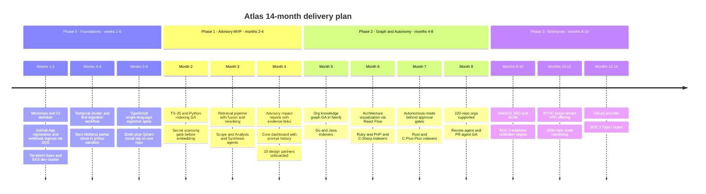
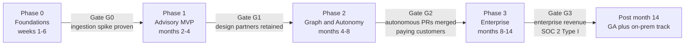
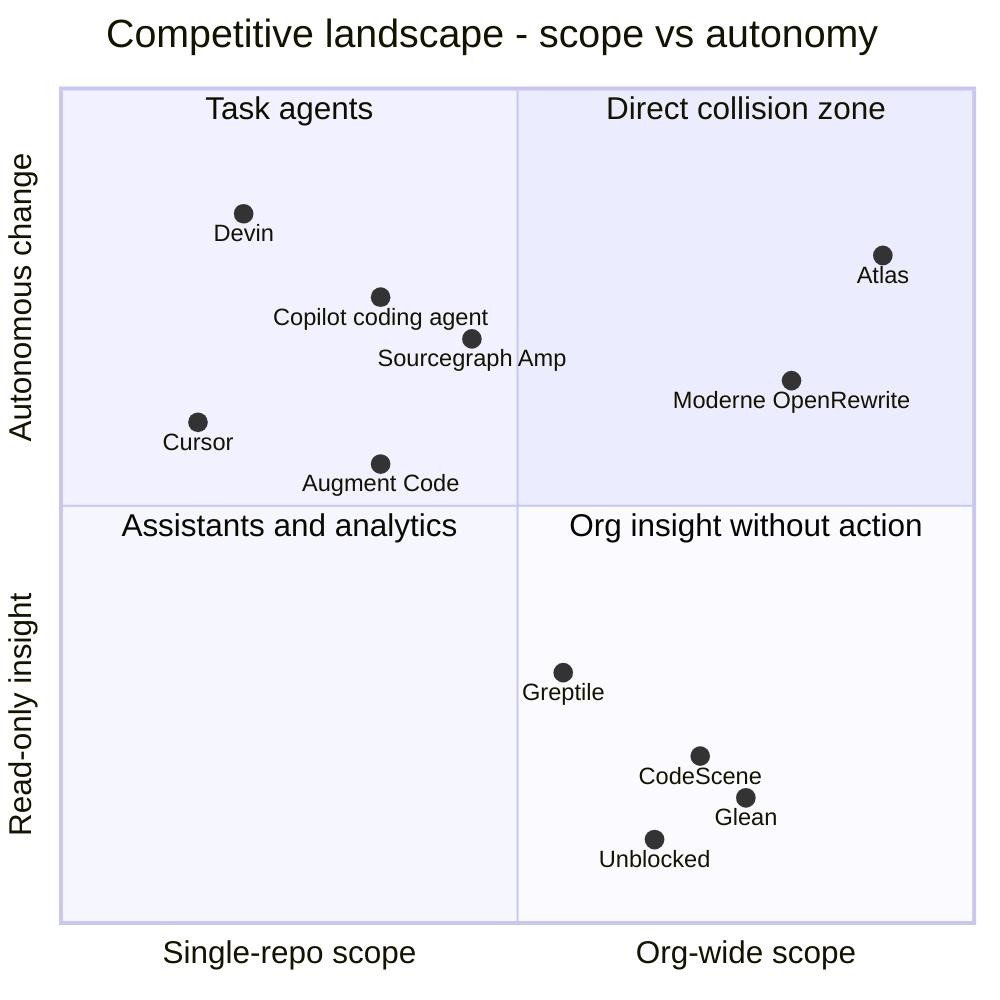

# Roadmap, Team, Risks & Competitive Analysis

Document 09 of 10 — Atlas architecture package.

Cross-references: system architecture and provider abstraction in `docs/01-system-architecture.md`, retrieval design in `docs/02-retrieval-and-rag.md`, graph design in `docs/03-graph-design.md`, ingestion in `docs/04-github-and-ingestion.md`, agents in `docs/05-ai-and-agents.md`, data architecture in `docs/06-data-architecture.md`, load/cost model in `docs/07-scalability-and-cost.md`, security/tenancy in `docs/08-security-and-deployment.md`. This document does not restate their content; it sequences it, staffs it, and defends it against the market.

## TL;DR

The five most important decisions in this document:

1. **Launch with TypeScript/JavaScript + Python only.** The founder's "ten languages, language-agnostic" requirement is an *architecture* requirement, not a *launch* requirement. TS/JS + Python top every major language-usage survey and fully cover our beachhead segment (microservice startups). All ten languages land by end of Phase 2 in three waves, on an architecture that was language-agnostic from day one (tree-sitter + SCIP, per `docs/04-github-and-ingestion.md`).
2. **Advisory mode ships four months before Autonomous mode.** Trust is the product. We earn the right to open PRs by first shipping impact reports where every claim is evidence-linked (file:line or graph edge, canon). Autonomous mode arrives in Phase 2 behind human approval gates — never as a launch feature.
3. **Five founding engineers + a contract designer; the security engineer is hired in Phase 2, before the SOC 2 evidence window opens, not after it.** Total 14-month cost ≈ $3.0M fully loaded (estimate — verify against actual comp bands), which sets the seed target at $5M for ≥ 20 months of runway.
4. **Sourcegraph is the sharpest near-term competitor; GitHub is the existential one.** Our moat is the compounding org knowledge graph, evidence-linked impact reports, SCM-permission-aware retrieval, and a fully self-hostable stack. The last two are structurally hard for GitHub to match and impossible for editor-first players; the counter-moat section (§4.4) says plainly which segment we concede if GitHub ships a good native version.
5. **Four explicit non-goals, enforced at every roadmap review:** no IDE plugin, no code hosting, no generic chatbot, no CI runner. Each is a quarter of engineering time we cannot afford and a market someone else already owns.

---

## 1. Development Roadmap

### 1.1 Roadmap principles

Three rules govern every scoping decision below:

1. **De-risk the hostile-input loop first.** The single riskiest technical bet is ingesting arbitrary repositories safely and cheaply (clone → parse → chunk → secret-scan → embed → retrieve inside a gVisor sandbox with egress blocked). Phase 0 exists to prove this loop before a single dashboard pixel is drawn.
2. **A phase ends at a gate, not a date.** Gates G0–G3 are decision meetings with written exit criteria (§1.3–§1.6). Failing a gate blocks the next phase's *hiring and spend*, not just its features. Dates below are planning targets; gates are hard.
3. **Cut scope, never architecture.** Every cut line below removes launch surface while preserving the canonical end-state: four retrieval primitives, two-tier graph, orchestrator-worker agents, self-hostable stack. Nothing in Phase 1 requires rework to reach Phase 3.

### 1.2 Timeline

### 1.3 Phase 0 — Foundations (weeks 1–6)

Goal: prove the riskiest technical loop end-to-end on one language before anything else is built. Repo content is HOSTILE input (canon): build scripts execute arbitrary code, prompt injection hides in READMEs and comments — so the spike runs in the production sandbox posture from day one, not a laptop prototype that gets "hardened later."

| Deliverable | Detail | Owner (role) |
|---|---|---|
| Monorepo + CI | Monorepo layout per `docs/01-system-architecture.md`; GitHub Actions; ArgoCD to a dev EKS cluster | Infra/platform |
| GitHub App skeleton | App registered with contents:read, metadata:read, pull_requests:write, checks:read; webhook events (push, pull_request, installation, repository) → SQS ingress buffer | Full-stack 1 |
| Temporal | Cluster deployed; one `IngestRepoWorkflow` (TypeScript SDK) with retry/backoff and rate-limit awareness | Infra/platform |
| Single-language ingestion spike | TypeScript only: Rust indexer worker, tree-sitter parse, function/class structure-aware chunking, gitleaks-style secret gate, voyage-code-3 embed (1024-dim int8) into Qdrant, Zoekt trigram index | Language-tooling |
| Sandbox posture | Ephemeral gVisor-sandboxed indexer jobs, egress-blocked, bare/blobless partial clones | Infra/platform |
| Retrieval smoke test | One-shot query over one real repo hitting Zoekt + Qdrant with reciprocal-rank fusion | AI/agents |
| Eval harness v0 | Langfuse wired; 20 hand-written golden queries over 2 seed repos | AI/agents |

**Cut lines (explicitly out of Phase 0):** no dashboard, no agent pipeline, no Neo4j, no SCIP, no reranker, no second language, no multi-tenancy hardening beyond Postgres RLS scaffolding, no billing.

**Gate G0 exit criteria:**

| Metric | Target |
|---|---|
| Ingest a 100k-LOC TS repo end-to-end | < 15 min wall clock (estimate — verify on real repos) |
| Secret-scan gate | 0 known-seeded secrets reach Qdrant in a red-team test with 50 planted credentials |
| Sandbox escape test | Indexer job running a malicious `postinstall` script cannot reach the network or the host filesystem |
| Retrieval sanity | Top-10 fused results contain the known-relevant file for ≥ 18 of 20 golden queries |
| Incremental re-index | A one-file commit re-indexes only affected chunks (content-addressed dedupe observed working) |

### 1.4 Phase 1 — Advisory MVP (months 2–4)

Goal: a design partner types a prompt, gets an evidence-linked cross-repo impact report and per-repo plans within minutes, and comes back next week without being chased. Advisory mode only. 10–50 repos per org.

#### 1.4.1 Language scope: TS/JS + Python only — challenging the founder assumption

The founder's ask reads as ten languages at launch. We reject that for launch (not for architecture) on four grounds:

1. **Market coverage.** JavaScript/TypeScript and Python sit at the top of every major usage measure: GitHub Octoverse 2024 ranked Python and JavaScript as the two most-used languages on GitHub with TypeScript third (estimate — verify against the published report before citing externally); Stack Overflow's 2024 developer survey put JavaScript at ~62% and Python at ~51% usage among professional developers (estimate — verify). Two languages capture the plurality of all repos we will ever see.
2. **Beachhead fit beats breadth.** Our beachhead — microservice startups of 10–200 repos — is overwhelmingly Node/TS backends plus Python services and data pipelines. Two languages cover *most of these orgs completely*, which matters more than covering every org partially: a cross-repo impact report that silently ignores 30% of an org's repos is worse than useless (it produces confident false negatives — risk P-1). We therefore onboard only orgs we can fully cover, and say so in the sales motion.
3. **Toolchain maturity.** SCIP indexer quality is best-in-class for exactly these two ecosystems (scip-typescript, scip-python — estimate, verify current maintenance status), so Phase 1 exercises the full two-tier graph design in `docs/03-graph-design.md` with precise symbol resolution rather than tree-sitter-fallback ambiguity. We debug our pipeline, not the indexers.
4. **Per-language cost is multiplicative.** Each language adds: indexer integration and its failure modes, chunking edge cases, framework-aware tree-sitter queries for route extraction, a per-language eval set, and support burden. Spending that before product-market-fit signal is pure waste (risk E-1).

The *architecture* remains ten-language from week 1 — tree-sitter grammars, SCIP artifact storage in S3 with Postgres pointers, and the extraction pipeline are language-parameterized. We cut launch scope, not architecture.

**Language wave plan (waves land in Phase 2):**

| Wave | Languages | When | Rationale |
|---|---|---|---|
| 0 (launch) | TypeScript/JavaScript, Python | Phase 1 | See above |
| 1 | Go, Java | Month 5 | Dominant in microservice backends; strong SCIP support (scip-go, scip-java — verify); highest partner demand expected |
| 2 | Ruby, PHP, C# | Month 6 | Large installed bases (Rails, Laravel/WordPress-adjacent, .NET shops); moderate SCIP maturity |
| 3 | Rust, C++ | Month 7 | Rust: growing but smaller org footprints. C++ deliberately last: build-system-dependent indexing (compilation databases) is the hardest of the ten; tree-sitter heuristic fallback carries more load here by design (canon permits it) |

#### 1.4.2 Phase 1 deliverables

| Deliverable | Detail |
|---|---|
| GitHub App GA | Installation flow, user-level OAuth identity, permission mirroring (a user may only query or see repos their GitHub identity can read — canon), webhook-driven incremental indexing |
| Indexing GA for TS/JS + Python | SCIP symbol graphs per repo@commit to S3 with Postgres pointers (NOT materialized into Neo4j — canon); content-addressed chunk dedupe; commit-diff incremental updates |
| Retrieval pipeline GA | Intent classification (Haiku) → parallel fan-out across Zoekt, Qdrant, Neo4j, SCIP → reciprocal-rank fusion → voyage rerank-2.5 → context assembly (repo cards + graph neighborhood summaries + top chunks) under an explicit token budget; retrieval also exposed as tools inside the agent loop (`docs/02-retrieval-and-rag.md`) |
| Graph, minimal | Neo4j with Org/Repo/Package/Service nodes and DEPENDS_ON edges from dependency manifests + lockfiles matched against internal coordinates — the full taxonomy is Phase 2 |
| Agent pipeline, advisory half | Scope → per-repo Analysis subagents in parallel with isolated contexts → cross-repo Synthesis → per-repo Planning; Opus for planning/synthesis, Sonnet for per-repo analysis, Haiku for classification (canon routing); every claim cites file:line or a graph edge; file paths verified to exist before inclusion in any report |
| Repo cards | Batch API offline summarization of each repo (purpose, stack, entry points) feeding context assembly |
| Core dashboard | Prompt history, repo list, previous analyses, impact reports, saved sessions; SSE streaming of agent progress; Next.js 15 + shadcn/ui |
| Cost metering scaffold | Per-tenant token and dollar metering via Langfuse + OTel from day one — unit-economics data starts accruing before we charge |

**Cut lines:** no autonomous mode, no architecture visualization, no API-spec/message-topic/env-var/infra-manifest edge extraction, no SSO/SCIM, no GitLab, no approval-workflow UI (advisory needs none), languages 3–10, no billing UI (invoices by hand for early paid pilots).

**Gate G1 exit criteria and success metrics:**

| Metric | Target | Measured how |
|---|---|---|
| Design partners active | 10 orgs onboarded; ≥ 6 weekly-active after 4 weeks | product analytics |
| Retrieval quality | recall@20 ≥ 0.85 on the golden query set | eval harness per `docs/02-retrieval-and-rag.md` |
| Impact-report precision | ≥ 0.9 of repo-level "affected" claims confirmed by partner engineers across 50 sampled reports (estimate — verify sampling protocol) | human grading |
| Hallucinated paths | 0 non-existent file paths in shipped reports | automated path-verification hard gate |
| Time-to-first-analysis | < 30 min from App install for a 10-repo org | instrumented onboarding funnel |
| Cost per analysis | ≤ $2.00 median at 10-repo scale (estimate — verify against the model in `docs/07-scalability-and-cost.md`) | Langfuse cost metering |
| Secret leakage | 0 credentials in vector store or LLM context (continuous red-team seeding) | secret-gate telemetry |

### 1.5 Phase 2 — Org graph, remaining languages, autonomy (months 4–8)

Goal: the org knowledge graph becomes the product's visible spine; autonomous mode ships behind approval gates; 100+ repo orgs are first-class.

| Deliverable | Detail |
|---|---|
| Org knowledge graph GA | Full node taxonomy (Org, Repo, Service, Deployable, Package, APIEndpoint, MessageTopic, DataStore, Table, EnvVar, ConfigKey, Team, Person, Domain) and edge taxonomy (DEPENDS_ON, CALLS, EXPOSES, CONSUMES, PUBLISHES, SUBSCRIBES, READS, WRITES, OWNS, DEPLOYS, REFERENCES_ENV, SHARES_SCHEMA); every derived edge carries {mechanism, confidence 0–1, evidence file:line list, first_seen_commit, last_seen_commit} (canon; `docs/03-graph-design.md`) |
| Cross-repo extractors | API specs (OpenAPI, protobuf, GraphQL SDL, AsyncAPI) + framework-aware route extraction via tree-sitter queries + client call-site extraction with URL-template matching; Kafka/SQS/RabbitMQ/NATS topic string matching; shared database and schema references; env var and config key references; K8s/Terraform/docker-compose manifests |
| LLM soft edges | Docs/READMEs → service semantics, always with confidence + evidence (canon: LLM extraction for soft edges only; deterministic extraction builds the graph) |
| Languages 3–10 | Waves 1–3 per §1.4.1 table; per-language conformance suite is the definition of done |
| Architecture visualization | React Flow service-level map fed from Neo4j (`docs/03-graph-design.md` visualization feed); edge evidence popovers showing file:line provenance and confidence |
| Autonomous mode | CodeGen agents in sandboxed ephemeral checkouts that build and run tests; Review agent adversarial diff critique; PR agent (branch, commit, PR via GitHub API); **human approval gates precede every autonomous write action** (canon); approval-workflow UI in dashboard |
| Scale hardening | 100+ repo orgs: Temporal backfill scheduler with per-installation token bucket respecting the 5000 req/hr GitHub App limit plus secondary limits (risk T-4) |
| Self-serve tier | Free/cheap individual-dev tier with hard monthly analysis caps (see Pushback §5.2) |

**Cut lines:** no SSO/SCIM, no BYOC, no GitLab, no on-prem, no SOC 2 audit (evidence collection starts month 6–8; the audit itself does not), no fine-tuned models, no Bitbucket.

**Gate G2 exit criteria and success metrics:**

| Metric | Target | Measured how |
|---|---|---|
| Graph edge precision | ≥ 0.9 precision for high-confidence edges on a labeled cross-repo benchmark built from design-partner orgs; recall ≥ 0.75 (estimate — verify once benchmark exists) | eval harness per `docs/03-graph-design.md` |
| Autonomous PR quality | ≥ 60% of approved autonomous PRs merged without human rework, on scoped task classes (estimate — verify) | GitHub API tracking |
| 100-repo onboarding | Full backfill of a 100-repo / ~20M-LOC org in < 24 h without tripping secondary rate limits | instrumented onboarding |
| Language coverage | All 10 languages pass the per-language ingestion conformance suite | CI |
| Paying customers | ≥ 5 paying (converted design partners); ≥ $15k MRR (estimate — pricing tests pending) | billing |
| Visualization adoption | ≥ 40% of weekly-active users open the architecture map weekly | product analytics |
| Autonomy opt-in | ≥ 20% of eligible orgs enable autonomous mode within 60 days of GA (counter-signal for risk P-2) | product analytics |

### 1.6 Phase 3 — Enterprise (months 8–14)

Goal: sell to the 1000-repo tier without re-architecting. Everything here was pre-decided in the canon (every component self-hostable, Postgres RLS tenant scoping, per-tenant KMS envelope encryption, Bedrock in BYOC) — Phase 3 is execution, not invention.

| Deliverable | Detail |
|---|---|
| SSO/SCIM | WorkOS SAML/SCIM; platform RBAC layered on mirrored GitHub permissions; full audit log surfaced to org admins |
| BYOC / single-tenant VPC | Terraform-packaged deployment of the full stack (Qdrant, Zoekt, Neo4j, Postgres, Temporal, Redis, S3-compatible storage) into customer AWS accounts; LLM via AWS Bedrock (`docs/08-security-and-deployment.md`) |
| SOC 2 | Type I report by month 14; Type II observation window opens immediately after; evidence automation wired from month 8 |
| 1000-repo hardening | ~150M-LOC orgs: Qdrant collection sharding, Zoekt shard fan-out, multi-week backfill orchestration under rate-limit budgets, per-tenant cost controls and quotas (`docs/07-scalability-and-cost.md`) |
| GitLab provider | Second implementation of the provider abstraction in `docs/01-system-architecture.md`: GitLab OAuth app + webhooks + MR API mapped onto the same internal interfaces; conformance-tested against the GitHub suite |
| Enterprise dashboard | Approval-workflow policies (who may approve autonomous PRs per repo group), audit export, usage/cost reporting per team |

**Cut lines:** on-prem/air-gapped ships *after* month 14 (it is tenancy Phase 3 in `docs/08-security-and-deployment.md`, deliberately off this delivery plan); Bitbucket provider; marketplace self-serve enterprise procurement; model fine-tuning.

**Gate G3 exit criteria and success metrics:**

| Metric | Target |
|---|---|
| Enterprise pilots | ≥ 2 BYOC deployments live at enterprise design partners |
| SOC 2 | Type I report issued |
| Scale proof | Synthetic 1000-repo org: p95 scope-stage retrieval latency < 15 s; backfill completes within rate-limit budget (estimate — verify against `docs/07-scalability-and-cost.md`) |
| Revenue | ≥ $50k MRR with ≥ 1 six-figure-ACV contract signed or in legal review (estimate — GTM dependent) |
| GitLab | Provider passes the same conformance suite as GitHub for indexing + advisory mode |

### 1.7 What we deliberately do NOT build

Enforced at every roadmap review. Each entry names the reason and the trigger that would reopen the decision.

| Non-goal | Why not | What we do instead | Revisit trigger |
|---|---|---|---|
| **IDE plugin** | Red-ocean market (Copilot, Cursor, JetBrains AI); an org-level product's home is the org level, not a single editor buffer; multi-editor plugin support is a full team forever | Dashboard + PRs + PR descriptions as the delivery surface; expose retrieval as an MCP server so IDEs and third-party agents can *consume* Atlas context | Clear pull from > 30% of paying customers AND MCP consumption proves insufficient |
| **Code hosting** | GitHub/GitLab are the systems of record; hosting is a compliance-and-durability business where we have zero advantage | Bare/blobless partial clones in ephemeral sandboxes; derived artifacts (SCIP, chunks, embeddings) in our S3 — never the source of truth | Never |
| **Generic chatbot** | "Chat with your code" is commoditized and evaluation-free; it dilutes the evidence-linked positioning that is our trust moat | Q&A exists only as a thin surface over the same retrieval pipeline, always citation-bearing; the product is impact analysis → plans → PRs | Never as a standalone product |
| **CI runner** | CI is owned by GitHub Actions et al.; running customer CI means running arbitrary customer workloads at our cost and our risk | Sandboxed codegen checkouts build and run tests *for our own validation only*; results feed the Review agent, not the customer's CI | Never |

Also deferred but not non-goals: Bitbucket provider, fine-tuned/self-hosted models, Jira/Linear ingestion for soft ownership edges, mobile dashboard.

---

## 2. Team Plan

### 2.1 Founding team (Phase 0–1): 5 engineers + contract designer

| Role | Count | Owns | Why this seat exists on day one |
|---|---|---|---|
| Full-stack product engineer | 2 | Next.js dashboard, NestJS API, SSE streaming, OpenAPI clients, approval workflows | The product surface is how trust is communicated; evidence-linked reports and streaming agent progress need real UI craft, and the API layer is half the platform |
| Infra/platform engineer | 1 | EKS, Terraform, ArgoCD, Temporal, Qdrant/Zoekt/Neo4j/Postgres/Redis operations, gVisor sandboxing, SQS ingress | Every canonical component is self-hostable *because we operate all of it ourselves from day one*; BYOC in Phase 3 is credible only if this discipline starts in week 1 |
| Language-tooling / indexing engineer | 1 | Rust indexer workers, tree-sitter grammars and queries, SCIP toolchain, structure-aware chunking, secret-scan gate | The rarest skill set on this list and the longest lead time to hire; the entire two-tier graph rests on artifact quality. If forced to sequence founding hires, this one comes before the AI engineer |
| AI/agents engineer | 1 | Claude Agent SDK orchestration, Opus/Sonnet/Haiku routing, retrieval-as-tools, prompt caching, Batch API pipelines, Langfuse evals | Owns the eval harness from week 1 — retrieval and agent quality are measured, never vibed |
| Product designer | contract, ~0.5 FTE | Dashboard, impact-report information design, architecture visualization, approval UX | Full-time design is not justified before Phase 2 visualization and approval-workflow work; contract keeps quality without the seat |

Founders occupy seats inside these 5 (e.g., a technical CEO holds one full-stack seat at reduced capacity; if no design-founder, increase the contract-designer budget). No dedicated PM and no dedicated salesperson through Phase 2: founder-led product, founder-led sales.

### 2.2 Hiring by phase and why this ordering

| Phase | Adds | End-of-phase headcount | Rationale for ordering |
|---|---|---|---|
| Phase 0–1 (months 0–4) | Founding 5 + designer contract | 5 + 0.5c | Smallest team covering all four subsystems: surface, platform, indexing, agents. Anything smaller serializes the critical path |
| Phase 2 (months 4–8) | **Second AI/agents engineer** (month 4); **Security engineer** (month 6) | 7 + 0.5c | Autonomous mode doubles the agent surface (CodeGen, Review, PR agents plus safety gates and codegen sandboxes) — the second AI engineer starts the week autonomy work starts, not after it slips. The security engineer joins ~3 months *before* the SOC 2 evidence window: auditors want months of collected evidence, and threat-model ownership (`docs/08-security-and-deployment.md`) stops being a part-time job the day autonomous writes exist |
| Phase 3 (months 8–14) | **Solutions engineer** (month 9) | 8 + 0.5c | BYOC deployments are hands-on Terraform runs in customer AWS accounts plus security-questionnaire grind; the solutions engineer converts enterprise pilots without pulling the infra engineer off the platform. GRC/compliance work is contracted, not hired |

Deliberately **not** hired in the first 14 months: PM (founders do it), sales rep (founder-led until the motion is repeatable), second infra engineer (revisit if live BYOC count > 4), ML researcher (we route to frontier models via the canon's routing table; we do not train models).

### 2.3 Fully-loaded cost per phase

Assumptions (all estimates — verify against actual offers and location mix): senior US-remote engineer fully loaded (salary + payroll tax + benefits + equipment + tooling) ≈ $300k/yr = $25k/mo; designer contract ≈ $8k/mo; solutions engineer ≈ $270k/yr fully loaded. Infra + LLM figures follow the load model in `docs/07-scalability-and-cost.md` (dev environments + design-partner workloads, not customer-funded production).

| Phase | Duration | Avg FTE | People cost | Infra + LLM | Programs | Phase total |
|---|---|---|---|---|---|---|
| Phase 0 | 1.5 mo | 5 + 0.5c | ~$200k | ~$8k | — | **~$210k** |
| Phase 1 | 2.5 mo | 5 + 0.5c | ~$330k | ~$30k | legal/incorporation ~$25k | **~$385k** |
| Phase 2 | 4 mo | 6.5 avg + 0.5c | ~$680k | ~$90k | first pentest ~$30k | **~$800k** |
| Phase 3 | 6 mo | 8 avg + 0.5c | ~$1,250k | ~$180k | SOC 2 audit + compliance tooling ~$80k; second pentest ~$30k | **~$1,540k** |
| **Total months 0–14** | | | **~$2.46M** | **~$0.31M** | **~$0.17M** | **≈ $2.9–3.0M** |

Worked runway example (estimate — verify): a **$5M seed** at this burn leaves ~$2.0M at month 14, which is 7–9 further months at the month-14 burn rate (~$260k/mo) — enough to raise a Series A on Phase 3 evidence ($50k MRR, an enterprise contract, SOC 2 Type I) without a bridge. A $3.5M raise leaves ~2 months of buffer and turns Gate G3 into a cliff. Raise $5M.

---

## 3. Risk Register

Scoring: Likelihood (L) and Impact (I) on 1–5; Exposure = L × I. Reviewed monthly with a named owner per risk. Categories: Tech, Product, Market, Execution.

| ID | Risk | Cat | L | I | Exp | Mitigation | Early-warning signal |
|---|---|---|---|---|---|---|---|
| T-1 | **Retrieval quality collapses on messy real-world orgs** — dead repos, forks, vendored code, generated files, monorepo/multi-repo hybrids poison fusion results | Tech | 4 | 5 | 20 | Golden query sets *per design-partner org*, not only curated repos (`docs/02-retrieval-and-rag.md`); repo-level quality signals (archived, fork, commit recency) as retrieval features; vendored/generated-file exclusion in chunking; RRF weights tunable per org | recall@20 on partner-org evals diverging > 10 pts from curated evals |
| T-2 | **Cross-repo edge precision/recall too low** — URL-template and topic-string matching produce false CALLS/PUBLISHES edges; missed edges destroy impact-report recall | Tech | 4 | 5 | 20 | Canon's confidence + evidence on every derived edge; reports render low-confidence edges as "possible — verify," never as fact; labeled edge benchmark graded by partner engineers; deterministic extractors first, LLM soft edges only for docs semantics | edge-precision eval < 0.85; a partner flags a wrong "affected repo" |
| T-3 | **Indexing cost blowup** — a full 150M-LOC pass ≈ 1.5B tokens ≈ ~$270 of voyage-code-3 at $0.18/Mtok looks cheap, but re-embedding churn, SCIP compute, and repo-card summarization multiply it (estimates — verify against `docs/07-scalability-and-cost.md`) | Tech | 3 | 4 | 12 | Content-addressed chunk dedupe (canon); commit-diff incremental indexing; Batch API for repo cards; per-tenant indexing budget alarms via cost metering; embed only post-secret-scan, post-dedupe chunks | per-tenant indexing spend > 2× model prediction for two consecutive weeks |
| T-4 | **GitHub rate limits at onboarding** — 5000 req/hr per installation plus secondary limits make 1000-repo backfills multi-day; naive parallelism gets the App throttled or flagged | Tech | 4 | 3 | 12 | Temporal rate-limit-aware backfill with per-installation token bucket; blobless partial clones minimize API calls; onboarding UX that shows honest progress; webhook-first incremental so backfill is one-time | 403/secondary-limit responses in onboarding telemetry |
| T-5 | **LLM regression** — a model version change silently degrades plan quality or safety behavior | Tech | 3 | 4 | 12 | Pinned model versions; Langfuse eval suites (retrieval, analysis, planning, codegen) gate any routing change; canary tenant for model upgrades; routing table is config with minutes-level rollback (`docs/05-ai-and-agents.md`) | eval-suite delta > 5% on any stage after a provider release |
| P-1 | **Trust destruction: one hallucinated impact report** — a single confident-but-wrong "these 12 repos are affected" at a design partner ends the relationship and the reference | Product | 3 | 5 | 15 | The canon's evidence discipline *is* the mitigation: every claim cites file:line or a graph edge; paths verified to exist before inclusion; calibrated confidence rendered in the UI; "insufficient evidence" is a first-class report outcome; adversarial Review agent on generated content | any partner-reported false claim; the path-verification gate ever firing in production |
| P-2 | **Autonomous-PR fear** — buyers love advisory, freeze at "it commits code"; autonomy becomes shelf-ware | Product | 4 | 3 | 12 | Autonomy opt-in per org AND per run; approval gates precede every write (canon); writes only to non-default branches via least-privilege App permissions; full audit log of agent actions; advisory is a complete product alone — autonomy is upsell, not the core bet | < 20% of eligible orgs enable autonomy 60 days after GA |
| M-1 | **GitHub ships cross-repo Copilot natively** | Market | 3 | 5 | 15 | §4.4 counter-moat; concrete hedges: GitLab provider in Phase 3 (multi-SCM neutrality), BYOC/self-host (structurally closed to Copilot), typed-graph depth + evidence UX, MCP exposure so we can complement rather than only compete | GitHub Universe announcements; Copilot Enterprise adding org-graph features |
| M-2 | **Sourcegraph extends Amp/code intel into org impact analysis** — they own the Zoekt lineage, SCIP, and enterprise code-search accounts | Market | 3 | 4 | 12 | Speed: the typed org graph + evidence reports are 12+ months of focused work even with their assets (§4.3); win their under-served segment (startups, not F500) first; keep self-host parity so their enterprise position isn't unique | Sourcegraph launches a service-level dependency graph or impact-report feature |
| M-3 | **Model providers commoditize the layer** — frontier labs ship org-scale code understanding as an API or agent feature | Market | 3 | 4 | 12 | Our value is the *deterministic* substrate (typed graph, SCIP artifacts, permission mirror, evidence discipline) that any model plugs into; better models make Atlas better, not obsolete; no moat claims based on prompt quality; model layer swappable (routing table + Bedrock path) | a provider launches hosted multi-repo indexing with permission awareness |
| E-1 | **10-language scope creep** — indexer edge cases (C++ build systems, PHP frameworks) consume the language-tooling engineer for months, starving graph work | Exec | 4 | 3 | 12 | Wave plan with per-language conformance suite as the definition of done; tree-sitter fallback is *acceptable* for wave-3 languages at wave-3 time (canon); language work timeboxed and never prioritized above graph work | any language > 3 weeks past its wave without a conformance pass |
| E-2 | **Enterprise sales cycle vs runway** — 6–12 month enterprise cycles collide with 18–24 months of runway; Phase 3 revenue slips | Exec | 4 | 4 | 16 | Land startups (weeks-long cycles) for revenue while enterprise incubates; enterprise design-partner conversations start in Phase 2, contracts in Phase 3; SOC 2 evidence collection early because it is the #1 procurement blocker; raise $5M not $3.5M (§2.3) | month-10 enterprise pipeline contains zero contracts in legal review |

### 3.1 Deep dive on the top three exposures

**T-1 / T-2 (retrieval and edge quality, Exp 20 each).** These are the same failure seen from two sides: the product's core claim is "we know who is affected and why," and both the ranked-retrieval path and the graph path must hold on orgs we did not curate. The structural mitigation is that the canon never lets a similarity score or a string match masquerade as a fact — fusion feeds an agent that must produce evidence, and edges carry mechanism + confidence + file:line provenance. The operational mitigation is eval-first development: the golden sets and the labeled edge benchmark are Gate G1/G2 exit criteria, not aspirations, and every design partner contributes labeled queries and edge confirmations as part of the partnership agreement.

**P-1 (hallucinated impact report, Exp 15).** One wrong report at a reference customer is worth more negative revenue than any feature is worth positive. This is why the roadmap ships advisory before autonomy, why "insufficient evidence" is a rendered outcome rather than a silent gap, and why the path-verification gate is a hard blocker in the report pipeline rather than a linter warning. The kill-switch protocol: any confirmed false repo-level claim at a partner triggers a same-week root-cause writeup shared with that partner — transparency is the only recovery move that preserves the reference.

**E-2 (sales cycle vs runway, Exp 16).** The mitigation is architectural as much as commercial: because the same stack serves 10-repo startups and 1000-repo enterprises (canon), we can take startup revenue in Phase 2 while enterprise procurement grinds. The roadmap's refusal to let SOC 2 evidence collection slip past month 8 exists for this risk, not for compliance box-ticking.

---

## 4. Competitive Analysis

### 4.1 Landscape map

Reading: the empty upper-right is the category — org-wide scope combined with evidence-gated autonomous change. Moderne is the only player near it, and it requires the transformation to be known in advance. Positions are qualitative placements (estimate — revisit quarterly).

### 4.2 Landscape table

Threat levels: **Existential** (could remove the category), **High** (direct feature collision plausible within 12 months), **Medium** (adjacent; could pivot in), **Low** (different job-to-be-done).

| Player | What they do | Where they stop short of cross-repo impact analysis | Threat |
|---|---|---|---|
| **Sourcegraph** (Code Search, Cody, Amp, Batch Changes) | Enterprise code search (Zoekt lineage), precise code intel via SCIP, AI assistant (Cody), agentic coding (Amp), mechanical multi-repo edits (Batch Changes) | Code intel is symbol-level, not service-level: no typed org graph (APIEndpoint/MessageTopic/DataStore edges), no impact reports; Batch Changes require you to *already know* the change; Amp is a workspace-scoped coding agent | **High** |
| **GitHub Copilot Enterprise / Copilot coding agent** (incl. the Workspace lineage) | Org-tuned chat with knowledge bases; task → plan → PR coding agent; unmatched distribution and data position | Agent and context are repo-scoped; knowledge bases index documents, not a typed dependency graph; no cross-repo "who is affected and why" with evidence; cloud-only, no self-host/BYOC | **Existential long-term; Medium at 12 months** |
| **Cursor** | AI-native IDE with per-workspace codebase indexing and strong agentic editing | Single-workspace ceiling by design; editor-bound surface; no server-side org graph, no SCM-permission-aware multi-user retrieval, no org-level reports | **Medium** |
| **Cognition** (Devin, DeepWiki) | Autonomous SWE agent executing tasks in VMs; DeepWiki auto-documents repos | Per-task context building, not a persistent typed org graph; multi-repo work is sequential task execution, not impact analysis; no evidence-linked org reporting | **Medium-High** |
| **Augment Code** | Context engine + agent tuned for very large codebases; enterprise focus | Depth-in-one-codebase optimization; retrieval is embedding-centric; no typed cross-repo edge extraction; no org impact reports | **Medium** |
| **Greptile** | AI code review; indexes a codebase into a graph for PR review and Q&A | Per-repo scope; review is reactive — a diff arrives, then analysis — not proactive org-level planning; no planning/execution pipeline across repos | **Low-Medium** |
| **Glean** | Enterprise search + agents across SaaS knowledge (docs, tickets, chat, some code) | Document-level understanding; no parsers/SCIP/dependency semantics; cannot answer "who depends on this endpoint"; no codegen | **Low** — but competes for the same enterprise AI budget line |
| **Unblocked** | Answers engineering questions from code + Slack + Jira context | Q&A only; no impact analysis, no plans, no code modification; context is conversational recall, not structural | **Low** |
| **Moderne / OpenRewrite** | Deterministic mass refactoring via lossless semantic trees and recipes across many repos | Recipe-based: the transformation must be known in advance; no discovery of *what* is affected; strongest in JVM ecosystems | **Low-Medium** — and a natural partner |
| **CodeScene** | Behavioral code analysis: hotspots, change coupling, knowledge/team-coupling analytics | Statistical co-commit coupling, not semantic dependency edges; analytics dashboards, no retrieval/agents/PRs | **Low** |

### 4.3 Prose: player by player

**Sourcegraph — the closest threat, and why they have not built this.** They own the best raw ingredients: Zoekt (we use it), SCIP (we use it), and enterprise code-search relationships. But their last two years concentrated on the coding-agent race (Amp) and assistant UX (Cody), where the unit of work is a developer's task inside a workspace — not the org. Their code intelligence answers "where is this symbol referenced," which is necessary but not sufficient for "which *services* break if this API changes, and what is the migration plan per repo." Building that requires the typed org graph (deterministic extractors across manifests, API specs, topics, schemas, infra manifests), a calibrated-confidence evidence UX, and an orchestrated multi-agent pipeline — a 12+ month focused build even with their assets, pointed away from where their revenue currently pulls them (enterprise search seats and agent subscriptions). Our window is exactly that gap. If they turn toward it, we out-execute in the segments they under-serve: microservice startups, and enterprises that demand BYOC of the *entire* stack including vector and graph stores. Watch item: any Sourcegraph release that materializes service-level edges or ships an "impact" noun.

**GitHub Copilot Enterprise / Copilot coding agent — the existential question.** Short-term threat is Medium: Copilot's center of gravity is the individual developer and repo-scoped tasks; knowledge bases index documents rather than typed dependency structure; everything is cloud-only and Microsoft-controlled. Long-term, distribution wins ties — the full answer is §4.4. The Workspace lineage (task → plan → implementation) proves they understand plan-first UX; what they have not shown is org-level dependency understanding with evidence, and their incentive structure (sell more GitHub) does not reward being a neutral cross-SCM layer.

**Cursor.** Owns developer attention and the inner loop, and is exceptional at it. But the architecture is a single-workspace editor: local/per-workspace indexing, single-user permissions, no server-side org graph, no multi-user report surface. They could ship multi-root workspaces, but org-scale impact analysis requires a persistent server-side graph and SCM permission mirroring — a different product shape from an editor. Threat is Medium: they compress the *value of the coding step*, which pressures the autonomy half of our product but not the understanding half. Atlas plans can be handed to Cursor users via MCP — complementary in practice.

**Cognition (Devin, DeepWiki).** Devin executes tasks autonomously in VMs and DeepWiki demonstrates real investment in repo understanding. Their gap is persistence and typing: context is rebuilt per task, understanding is documentation-shaped rather than a queryable typed graph, and there is no evidence-linked org reporting. Threat Medium-High because they are well-funded and their trajectory (understand → plan → execute) rhymes with ours; their bet is on the agent, ours is on the substrate the agent stands on.

**Augment Code.** Serious context-engine engineering aimed at very large codebases, sold to enterprises. Their frame is depth within a codebase, retrieval is embedding-centric, and there is no typed cross-repo extraction — the RETRIEVAL VERDICT in `docs/02-retrieval-and-rag.md` (similarity search cannot answer "who depends on this") is precisely the line between us. Threat Medium: closest to us in enterprise posture, furthest in graph substance.

**Greptile.** Graph-flavored codebase indexing applied to AI code review. Sharp wedge, real revenue, but structurally reactive: analysis happens when a diff arrives, per repo. No cross-repo planning or execution. Threat Low-Medium; also validates that "code understanding graph" sells.

**Glean.** Wins the "enterprise AI search" budget line and will name-check code as a data source. Without parsers, SCIP, or dependency semantics it cannot do impact analysis; its threat is commercial (budget competition and enterprise relationships), not technical. Threat Low.

**Unblocked.** Good answers about code with team context; no structural understanding, no plans, no writes. Threat Low; validates demand for org-level answers.

**Moderne / OpenRewrite.** The most interesting non-threat: deterministic, provably-safe mass transformation across thousands of repos — but only for transformations already expressed as recipes, and strongest in JVM ecosystems. They execute known changes; we discover what must change and plan it. A partnership (Atlas plans compile to OpenRewrite recipes where applicable) is plausible in Phase 3+. Threat Low-Medium.

**CodeScene.** Statistical change-coupling and hotspot analytics for engineering leaders. Correlational, not semantic; dashboards, not action. Threat Low; occasionally competes for the same executive narrative ("understand your engineering org").

### 4.4 Our moat — and the honest counter-moat

**Moat, in decreasing order of durability:**

1. **The org knowledge graph as a compounding asset.** Every indexed commit, every human-confirmed or corrected edge, every approved impact report makes a tenant's graph more precise (first_seen/last_seen lineage, confidence recalibration against human feedback). Switching away means abandoning an asset built from months of org history. This is *per-tenant* compounding — the defensible kind — not cross-tenant data pooling, which our privacy posture (`docs/08-security-and-deployment.md`) correctly forbids.
2. **Evidence-linked impact reports.** "Every claim cites file:line or a graph edge; paths verified to exist" is a product discipline plus an eval infrastructure, not a feature checkbox. Competitors bolting impact analysis onto chat assistants will hallucinate their way out of enterprise trust; our architecture makes unevidenced claims structurally unshippable.
3. **SCM-permission-aware retrieval.** Mirroring GitHub read permissions into every retrieval primitive (Postgres RLS, Qdrant payload filters, graph scoping — `docs/06-data-architecture.md`) is table stakes for enterprises and genuinely hard to retrofit onto single-user tools like Cursor or per-task agents like Devin.
4. **Self-hostable stack for enterprise.** Every canonical component (Qdrant, Zoekt, Neo4j, Postgres, Temporal, Redis, S3-compatible storage; LLM via AWS Bedrock) runs in the customer's VPC. GitHub cannot offer this for Copilot; most AI-coding startups are architecturally cloud-locked.

**Counter-moat: what happens if GitHub does this natively.** Played straight: GitHub has the code at zero integration cost, webhooks with no rate limits against itself, the identity system, and distribution to every developer on the platform. If they ship a real cross-repo impact product, three defenses remain, in order of strength:

1. **BYOC/self-host + multi-SCM** — structural gaps they will not close. Copilot will not run in a customer VPC, and GitHub will not deeply index a customer's GitLab or Bitbucket estates. Enterprises with mixed SCM and code-egress restrictions remain addressable regardless of what GitHub ships. This is why the GitLab provider and BYOC are Phase 3 deliverables, not someday-items.
2. **Depth.** A typed, evidence-carrying graph across 12 edge types and 10 ecosystems is a multi-year build; incumbents rationally ship the 60% version first (docs indexing + repo-scoped agents). Impact analysis is a domain where the 60% version actively burns trust — risk P-1 applies to them too, and at their scale a hallucinated impact report makes the news.
3. **Neutrality and focus.** We are the system of record for org-level understanding across whatever tools an org uses; GitHub's incentive is to deepen GitHub lock-in, which caps their willingness to be that neutral layer.

What these defenses do **not** cover: the individual-developer and small-startup cloud segment, where distribution beats depth. If GitHub ships even a decent native version, we concede that segment's marketing narrative and survive on the mid-market/enterprise depth wedge. That outcome is survivable if — and only if — Phase 3 lands on time. It is one of the two reasons (with risk E-2) this roadmap refuses to let enterprise slip past month 14.

---

## 5. Pushback

The canon is implemented above exactly as specified. Three founder assumptions deserve challenge. The first is already reflected in the roadmap because the founder explicitly invited it; the other two are argued here for a decision.

### 5.1 "All ten languages at launch" — rejected; implemented as waves (decision needed: ratify wave order)

§1.4.1 makes the full case: TS/JS + Python fully cover the beachhead segment, SCIP maturity is best for exactly those two, and per-language cost is multiplicative across indexers, chunking edge cases, framework queries, eval sets, and support. The architecture is ten-language from week 1; the *launch* is two-language, with all ten passing conformance by month 8. Decision needed from the founder: sign off on the wave order in §1.4.1, specifically C++ last — anyone demanding C++ first is an embedded/HPC org outside the beachhead, and saying "not yet" to them is a feature of the plan, not a failure.

### 5.2 "Individual devs with several repos" as a target — serve architecturally, do not target commercially

One architecture must serve all three segments — agreed, and it does (the same stack spans 10 to 1000 repos, per `docs/07-scalability-and-cost.md`). But the GTM should not launch on individual devs: a dev with four repos holds the cross-repo graph in their head, willingness-to-pay is lowest, and support cost per revenue dollar is highest. Worse, per-analysis LLM cost (~$0.50–2.00, estimate — verify) makes a cheap self-serve tier margin-fragile. Recommendation: microservice startups (10–200 repos) are the beachhead; individual devs get a free/cheap self-serve tier in Phase 2 with hard monthly analysis caps, as a funnel and word-of-mouth engine — never a revenue line we staff against. This changes no architecture; it changes where founder-led sales time goes in months 2–8.

### 5.3 "Optimize for the best possible platform, not for simplicity" — accepted for architecture, rejected for sequencing

The canon's architecture maximalism is right: four fused retrieval primitives, the two-tier graph split, and Temporal-durable agent runs are the difference between a demo and a platform, and retrofitting any of them later would cost multiples of building them now. But the same instinct applied to *sequencing* produces a 14-month build with no revenue until month 8 — which is how well-architected companies die. This document therefore treats the canon as the architectural end-state and enforces revenue-bearing cut lines inside it: advisory-only MVP, two launch languages, no SSO until Phase 3. Concretely, Gate G2's "≥ 5 paying customers" is a *funding* gate, not a vanity metric — if it fails, Phase 3 hiring freezes and the plan reverts to design-partner-funded development while retrieval/graph quality is fixed. The founder should explicitly ratify the trade: platform maximalism in design, ruthless incrementalism in delivery.

---

*End of document 09. Master index and executive summary: `README.md`.*
